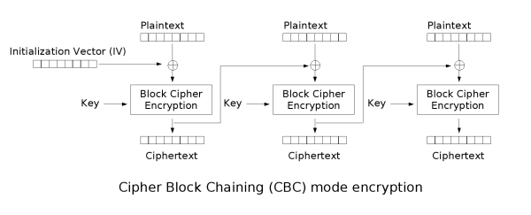
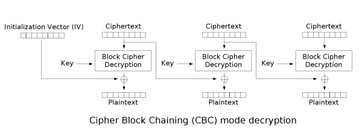

# CBC

CBC全稱爲密碼分組鏈接（Cipher-block chaining） 模式，這裏

- IV 不要求保密
- IV 必須是不可預測的，而且要保證完整性。

## 加密



## 解密



## 優缺點

### 優點

1. 密文塊不僅和當前密文塊相關，而且和前一個密文塊或 IV 相關，隱藏了明文的統計特性。
2. 具有有限的兩步錯誤傳播特性，即密文塊中的一位變化只會影響當前密文塊和下一密文塊。
3. 具有自同步特性，即第 k 塊起密文正確，則第 k+1 塊就能正常解密。

### 缺點

1. 加密不能並行，解密可以並行。

## 應用

CBC 應用十分廣泛

- 常見的數據加密和 TLS 加密。
- 完整性認證和身份認證。

## 攻擊

###  字節反轉攻擊

#### 原理
字節反轉的原理十分簡單，我們觀察**解密過程**可以發現如下特性:

- IV 向量影響第一個明文分組
- 第 n 個密文分組可以影響第 n + 1 個明文分組

假設第$n$個密文分組爲$C_n$，解密後的第$n$個明文分組爲爲$P_n$。

然後$P_{n+1}=C_n~\text{xor}~f(C_{n+1})$。

其中$f$函數爲圖中的$\text{Block Cipher Decryption}$。

對於某個信息已知的原文和密文，然後我們可以修改第$n$個密文塊$C_n$爲$C_n~\text{xor}~P_{n+1}~\text{xor}~A$。然後再對這條密文進行解密，那麼解密後的第$n$個明文快將會變成$A$。

#### 例題

```python
from flag import FLAG
from Crypto.Cipher import AES
from Crypto import Random
import base64

BLOCK_SIZE=16
IV = Random.new().read(BLOCK_SIZE)
passphrase = Random.new().read(BLOCK_SIZE)

pad = lambda s: s + (BLOCK_SIZE - len(s) % BLOCK_SIZE) * chr(BLOCK_SIZE - len(s) % BLOCK_SIZE)
unpad = lambda s: s[:-ord(s[len(s) - 1:])]

prefix = "flag="+FLAG+"&userdata="
suffix = "&user=guest"
def menu():
    print "1. encrypt"
    print "2. decrypt"
    return raw_input("> ")

def encrypt():
    data = raw_input("your data: ")
    plain = prefix+data+suffix
    aes = AES.new(passphrase, AES.MODE_CBC, IV)
    print base64.b64encode(aes.encrypt(pad(plain)))


def decrypt():
    data = raw_input("input data: ")
    aes = AES.new(passphrase, AES.MODE_CBC, IV)
    plain = unpad(aes.decrypt(base64.b64decode(data)))
    print 'DEBUG ====> ' + plain
    if plain[-5:]=="admin":
        print plain
    else:
        print "you are not admin"

def main():
    for _ in range(10):
        cmd = menu()
        if cmd=="1":
            encrypt()
        elif cmd=="2":
            decrypt()
        else:
            exit()

if __name__=="__main__":
    main()
```

可見題目希望我們提供一個加密的字符串，如果這個字符串解密後最後的內容爲admin。程序將會輸出明文。所以題目流程爲先隨便提供一個明文，然後將密文進行修改，使得解密後的字符串最後的內容爲admin,我們可以枚舉flag的長度來確定我們需要在什麼位置進行修改。

以下是exp.py

```python
from pwn import *
import base64

pad = 16
data = 'a' * pad
for x in range(10, 100):
    r = remote('xxx.xxx.xxx.xxx', 10004)
    #r = process('./chall.sh')
    
    r.sendlineafter('> ', '1')
    r.sendlineafter('your data: ', data)
    cipher = list(base64.b64decode(r.recv()))
    #print 'cipher ===>', ''.join(cipher)
    
    BLOCK_SIZE = 16
    prefix = "flag=" + 'a' * x + "&userdata="
    suffix = "&user=guest"
    plain = prefix + data + suffix
    
    idx = (22 + x + pad) % BLOCK_SIZE + ((22 + x + pad) / BLOCK_SIZE - 1) * BLOCK_SIZE
    cipher[idx + 0] = chr(ord(cipher[idx + 0]) ^ ord('g') ^ ord('a'))
    cipher[idx + 1] = chr(ord(cipher[idx + 1]) ^ ord('u') ^ ord('d'))
    cipher[idx + 2] = chr(ord(cipher[idx + 2]) ^ ord('e') ^ ord('m'))
    cipher[idx + 3] = chr(ord(cipher[idx + 3]) ^ ord('s') ^ ord('i'))
    cipher[idx + 4] = chr(ord(cipher[idx + 4]) ^ ord('t') ^ ord('n'))

    r.sendlineafter('> ', '2')
    r.sendlineafter('input data: ', base64.b64encode(''.join(cipher)))

    msg = r.recvline()
    if 'you are not admin' not in msg:
        print msg
        break
    r.close()  

```
### Padding Oracle Attack
具體參見下面的介紹。
