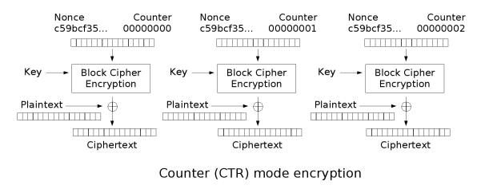
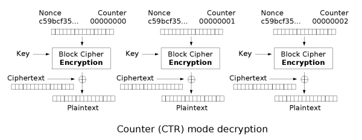

# CTR

CTR全稱爲計數器模式（Counter mode），該模式由 Diffe 和 Hellman 設計。

## 加密



## 解密



## 特點

| 特性                          | 描述     |
| ----------------------------- | -------- |
| 加密可並行化 (Encryption parallelizable) | 是 (Yes) |
| 解密可並行化 (Decryption parallelizable) | 是 (Yes) |
| 隨機讀取訪問 (Random read access)   | 是 (Yes) |

CTR 模式比 OFB 模式有一些優勢。一個優點是它允許並行加密和解密多個塊，因爲可以爲每個塊獨立計算密鑰流。這可以提高加密和解密過程的性能和效率。

## 2023 某CTF

題面

```python
from Crypto.Util.number import long_to_bytes, bytes_to_long
from Crypto.Cipher import AES
from Crypto.Util import Counter
from hashlib import sha256
import os
from secret import flag

def padding(msg):
    return msg + os.urandom(16 - len(msg) % 16)

msg = b"where is the flag? Key in my Heart/Counter!!!!"
key = b"I w0nder how????"

assert len(msg) == 46
assert len(key) == 16

enc_key = os.urandom(16)
initial_value = bytes_to_long(enc_key)
hash = sha256(str(initial_value).encode()).hexdigest()

aes = AES.new(enc_key,AES.MODE_ECB)
enc_flag = aes.encrypt(padding(flag))

ctr = Counter.new(AES.block_size * 8, initial_value = initial_value) 
aes = AES.new(key, counter = ctr, mode = AES.MODE_CTR)
enc = aes.encrypt(msg)

print("enc = {}".format(enc[-16:]))
print("enc_flag = {}".format(enc_flag))
print("hash = {}".format(hash))

"""
enc_last16 = b'\xbe\x9bd\xc6\xd4=\x8c\xe4\x95bi\xbc\xe01\x0e\xb8'
enc_flag = b'\xb2\x97\x83\x1dB\x13\x9b\xc2\x97\x9a\xa6+M\x19\xd74\xd2-\xc0\xb6\xba\xe8ZE\x0b:\x14\xed\xec!\xa1\x92\xdfZ\xb0\xbd\xb4M\xb1\x14\xea\xd8\xee\xbf\x83\x16g\xfa'
hash = efb07225b3f1993113e104757210261083c79de50f577b3f0564368ee7b25eeb
"""
```

可以看出: 先用 ECB 模式加密了 `flag`，且這時的 `key1` 是未知的，同時給出將 `key1` 字節轉整數後進行 sha256 hash 的結果

將 `key1` 字節轉整數設爲 CTR 模式中 `Counter` 的計數器初始值，且接下來用此 `Counter` 作爲參數對明文， `key2` 進行加密，並給出密文最後16字節，這其中: 明文、`key2`、最後一塊的密文(實際上還需處理) 我們都是已知的

這時我們的目標即爲根據已知條件來逆推回 `Counter` 初始值

我們來回顧下 CTR 模式加密流程: 


想要得到 `Counter`，那就得先得到加密器給出的結果，加密時: $明文 \oplus E(Counter) = 密文$，而根據異或性質 $E(Counter)$ 則爲 $明文 \oplus 密文$

這時僅剩將 $E(Counter)$ 轉爲 $Counter$

這裏我們不要被 CTR 模式加解密圖示所侷限思維，實際上只看最後這部分，完全可以將其理解爲 ECB 模式的某一個塊，那解密即爲: $D(E(Counter)) = Counter$

接着我們還要將 $Counter$ 減去其在加密過程中，計數器增加的數值，則爲最終的結果

其中還有一些坑點可以看如下 Exploit 中的註釋

```python
from Crypto.Util.number import long_to_bytes, bytes_to_long
from Crypto.Cipher import AES
from Crypto.Util import Counter
from hashlib import sha256
import os
# from secret import flag
flag = b'flag{test}'

def padding(msg):
    return msg + os.urandom(16 - len(msg) % 16)  # 隨機值填充

msg = b"where is the flag? Key in my Heart/Counter!!!!"
key = b"I w0nder how????"

assert len(msg) == 46
assert len(key) == 16

enc_key = os.urandom(16)  # 隨機key
initial_value = bytes_to_long(enc_key) # key轉爲整數
hash = sha256(str(initial_value).encode()).hexdigest()  # 字符串(key) 的 sha256

aes = AES.new(enc_key,AES.MODE_ECB) 
enc_flag = aes.encrypt(padding(flag))

                # 16 * 8 = 128,
# {'counter_len': 16, 'prefix': b'', 'suffix': b'', 'initial_value': 1, 'little_endian': False}
ctr = Counter.new(AES.block_size * 8, initial_value = initial_value) 
print(ctr)
aes = AES.new(key, counter = ctr, mode = AES.MODE_CTR)  # key 已知, 推 counter, CTR mode 不需要 padding
enc = aes.encrypt(msg)  # msg 已知


# print("enc = {}".format(len(enc)))  # 46
print("enc = {}".format(enc[-16:]))  # 密文的最後16位, 但並不是最後一個 block
print("enc_flag = {}".format(enc_flag))
print("hash = {}".format(hash))
print('題目數據輸出結束' + ' *' * 16)
# Data
enc_last16 = b'\xbe\x9bd\xc6\xd4=\x8c\xe4\x95bi\xbc\xe01\x0e\xb8'
enc_flag = b'\xb2\x97\x83\x1dB\x13\x9b\xc2\x97\x9a\xa6+M\x19\xd74\xd2-\xc0\xb6\xba\xe8ZE\x0b:\x14\xed\xec!\xa1\x92\xdfZ\xb0\xbd\xb4M\xb1\x14\xea\xd8\xee\xbf\x83\x16g\xfa'
hash = 'efb07225b3f1993113e104757210261083c79de50f577b3f0564368ee7b25eeb'

# Solution
# a = msg[32:]  # 從明文index 32 開始
a = msg[16 * (len(msg) // 16):]  # 取最後一個 block
b = enc_last16[16 - (len(enc) % 16):]  # 從密文index 2 開始 | 選最後一個 block
# 加密最後步驟 明文 xor enc_{key}(counter) = 密文
# 解密最後步驟 enc_{key}(counter) xor 密文 = 明文 | enc_{key}(counter) = 密文 xor 明文
enc_Counter1 = bytes(a[i] ^ b[i] for i in range(14))  
for i in range(0xff):
    for j in range(0xff):
        # ECB mode 要求數據長度與塊長對齊, 而加密後的數據的最後 2 bytes 我們並不清楚, 所以我們需要嘗試所有的可能
        enc_Counter2 = enc_Counter1 + bytes([i]) + bytes([j])
        aes = AES.new(key,AES.MODE_ECB)
        Counter = aes.decrypt(enc_Counter2)  # E_{key}(Counter) = Counter_enc | Counter = D_{key}(Counter_enc)
        initial_value = bytes_to_long(Counter) - (len(msg) // 16)  # 經歷兩個 block, 最後一個 block 的 Counter - block 數 = 初始值
        if hash == sha256(str(initial_value).encode()).hexdigest():  # type: str
            print(f'found {initial_value = }')
            enc_key = long_to_bytes(initial_value)
            aes = AES.new(enc_key,AES.MODE_ECB)
            flag = aes.decrypt(enc_flag)
            print(flag)
            break
# flag{9b1deb4d-3b7d-4bad-9bdd-2b0d7b3dcb6d}
```

## 題目

- 2017 star ctf ssss
- 2017 star ctf ssss2
