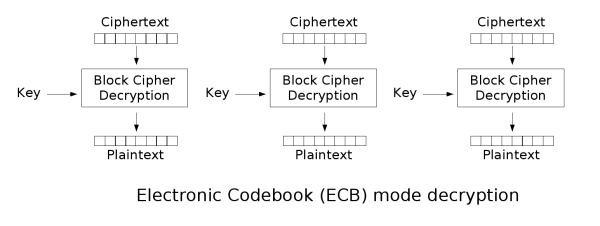

# ECB

ECB模式全稱爲電子密碼本模式（Electronic codebook）。

## 加密


## 解密



## 優缺點

### 優點

1. 實現簡單。
2. 不同明文分組的加密可以並行計算，速度很快。

### 缺點

1. 同樣的明文塊會被加密成相同的密文塊，不會隱藏明文分組的統計規律。正如下圖所示


爲了解決統一明文產生相同密文的問題，提出了其它的加密模式。

## 典型應用

1. 用於隨機數的加密保護。
2. 用於單分組明文的加密。

## 2016 ABCTF aes-mess-75

 題目描述如下

```
We encrypted a flag with AES-ECB encryption using a secret key, and got the hash: e220eb994c8fc16388dbd60a969d4953f042fc0bce25dbef573cf522636a1ba3fafa1a7c21ff824a5824c5dc4a376e75 However, we lost our plaintext flag and also lost our key and we can't seem to decrypt the hash back :(. Luckily we encrypted a bunch of other flags with the same key. Can you recover the lost flag using this?

[HINT] There has to be some way to work backwards, right?
```

可以看出，這個加密是一個 ECB 加密，然後 AES 是 16 個字節一組，每個字節可以使用兩個 16 進制字符表示，因此，我們每 32 個字符一組進行分組，然後去對應的 txt 文件中搜索即可。

對應 flag

```
e220eb994c8fc16388dbd60a969d4953 abctf{looks_like
f042fc0bce25dbef573cf522636a1ba3 _you_can_break_a
fafa1a7c21ff824a5824c5dc4a376e75 es}
```

最後一個顯然在加密時進行了 padding。

## 題目

- 2018 PlaidCTF macsh

