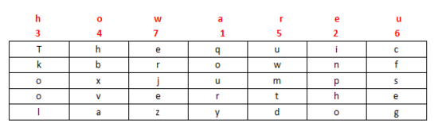
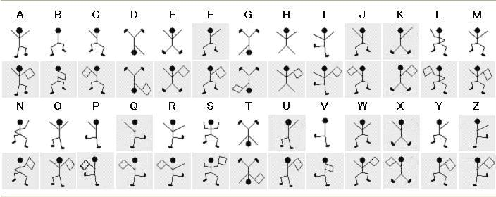

# 其它類型加密

## 培根密碼

### 原理

培根密碼使用兩種不同的字體，代表 A 和 B，結合加密表進行加解密。

| a   | AAAAA | g   | AABBA | n   | ABBAA | t   | BAABA |
| --- | ----- | --- | ----- | --- | ----- | --- | ----- |
| b   | AAAAB | h   | AABBB | o   | ABBAB | u-v | BAABB |
| c   | AAABA | i-j | ABAAA | p   | ABBBA | w   | BABAA |
| d   | AAABB | k   | ABAAB | q   | ABBBB | x   | BABAB |
| e   | AABAA | l   | ABABA | r   | BAAAA | y   | BABBA |
| f   | AABAB | m   | ABABB | s   | BAAAB | z   | BABBB |

上面的是常用的加密表。還有另外的一種加密表，可認爲是將 26 個字母從 0 到 25 排序，以二進製表示，A 代表 0，B 代表 1。

下面這一段內容就是明文 steganography 加密後的內容，正常字體是 A，粗體是 B：

**T**o en**co**de **a** mes**s**age e**ac**h letter **of** the **pl**a**i**nt**ex**t **i**s replaced b**y a g**rou**p of f**i**ve** of **th**e lett**ers** **'A'** o**r 'B'**.

可以看到，培根密碼主要有以下特點

- 只有兩種字符
- 每一段的長度爲 5
- 加密內容會有特殊的字體之分，亦或者大小寫之分。

### 工具

- http://rumkin.com/tools/cipher/baconian.php

## 柵欄密碼

### 原理

柵欄密碼把要加密的明文分成 N 個一組，然後把每組的第 1 個字連起來，形成一段無規律的話。這裏給出一個例子

```
明文：THERE IS A CIPHER
```

去掉空格後變爲

```
THEREISACIPHER
```

分成兩欄，兩個一組得到

```
TH ER EI SA CI PH ER
```

先取出第一個字母，再取出第二個字母

```
TEESCPE
HRIAIHR
```

連在一起就是

```
TEESCPEHRIAIHR
```

上述明文也可以分爲2欄。

```
THEREIS ACIPHER
```

組合得到密文

```
TAHCEIRPEHIESR
```

### 工具

- https://www.qqxiuzi.cn/bianma/zhalanmima.php

## 曲路密碼

### 原理

曲路密碼（Curve Cipher）是一種換位密碼，需要事先雙方約定密鑰（也就是曲路路徑）。下面給出一個例子

```
明文：The quick brown fox jumps over the lazy dog
```

填入 5 行 7 列表（事先約定填充的行列數）


加密的迴路線（事先約定填充的行列數）


```
密文：gesfc inpho dtmwu qoury zejre hbxva lookT
```

## 列移位加密

### 原理

列移位密碼（Columnar Transposition Cipher）是一種比較簡單，易於實現的換位密碼，通過一個簡單的規則將明文打亂混合成密文。下面給出一個例子。

我們以明文 `The quick brown fox jumps over the lazy dog`，密鑰 `how are u` 爲例：

將明文填入 5 行 7 列表（事先約定填充的行列數，如果明文不能填充完表格可以約定使用某個字母進行填充）


密鑰： `how are u`，按 `how are u` 在字母表中的出現的先後順序進行編號，我們就有 a 爲 1，e 爲 2，h 爲 3，o 爲 4，r 爲 5，u 爲 6，w 爲 7，所以先寫出 a 列，其次 e 列，以此類推寫出的結果便是密文：



密文： `qoury inpho Tkool hbxva uwmtd cfseg erjez`

### 工具

- http://www.practicalcryptography.com/ciphers/classical-era/columnar-transposition/ 行列數相等


## 01248 密碼

### 原理

該密碼又稱爲雲影密碼，使用 0，1，2，4，8 四個數字，其中 0 用來表示間隔，其他數字以加法可以表示出 如：28=10，124=7，18=9，再用 1->26 表示 A->Z。

可以看出該密碼有以下特點

- 只有 0，1，2，4，8

### 例子

這裏我們以CFF 2016 影之密碼爲例進行介紹，題目

> 8842101220480224404014224202480122

我們按照0來進行分割，如下

| 內容   | 數字           | 字符 |
| ------ | -------------- | ---- |
| 88421  | 8+8+4+2+1=23   | W    |
| 122    | 1+2+2=5        | E    |
| 48     | 4+8=12         | L    |
| 2244   | 2+2+4+4=12     | L    |
| 4      | 4              | D    |
| 142242 | 1+4+2+2+4+2=15 | O    |
| 248    | 2+4+8=14       | N    |
| 122    | 1+2+2=5        | E    |

所以最後的 flag 爲 WELLDONE。

## JSFuck

### 原理

JSFuck 可以只用 6 個字符 `[]()!+` 來編寫 JavaScript 程序。比如我們想用 JSFuck 來實現 `alert(1)` 代碼如下

```javascript
[][(![]+[])[+[[+[]]]]+([][[]]+[])[+[[!+[]+!+[]+!+[]+!+[]+!+[]]]]+(![]+[])[+[[!+[]+!+[]]]]+(!![]+[])[+[[+[]]]]+(!![]+[])[+[[!+[]+!+[]+!+[]]]]+(!![]+[])[+[[+!+[]]]]][([][(![]+[])[+[[+[]]]]+([][[]]+[])[+[[!+[]+!+[]+!+[]+!+[]+!+[]]]]+(![]+[])[+[[!+[]+!+[]]]]+(!![]+[])[+[[+[]]]]+(!![]+[])[+[[!+[]+!+[]+!+[]]]]+(!![]+[])[+[[+!+[]]]]]+[])[+[[!+[]+!+[]+!+[]]]]+([][(![]+[])[+[[+[]]]]+([][[]]+[])[+[[!+[]+!+[]+!+[]+!+[]+!+[]]]]+(![]+[])[+[[!+[]+!+[]]]]+(!![]+[])[+[[+[]]]]+(!![]+[])[+[[!+[]+!+[]+!+[]]]]+(!![]+[])[+[[+!+[]]]]]+[])[+[[!+[]+!+[]+!+[]+!+[]+!+[]+!+[]]]]+([][[]]+[])[+[[+!+[]]]]+(![]+[])[+[[!+[]+!+[]+!+[]]]]+(!![]+[])[+[[+[]]]]+(!![]+[])[+[[+!+[]]]]+([][[]]+[])[+[[+[]]]]+([][(![]+[])[+[[+[]]]]+([][[]]+[])[+[[!+[]+!+[]+!+[]+!+[]+!+[]]]]+(![]+[])[+[[!+[]+!+[]]]]+(!![]+[])[+[[+[]]]]+(!![]+[])[+[[!+[]+!+[]+!+[]]]]+(!![]+[])[+[[+!+[]]]]]+[])[+[[!+[]+!+[]+!+[]]]]+(!![]+[])[+[[+[]]]]+([][(![]+[])[+[[+[]]]]+([][[]]+[])[+[[!+[]+!+[]+!+[]+!+[]+!+[]]]]+(![]+[])[+[[!+[]+!+[]]]]+(!![]+[])[+[[+[]]]]+(!![]+[])[+[[!+[]+!+[]+!+[]]]]+(!![]+[])[+[[+!+[]]]]]+[])[+[[!+[]+!+[]+!+[]+!+[]+!+[]+!+[]]]]+(!![]+[])[+[[+!+[]]]]]((![]+[])[+[[+!+[]]]]+(![]+[])[+[[!+[]+!+[]]]]+(!![]+[])[+[[!+[]+!+[]+!+[]]]]+(!![]+[])[+[[+!+[]]]]+(!![]+[])[+[[+[]]]]+([][(![]+[])[+[[+[]]]]+([][[]]+[])[+[[!+[]+!+[]+!+[]+!+[]+!+[]]]]+(![]+[])[+[[!+[]+!+[]]]]+(!![]+[])[+[[+[]]]]+(!![]+[])[+[[!+[]+!+[]+!+[]]]]+(!![]+[])[+[[+!+[]]]]]+[])[+[[+!+[]]]+[[!+[]+!+[]+!+[]+!+[]+!+[]]]]+[+!+[]]+([][(![]+[])[+[[+[]]]]+([][[]]+[])[+[[!+[]+!+[]+!+[]+!+[]+!+[]]]]+(![]+[])[+[[!+[]+!+[]]]]+(!![]+[])[+[[+[]]]]+(!![]+[])[+[[!+[]+!+[]+!+[]]]]+(!![]+[])[+[[+!+[]]]]]+[])[+[[+!+[]]]+[[!+[]+!+[]+!+[]+!+[]+!+[]+!+[]]]])()
```

其他一些基本的表達：

```javascript
false       =>  ![]
true        =>  !![]
undefined   =>  [][[]]
NaN         =>  +[![]]
0           =>  +[]
1           =>  +!+[]
2           =>  !+[]+!+[]
10          =>  [+!+[]]+[+[]]
Array       =>  []
Number      =>  +[]
String      =>  []+[]
Boolean     =>  ![]
Function    =>  []["filter"]
eval        =>  []["filter"]["constructor"]( CODE )()
window      =>  []["filter"]["constructor"]("return this")()
```

### 工具

- [JSFuck 在線加密網站](http://www.jsfuck.com/)

## BrainFuck

### 原理

Brainfuck，是一種極小化的計算機語言，它是由 Urban Müller 在 1993 年創建的。我們舉一個例子，如果我們想要一個在屏幕上打印Hello World！，那麼對應的程序如下。對於其中的原理，感興趣的可以自行網上搜索。

```
++++++++++[>+++++++>++++++++++>+++>+<<<<-]
>++.>+.+++++++..+++.>++.<<+++++++++++++++.
>.+++.------.--------.>+.>.
```

與其對應的還有 ook。

### 工具

- https://www.splitbrain.org/services/ook

## 豬圈密碼

### 原理

豬圈密碼是一種以格子爲基礎的簡單替代式密碼，格子如下


我們舉一個例子，如明文爲 `X marks the spot` ，那麼密文如下


### 工具

- http://www.simonsingh.net/The_Black_Chamber/pigpen.html

## 舞動的小人密碼

### 原理

這種密碼出自於福爾摩斯探案集。每一個跳舞的小人實際上對應的是英文二十六個字母中的一個，而小人手中的旗子則表明該字母是單詞的最後一個字母，如果僅僅是一個單詞而不是句子，或者是句子中最後的一個單詞，則單詞中最後一個字母不必舉旗。



## 鍵盤密碼

所謂鍵盤密碼，就是採用手機鍵盤或者電腦鍵盤進行加密。

### 手機鍵盤密碼

手機鍵盤加密方式，是每個數字鍵上有 3-4 個字母，用兩位數字來表示字母，例如：ru 用手機鍵盤表示就是：7382，那麼這裏就可以知道了，手機鍵盤加密方式不可能用 1 開頭，第二位數字不可能超過 4，解密的時候參考此


關於手機鍵盤加密還有另一種方式，就是「音的」式（這一點可能根據手機的不同會有所不同），具體參照手機鍵盤來打，例如：「數字」表示出來就是：748 94。在手機鍵盤上面按下這幾個數，就會出：「數字」的拼音。

### 電腦鍵盤棋盤

電腦鍵盤棋盤加密，利用了電腦的棋盤方陣。


### 電腦鍵盤座標

電腦鍵盤座標加密，利用鍵盤上面的字母行和數字行來加密，例：bye 用電腦鍵盤 XY 表示就是：351613


### 電腦鍵盤 QWE

電腦鍵盤 QWE 加密法，就是用字母表替換鍵盤上面的排列順序。


### 鍵盤佈局加密

簡單地說就是根據給定的字符在鍵盤上的樣子來進行加密。

### 0CTF 2014 classic

> 小丁丁發現自己置身於一個詭異的房間，面前只有一扇刻着奇怪字符的門。 他發現門邊上還有一道密碼鎖，似乎要輸入密碼才能開門。。4esxcft5 rdcvgt 6tfc78uhg 098ukmnb

發現這麼亂，還同時包括數字和字母猜想可能是鍵盤密碼，試着在鍵盤上按照字母順序描繪一下，可得到0ops字樣，猜測就是flag了。

### 2017年xman選拔賽——一二三，木頭人

> 我數123木頭人，再不行動就要被扣分。
>
> 23731263111628163518122316391715262121
>
> 密碼格式xman{flag}

題目中有很明顯的提示123，那麼就自然需要聯想到鍵盤密碼中電腦鍵盤座標密碼，可以發現前幾個數字第二個數字都是1-3範圍內的，也驗證了我們的猜測。於是

> 23-x
>
> 73-m
>
> 12-a
>
> 63-n
>
> 11-q

不對呀，密碼格式是 `xman{`，第四個字符是 `{`，於是看了看 `{` 的位置，其並沒有對應的橫座標，但是如果我們手動把它視爲 11 的話，那麼111就是 `{`。然後依次往後推，發現確實可行，，最後再把 121 視爲 `}` 即可得到 flag。

```
xman{hintisenough}
```

從這裏我們可以看出，我們還是要注意遷移性，不能單純地照搬一些已有的知識。

### 題目

- 實驗吧 奇怪的短信
