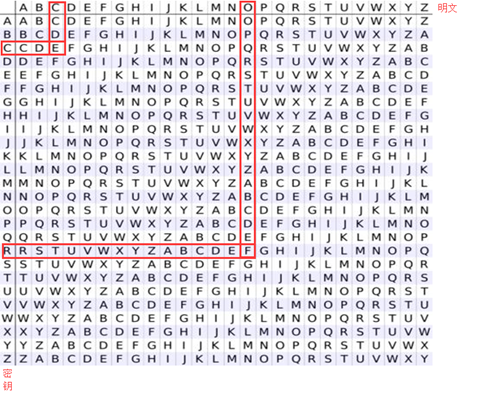

# 多表代換加密

對於多表替換加密來說，加密後的字母幾乎不再保持原來的頻率，所以我們一般只能通過尋找算法實現對應的弱點進行破解。

## Playfair

### 原理

Playfair 密碼（Playfair cipher or Playfair square）是一種替換密碼，1854 年由英國人查爾斯·惠斯通（Charles Wheatstone）發明，基本算法如下：

1.  選取一串英文字母，除去重複出現的字母，將剩下的字母逐個逐個加入 5 × 5 的矩陣內，剩下的空間由未加入的英文字母依 a-z 的順序加入。注意，將 q 去除，或將 i 和 j 視作同一字。
2.  將要加密的明文分成兩個一組。若組內的字母相同，將 X（或 Q）加到該組的第一個字母后，重新分組。若剩下一個字，也加入 X 。
3.  在每組中，找出兩個字母在矩陣中的地方。
    - 若兩個字母不同行也不同列，在矩陣中找出另外兩個字母（第一個字母對應行優先），使這四個字母成爲一個長方形的四個角。
    - 若兩個字母同行，取這兩個字母右方的字母（若字母在最右方則取最左方的字母）。
    - 若兩個字母同列，取這兩個字母下方的字母（若字母在最下方則取最上方的字母）。

新找到的兩個字母就是原本的兩個字母加密的結果。

以 playfair example 爲密匙，得

```
P L A Y F
I R E X M
B C D G H
K N O Q S
T U V W Z
```

要加密的訊息爲 Hide the gold in the tree stump

```
HI DE TH EG OL DI NT HE TR EX ES TU MP
```

就會得到

```
BM OD ZB XD NA BE KU DM UI XM MO UV IF
```

### 工具

- CAP4

## Polybius

### 原理

Polybius密碼又稱爲棋盤密碼，其一般是將給定的明文加密爲兩兩組合的數字，其常用密碼錶

|      | 1   | 2   | 3   | 4   | 5    |
| :--- | --- | --- | --- | --- | :--- |
| 1    | A   | B   | C   | D   | E    |
| 2    | F   | G   | H   | I/J | K    |
| 3    | L   | M   | N   | O   | P    |
| 4    | Q   | R   | S   | T   | U    |
| 5    | V   | W   | X   | Y   | Z    |

舉個例子，明文 HELLO，加密後就是 23 15 31 31 34。

另一種密碼錶

|     | A   | D   | F   | G   | X   |
| --- | --- | --- | --- | --- | --- |
| A   | b   | t   | a   | l   | p   |
| D   | d   | h   | o   | z   | k   |
| F   | q   | f   | v   | s   | n   |
| G   | g   | j   | c   | u   | x   |
| X   | m   | r   | e   | w   | y   |

注意，這裏字母的順序被打亂了。

A D F G X 的由來：

> 1918 年，第一次世界大戰將要結束時，法軍截獲了一份德軍電報，電文中的所有單詞都由 A、D、F、G、X 五個字母拼成，因此被稱爲 ADFGX 密碼。ADFGX 密碼是 1918 年 3 月由德軍上校 Fritz Nebel 發明的，是結合了 Polybius 密碼和置換密碼的雙重加密方案。

舉個例子，HELLO，使用這個表格加密，就是 DD XF AG AG DF。

### 工具

- CrypTool

### 例子

這裏以安恆杯 9 月 Crypto 賽題 Go 爲例，題目爲：

> 密文：ilnllliiikkninlekile

> 壓縮包給了一行十六進制：546865206c656e677468206f66207468697320706c61696e746578743a203130

> 請對密文解密

首先對十六進制進行 hex 解碼，得到字符串："The length of this plaintext: 10"

密文長度爲 20 ，而明文長度爲 10 ，密文只有 " l "," i "," n "," k "," e " 這五個字符，聯想到棋盤密碼。

首先試一下五個字符按字母表順序排列：

|      | e   | i   | k   | l   | n    |
| :--- | --- | --- | --- | --- | :--- |
| e    | A   | B   | C   | D   | E    |
| i    | F   | G   | H   | I/J | K    |
| k    | L   | M   | N   | O   | P    |
| l    | Q   | R   | S   | T   | U    |
| n    | V   | W   | X   | Y   | Z    |

根據密文解密得：iytghpkqmq。

這應該不是我們想要的 flag 答案。

看來這五個字符排列不是這麼排列的，一共有 5! 種情況，寫腳本爆破：

```python
import itertools

key = []
cipher = "ilnllliiikkninlekile"

for i in itertools.permutations('ilnke', 5):
    key.append(''.join(i))

for now_key in key:
    solve_c = ""
    res = ""
    for now_c in cipher:
        solve_c += str(now_key.index(now_c))
    for i in range(0,len(solve_c),2):
        now_ascii = int(solve_c[i])*5+int(solve_c[i+1])+97
        if now_ascii>ord('i'):
            now_ascii+=1
        res += chr(now_ascii)
    if "flag" in res:
        print now_key,res
```
腳本其實就是實現棋盤密碼這個算法，只是這五個字符的順序不定。

跑出下面兩個結果：

> linke flagishere

> linek flagkxhdwd

顯然第一個是我們想要的答案。

附上正確的密碼錶：

|      | l   | i   | n   | k   | e    |
| :--- | --- | --- | --- | --- | :--- |
| l    | A   | B   | C   | D   | E    |
| i    | F   | G   | H   | I/J | K    |
| n    | L   | M   | N   | O   | P    |
| k    | Q   | R   | S   | T   | U    |
| e    | V   | W   | X   | Y   | Z    |

## Vigenere 維吉尼亞密碼

### 原理

維吉尼亞密碼（Vigenere）是使用一系列凱撒密碼組成密碼字母表的加密算法，屬於多表密碼的一種簡單形式。


下面給出一個例子

```
明文：come greatwall
密鑰：crypto
```

首先，對密鑰進行填充使其長度與明文長度一樣。

| 明文 | c   | o   | m   | e   | g   | r   | e   | a   | t   | w   | a   | l   | l   |
| ---- | --- | --- | --- | --- | --- | --- | --- | --- | --- | --- | --- | --- | --- |
| 密鑰 | c   | r   | y   | p   | t   | o   | c   | r   | y   | p   | t   | o   | c   |

其次，查表得密文



```
明文：come greatwall
密鑰：crypto
密文：efkt zferrltzn
```
### 破解

對包括維吉尼亞密碼在內的所有多表密碼的破譯都是以字母頻率爲基礎的，但直接的頻率分析卻並不適用，這是因爲在維吉尼亞密碼中，一個字母可以被加密成不同的密文，因而簡單的頻率分析在這裏並沒有用。

**破譯維吉尼亞密碼的關鍵在於它的密鑰是循環重複的。** 如果我們知道了密鑰的長度，那密文就可以被看作是交織在一起的凱撒密碼，而其中每一個都可以單獨破解。關於密碼的長度，我們可以 使用卡西斯基試驗和弗裏德曼試驗來獲取。

卡西斯基試驗是基於類似 the 這樣的常用單詞有可能被同樣的密鑰字母進行加密，從而在密文中重複出現。例如，明文中不同的 CRYPTO 可能被密鑰 ABCDEF 加密成不同的密文：

```
密鑰：ABCDEF AB CDEFA BCD EFABCDEFABCD
明文：CRYPTO IS SHORT FOR CRYPTOGRAPHY
密文：CSASXT IT UKSWT GQU GWYQVRKWAQJB
```

此時明文中重複的元素在密文中並不重複。然而，如果密鑰相同的話，結果可能便爲（使用密鑰 ABCD）：

```
密鑰：ABCDAB CD ABCDA BCD ABCDABCDABCD
明文：CRYPTO IS SHORT FOR CRYPTOGRAPHY
密文：CSASTP KV SIQUT GQU CSASTPIUAQJB
```

此時卡西斯基試驗就能產生效果。對於更長的段落此方法更爲有效，因爲通常密文中重複的片段會更多。如通過下面的密文就能破譯出密鑰的長度：

```
密文：DYDUXRMHTVDVNQDQNWDYDUXRMHARTJGWNQD
```

其中，兩個 DYDUXRMH 的出現相隔了 18 個字母。因此，可以假定密鑰的長度是 18 的約數，即長度爲 18、9、6、3 或 2。而兩個 NQD 則相距 20 個字母，意味着密鑰長度應爲 20、10、5、4 或 2。取兩者的交集，則可以基本確定密鑰長度爲 2。接下來就是進行進一步的操作了。

關於更加詳細的破解原理，這裏暫時不做過多的介紹。可以參考http://www.practicalcryptography.com/cryptanalysis/stochastic-searching/cryptanalysis-vigenere-cipher/。

### 工具

-   已知密鑰
    - Python 的 pycipher 庫
    - [在線解密 Vigenère cipher](http://planetcalc.com/2468/)
    - CAP4
-   未知密鑰
    - [Vigenère Cipher Codebreaker](http://www.mygeocachingprofile.com/codebreaker.vigenerecipher.aspx)
    - [Vigenere Solver](https://www.guballa.de/vigenere-solver) ，不夠完善。

## Nihilist

### 原理

Nihilist密碼又稱關鍵字密碼：明文 + 關鍵字 = 密文。以關鍵字 helloworld 爲例。

首先利用密鑰構造棋盤矩陣（類似 Polybius 密碼）
- 新建一個 5 × 5 矩陣
- 將字符不重複地依次填入矩陣
- 剩下部分按字母順序填入
- 字母 i 和 j 等價

|     | 1   | 2   | 3     | 4   | 5   |
| --- | --- | --- | ----- | --- | --- |
| 1   | h   | e   | l     | o   | w   |
| 2   | r   | d   | a     | b   | c   |
| 3   | f   | g   | i / j | k   | m   |
| 4   | n   | p   | q     | s   | t   |
| 5   | u   | v   | x     | y   | z   |

對於加密過程參照矩陣 M 進行加密：

```
a -> M[2,3] -> 23
t -> M[4,5] -> 45
```
對於解密過程

參照矩陣 M 進行解密：

```
23 -> M[2,3] -> a
45 -> M[4,5] -> t
```
可以看出，密文的特徵有如下幾點

- 純數字
- 只包含 1 到 5
- 密文長度偶數。

## Hill

### 原理

希爾密碼（Hill）使用每個字母在字母表中的順序作爲其對應的數字，即A=0，B=1，C=2 等，然後將明文轉化爲 n 維向量，跟一個 n × n 的矩陣相乘，再將得出的結果模 26。注意用作加密的矩陣（即密匙）在 $\mathbb{Z}_{26}^{n}$ 必須是可逆的，否則就不可能解碼。只有矩陣的行列式和 26 互質，纔是可逆的。下面舉一個例子

```
明文：ACT
```

將明文化爲矩陣。

$$
\begin{bmatrix}
0\\
2\\
19
\end{bmatrix}
$$

假設密鑰爲：

$$
\begin{bmatrix}
6 & 24 & 1\\
13 & 16 & 10\\
20 & 17 & 15
\end{bmatrix}
$$

加密過程爲：

$$
\begin{bmatrix}
6 & 24 & 1\\
13 & 16 & 10\\
20 & 17 & 15
\end{bmatrix}
\begin{bmatrix}
0\\
2\\
19
\end{bmatrix}
\equiv
\begin{bmatrix}
67\\
222\\
319
\end{bmatrix}
\equiv
\begin{bmatrix}
15\\
14\\
7
\end{bmatrix}
\bmod 26
$$

密文即爲

```
密文：POH
```

### 工具

- http://www.practicalcryptography.com/ciphers/hill-cipher/
- CAP4
- Cryptool

### 例子

這裏我們以ISCC 2015 base decrypt 150爲例進行介紹，題目爲

> 密文： 22,09,00,12,03,01,10,03,04,08,01,17 （wjamdbkdeibr）
>
> 使用的矩陣是 1 2 3 4 5 6 7 8 10
>
> 請對密文解密.

首先，矩陣是 3 × 3 的。說明每次加密3個字符。我們直接使用 Cryptool，需要注意的是，這個矩陣是按照列來排布的。即如下

```
1 4 7
2 5 8
3 6 10
```

最後的結果爲 `overthehillx`。

## AutokeyCipher

### 原理

自動密鑰密碼（Autokey Cipher）也是多表替換密碼，與維吉尼亞密碼密碼類似，但使用不同的方法生成密鑰。通常來說它要比維吉尼亞密碼更安全。自動密鑰密碼主要有兩種，關鍵詞自動密鑰密碼和原文自動密鑰密碼。下面我們以關鍵詞自動密鑰爲例：

```
明文：THE QUICK BROWN FOX JUMPS OVER THE LAZY DOG
關鍵詞：CULTURE
```

自動生成密鑰：

```
CULTURE THE QUICK BROWN FOX JUMPS OVER THE
```

接下來的加密過程和維吉尼亞密碼類似，從相應的表格可得：

密文

```
VBP JOZGD IVEQV HYY AIICX CSNL FWW ZVDP WVK
```

### 工具

-   已知關鍵詞
    - Python 的 pycipher 庫
-   未知關鍵詞
    - http://www.practicalcryptography.com/cryptanalysis/stochastic-searching/cryptanalysis-autokey-cipher/
    - **tools 文件夾下 break_autokey.py，待完成。**
