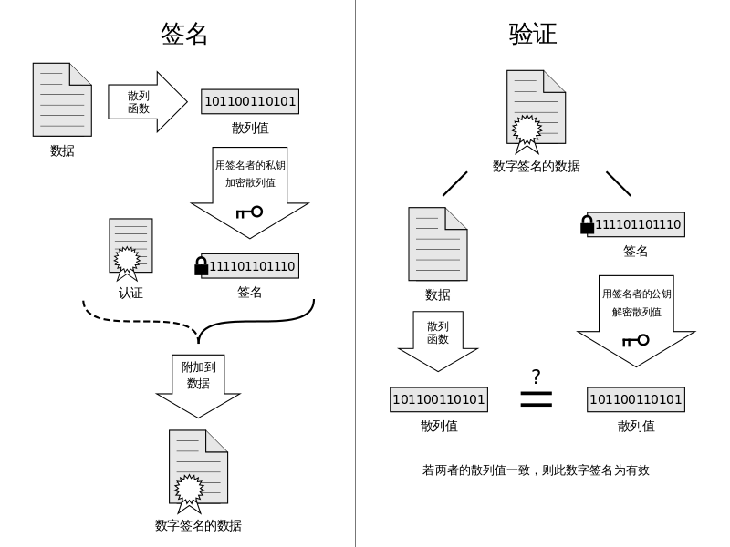

# 數字簽名

在日常生活中，我們在參加某個活動的時候，可能會需要簽名，以便於證明我們確實到場了，，，防止導員啥的，你懂得。。。但其實吧，這種簽名很容易被僞造，隨便找一個人代簽一下，或者說找一個會模仿別人字跡的人幫忙籤一下。在計算機世界中，我們可能會需要電子簽名，因爲我們大多數情況下會使用電子文件，那這時候怎麼辦呢？當然，我們仍然可以選擇使用自己的名字。但其實還有另外一種方式，那就是採用數字簽名，這種簽名更加難以僞造，可信程度更高。數字簽名的主要用處是確保消息確實來自於聲稱產生該消息的人。

數字簽名（digital signature）主要用於對數字消息（digital message）進行簽名，以防消息的冒名僞造或篡改，亦可以用於通信雙方的身份鑑別。

數字簽名依賴於非對稱密碼，因爲我們必須確保一方能夠做的事情，而另一方不能夠做出這樣的事情。其基本原理如下

數字簽名應當具有以下幾個特性：

(1) 簽名是可信的：任何人都可以驗證簽名的有效性。

(2) 簽名是不可僞造的：除了合法的簽名者之外，任何其他人僞造其簽名是困難的。

(3) 簽名是不可複製的：對一個消息的簽名不能通過複製變爲另一個消息的簽名。如果對一個消息的簽名是從別處複製得到的，則任何人都可以發現消息與簽名之間的不一致性，從而可以拒絕簽名的消息。

(4) 簽名的消息是不可改變的：經簽名的消息不能被篡改。一旦簽名的消息被篡改，則任何人都可以發現消息與簽名之間的不一致性。

(5) 簽名是不可抵賴的：簽名者事後不能否認自己的簽名。