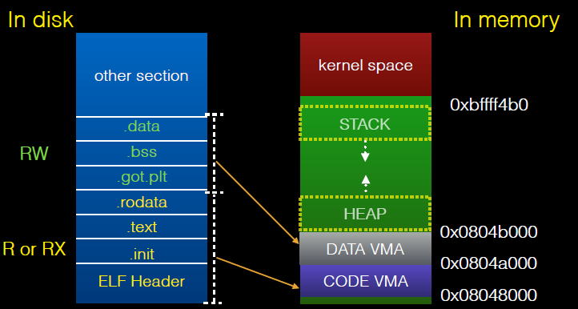

# 程序執行流程

**參考 Execution Angleboye@Bamboofox 。**

## 靜態執行

這裏給出程序靜態執行的基本過程。

## 動態執行

這裏給出另外一張更加細節的圖片。

## 基本操作說明

### sys_execve

該函數主要用於執行一個新的程序，即執行我們想要執行的程序，會檢查相應的argv以及envp等參數。

### do_execve

該函數打開目標映像文件，並從目標文件的開始處讀入指定長度的（目前爲128）字節來獲取相應目標文件的基本信息。

### search_binary_handler

該函數會搜索支持處理當前類型的二進制文件類型隊列，以便於讓各種可執行程序的處理程序進行相應的處理。

### load_elf_binary

該函數的主要處理流程如下

- 檢查並獲取elf文件的頭部信息。

- 如果目標文件採用動態鏈接，則使用.interp 節來確定loader的路徑。

- 將program header 中記錄的相應的段映射到內存中。program header中有以下重要信息

  - 每一個段需要映射到的地址
  - 每一個段相應的權限。
  - 記錄哪些節屬於哪些段。

  具體的映射如下

  

  分情況處理

  - 動態鏈接情況下，將sys_execve的返回地址改爲loader(ld.so)的entry point。
  - 靜態鏈接情況下，將sys_execve的返回地址改爲程序的入口點。

### ld.so

該文件有以下功能

- 主要用於載入ELF文件中DT_NEED中記錄的共享庫。
- 初始化工作
  - 初始化GOT表。
  - 將symbol table合併到global symbol table。

### _start

_start函數會將以下項目交給libc_start_main

- 環境變量起始地址
- .init
  - 啓動main函數前的初始化工作
- fini
  - 程序結束前的收尾工作。
