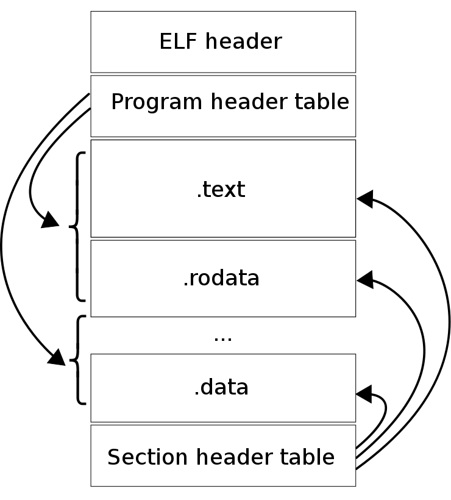
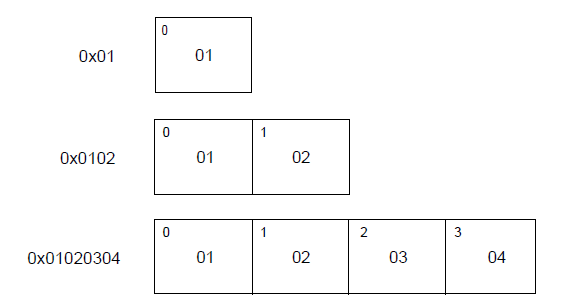
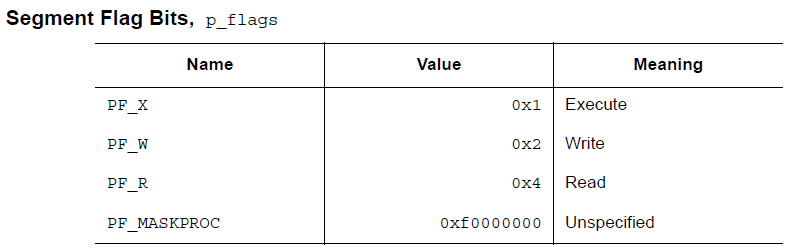
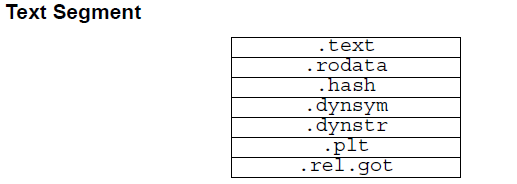
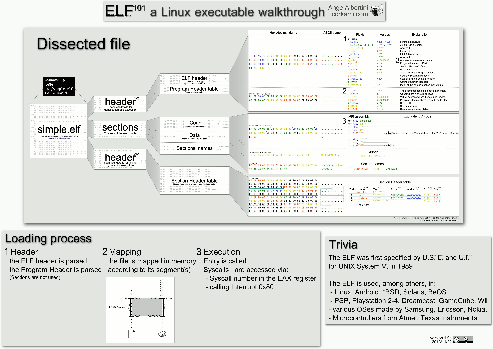

# ELF 文件

> 本部分內容來源於 ELF 1.2 標準，內容經過一定的修改與整理，主要參考文獻如下
>
> 1. ELF 文件格式分析，北京大學，滕啓明
> 2. ELF-摧毀聖誕

## 簡介

ELF （Executable and Linkable Format）文件，也就是在 Linux 中的目標文件，主要有以下三種類型

- 可重定位文件（Relocatable File），包含由編譯器生成的代碼以及數據。鏈接器會將它與其它目標文件鏈接起來從而創建可執行文件或者共享目標文件。在 Linux 系統中，這種文件的後綴一般爲 `.o` 。
- 可執行文件（Executable File），就是我們通常在 Linux 中執行的程序。


- 共享目標文件（Shared Object File），包含代碼和數據，這種文件是我們所稱的庫文件，一般以 `.so` 結尾。一般情況下，它有以下兩種使用情景：
	- 鏈接器（Link eDitor, ld）可能會處理它和其它可重定位文件以及共享目標文件，生成另外一個目標文件。
	- 動態鏈接器（Dynamic Linker）將它與可執行文件以及其它共享目標組合在一起生成進程鏡像。

> 關於Link eDitor的命名，https://en.wikipedia.org/wiki/GNU_linker

目標文件由彙編器和鏈接器創建，是文本程序的二進制形式，可以直接在處理器上運行。那些需要虛擬機纔能夠執行的程序(Java)不屬於這一範圍。

這裏我們主要關注於 ELF 的文件格式。

### 文件格式

目標文件既會參與程序鏈接又會參與程序執行。出於方便性和效率考慮，根據過程的不同，目標文件格式提供了其內容的兩種並行視圖，如下


首先，我們來**關注一下鏈接視圖**。

文件開始處是 ELF 頭部（ **ELF  Header**），它給出了整個文件的組織情況。

如果程序頭部表（Program Header Table）存在的話，它會告訴系統如何創建進程。用於生成進程的目標文件必須具有程序頭部表，但是重定位文件不需要這個表。

節區部分包含在鏈接視圖中要使用的大部分信息：指令、數據、符號表、重定位信息等等。

節區頭部表（Section Header Table）包含了描述文件節區的信息，每個節區在表中都有一個表項，會給出節區名稱、節區大小等信息。用於鏈接的目標文件必須有節區頭部表，其它目標文件則無所謂，可以有，也可以沒有。

這裏給出一個關於鏈接視圖比較形象的展示



對於**執行視圖**來說，其主要的不同點在於沒有了section，而有了多個segment。其實這裏的 segment 大都是來源於鏈接視圖中的 section。

注意:

> 儘管圖中是按照 ELF 頭，程序頭部表，節區，節區頭部表的順序排列的。但實際上除了 ELF  頭部表以外，其它部分都沒有嚴格的順序。

### 數據形式

ELF 文件格式支持 8 位/32 位體系結構。當然，這種格式是可以擴展的，也可以支持更小的或者更大位數的處理器架構。因此，目標文件會包含一些控制數據，這部分數據表明了目標文件所使用的架構，這也使得它可以被通用的方式來識別和解釋。目標文件中的其它數據採用目的處理器的格式進行編碼，與在何種機器上創建沒有關係。這裏其實想表明的意思目標文件可以進行交叉編譯，我們可以在 x86 平臺生成 arm 平臺的可執行代碼。

目標文件中的所有數據結構都遵從“自然”大小和對齊規則。如下

| 名稱            |  長度  | 對齊方式 |   用途    |
| :------------ | :--: | :--: | :-----: |
| Elf32_Addr    |  4   |  4   | 無符號程序地址 |
| Elf32_Half    |  2   |  2   | 無符號半整型  |
| Elf32_Off     |  4   |  4   | 無符號文件偏移 |
| Elf32_Sword   |  4   |  4   | 有符號大整型  |
| Elf32_Word    |  4   |  4   | 無符號大整型  |
| unsigned char |  1   |  1   | 無符號小整型  |

如果必要，數據結構可以包含顯式地補齊來確保 4 字節對象按 4 字節對齊，強制數據結構的大小是 4 的整數倍等等。數據同樣適用是對齊的。因此，包含一個 Elf32_Addr 類型成員的結構體會在文件中的 4 字節邊界處對齊。

爲了具有可移植性，ELF 文件不使用位域。

### 字符表示

待。

**注：在下面的介紹中，我們以 32 位爲主進行介紹。**

## ELF Header

ELF Header 描述了 ELF 文件的概要信息，利用這個數據結構可以索引到 ELF 文件的全部信息，數據結構如下：

```c
#define EI_NIDENT	16

typedef struct {
	unsigned char	e_ident[EI_NIDENT];
	ELF32_Half		e_type;
	ELF32_Half		e_machine;
	ELF32_Word		e_version;
	ELF32_Addr		e_entry;
	ELF32_Off		e_phoff;
	ELF32_Off		e_shoff;
	ELF32_Word		e_flags;
	ELF32_Half		e_ehsize;
	ELF32_Half		e_phentsize;
	ELF32_Half		e_phnum;
	ELF32_Half		e_shentsize;
	ELF32_Half		e_shnum;
	ELF32_Half		e_shstrndx;
} Elf32_Ehdr;
```

其中每個成員都是 e 開頭的，它們應該都是 ELF 的縮寫。每個成員具體的說明如下。

### e_ident

正如之前所說，ELF 提供了一個目標文件框架，以便於支持多種處理器，多種編碼格式的機器。該變量給出了用於解碼和解釋文件中與機器無關的數據的方式。這個數組對於不同的下標的含義如下

| 宏名稱     | 下標 | 目的           |
| ---------- | ---- | -------------- |
| EI_MAG0    | 0    | 文件標識       |
| EI_MAG1    | 1    | 文件標識       |
| EI_MAG2    | 2    | 文件標識       |
| EI_MAG3    | 3    | 文件標識       |
| EI_CLASS   | 4    | 文件類         |
| EI_DATA    | 5    | 數據編碼       |
| EI_VERSION | 6    | 文件版本       |
| EI_PAD     | 7    | 補齊字節開始處 |

其中，

`e_ident[EI_MAG0]`  到 `e_ident[EI_MAG3]`，即文件的頭4個字節，被稱作“魔數”，標識該文件是一個ELF目標文件。**至於開頭爲什麼是0x7f，並沒有仔細去查過**。

| 名稱      | 值    | 位置               |
| ------- | ---- | ---------------- |
| ELFMAG0 | 0x7f | e_ident[EI_MAG0] |
| ELFMAG1 | ‘E’  | e_ident[EI_MAG1] |
| ELFMAG2 | ‘L’  | e_ident[EI_MAG2] |
| ELFMAG3 | ‘F’  | e_ident[EI_MAG3] |

`e_ident[EI_CLASS]` 爲 `e_ident[EI_MAG3]`的下一個字節，標識文件的類型或容量。

| 名稱           | 值    | 意義    |
| ------------ | ---- | ----- |
| ELFCLASSNONE | 0    | 無效類型  |
| ELFCLASS32   | 1    | 32位文件 |
| ELFCLASS64   | 2    | 64位文件 |

ELF 文件的設計使得它可以在多種字節長度的機器之間移植，而不需要強制規定機器的最長字節長度和最短字節長度。`ELFCLASS32`類型支持文件大小和虛擬地址空間上限爲 4GB 的機器；它使用上述定義中的基本類型。

`ELFCLASS64` 類型用於 64 位架構。

`e_ident[EI_DATA]`字節給出了目標文件中的特定處理器數據的編碼方式。下面是目前已定義的編碼：

| 名稱          | 值    | 意義     |
| ----------- | ---- | ------ |
| ELFDATANONE | 0    | 無效數據編碼 |
| ELFDATA2LSB | 1    | 小端     |
| ELFDATA2MSB | 2    | 大端     |

其它值被保留，在未來必要時將被賦予新的編碼。

文件數據編碼方式表明了文件內容的解析方式。正如之前所述，`ELFCLASS32`類型文件使用了具有1，2 和 4 字節的變量類型。對於已定義的不同的編碼方式，其表示如下所示，其中字節號在左上角。

`ELFDATA2LSB`編碼使用補碼，最低有效位（Least Significant Byte）佔用最低地址。


`ELFDATA2MSB`編碼使用補碼，最高有效位（Most Significant Byte）佔用最低地址。



`e_ident[EI_DATA]` 給出了 ELF 頭的版本號。目前這個值必須是`EV_CURRENT`，即之前已經給出的`e_version`。

`e_ident[EI_PAD]` 給出了 `e_ident` 中未使用字節的開始地址。這些字節被保留並置爲0；處理目標文件的程序應該忽略它們。如果之後這些字節被使用，EI_PAD的值就會改變。

### e_type

`e_type` 標識目標文件類型。

| 名稱      | 值     | 意義           |
| --------- | ------ | -------------- |
| ET_NONE   | 0      | 無文件類型     |
| ET_REL    | 1      | 可重定位文件   |
| ET_EXEC   | 2      | 可執行文件     |
| ET_DYN    | 3      | 共享目標文件   |
| ET_CORE   | 4      | 核心轉儲文件   |
| ET_LOPROC | 0xff00 | 處理器指定下限 |
| ET_HIPROC | 0xffff | 處理器指定上限 |

雖然核心轉儲文件的內容沒有被詳細說明，但 `ET_CORE` 還是被保留用於標誌此類文件。從 `ET_LOPROC` 到 `ET_HIPROC` (包括邊界)被保留用於處理器指定的場景。其它值在未來必要時可被賦予新的目標文件類型。

### e_machine

這一項指定了當前文件可以運行的機器架構。

| 名稱       | 值    | 意義             |
| -------- | ---- | -------------- |
| EM_NONE  | 0    | 無機器類型          |
| EM_M32   | 1    | AT&T WE 32100  |
| EM_SPARC | 2    | SPARC          |
| EM_386   | 3    | Intel 80386    |
| EM_68K   | 4    | Motorola 68000 |
| EM_88K   | 5    | Motorola 88000 |
| EM_860   | 7    | Intel 80860    |
| EM_MIPS  | 8    | MIPS RS3000    |

其中 EM 應該是 `ELF Machine` 的簡寫。

其它值被在未來必要時用於新的機器。 此外，特定處理器的ELF名稱使用機器名稱來進行區分，一般標誌會有個前綴`EF_` （ELF Flag）。例如，在`EM_XYZ`機器上名叫 `WIDGET` 的標誌將被稱爲 `EF_XYZ_WIDGET`。

### e_version

標識目標文件的版本。

| 名稱         | 值    | 意義   |
| ---------- | ---- | ---- |
| EV_NONE    | 0    | 無效版本 |
| EV_CURRENT | 1    | 當前版本 |

1 表示初始文件格式；未來擴展新的版本的時候(extensions)將使用更大的數字。雖然在上面值`EV_CURRENT`爲1，但是爲了反映當前版本號，它可能會改變，**比如ELF到現在也就是1.2版本。**

### e_entry

這一項爲系統轉交控制權給 ELF 中相應代碼的虛擬地址。如果沒有相關的入口項，則這一項爲0。

### e_phoff

這一項給出**程序頭部表**在文件中的字節偏移（**Program Header table OFFset**）。如果文件中沒有程序頭部表，則爲0。

### e_shoff

這一項給出**節頭表**在文件中的字節偏移（ **Section Header table OFFset** ）。如果文件中沒有節頭表，則爲0。

### e_flags

這一項給出文件中與特定處理器相關的標誌，這些標誌命名格式爲`EF_machine_flag`。

### e_ehsize

這一項給出 ELF 文件頭部的字節長度（ELF Header Size）。

### e_phentsize

這一項給出程序頭部表中每個表項的字節長度（**Program Header ENTry SIZE**）。每個表項的大小相同。

### e_phnum

這一項給出程序頭部表的項數（ **Program Header entry NUMber** ）。因此，`e_phnum` 與 `e_phentsize` 的乘積即爲程序頭部表的字節長度。如果文件中沒有程序頭部表，則該項值爲0。

### e_shentsize

這一項給出節頭的字節長度（**Section Header ENTry SIZE**）。一個節頭是節頭表中的一項；節頭表中所有項佔據的空間大小相同。

### e_shnum

這一項給出節頭表中的項數（**Section Header NUMber**）。因此， `e_shnum` 與 `e_shentsize` 的乘積即爲節頭表的字節長度。如果文件中沒有節頭表，則該項值爲0。

### e_shstrndx

這一項給出節頭表中與節名字符串表相關的表項的索引值（**Section Header table InDeX related with section  name STRing table**）。如果文件中沒有節名字符串表，則該項值爲`SHN_UNDEF`。關於細節的介紹，請參考後面的“節”和“字符串表”部分。

## Program Header Table

### 概述

Program Header Table 是一個結構體數組，每一個元素的類型是 `Elf32_Phdr`，描述了一個段或者其它系統在準備程序執行時所需要的信息。其中，ELF 頭中的 `e_phentsize` 和 `e_phnum` 指定了該數組每個元素的大小以及元素個數。一個目標文件的段包含一個或者多個節。**程序的頭部只有對於可執行文件和共享目標文件有意義。**

可以說，Program Header Table 就是專門爲 ELF 文件運行時中的段所準備的。

`Elf32_Phdr` 的數據結構如下

```c++
typedef struct {
	ELF32_Word	p_type;
	ELF32_Off	p_offset;
	ELF32_Addr	p_vaddr;
	ELF32_Addr	p_paddr;
	ELF32_Word	p_filesz;
	ELF32_Word	p_memsz;
	ELF32_Word	p_flags;
	ELF32_Word	p_align;
} Elf32_Phdr;
```

每個字段的說明如下

| 字段     | 說明                                                         |
| -------- | ------------------------------------------------------------ |
| p_type   | 該字段爲段的類型，或者表明了該結構的相關信息。               |
| p_offset | 該字段給出了從文件開始到該段開頭的第一個字節的偏移。         |
| p_vaddr  | 該字段給出了該段第一個字節在內存中的虛擬地址。               |
| p_paddr  | 該字段僅用於物理地址尋址相關的系統中， 由於“System V”忽略了應用程序的物理尋址，可執行文件和共享目標文件的該項內容並未被限定。 |
| p_filesz | 該字段給出了文件鏡像中該段的大小，可能爲0。                  |
| p_memsz  | 該字段給出了內存鏡像中該段的大小，可能爲0。                  |
| p_flags  | 該字段給出了與段相關的標記。                                 |
| p_align  | 可加載的程序的段的 p_vaddr 以及 p_offset 的大小必須是 page 的整數倍。該成員給出了段在文件以及內存中的對齊方式。如果該值爲 0 或 1 的話，表示不需要對齊。除此之外，p_align 應該是 2 的整數指數次方，並且 p_vaddr 與 p_offset 在模 p_align 的意義下，應該相等。 |

### 段類型

可執行文件中的段類型如下

| 名字                | 取值                    | 說明                                                         |
| ------------------- | ----------------------- | ------------------------------------------------------------ |
| PT_NULL             | 0                       | 表明段未使用，其結構中其他成員都是未定義的。                 |
| PT_LOAD             | 1                       | 此類型段爲一個可加載的段，大小由 p_filesz 和 p_memsz  描述。文件中的字節被映射到相應內存段開始處。如果 p_memsz  大於  p_filesz，“剩餘”的字節都要被置爲0。p_filesz 不能大於 p_memsz。可加載的段在程序頭部中按照 p_vaddr 的升序排列。 |
| PT_DYNAMIC          | 2                       | 此類型段給出動態鏈接信息。                                   |
| PT_INTERP           | 3                       | 此類型段給出了一個以 NULL  結尾的字符串的位置和長度，該字符串將被當作解釋器調用。這種段類型僅對可執行文件有意義（也可能出現在共享目標文件中）。此外，這種段在一個文件中最多出現一次。而且這種類型的段存在的話，它必須在所有可加載段項的前面。 |
| PT_NOTE             | 4                       | 此類型段給出附加信息的位置和大小。                           |
| PT_SHLIB            | 5                       | 該段類型被保留，不過語義未指定。而且，包含這種類型的段的程序不符合ABI標準。 |
| PT_PHDR             | 6                       | 該段類型的數組元素如果存在的話，則給出了程序頭部表自身的大小和位置，既包括在文件中也包括在內存中的信息。此類型的段在文件中最多出現一次。**此外，只有程序頭部表是程序的內存映像的一部分時，它纔會出現**。如果此類型段存在，則必須在所有可加載段項目的前面。 |
| PT_LOPROC~PT_HIPROC | 0x70000000  ~0x7fffffff | 此範圍的類型保留給處理器專用語義。                           |

### 基地址-Base Address

程序頭部的虛擬地址可能並不是程序內存鏡像中實際的虛擬地址。通常來說，可執行程序都會包含絕對地址的代碼。爲了使得程序可以正常執行，段必須在相應的虛擬地址處。另一方面，共享目標文件通常來說包含與地址無關的代碼。這可以使得共享目標文件可以被多個進程加載，同時保持程序執行的正確性。儘管系統會爲不同的進程選擇不同的虛擬地址，但是它仍然保留段的相對地址，**因爲地址無關代碼使用段之間的相對地址來進行尋址，內存中的虛擬地址之間的差必須與文件中的虛擬地址之間的差相匹配**。內存中任何段的虛擬地址與文件中對應的虛擬地址之間的差值對於任何一個可執行文件或共享對象來說是一個單一常量值。這個差值就是基地址，基地址的一個用途就是在動態鏈接期間重新定位程序。

可執行文件或者共享目標文件的基地址是在執行過程中由以下三個數值計算的

- 虛擬內存加載地址
- 最大頁面大小
- 程序可加載段的最低虛擬地址

要計算基地址，首先要確定可加載段中 p_vaddr 最小的內存虛擬地址，之後把該內存虛擬地址縮小爲與之最近的最大頁面的整數倍即是基地址。根據要加載到內存中的文件的類型，內存地址可能與 p_vaddr 相同也可能不同。

### 段權限-p_flags

被系統加載到內存中的程序至少有一個可加載的段。當系統爲可加載的段創建內存鏡像時，它會按照 p_flags 將段設置爲對應的權限。可能的段權限位有



其中，所有在 PF_MASKPROC 中的比特位都是被保留用於與處理器相關的語義信息。

如果一個權限位被設置爲 0，這種類型的段是不可訪問的。實際的內存權限取決於相應的內存管理單元，不同的系統可能操作方式不一樣。儘管所有的權限組合都是可以的，但是系統一般會授予比請求更多的權限。在任何情況下，除非明確說明，一個段不會有寫權限。下面給出了所有的可能組合。


例如，一般來說，.text 段一般具有讀和執行權限，但是不會有寫權限。數據段一般具有寫，讀，以及執行權限。

### 段內容

一個段可能包括一到多個節區，但是這並不會影響程序的加載。儘管如此，我們也必須需要各種各樣的數據來使得程序可以執行以及動態鏈接等等。下面會給出一般情況下的段的內容。對於不同的段來說，它的節的順序以及所包含的節的個數有所不同。此外，與處理相關的約束可能會改變對應的段的結構。

如下所示，代碼段只包含只讀的指令以及數據。當然這個例子並沒有給出所有的可能的段。



數據段包含可寫的數據以及以及指令，通常來說，包含以下內容


程序頭部的 PT_DYNAMIC 類型的元素指向 .dynamic 節。其中，got 表和 plt 表包含與地址無關的代碼相關信息。儘管在這裏給出的例子中，plt 節出現在代碼段，但是對於不同的處理器來說，可能會有所變動。

.bss 節的類型爲 SHT_NOBITS，這表明它在 ELF 文件中不佔用空間，但是它卻佔用可執行文件的內存鏡像的空間。通常情況下，沒有被初始化的數據在段的尾部，因此，`p_memsz` 纔會比 `p_filesz` 大。

注意：

-   不同的段可能會有所重合，即不同的段包含相同的節。

## Section Header Table

其實這個數據結構是在 ELF 文件的尾部（ **爲什麼要放在文件尾部呢？？** ），但是爲了講解方便，這裏將這個表放在這裏進行講解。

該結構用於定位 ELF 文件中的每個節區的具體位置。

首先，ELF頭中的 `e_shoff` 項給出了從文件開頭到節頭表位置的字節偏移。`e_shnum` 告訴了我們節頭表包含的項數；`e_shentsize` 給出了每一項的字節大小。

其次，節頭表是一個數組，每個數組的元素的類型是 `ELF32_Shdr` ，每一個元素都描述了一個節區的概要內容。

### ELF32_Shdr

每個節區頭部可以用下面的數據結構進行描述：

```c
typedef struct {
	ELF32_Word		sh_name;
	ELF32_Word		sh_type;
	ELF32_Word		sh_flags;
	ELF32_Addr		sh_addr;
	ELF32_Off		sh_offset;
	ELF32_Word		sh_size;
	ELF32_Word		sh_link;
	ELF32_Word		sh_info;
	ELF32_Word		sh_addralign;
	ELF32_Word		sh_entsize;
} Elf32_Shdr;
```

每個字段的含義如下

| 成員         | 說明                                                         |
| :----------- | ------------------------------------------------------------ |
| sh_name      | 節名稱，是節區頭字符串表節區中（Section Header String Table Section）的索引，因此該字段實際是一個數值。在字符串表中的具體內容是以 NULL 結尾的字符串。 |
| sh_type      | 根據節的內容和語義進行分類，具體的類型下面會介紹。           |
| sh_flags     | 每一比特代表不同的標誌，描述節是否可寫，可執行，需要分配內存等屬性。 |
| sh_addr      | 如果節區將出現在進程的內存映像中，此成員給出節區的第一個字節應該在進程鏡像中的位置。否則，此字段爲 0。 |
| sh_offset    | 給出節區的第一個字節與文件開始處之間的偏移。SHT_NOBITS 類型的節區不佔用文件的空間，因此其 sh_offset 成員給出的是概念性的偏移。 |
| sh_size      | 此成員給出節區的字節大小。除非節區的類型是 SHT_NOBITS ，否則該節佔用文件中的 sh_size  字節。類型爲SHT_NOBITS 的節區長度可能非零，不過卻不佔用文件中的空間。 |
| sh_link      | 此成員給出節區頭部表索引鏈接，其具體的解釋依賴於節區類型。   |
| sh_info      | 此成員給出附加信息，其解釋依賴於節區類型。                   |
| sh_addralign | 某些節區的地址需要對齊。例如，如果一個節區有一個 doubleword 類型的變量，那麼系統必須保證整個節區按雙字對齊。也就是說，$sh\_addr \% sh\_addralign$=0。目前它僅允許爲 0，以及 2 的正整數冪數。 0 和 1 表示沒有對齊約束。 |
| sh_entsize   | 某些節區中存在具有固定大小的表項的表，如符號表。對於這類節區，該成員給出每個表項的字節大小。反之，此成員取值爲0。 |

 正如之前所說，索引爲零（SHN_UNDEF）的節區頭也存在，此索引標記的是未定義的節區引用。這一項的信息如下

| 字段名稱         | 取值        | 說明    |
| ------------ | --------- | ----- |
| sh_name      | 0         | 無名稱   |
| sh_type      | SHT_NULL  | 限制    |
| sh_flags     | 0         | 無標誌   |
| sh_addr      | 0         | 無地址   |
| sh_offset    | 0         | 無文件偏移 |
| sh_size      | 0         | 無大小   |
| sh_link      | SHN_UNDEF | 無鏈接信息 |
| sh_info      | 0         | 無輔助信息 |
| sh_addralign | 0         | 無對齊要求 |
| sh_entsize   | 0         | 無表項   |

### 特殊下標

節頭表中比較特殊的幾個下標如下

| 名稱            | 值      | 含義                                       |
| ------------- | ------ | ---------------------------------------- |
| SHN_UNDEF     | 0      | 標誌未定義的，丟失的，不相關的或者其它沒有意義的節引用。例如，與節號SHN_UNDEF相關的“定義”的符號就是一個未定義符號。**注：雖然0號索引被保留用於未定義值，節頭表仍然包含索引0的項。也就是說，如果ELF頭的e_shnum爲6，那麼索引應該爲0~5。更加詳細的內容在後面會說明。** |
| SHN_LORESERVE | 0xff00 | 保留索引值範圍的下界。                              |
| SHN_LOPROC    | 0xff00 | 處理器相關的下界                                 |
| SHN_HIPROC    | 0xff1f | 處理器相關的上界                                 |
| SHN_ABS       | 0xfff1 | 相關引用的絕對值。例如與節號SHN_ABS相關的符號擁有絕對值，它們不受重定位的影響 |
| SHN_COMMON    | 0xfff2 | 這一節區相定義的符號是通用符號，例如FORTRAN COMMON，C語言中未分配的外部變量。 |
| SHN_HIRESERVE | 0xffff | 保留索引值範圍的上界。                              |

**系統保留在`SHN_LORESERVE`到`SHN_HIRESERVE`之間(包含邊界)的索引值，這些值不在節頭表中引用。也就是說，節頭表不包含保留索引項。沒特別理解。**

### 部分節頭字段

#### sh_type

節類型目前有下列可選範圍，其中 SHT 是**Section Header Table** 的簡寫。

| 名稱           | 取值         | 說明                                       |
| ------------ | ---------- | ---------------------------------------- |
| SHT_NULL     | 0          | 該類型節區是非活動的，這種類型的節頭中的其它成員取值無意義。           |
| SHT_PROGBITS | 1          | 該類型節區包含程序定義的信息，它的格式和含義都由程序來決定。           |
| SHT_SYMTAB   | 2          | 該類型節區包含一個符號表（**SYMbol TABle**）。目前目標文件對每種類型的節區都只  能包含一個，不過這個限制將來可能發生變化。  一般，SHT_SYMTAB 節區提供用於鏈接編輯（指 ld  而言） 的符號，儘管也可用來實現動態鏈接。 |
| SHT_STRTAB   | 3          | 該類型節區包含字符串表（ **STRing TABle** ）。         |
| SHT_RELA     | 4          | 該類型節區包含顯式指定位數的重定位項（ **RELocation entry with Addends** ），例如，32 位目標文件中的 Elf32_Rela 類型。此外，目標文件可能擁有多個重定位節區。 |
| SHT_HASH     | 5          | 該類型節區包含符號哈希表（ **HASH table** ）。          |
| SHT_DYNAMIC  | 6          | 該類型節區包含動態鏈接的信息（ **DYNAMIC linking** ）。   |
| SHT_NOTE     | 7          | 該類型節區包含以某種方式標記文件的信息（**NOTE**）。           |
| SHT_NOBITS   | 8          | 該類型節區不佔用文件的空間，其它方面和SHT_PROGBITS相似。儘管該類型節區不包含任何字節，其對應的節頭成員sh_offset 中還是會包含概念性的文件偏移。 |
| SHT_REL      | 9          | 該類型節區包含重定位表項（**RELocation entry without Addends**），不過並沒有指定位數。例如，32位目標文件中的 Elf32_rel 類型。目標文件中可以擁有多個重定位節區。 |
| SHT_SHLIB    | 10         | 該類型此節區被保留，不過其語義尚未被定義。                    |
| SHT_DYNSYM   | 11         | 作爲一個完整的符號表，它可能包含很多對動態鏈接而言不必  要的符號。因此，目標文件也可以包含一個 SHT_DYNSYM  節區，其中保存動態鏈接符號的一個最小集合，以節省空間。 |
| SHT_LOPROC   | 0X70000000 | 此值指定保留給處理器專用語義的下界（ **LOw PROCessor-specific semantics** ）。 |
| SHT_HIPROC   | OX7FFFFFFF | 此值指定保留給處理器專用語義的上界（ **HIgh PROCessor-specific semantics** ）。 |
| SHT_LOUSER   | 0X80000000 | 此值指定保留給應用程序的索引下界。                        |
| SHT_HIUSER   | 0X8FFFFFFF | 此值指定保留給應用程序的索引上界。                        |

#### sh_flags

節頭中 `sh_flags`  字段的每一個比特位都可以給出其相應的標記信息，其定義了對應的節區的內容是否可以被修改、被執行等信息。如果一個標誌位被設置，則該位取值爲1，未定義的位都爲0。目前已定義值如下，其他值保留。

| 名稱            | 值          | 說明                                       |
| ------------- | ---------- | ---------------------------------------- |
| SHF_WRITE     | 0x1        | 這種節包含了進程運行過程中可以被寫的數據。                    |
| SHF_ALLOC     | 0x2        | 這種節在進程運行時佔用內存。對於不佔用目標文件的內存鏡像空間的某些控制節，該屬性處於關閉狀態(off)。 |
| SHF_EXECINSTR | 0x4        | 這種節包含可執行的機器指令（**EXECutable INSTRuction**）。 |
| SHF_MASKPROC  | 0xf0000000 | 所有在這個掩碼中的比特位用於特定處理器語義。                   |

#### sh_link & sh_info

當節區類型的不同的時候，sh_link 和 sh_info 也會具有不同的含義。

| sh_type               | sh_link                                                      | sh_info                    |
| --------------------- | ------------------------------------------------------------ | -------------------------- |
| SHT_DYNAMIC           | 節區中使用的字符串表的節頭索引                               | 0                          |
| SHT_HASH              | 此哈希表所使用的符號表的節頭索引                             | 0                          |
| SHT_REL/SHT_RELA      | 與符號表相關的節頭索引                                     | 重定位應用到的節的節頭索引 |
| SHT_SYMTAB/SHT_DYNSYM | 操作系統特定信息，Linux 中的 ELF 文件中該項指向符號表中符號所對應的字符串節區在 Section Header Table 中的偏移。 | 操作系統特定信息           |
| other                 | `SHN_UNDEF`                                                  | 0                          |

## 例子

這裏給出一個 elf 文件比較經典的例子。



**有時間會結合具體的程序，給出一個更好的例子。**

## 參考文獻

-   https://blogs.oracle.com/ali/gnu-hash-elf-sections
-   https://bbs.pediy.com/thread-204642.htm
