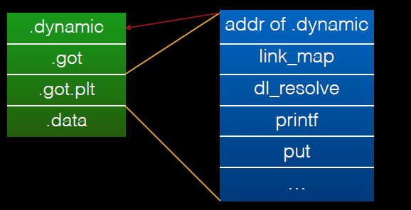

# Dynamic Sections

## .interp

這個節包含了程序對應的解釋器。

參與動態鏈接的可執行文件會具有一個 PT_INTERP 類型的程序頭元素，以便於來加載程序中的段。在 exec (BA_OS) 過程中，系統會從該節中提取解釋器的路徑，並根據解釋器文件的段創建初始時的程序鏡像。也就是說，系統並不使用給定的可執行文件的鏡像，而會首先爲解釋器構造獨立的內存鏡像。因此，解釋器需要從系統處獲取控制權，然後爲應用程序提供執行環境。

解釋器可能有兩種方式獲取控制權。

1. 它可以接收一個指向文件頭的文件描述符，以便於讀取可執行文件。它可以使用這個文件描述符來讀取並將可執行文件的段映射到內存中。

2. 有時候根據可執行文件格式的不同，系統有可能不會把文件描述符給解釋器，而是會直接將可執行文件加載到內存中。

解釋器本身可能不需要再有一個解釋器。解釋器本身可能是一個共享目標文件或者是一個可執行文件。

- 共享目標文件（正常情況下）被加載爲地址獨立的。也就是說，對於不同的進程來說，它的地址會有所不同。系統通過 mmap (KE_OS) 以及一些相關的操作來創建動態段中的內容。因此，共享目標文件的地址通常來說不會和原來的可執行文件的原有地址衝突。
- 可執行文件一般會被加載到固定的地址。系統通過程序頭部表的虛擬地址來創建對應的段。因此，一個可執行文件的解釋器的虛擬地址可能和第一個可執行文件衝突。解釋器有責任來解決相應的衝突。

## .dynamic

如果一個目標文件參與到動態鏈接的過程中，那麼它的程序頭部表將會包含一個類型爲 PT_DYNAMIC 的元素。這個段包含了 .dynamic 節。ELF 使用 _DYNAMIC 符號來標記這個節。它的結構如下

```c
/* Dynamic section entry.  */
typedef struct
{
    Elf32_Sword d_tag; /* Dynamic entry type */
    union
    {
        Elf32_Word d_val; /* Integer value */
        Elf32_Addr d_ptr; /* Address value */
    } d_un;
} Elf32_Dyn;
extern Elf32_Dyn_DYNAMIC[];
```

其中，d_tag 的取值決定了該如何解釋 d_un。

-   d_val
    -   這個字段表示一個整數值，可以有多種意思。
-   d_ptr
    -   這個字段表示程序的虛擬地址。正如之前所說的，一個文件的虛擬地址在執行的過程中可能和內存的虛擬地址不匹配。當解析動態節中的地址時，動態鏈接器會根據原始文件的值以及內存的基地址來計算真正的地址。爲了保持一致性，文件中並不會包含重定位入口來"糾正"動態結構中的地址。

可以看出，其實這個節是由若干個鍵值對構成的。

**下表總結了可執行文件以及共享目標文件中的 d_tag 的需求**。如果一個 tag 被標記爲"mandatory"，那麼對於一個 TIS ELF conforming 的文件來說，其動態鏈接數組必須包含對應入口的類型。同樣的，“optional”意味着可以有，也可以有沒有。

| 名稱                  | 數值                   | d_un   | 可執行 | 共享 目標 | 說明                                                         |
| --------------------- | ---------------------- | ------ | ------ | --------- | ------------------------------------------------------------ |
| DT_NULL               | 0                      | 忽略   | 必需   | 必需      | 標誌着 _DYNAMIC 數組的末端。                                 |
| DT_NEEDED             | 1                      | d_val  | 可選   | 可選      | 包含以NULL 結尾的字符串的字符串表偏移，該字符串給出某個需要的庫的名稱。所使用的索引爲DT_STRTAB的下標。動態數組中可以包含很多個這種類型的標記。這些項在這種類型標記中的相對順序比較重要。但是與其它的標記之前的順序倒無所謂。對應的段爲.gnu.version_r。 |
| DT_PLTRELSZ           | 2                      | d_val  | 可選   | 可選      | 給出與過程鏈接表相關的重定位項的總的大小。如果存在DT_JMPREL類型的項，那麼DT_PLTRELSZ也必須存在。 |
| DT_PLTGOT             | 3                      | d_ptr  | 可選   | 可選      | 給出與過程鏈接表或者全局偏移表相關聯的地址，對應的段.got.plt |
| DT_HASH               | 4                      | d_ptr  | 必需   | 必需      | 此類型表項包含符號哈希表的地址。此哈希表指的是被 DT_SYMTAB 引用的符號表。 |
| DT_STRTAB             | 5                      | d_ptr  | 必需   | 必需      | 此類型表項包含動態字符串表的地址。符號名、庫名、和其它字符串都包含在此表中。對應的節的名字應該是.dynstr。 |
| DT_SYMTAB             | 6                      | d_ptr  | 必需   | 必需      | 此類型表項包含動態符號表的地址。對 32 位的文件而言，這個符號表中的條目的類型爲 Elf32_Sym。 |
| DT_RELA               | 7                      | d_ptr  | 必需   | 可選      | 此類型表項包含重定位表的地址。此表中的元素包含顯式的補齊，例如 32 位文件中的 Elf32_Rela。目標文件可能有多個重定位節區。在爲可執行文件或者共享目標文件創建重定位表時，鏈接編輯器將這些節區連接起來，形成一個表。儘管在目標文件中這些節區相互獨立，但是動態鏈接器把它們視爲一個表。在動態鏈接器爲可執行文件創建進程映像或者向一個進程映像中添加某個共享目標時，要讀取重定位表並執行相關的動作。如果此元素存在，動態結構體中也必須包含 DT_RELASZ 和 DT_RELAENT 元素。如果對於某個文件來說，重定位是必需的話，那麼 DT_RELA 或者 DT_REL 都可能存在。 |
| DT_RELASZ             | 8                      | d_val  | 必需   | 可選      | 此類型表項包含 DT_RELA 重定位表的總字節大小。                |
| DT_RELAENT            | 9                      | d_val  | 必需   | 可選      | 此類型表項包含 DT_RELA 重定位項的字節大小。                  |
| DT_STRSZ              | 10                     | d_val  | 必需   | 必需      | 此類型表項給出字符串表的字節大小，按字節數計算。             |
| DT_SYMENT             | 11                     | d_val  | 必需   | 必需      | 此類型表項給出符號表項的字節大小。                           |
| DT_INIT               | 12                     | d_ptr  | 可選   | 可選      | 此類型表項給出初始化函數的地址。                             |
| DT_FINI               | 13                     | d_ptr  | 可選   | 可選      | 此類型表項給出結束函數（Termination Function）的地址。       |
| DT_SONAME             | 14                     | d_val  | 忽略   | 可選      | 此類型表項給出一個以 NULL 結尾的字符串的字符串表偏移，對應的字符串是某個共享目標的名稱。該偏移實際上是 DT_STRTAB 中的索引。 |
| DT_RPATH              | 15                     | d_val  | 可選   | 忽略      | 此類型表項包含以 NULL 結尾的字符串的字符串表偏移，對應的字符串是搜索庫時使用的搜索路徑。該偏移實際上是 DT_STRTAB 中的索引。 |
| DT_SYMBOLIC           | 16                     | 忽略   | 忽略   | 可選      | 如果這種類型表項出現在共享目標庫中，那麼這將會改變動態鏈接器的符號解析算法。動態連接器將首先選擇從共享目標文件本身開始搜索符號，只有在搜索失敗時，纔會選擇從可執行文件中搜索相應的符號。 |
| DT_REL                | 17                     | d_ptr  | 必需   | 可選      | 此類型表項與 DT_RELA類型的表項類似，只是其表格中包含隱式的補齊，對 32 位文件而言，就是 Elf32_Rel。如果ELF文件中包含此元素，那麼動態結構中也必須包含 DT_RELSZ 和 DT_RELENT 類型的元素。 |
| DT_RELSZ              | 18                     | d_val  | 必需   | 可選      | 此類型表項包含 DT_REL 重定位表的總字節大小。                 |
| DT_RELENT             | 19                     | d_val  | 必需   | 可選      | 此類型表項包含 DT_REL 重定位項的字節大小。                   |
| DT_PLTREL             | 20                     | d_val  | 可選   | 可選      | 此類型表項給出過程鏈接表所引用的重定位項的地址。根據具體情況， d_val 對應的地址可能包含 DT_REL 或者  DT_RELA。過程鏈接表中的所有重定位都必須採用相同的重定位方式。 |
| DT_DEBUG              | 21                     | d_ptr  | 可選   | 忽略      | 此類型表項用於調試。ABI 未規定其內容，訪問這些條目的程序可能與 ABI 不兼容。 |
| DT_TEXTREL            | 22                     | 忽略   | 可選   | 可選      | 如果文件中不包含此類型的表項，則表示沒有任何重定位表項能夠造成對不可寫段的修改。如果存在的話，則可能存在若干重定位項請求對不可寫段進行修改，因此，動態鏈接器可以做相應的準備。 |
| DT_JMPREL             | 23                     | d_ptr  | 可選   | 可選      | 該類型的條目的 d_ptr 成員包含了過程鏈接表的地址，並且索引時應該會把該地址強制轉換爲對應的重定位表項類型的指針。把重定位表項分開有利於讓動態鏈接器在進程初始化時忽略它們（開啓了延遲綁定）。如果存在此成員，相關的 DT_PLTRELSZ 和  DT_PLTREL 必須也存在。 |
| DT_BIND_NOW           | 24                     | 忽略   | 可選   | 可選      | 如果可執行文件或者共享目標文件中存在此類型的表項的話，動態鏈接器在將控制權轉交給程序前，應該將該文件的所有需要重定位的地址都進行重定位。這個表項的優先權高於延遲綁定，可以通過環境變量或者dlopen(BA_LIB)來設置。 |
| DT_LOPROC  ~DT_HIPROC | 0x70000000 ~0x7fffffff | 未指定 | 未指定 | 未指定    | 這個範圍的表項是保留給處理器特定的語義的。                   |

沒有出現在此表中的標記值是保留的。此外，除了數組末尾的 DT_NULL 元素以及 DT_NEEDED 元素的相對順序約束以外， 其他表項可以以任意順序出現。

## Global Offset Table

GOT 表在 ELF 文件中分爲兩個部分

-   .got，存儲導入變量的地址。
-   .got.plt，存儲導入函數的地址。

通常來說，地址獨立代碼不能包含絕對虛擬地址。GOT 表中包含了隱藏的絕對地址，這使得在不違背位置無關性以及程序代碼段共享的情況下，得到相關符號的絕對地址。一個程序可以使用位置獨立代碼來引用它的 GOT 表，然後提取出來絕對的數值，以便於將位置獨立的引用重定向到絕對的地址。 

初始時，got 表中包含重定向所需要的信息。當一個系統爲可加載的目標文件創建內存段時，動態鏈接器會處理重定位項，其中的一些項的類型可能是 R_386_GLOB_DAT，這會指向 got 表。動態鏈接器會決定相關符號的值，計算它們的絕對地址，然後將合適的內存表項設置爲相應的值。儘管在鏈接器建立目標文件時，絕對地址還處於未知狀態，動態鏈接器知道所有內存段的地址，因爲可以計算所包含的符號的絕對地址。

如果一個程序需要直接訪問一個符號的絕對地址，那麼這個符號將會有一個 got 表項。由於可執行文件以及共享目標文件都有單獨的表項，所以一個符號的地址可能會出現在多個表中。動態鏈接器在把權限給到進程鏡像中的代碼段前，會處理所有的 got 表中的重定位項，以便於確保所有的絕對地址在執行過程中是可以訪問的。

GOT 表中的第 0 項包含動態結構（_DYNAMIC）的地址。這使得一個程序，例如動態鏈接器，在沒有執行其重定向前可以找到對應的動態節。這對於動態鏈接器來說是非常重要的，因爲它必須在不依賴其它程序的情況下可以重定位自己的內存鏡像。

在不同的程序中，系統可能會爲同一共享目標文件選擇不同的內存段地址；甚至對於同一個程序，在不同的執行過程中，也會有不同的庫地址。然而，一旦進程鏡像被建立，內存段的地址就不會再改變，只要一個進程還存在，它的內存段地址將處於固定的位置。

GOT 表的形式以及解釋依賴於具體的處理器，對於 Intel 架構來說，`_GLOBAL_OFFSET_TABLE_` 符號可能被用來訪問這個表。

```
extern Elf32_Addr _GLOBAL_OFFSET_TABLE[];
```

`_GLOBAL_OFFSET_TABLE_`可能會在 .got 節的中間，以便於可以使用正負索引來訪問這個表。

在 Linux 的實現中，.got.plt 的前三項的具體的含義如下

-   GOT[0]，.dynamic 的地址。
-   GOT[1]，指向 link_map 的指針，只會在動態裝載器中使用，包含了進行符號解析需要的當前 ELF 對象的信息。每個 link_map 都是一條雙向鏈表的一個節點，而這個鏈表保存了所有加載的 ELF 對象的信息。
-   GOT[2]，指向動態裝載器中 _dl_runtime_resolve 函數的指針。

.got.plt 後面的項則是程序中不同 .so 中函數的引用地址。下面給出一個相應的關係。



## Procedure Linkage Table

PLT 表將導入函數重定向到絕對地址。主要包括兩部分

-   **.plt**，與常見導入的函數有關，如 read 等函數。
-   **.plt.got**，與動態鏈接有關係。

準確的說，plt 表不是查詢表，而是一塊代碼。這一塊內容是與代碼相關的。

在動態鏈接下，程序模塊之間包含了大量的函數引用。如果在程序開始執行前就把所有的函數地址都解析好，動態鏈接就會耗費不少時間用於解決模塊之間的函數引用的符號查找以及重定位。但是，在一個程序運行過程中，可能很多函數在程序執行完時都不會用到，因此一開始就把所有函數都鏈接好可能會浪費大量資源，所以 ELF 採用了一種延遲綁定的做法，其基本思想是函數第一次被用到時才進行綁定（符號查找，重定位等），如果沒有用則不進行綁定。所以程序開始執行前，模塊間的函數調用都沒有進行綁定，而是需要用到時才由動態鏈接器負責綁定。

在惰性綁定的情況下，總體流程如下圖所示，藍線表示首次執行的流程圖，紅線表示第二次以後調用的流程圖：


LD_BIND_NOW 環境變量可以改變動態鏈接器的行爲。如果它的值非空的話，動態鏈接器在將控制權交給程序之前會執行 PLT 表項。也就是說，動態鏈接器在進程初始化過程中執行類型爲 R\_3862\_JMP_SLOT 的重定位表項。否則的話，動態鏈接表會對過程鏈接表項進行延遲綁定，直到第一次執行對應的表項時，纔會今次那個符號解析以及重定位。

注意

>   惰性綁定通常來說會提高應用程序的性能，因爲沒有使用的符號並不會增加動態鏈接的負載。然而，有以下兩種情況將會使得惰性綁定出現未預期的情況。首先，對於一個共享目標文件的函數的初始引用一般來說會超過後續調用的時間，因爲動態鏈接器需要攔截調用以便於去解析符號。一些應用並不能夠忍受這種不可預測性。其次，如果發生了錯誤，並且動態鏈接器不能夠解析符號。動態鏈接器將會終止程序。在惰性綁定的情況下，這種情況可能隨時發生。當關閉了惰性綁定的話，動態鏈接器在進程初始化的過程中就不會出現相應的錯誤，因爲這些都是在應用獲得控制權之前執行的。

鏈接編輯器不能夠解析執行流轉換（比如函數調用），即從一個可執行文件或者共享目標文件到另一個文件。鏈接器安排程序將控制權交給過程鏈接表中的表項。在 Intel 架構中，過程鏈接表存在於共享代碼段中，但是他們會使用在 GOT 表中的數據。動態鏈接器會決定目標的絕對地址，並且會修改相應的 GOT 表中的內存鏡像。因此，動態鏈接器可以在不違背位置獨立以及程序代碼段兼容的情況下，重定向 PLT 項。可執行文件和共享目標文件都有獨立的 PLT 表。

絕對地址的過程鏈接表如下

```assembly
.PLT0:  pushl	got_plus_4
        jmp	*got_plus_8
	      nop; nop
	      nop; nop
.PLT1:  jmp	*name1_in_GOT
        pushl	$offset@PC
	      jmp	.PLT0@PC
.PLT2:  jmp	*name2_in_GOT
        push	$offset
	     jmp	.PLT0@PC
	     ...
```

位置無關的過程鏈接表的地址如下

```assembly
.PLT0:  pushl	4(%ebx)
        jmp	*8(%ebx)
	      nop; nop
	      nop; nop
.PLT1:  jmp	*name1_in_GOT(%ebx)
        pushl	$offset
	      jmp	.PLT0@PC
.PLT2:  jmp	*name2_in_GOT(%ebx)
        push	$offset
	      jmp	.PLT0@PC
	      ...
```

可以看出過程鏈接錶針對於絕對地址以及位置獨立的代碼的處理不同。但是動態鏈接器處理它們時，所使用的接口是一樣的。


動態鏈接器和程序按照如下方式解析過程鏈接表和全局偏移表的符號引用。

1.  當第一次建立程序的內存鏡像時，動態鏈接器將 GOT 表的第二個和第三個項設置爲特殊的值，下面的步驟會仔細解釋這些數值。
2.  如果過程鏈接表是位置獨立的話，那麼 GOT 表的地址必須在 ebx 寄存器中。每一個進程鏡像中的共享目標文件都有獨立的 PLT 表，並且程序只在同一個目標文件將控制流交給 PLT 表項。因此，調用函數負責在調用 PLT表項之前，將全局偏移表的基地址設置爲寄存器中。
3.  這裏舉個例子，假設程序調用了name1，它將控制權交給了 lable .PLT1。
4.  那麼，第一條指令將會跳轉到全局偏移表中 name1 的地址。初始時，全局偏移表中包含 PLT 中下一條 pushl 指令的地址，並不是 name1 的實際地址。
5.  因此，程序將相應函數在 `rel.plt` 中的偏移（重定位偏移，reloc_index）壓到棧上。重定位偏移是 32 位的，並且是非負的數值。此外，重定位表項的類型爲 R\_386\_JMP_SLOT，並且它將會說明在之前 jmp 指令中使用的全局偏移表項在 GOT 表中的偏移。重定位表項也包含了一個符號表索引，因此告訴動態鏈接器什麼符號目前正在被引用。在這個例子中，就是 name1了。
6.  在壓入重定位偏移後，程序會跳轉到 .PLT0，這是過程鏈接表的第一個表項。pushl 指令將 GOT 表的第二個表項(got_plus_4 或者4(%ebx)，**當前ELF對象的信息**)壓到棧上，然後給動態鏈接器一個識別信息。此後，程序會跳轉到第三個全局偏移表項(got_plus\_8 或者8(%ebx)，**指向動態裝載器中 `_dl_runtime_resolve` 函數的指針**) 處，這將會將程序流交給動態鏈接器。
7.  當動態鏈接器接收到控制權後，他將會進行出棧操作，查看重定位表項，解析出對應的符號的值，然後將 name1 的地址寫入到全局偏移表項中，最後將控制權交給目的地址。
8.  過程鏈接表執行之後，程序的控制權將會直接交給 name1 函數，而且此後再也不會調用動態鏈接器來解析這個函數。也就是說，在 .PLT1 處的 jmp 指令將會直接跳轉到 name1 處，而不是再次執行 pushl 指令。

## .rel(a).dyn & .rel(a).plt

.rel.dyn 包含了動態鏈接的二進制文件中需要重定位的變量的信息，而 .rel.plt 包含了需要重定位的函數的信息。這兩類重定位節都使用如下的結構（以 32 位爲例）

```
typedef struct {
    Elf32_Addr        r_offset;
    Elf32_Word       r_info;
} Elf32_Rel;

typedef struct {
    Elf32_Addr     r_offset;
    Elf32_Word    r_info;
    Elf32_Sword    r_addend;
} Elf32_Rela;
```

Elf32_Rela 類型的表項包含明確的補齊信息。 Elf32_Rel 類型的表項在將被修改的位置保存隱式的補齊信息。由於處理器體系結構的原因，這兩種形式都存在，甚至是必需的。因此，對特定機器的實現可以僅使用一種形式，也可以根據上下文使用兩種形式。

其中，每個字段的說明如下

| 成員     | 說明                                                         |
| -------- | ------------------------------------------------------------ |
| r_offset | **此成員給出了需要重定位的位置。**對於一個可重定位文件而言，此值是從需要重定位的符號所在節區頭部開始到將被重定位的位置之間的字節偏移。對於可執行文件或者共享目標文件而言，其取值是需要重定位的**虛擬地址**，一般而言，也就是說我們所說的 GOT 表的地址。 |
| r_info   | **此成員給出需要重定位的符號的符號表索引，以及相應的重定位類型。**  例如一個調用指令的重定位項將包含被調用函數的符號表索引。如果索引是 STN_UNDEF，那麼重定位使用 0 作爲“符號值”。此外，重定位類型是和處理器相關的。 |
| r_addend | 此成員給出一個常量補齊，用來計算將被填充到可重定位字段的數值。 |

關於 r_info 更加具體的字段信息如下面的代碼所示

- r_info 的高三個字節對應的值表示這個動態符號在 `.dynsym` 符號表中的位置
- r_info 的最低字節表示的是重定位類型類型

```c
#define ELF32_R_SYM(i)    ((i)>>8)
#define ELF32_R_TYPE(i)   ((unsigned char)(i))
// 用於構造 r_info
#define ELF32_R_INFO(s,t) (((s)<<8)+(unsigned char)(t))
```

重定位節區會引用兩個其它節區：**符號表、要修改的節區**。節區頭部的 sh_info 和 sh_link 成員給出相應的關係。

這裏，我們具體討論可能的重定位類型。在下面的計算中，我們假設是把一個可重定位文件轉換爲可執行文件或者共享目標文件。從概念上講，鏈接器會把一個或者多個可重定位文件合併起來得到輸出文件。它首先要決定如何結合並放置這些輸入文件，然後更新符號表的值，最後才進行重定位。可執行文件或者共享目標文件的重定位方法是相似的，並且結果幾乎一樣。在後面的描述中我們將會採用如下記號。

-   A(addend) 用來計算可重定位字段的取值的補齊。
-   B(base)  表示共享目標文件在執行過程中被加載到內存中的基地址。一般來說，共享目標文件的虛擬基地址爲 0，但是在執行時，其地址卻會發生改變。
-   G(Global) 表示在執行時重定位項的符號在全局偏移表中的偏移。
-   GOT (global offset table) 表示全局偏移表（GOT）的地址。
-   L (linkage) 表示過程鏈接表項中一個符號的節區偏移或者地址。過程鏈接表項會把函數調用重定位到正確的目標位置。鏈接編輯器會構造初始的過程鏈接表，然後動態鏈接器在執行過程中會修改這些項目。
-   P (place) 表示被重定位（用 r_offset 計算）的存儲單元的位置（節區偏移或者地址）。
-   S  (symbol) 表示索引位於重定位項中的符號的取值。

重定位項的 r_offset 取值爲受影響的存儲單元的第一個字節的偏移或者虛擬地址。重定位類型給出需要修改的比特位以及如何計算它們的值。其中，Intel 架構只使用 ELF32_REL 重定位表項，將要被重定位的成員保留對應的補齊數值。在所有的情況下，補齊的數值與計算的結果使用相同的字節序。

重定位類型以及部分含義如下

| 名稱           | 值   | 域     | 計算        | 含義                                                         |
| -------------- | ---- | ------ | ----------- | ------------------------------------------------------------ |
| R_386_NONE     | 0    | 無     | 無          |                                                              |
| R_386_32       | 1    | word32 | S + A       |                                                              |
| R_386_PC32     | 1    | word32 | S + A - P   |                                                              |
| R_386_GOT32    | 1    | word32 | G + A - P   | 該重定位類型計算從全局偏移表基址到符號的全局偏移表項的距離。另外，它還命令鏈接器創建一個全局偏移表。 |
| R_386_PLT32    | 1    | word32 | L + A - P   | 該重定位類型計算符號的過程鏈接表項地址。另外，它還命令鏈接器創建一個過程鏈接表。 |
| R_386_COPY     | 5    | 無     | 無          | 該重定位類型由鏈接器爲動態鏈接過程創建。它的偏移項指向可寫段中的位置。符號表規定這種符號應既存在於當前目標文件又該存在於共享目標文件中。在執行過程中，動態鏈接器將與該共享目標符號相關的數據複製到由上述偏移量指定的位置。 |
| R_386_GLOB_DAT | 6    | word32 | S           | 該重定位類型用於把一個全局偏移表中的符號設置爲指定符號的地址。這個特殊的重定位類型允許確定符號和全局偏移表項之間的關係。 |
| R_386_JMP_SLOT | 7    | word32 | S           | 該重定位類型由鏈接器爲動態鏈接過程創建。它的偏移項給出了相應過程鏈接表項的位置。動態鏈接器修改過程鏈接表，從而把程序控制權轉移到上述指出的符號地址。 |
| R_386_RELATIVE | 8    | word32 | B + A       | 該重定位類型由鏈接器爲動態鏈接過程創建。它的偏移項給出了共享目標中的一個包含了某個代表相對地址的值的位置。動態鏈接器通過把共享目標文件裝載到的虛擬地址與上述相對地址相加來計算對應虛擬地址。這種類型的重定位項設置符號表索引爲0。 |
| R_386_GOTOFF   | 9    | word32 | S + A - GOT | 該重定位類型計算符號值與全局偏移表地址之間的差。此外，它還通知鏈接器創建一個全局偏移表。 |
| R_386_GOTPC    | 10   | word32 | S + A - P   | 該重定位類型與`R_386_PC32` 類似，只不過它在計算時使用全局偏移表的地址。正常情況下，該重定位表項中被引用的符號是`_GLOBAL_OFFSET_TABLE_` ，它會命令鏈接器創建一個全局偏移表。 |

## .dynsym

動態鏈接的 ELF 文件具有專門的動態符號表，其使用的結構也是 Elf32_Sym，但是其存儲的節爲 .dynsym。這裏再次給出 Elf32_Sym 的結構

```c
typedef struct
{
  Elf32_Word    st_name;   /* Symbol name (string tbl index) */
  Elf32_Addr    st_value;  /* Symbol value */
  Elf32_Word    st_size;   /* Symbol size */
  unsigned char st_info;   /* Symbol type and binding */
  unsigned char st_other;  /* Symbol visibility under glibc>=2.2 */
  Elf32_Section st_shndx;  /* Section index */
} Elf32_Sym;
```

需要注意的是 `.dynsym` 是運行時所需的，ELF 文件中 export/import 的符號信息全在這裏。但是，`.symtab` 節中存儲的信息是編譯時的符號信息，它們在 `strip` 之後會被刪除掉。

我們主要關注動態符號中的兩個成員

-   st_name，該成員保存着動態符號在 .dynstr 表（動態字符串表）中的偏移。
-   st_value，如果這個符號被導出，這個符號保存着對應的虛擬地址。

動態符號與指向它的 Elf_Verdef 之間的關聯性保存在 `.gnu.version` 節中。這個節是由 Elf_Verneed 結構體構成的數組。其中，每個表項對應動態符號表的一項。其實，這個結構體就只有一個域：那就是一個 16 位的整數，表示在 `.gnu.verion_r` 段中的下標。

除此之外，動態鏈接器使用 Elf_Rel 結構體成員 r_info 中的下標同時作爲 .dynsym 段和 .gnu.version 段的下標。這樣就可以一一對應到每一個符號到底是那個版本的了。

## .dynstr

這個節包含了動態鏈接所需要的字符串。

## Misc 

### version releated sections

ELF 文件不僅可以導入外部的符號，而且還可以導入指定版本的符號。例如，當我們可以從 GLIBC_2.2.5 中導入其中的一些標準庫函數，比如 printf。其中，.gnu.version_r 保存了版本的定義，對應的結構體是 Elf_Verdef。

#### .gnu.version

該節與 .dynsym 中的符號信息一一對應，即兩者的元素個數一樣。.gnu.version 中每一個元素的類型是 `Elfxx_Half`，指定了對應符號的版本信息。`Elfxx_Half` 中有兩個值是保留的

- 0，表示這個符號是本地的，對外不公開。下面的`__gmon_start__` 就是一個本地符號。
- 1，表示這個符號在當前這個目標文件中定義，並且是全局可以訪問的。下面的 `_IO_stdin_used` 就是一個全局符號。

```assembly
LOAD:080482D8 ; ELF GNU Symbol Version Table
LOAD:080482D8                 dw 0
LOAD:080482DA                 dw 2                    ; setbuf@@GLIBC_2.0
LOAD:080482DC                 dw 2                    ; read@@GLIBC_2.0
LOAD:080482DE                 dw 0                    ; local  symbol: __gmon_start__
LOAD:080482E0                 dw 2                    ; strlen@@GLIBC_2.0
LOAD:080482E2                 dw 2                    ; __libc_start_main@@GLIBC_2.0
LOAD:080482E4                 dw 2                    ; write@@GLIBC_2.0
LOAD:080482E6                 dw 2                    ; stdin@@GLIBC_2.0
LOAD:080482E8                 dw 2                    ; stdout@@GLIBC_2.0
LOAD:080482EA                 dw 1                    ; global symbol: _IO_stdin_used
...
.rodata:0804866C                 public _IO_stdin_used
.rodata:0804866C _IO_stdin_used  db    1                 ; DATA XREF: LOAD:0804825C↑o
.rodata:0804866D                 db    0
.rodata:0804866E                 db    2
.rodata:0804866F                 db    0
.rodata:0804866F _rodata         ends
```

#### .gnu.version_d

Version definitions of symbols.

#### .gnu.version_r

Version references (version needs) of symbols.

## 參考

- https://refspecs.linuxfoundation.org/LSB_3.0.0/LSB-PDA/LSB-PDA.junk/symversion.html