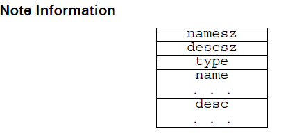
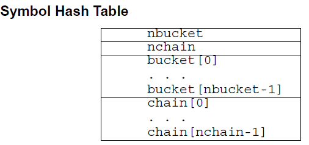
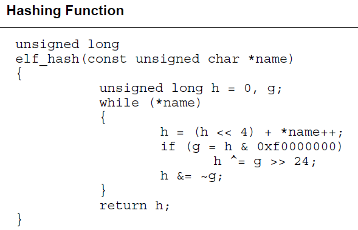

# Misc Sections

## Note related sections

有時候生產廠商或者系統構建者可能需要使用一些特殊的信息來標記ELF文件，從而其它程序可以來檢查該 ELF 文件的一致性以及兼容性。節區類型爲 SHT_NOTE 或者程序頭部類型爲 PT_NOTE 的元素用於來實現這個目的，它們中對象的表項可能包含一到多個，每一個表項都是目標處理器格式的 4 字節數組。下面給出了一些可能的註釋信息。但是這並不在 ELF 文件的規範內。

-   namesz 與 name
    -   name 的前 namesz 字節包含了一個以 NULL 結尾的字符串，這表示該項的擁有者或者發起人。但是目前並沒有避免衝突的格式化的命名機制。一般來說，生產廠商會使用他們自己公司的名字，例如“XYZ Computer Company”來當做對應的標誌。如果沒有任何名字的話，namesz 應該是0。那麼在 name的地方應該填充到 4 字節對齊。
-   descsz 與 desc
    -   desc 的前 descsz 字節包含了註釋的描述。ELF 文件對於描述的內容沒有任何約束。如果沒有任何描述的話，descsz 應該爲 0。當然，應該在 desc 處填充到 4 字節對齊。
-   type
    -   這個字段給出了描述的解釋，對於不同那個的發起者來說，他們都必須控制自己的類型，對於同一類型來說，有可能有多個描述與其對應。因此，發起者必須能夠識別名字以及類型以便於來理解對應的描述。目前來說，類型不能夠爲非負值，ELF 文件的規範裏並不定義描述符的意思。這也是爲什麼 type 在前面。

下面給出一個簡單的例子來說明一下

這裏包含了兩個表項。

在 Linux 中，與 Note 相關的節包含了 ELF 文件中的一些註釋信息，主要包含兩個節

-   .note.ABI-tag
-   .note.gnu.build-id

## .gnu.hash

注：本部分主要參考https://blogs.oracle.com/ali/gnu-hash-elf-sections。

在 ELF 良好的可擴展性的幫助下， GNU 爲 ELF 對象添加了一個新的哈希節，這個節的性能相比於原有的 `SYSV hash` 會好很多。該節用於快速根據符號名獲取對應符號表中的索引。

更多內容請參考 https://blogs.oracle.com/ali/entry/gnu_hash_elf_sections。 **有待進一步學習。**

### ELF 標準

ELF 文件中的哈希表由 Elf32_Word 對象構成，用來支持符號表訪問。下面的符號可以用來輔助解釋符號表的組織情況，但是他們並不是 ELF 文件說明的一部分。

bucket 數組包含了 nbucket 個元素，chain 數組包含了 nchain 個元素，所有的數組的下標都是以 0 開始。bucket 和 chain 都包含符號表索引。chain 數組中的元素是和符號表中的元素一一對應的，因此符號表的元素個數必須和 nchain 的大小相同，故而符號表的索引同樣可以作爲 chain 表的索引。下面展示的哈希函數接受一個符號名作爲輸入，然後返回一個值，這個值可能被用於計算 bucket 的索引。因此，如果哈希函數針對於某個名字返回值 x，那麼 `bucket[x%nbucket] ` 給出了一個索引 y，可以用來索引符號表，也可以用來索引 chain 表。如果符號表的對應索引並不是所想要的哪一個，那麼 chain[y] 就會給出同一個哈希值的下一個符號表中表項的位置，即可以用來防止出現哈希值一樣的情況。因此我們可以跟着 chain 鏈一直搜索直到遇到所想要的符號，或者遇到值爲 `STN_UNDEF` 的 chain 的表項。

## .eh_frame related

.eh_frame_hdr

.eh_frame
