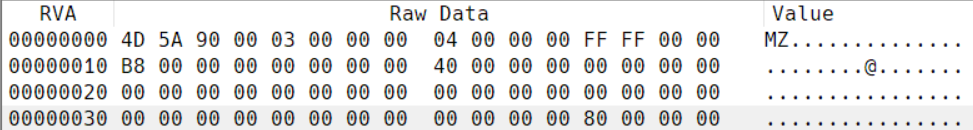
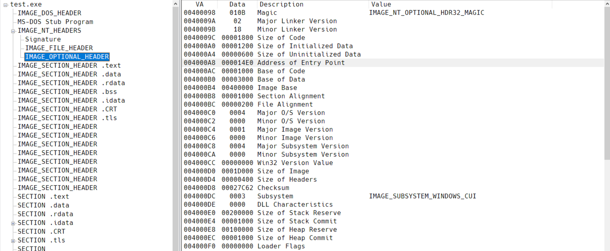

# PE 文件格式

## PE 簡介

PE 文件的全稱是 Portable Executable ，意爲可移植的可執行的文件，常見的EXE、DLL、OCX、SYS、COM都是PE 文件，PE 文件是微軟Windows操作系統上的程序文件，可能是間接被執行，如DLL）。
一個 32-bits 的 PE 文件佈局如下圖所示：

```text
+-------------------------------+ \
|     MS-DOS MZ header          |  |
+-------------------------------+  |
| MS-DOS Real-Mode Stub program |  |
+-------------------------------+  |
|     PE Signature              |  | -> PE file header
+-------------------------------+  |
|     IMAGE_FILE_HEADER         |  |
+-------------------------------+  |
|     IMAGE_OPTIONAL_HEADER     |  |
+-------------------------------+ /
|     section header #1         | 
+-------------------------------+ 
|     section header #2 
+------------------------- 
: 
: 
 
+------------------------------+ 
|        section #1            | 
+------------------------------+ 
|        section #2 
+-------------------- 
: 
: 
```

接下來將會以一個 32-bit 的 PE 文件作爲標本介紹一下 PE 文件。

```c
// 示例代碼 test.c
#include <stdio.h>

int main(){
  printf("Hello, PE!\n");

  return 0;
}
```

**通過 `Devcpp` 軟件的 `TDM-GCC 4.9.2 32-bit Release` 方式編譯文件生成 `test.exe`，作爲示例文件。**

### 常用術語及其含義

- **`映像文件` 因爲 PE 文件通常需要加載到內存中才能執行，相當於內存中的映像，所以 PE 文件也叫做映像文件。**
- **`RVA` 相對虛擬地址，映像文件在虛擬內存中相對於加載基址的偏移。**
- **`VA` 虛擬地址，映像文件在虛擬內存中的地址。**
- **`FOA` 文件偏移地址，映像文件在磁盤文件中相對於文件開頭的偏移。**

因爲不論是在磁盤文件上，或是在虛擬內存中，數據相對於其所在節的相對偏移是固定的，據此可以實現 RVA 與 FOA 之間的轉換，即`RVA - 節區RVA = FOA - 節區FOA`。

假設某一個屬於 .data 節的數據的 RVA 是 0x3100，.data 節的 節區RVA 爲 0x3000，那麼該數據相對於 .data 節的相對偏移就是 0x100。而 .data 節在的 節區FOA 爲 0x1C00，那麼該數據在磁盤文件中的 FOA 就是 0x1D00。完整的計算公式是：`FOA = 節區FOA + (RVA - 節區RVA)`。如果該映像文件的加載基址爲0x40000000，那麼該數據的 VA 就是 0x40003100。

## PE文件頭

PE 文件的最開始便是 PE 文件頭，它由 `MS-DOS 文件頭` 和 `IMAGE_NT_HEADERS` 結構體組成。

### MS-DOS 文件頭

`MS-DOS 文件頭` 包含 `IMAGE_DOS_HEADER` 和 `DOS Stub` 兩個部分。

`IMAGE_DOS_HEADER` 結構體的定義如下：

```c
typedef struct _IMAGE_DOS_HEADER
{
     WORD e_magic;              // "MZ"
     WORD e_cblp;
     WORD e_cp;
     WORD e_crlc;
     WORD e_cparhdr;
     WORD e_minalloc;
     WORD e_maxalloc;
     WORD e_ss;
     WORD e_sp;
     WORD e_csum;
     WORD e_ip;
     WORD e_cs;
     WORD e_lfarlc;
     WORD e_ovno;
     WORD e_res[4];
     WORD e_oemid;
     WORD e_oeminfo;
     WORD e_res2[10];
     LONG e_lfanew;             // NT 頭相對於文件起始處的偏移
} IMAGE_DOS_HEADER, *PIMAGE_DOS_HEADER;
```

`IMAGE_DOS_HEADER` 結構體中有 2 個重要成員：
- **`e_magic` 單字。DOS 簽名 "4D5A"，即 ASCII 值 "MZ"。所有 PE 文件的開頭都有 DOS 簽名。**
- **`e_lfanew` 單字。`IMAGE_NT_HEADER`相對於文件起始處的偏移。**

示例程序的 `IMAGE_DOS_HEADER` 如圖 2 所示：



`IMAGE_DOS_HEADER` 結構體後緊接着是 `DOS Stub`，它的作用很簡單，當系統爲 MS-DOS 環境時，輸出 `This program cannot be run in DOS mode.` 並退出程序，表明該程序不能在 MS-DOS 環境下運行。這使得所有的 PE 文件都對 MS-DOS 環境兼容。利用該特性可以創建出一個在 MS-DOS 和 Windows 環境中都能運行的程序，在 MS-DOS 中執行 16-bit MS-DOS 代碼，在 Windows 中執行 32-bit Windows 代碼。

示例程序的 `DOS Stub` 如圖 3 所示：


### IMAGE_NT_HEADERS

`IMAGE_NT_HEADERS` 結構體，俗稱 NT 頭。緊跟在 `DOS Stub` 之後，其定義如下：

```c
typedef struct _IMAGE_NT_HEADERS {
  DWORD                   Signature;         /* +0000h PE 標識 */
  IMAGE_FILE_HEADER       FileHeader;        /* +0004h PE 標準頭 */
  IMAGE_OPTIONAL_HEADER32 OptionalHeader;    /* +0018h PE 可選頭  */
} IMAGE_NT_HEADERS32, *PIMAGE_NT_HEADERS32;
```

示例程序的 `IMAGE_NT_HEADERS` 如圖 4 所示：


接下來詳細說一下 NT 頭。

#### PE Signature

NT 頭的第一個成員是`PE Signature`，它是一個4字節大小的ASCII碼字符串 `PE\0\0`，用於指明當前文件是一個 PE 格式的映像文件。其位置可以通過 `IMAGE_DOS_HEADER` 的 `e_lfanew` 成員的值確定。

#### IMAGE_FILE_HEADER

`PE Signature` 後緊跟着是 `IMAGE_FILE_HEADER` 結構體，又稱作 `COFF 頭（標準通用文件格式頭）`。其定義如下：

```c
typedef struct _IMAGE_FILE_HEADER {
  WORD  Machine;                    /* +0004h 目標機器類型 */
  WORD  NumberOfSections;           /* +0006h PE 中節的數量 */
  DWORD TimeDateStamp;              /* +0008h 時間戳 */
  DWORD PointerToSymbolTable;       /* +000ch 指向符號表的指針 */
  DWORD NumberOfSymbols;            /* +0010h 符號表中符號數目 */
  WORD  SizeOfOptionalHeader;       /* +0012h 可選頭的大小 */
  WORD  Characteristics;            /* +0014h 文件屬性標誌 */
} IMAGE_FILE_HEADER, *PIMAGE_FILE_HEADER;
```

接下來依次對每一個字段做出解釋：

- **`Machine`  單字。用於指明 CPU 類型。詳細瞭解所支持的 CPU 類型請參考 [微軟 PE 格式 COFF 文件頭 Machine 類型](https://docs.microsoft.com/zh-cn/windows/win32/debug/pe-format?redirectedfrom=MSDN#machine-types)。**
- **`NumberOfSections` 單字。文件中存在的節區數量。PE 文件將代碼、數據、資源的依據屬性分類到不同節區中存儲。**
- `TimeDateStamp` 雙字。低 32 位表示從 1970 年 1 月 1 日 00：00 到文件創建時經過的秒數。
- `PointerToSymbolTable` 雙字。符號表的文件偏移。如果不存在符號表，其值爲 0。
- `NumberOfSymbols` 雙字。該字段表示符號表中的符號數量。由於字符串表緊跟在符號表之後，所有能通過該值定位字符串表。
- **`SizeOfOptionalHeader` 單字。表示可選頭的大小。在 32-bit 機器上默認是 0x00E0，在 64-bit 機器上默認是 0x00F0。**
- **`Characteristics` 單字。用於標識文件屬性，以 bit OR 方式組合。**下面是一些已定義的文件屬性標誌：

```c
// 文件屬性標誌
#define IMAGE_FILE_RELOCS_STRIPPED          0x0001    // 表示文件不包含重定位信息，只能在原定的基址加載。如果原定基址不可用，加載器會報出錯誤
#define IMAGE_FILE_EXECUTABLE_IMAGE         0x0002    // 表示文件可執行，如果該位未設置，意味着存在鏈接器錯誤
#define IMAGE_FILE_LINE_NUMS_STRIPPED       0x0004    // 不存在行信息
#define IMAGE_FILE_LOCAL_SYMS_STRIPPED      0x0008    // 不存在符號信息
#define IMAGE_FILE_AGGRESSIVE_WS_TRIM       0x0010    // 已廢棄
#define IMAGE_FILE_LARGE_ADDRESS_AWARE      0x0020    // 應用可處理大於 2GB 的地址
#define IMAGE_FILE_BYTES_REVERSED_LO        0x0080    // 小尾存儲。已廢棄
#define IMAGE_FILE_32BIT_MACHINE            0x0100    // 基於 32-bit 體系結構
#define IMAGE_FILE_DEBUG_STRIPPED           0x0200    // 不存在調試信息
#define IMAGE_FILE_REMOVABLE_RUN_FROM_SWAP  0x0400    // 如果映像文件在可移動介質上，完全加載並複製到內存交換文件中
#define IMAGE_FILE_NET_RUN_FROM_SWAP        0x0800    // 如果映像文件在網絡介質上，完全加載並複製到內存交換文件中
#define IMAGE_FILE_SYSTEM                   0x1000    // 映像文件是系統文件
#define IMAGE_FILE_DLL                      0x2000    // 映像文件是動態鏈接庫文件
#define IMAGE_FILE_UP_SYSTEM_ONLY           0x4000    // 文件只能在單處理器機器上運行
#define IMAGE_FILE_BYTES_REVERSED_HI        0x8000    // 大尾存儲（已廢棄）
```

示例程序的 `IMAGE_FILE_HEADER` 如下：

```text
// 示例程序 IMAGE_FILE_HEADER
RVA       Value      Description
----------------------------------------------------
00000084  014C       機器類型
00000086  000F       節區數量
00000088  5D88E2A6   時間戳
0000008c  00012C00   符號表偏移
00000090  000004E4   符號數量
00000094  00E0       可選頭大小
00000096  0107       文件屬性
                     0001  IMAGE_FILE_RELOCS_STRIPPED
                     0002  IMAGE_FILE_EXECUTABLE_IMAGE
                     0004  IMAGE_FILE_LINE_NUMS_STRIPPED
                     0100  IMAGE_FILE_32BIT_MACHINE
```

#### IMAGE_OPTIONAL_HEADER

之所以`IMAGE_OPTIONAL_HEADER` 叫做可選頭，是因爲對於目標文件，它沒有任何作用，只是平白增加了目標文件的大小；但對於映像文件來說，它提供了加載時必需的信息。定義如下：

```c
typedef struct _IMAGE_OPTIONAL_HEADER {
  WORD                 Magic;                            /* +0018h 魔數 */
  BYTE                 MajorLinkerVersion;               /* +001ah 鏈接器主要版本號 */
  BYTE                 MinorLinkerVersion;               /* +001bh 鏈接器次要版本號 */
  DWORD                SizeOfCode;                       /* +001ch 所有含代碼的節的總大小 */
  DWORD                SizeOfInitializedData;            /* +0020h 所有含已初始化數據的節的總大小 */
  DWORD                SizeOfUninitializedData;          /* +0024h 所有含未初始化數據的節的總大小 */
  DWORD                AddressOfEntryPoint;              /* +0028h 程序入口點RVA */
  DWORD                BaseOfCode;                       /* +002ch 代碼節起始RVA */
  DWORD                BaseOfData;                       /* +0030h 數據節起始RVA */
  DWORD                ImageBase;                        /* +0034h 映像文件加載時的首選地址 */
  DWORD                SectionAlignment;                 /* +0038h 內存中節對齊粒度*/
  DWORD                FileAlignment;                    /* +003ch 文件中節對齊粒度 */
  WORD                 MajorOperatingSystemVersion;      /* +0040h 操作系統主要版本號 */
  WORD                 MinorOperatingSystemVersion;      /* +0042h 操作系統次要版本號 */
  WORD                 MajorImageVersion;                /* +0044h 映像文件主要版本號 */
  WORD                 MinorImageVersion;                /* +0046h 映像文件次要版本號 */
  WORD                 MajorSubsystemVersion;            /* +0048h 子系統主要版本號 */
  WORD                 MinorSubsystemVersion;            /* +004ah 子系統次要版本號 */
  DWORD                Win32VersionValue;                /* +004ch 保留。置0 */
  DWORD                SizeOfImage;                      /* +0050h 內存中映像文件的大小 */
  DWORD                SizeOfHeaders;                    /* +0054h 所有頭+節表大小 */
  DWORD                CheckSum;                         /* +0058h 映像文件校驗和 */
  WORD                 Subsystem;                        /* +005ch 運行映像所需子系統 */
  WORD                 DllCharacteristics;               /* +005eh 映像文件的DLL屬性 */
  DWORD                SizeOfStackReserve;               /* +0060h 初始化時的保留的棧大小 */
  DWORD                SizeOfStackCommit;                /* +0064h 初始化時實際提交的棧大小 */
  DWORD                SizeOfHeapReserve;                /* +0068h 初始化時保留的堆大小 */
  DWORD                SizeOfHeapCommit;                 /* +006ch 初始化時實際提交的堆大小 */
  DWORD                LoaderFlags;                      /* +0070h 已廢棄 */
  DWORD                NumberOfRvaAndSizes;              /* +0074h 數據目錄結構的數量 */
  IMAGE_DATA_DIRECTORY DataDirectory[IMAGE_NUMBEROF_DIRECTORY_ENTRIES];     /* +0078h 指向數據目錄中第一個 IMAGE_DATA_DIRECTORY 結構體的指針 */
} IMAGE_OPTIONAL_HEADER32, *PIMAGE_OPTIONAL_HEADER32;
```

- **`Magic` 單字。指明映像文件的類型。`0x0107h` 表示 ROM 映像；`0x010B` 表示 PE32；`0x020B` 表示 PE32+，即 64-bit 的 PE 文件。**
- `MajorLinkerVersion` 字節。指定鏈接器主要版本號。
- `MinorLinkerVersion` 字節。指定鏈接器次要版本號。
- `SizeOfCode` 雙字。所有包含代碼的節的總大小。**這裏的大小指文件對齊後的大小。判斷某個節是否包含代碼的方法是根據節屬性是否包含 `IMAGE_SCN_CNT_CODE` 標誌。**
- `SizeOfInitializedData` 雙字。所有包含已初始化數據節的總大小。
- `SizeOfUninitializedData` 雙字。所有包含未初始化數據節的總大小。
- **`AddressOfEntryPoint` 雙字。入口點函數的指針相對於映像文件加載基址的偏移量。對於可執行文件，這是啓動地址；對於設備驅動，這是初始化函數的地址；入口點函數對於 DLL 文件是可選的，如果不存在入口點，該成員必須置 0。**
- `BaseOfCode` 雙字。代碼節的 RVA，代碼節起始處相對於映像文件加載基址的偏移量。通常代碼節緊跟在 PE 頭 後面，節名爲 ".text"。
- `BaseOfData` 雙字。數據節的 RVA，數據節起始處相對於映像文件加載基址的偏移量。通常數據節位於文件末尾，節名爲 ".data"。
- **`ImageBase` 雙字。映像文件加載時的優先載入地址，值必須是 64KB 的整數倍。**應用程序的默認值是 0x00400000；DLL 的默認值是 0x10000000。**當一個程序用到了多個 DLL 文件時，PE 加載器會調整 DLL 的載入地址，使所有 DLL 文件都能夠被正確載入。**
- **`SectionAlignment` 雙字。內存中的節對齊粒度。該成員的值必須不小於 `FileAlignment` 成員的值。默認的值與系統的頁大小相等。**
- **`FileAlignment` 雙字。映像文件中原始數據的對齊粒度。值必須是在 512-64K 範圍內的 2 的冪。默認值爲512，但如果 `SectionAlignment` 成員的值小於系統頁大小，則 `FileAlignment` 與 `SectionAlignment` 兩者成員的值必須相同。**
- `MajorOperatingSystemVersion` 單字。操作系統主要版本號。
- `MinorOperatingSystemVersion` 單字。操作系統次要版本號。
- `MajorImageVersion` 單字。映像文件主要版本號。
- `MinorImageVersion` 單字。映像文件次要版本號。
- `MajorSubsystemVersion` 單字。子系統主要版本號。
- `MinorSubsystemVersion` 單字。子系統次要版本號。
- `Win32VersionValue` 雙字。保留。置0。
- **`SizeOfImage` 雙字。映像文件在虛擬內存中所佔的大小。值必須爲 `SectionAlignment` 的整數倍。**
- **`SizeOfHeaders` 雙字。PE 文件頭和所有節表大小的總和按照 `FileAlignment` 對齊後的大小。第一節區在文件開始偏移爲 `SizeOfHeaders` 處。**
- `CheckSum` 雙字。映像文件的校驗值。需要在裝載時校驗的文件有所有的驅動，任何在啓動時裝載的 DLL，以及任何加載到關鍵系統進程中的 DLL。
- **`Subsystem` 單字。運行映像文件所需的子系統。已定義的子系統標誌如下：**

```c
// Subsystem 標誌
#define IMAGE_SUBSYSTEM_UNKNOWN                      0  // 未知子系統
#define IMAGE_SUBSYSTEM_NATIVE                       1  // 不需要子系統。設備驅動和本機系統進程
#define IMAGE_SUBSYSTEM_WINDOWS_GUI                  2  // Windows 圖形用戶接口（GUI）子系統
#define IMAGE_SUBSYSTEM_WINDOWS_CUI                  3  // Windows 字符模式用戶接口子（CUI）系統
#define IMAGE_SUBSYSTEM_OS2_CUI                      5  //  OS/2 CUI 子系統
#define IMAGE_SUBSYSTEM_POSIX_CUI                    7  // POSIX CUI 子系統
#define IMAGE_SUBSYSTEM_WINDOWS_CE_GUI               9  // Windows CE 系統
#define IMAGE_SUBSYSTEM_EFI_APPLICATION             10  // 可擴展固件接口（EFI）應用程序
#define IMAGE_SUBSYSTEM_EFI_BOOT_SERVEICE_DRIVER    11  // 帶引導服務的 EFI 驅動程序
#define IMAGE_SUBSYSTEM_EFI_RUNTIME_DRIVER          12  // 帶運行時服務的 EFI 驅動程序
#define IMAGE_SUBSYSTEM_EFI_ROM                     13  // EFI ROM 映像
#define IMAGE_SUBSYSTEM_XBOX                        14  // XBOX 系統
#define IMAGE_SUBSYSTEM_WINDOWS_BOOT_APPLICATION    16  // 引導應用程序
```

- **`DllCharacteristics` 單字。映像文件的 DLL 屬性，以 bit OR 方式組合。各標誌位的含義如下：**

```c
// DLL 屬性標誌
// 0x0001 0x0002 0x0004 0x0008 保留，值必須爲 0。
#define IMAGE_DLLCHARACTERISTICS_DYNAMIC_BASE             0x0040  // DLL 可以在加載時重定位
#define IMAGE_DLLCHARACTERISTICS_FORCE_INTEGRITY          0x0080  // 強制實行代碼完整性檢驗
#define IMAGE_DLLCHARACTERISTICS_NX_COMPAT                0x0100  // 映像兼容數據執行保護（DEP）
#define IMAGE_DLLCHARACTERISTICS_NO_ISOLATION             0x0200  // 映像可以隔離，但不應該被隔離
#define IMAGE_DLLCHARACTERISTICS_NO_SEH                   0x0400  // 映像不使用結構化異常處理（SEH）
#define IMAGE_DLLCHARACTERISTICS_NO_BIND                  0x0800  // 不綁定映像
//#define IMAGE_DLLCHARACTERISTICS_APPCONTAINER           0x1000  // 在 32-bit 保留；64-bit 表示映像必須在 AppContainer 內執行
#define IMAGE_DLLCHARACTERISTICS_WDM_DRIVER               0x2000  // WDM 驅動
//#define IMAGE_DLLCHARACTERISTICS_GUARD_CF               0x4000  // 在 32-bit 保留；64-bit 表示映像支持控制流保護
#define IMAGE_DLLCHARACTERISTICS_TERMINAL_SERVER_AWARE    0x8000  // 映像可用於終端服務器
```

- `SizeOfStackReserve` 雙字。初始化時保留的棧內存大小，默認值是 1MB。具體說是初始化時爲棧保留的虛擬內存的大小，但並不是所有保留的虛擬內存都能直接作爲棧使用。初始化時實際提交的棧大小由 `SizeOfStackCommit` 成員指定。
- `SizeOfStackCommit` 雙字。初始化時實際提交的棧內存大小。
- `SizeOfHeapReserve` 雙字。初始化時保留的堆內存大小，默認值爲 1MB。每一個進程至少爲會有一個默認的進程堆，在進程啓動的時候被創建，並且在進程的聲明週期內不會被刪除。
- `SizeOfHeapCommit` 雙字。初始化時實際提交的堆內存大小，默認大小爲 1 頁。可以通過鏈接器的 "-heap" 參數指定起始保留的堆內存大小和實際提交的堆內存大小。
- `LoaderFlags` 成員已棄用。
- **`NumberOfRvaAndSizes` 雙字。數據目錄結構的數量。通常爲 0x00000010，即 16 個。**
- **`DataDirectory` 結構體。由 `IMAGE_DATA_DIRECTORY` 結構體組成的數組，數組的每項都有被定義的值。結構體定義如下：**

```c
typedef struct _IMAGE_DATA_DIRECTORY {
  DWORD VirtualAddress;      /* 數據目錄的 RVA */
  DWORD Size;                /* 數據目錄的大小 */
} IMAGE_DATA_DIRECTORY, *PIMAGE_DATA_DIRECTORY;
```

各數組項如下：

```c
// 數據目錄
DataDirectory[0] =   EXPORT Directory           // 導入表 RVA 和大小
DataDirectory[1] =   IMPORT Directory           // 導入表 RVA 和大小
DataDirectory[2] =   RESOURCE Directory         // 資源表 RVA 和大小
DataDirectory[3] =   EXCEPTION Directory        // 異常表 RVA 和大小
DataDirectory[4] =   CERTIFICATE Directory      // 證書表 FOA 和大小
DataDirectory[5] =   BASE RELOCATION Directory  // 基址重定位表 RVA 和大小
DataDirectory[6] =   DEBUG Directory            // 調試信息 RVA 和大小
DataDirectory[7] =   ARCH DATA Directory        // 指定架構信息 RVA 和大小
DataDirectory[8] =   GLOBALPTR Directory        // 全局指針寄存器 RVA
DataDirectory[9] =   TLS Directory              // 線程私有存儲表 RVA 和大小
DataDirectory[10] =  LOAD CONFIG Directory      // 加載配置表 RVA 和大小
DataDirectory[11] =  BOUND IMPORT Directory     // 綁定導入表 RVA 和大小
DataDirectory[12] =  `IAT` Directory              // 導入地址表 RVA 和大小
DataDirectory[13] =  DELAY IMPORT Directory     // 延遲導入描述符 RVA 和大小
DataDirectory[14] =  CLR Directory              // CLR數據 RVA 和大小
DataDirectory[15] =  Reserverd                  // 保留
```

示例程序的 `IMAGE_OPTIONAL_HEADER` 如下圖：



## PE 數據主體

PE 數據主體包括 `Section Header` 和所有的節區。

### Section Header

緊跟在可選頭後面的是 `Section Header`，也稱作節表。PE 文件種所有節的屬性都被定義在節表中。節表由一系列的 `IMAGE_SECTION_HEADER` 結構體組成，結構體大小均爲 40 字節。每一個結構體描述一個節的信息，定義如下：

```c
typedef struct _IMAGE_SECTION_HEADER {
  BYTE  Name[IMAGE_SIZEOF_SHORT_NAME];    /* 節區名 */
  union {
    DWORD PhysicalAddress;                /* 物理地址 */
    DWORD VirtualSize;                    /* 虛擬內存中節區大小  */
  } Misc;
  DWORD VirtualAddress;                   /* 虛擬內存中節區 RVA */
  DWORD SizeOfRawData;                    /* 磁盤文件中節區大小 */
  DWORD PointerToRawData;                 /* 磁盤文件中節區 FOA */
  DWORD PointerToRelocations;             /* 指向重定位表的指針 */
  DWORD PointerToLinenumbers;             /* 指向行號表的指針 */
  WORD  NumberOfRelocations;              /* 重定位入口數量 */
  WORD  NumberOfLinenumbers;              /* 行號數量 */
  DWORD Characteristics;                  /* 節區屬性 */
} IMAGE_SECTION_HEADER, *PIMAGE_SECTION_HEADER;
```

- `Name` 節名稱字符串。長度最多 8 個字節。
- `Misc`
  - `PhysicalAddress` 雙字。文件地址。
  - `VirtualSize` 雙字。虛擬內存中的節區所佔內存大小。 
- `VirtualAddress` 雙字。虛擬內存中節區 RVA。
- `SizeOfRawData` 雙字。對於映像文件，表示磁盤上初始化數據的大小，值必須爲 `FileAlignment` 的整數倍；對於目標文件，表示節的大小。
- `PointerToRawData` 雙字。磁盤文件中節區起始處的 FOA。值必須是 `FileAlignment` 的整數倍。
- `PointerToRelocations` 雙字。在對象文件中使用，指向重定位表的指針。
- `PointerToLinenumbers` 雙字。行號信息位置（供調試用）。如果沒有行號信息則置 0；同時因爲不建議使用 COFF 調試信息，在映像文件中應置 0。
- `NumberOfRelocations` 單字。重定位入口的數量，在映像文件中置 0。
- `NumberOfLinenumbers` 單字。行號數量（供調試用）。因爲不建議使用 COFF 調試信息，所以在映像文件中應置 0。
- **`Characteristics` 雙字。節區屬性。，以 bit OR 方式組合。各標誌位的含義如下：**

```c
// 節區屬性
#define IMAGE_SCN_CNT_CODE                0x00000020  // 節區包含代碼
#define IMAGE_SCN_CNT_INITIALIZED_DATA    0x00000040  // 節區包含已初始化數據
#define IMAGE_SCN_CNT_UNINITIALIZED_DATA  0x00000080  // 節區包含未初始化數據
#define IMAGE_SCN_ALIGN_1BYTES            0x00100000  // 1-byte 對齊。僅用於目標文件
#define IMAGE_SCN_ALIGN_2BYTES            0x00200000  // 2-byte 對齊。僅用於目標文件
#define IMAGE_SCN_ALIGN_4BYTES            0x00300000  // 4-byte 對齊。僅用於目標文件
#define IMAGE_SCN_ALIGN_8BYTES            0x00400000  // 8-byte 對齊。僅用於目標文件
#define IMAGE_SCN_ALIGN_16BYTES           0x00500000  // 16-byte 對齊。僅用於目標文件
#define IMAGE_SCN_ALIGN_32BYTES           0x00600000  // 32-byte 對齊。僅用於目標文件
#define IMAGE_SCN_ALIGN_64BYTES           0x00700000  // 64-byte 對齊。僅用於目標文件
#define IMAGE_SCN_ALIGN_128BYTES          0x00800000  // 128-byte 對齊。僅用於目標文件
#define IMAGE_SCN_ALIGN_256BYTES          0x00900000  // 256-byte 對齊。僅用於目標文件
#define IMAGE_SCN_ALIGN_512BYTES          0x00A00000  // 512-byte 對齊。僅用於目標文件
#define IMAGE_SCN_ALIGN_1024BYTES         0x00B00000  // 1024-byte 對齊。僅用於目標文件
#define IMAGE_SCN_ALIGN_2048BYTES         0x00C00000  // 2048-byte 對齊。僅用於目標文件
#define IMAGE_SCN_ALIGN_4096BYTES         0x00D00000  // 4096-byte 對齊。僅用於目標文件
#define IMAGE_SCN_ALIGN_8192BYTES         0x00E00000  // 8192-byte 對齊。僅用於目標文件
#define IMAGE_SCN_LNK_NRELOC_OVFL         0x01000000  // 節區包含擴展的重定位項
#define IMAGE_SCN_MEM_DISCARDABLE         0x02000000  // 節區可根據需要丟棄，如 .reloc 在進程開始後被丟棄
#define IMAGE_SCN_MEM_NOT_CACHED          0x04000000  // 節區不會被緩存
#define IMAGE_SCN_MEM_NOT_PAGED           0x08000000  // 節區不可分頁
#define IMAGE_SCN_MEM_SHARED              0x10000000  // 節區可共享給不同進程
#define IMAGE_SCN_MEM_EXECUTE             0x20000000  // 節區可作爲代碼執行
#define IMAGE_SCN_MEM_READ                0x40000000  // 節區可讀
#define IMAGE_SCN_MEM_WRITE               0x80000000  // 節區可寫
```

示例文件的節區頭如下：

```text
No.  Name    VirtualSize  VirtualOffset  RawSize   RawOffset  Characteristics
--------------------------------------------------------------------------
01   .text   00001670     00001000       00001800  00000400   60500020  R-X  包含可執行代碼
02   .data   0000002C     00003000       00000200  00001C00   C0300040  RW-  包含已初始化數據
03   .rdata  00000168     00004000       00000600  00001E00   40300040  R--  包含已初始化數據
04   .bss    00000450     00005000       00000000  00000000   C0700080  RW-  包含未初始化數據
05   .idata  00000564     00006000       00000600  00002400   C0300040  RW-  包含已初始化數據
06   .CRT    00000034     00007000       00000200  00002A00   C0300040  RW-  包含已初始化數據
07   .tls    00000020     00008000       00000200  00002C00   C0300040  RW-  包含已初始化數據
08   /4      000002D8     00009000       00000400  00002E00   42400040  R--  包含已初始化數據
09   /19     0000A6D5     0000A000       0000A800  00003200   42100040  R--  包含已初始化數據
0A   /31     0000199E     00015000       00001A00  0000DA00   42100040  R--  包含已初始化數據
0B   /45     000018F3     00017000       00001A00  0000F400   42100040  R--  包含已初始化數據
0C   /57     00000780     00019000       00000800  00010E00   42300040  R--  包含已初始化數據
0D   /70     000002F2     0001A000       00000400  00011600   42100040  R--  包含已初始化數據
0E   /81     00000D1E     0001B000       00000E00  00012800   42100040  R--  包含已初始化數據
0F   /92     00000230     0001C000       00000400  00012C00   42100040  R--  包含已初始化數據
```

### Sections

緊跟在 `Section Header`  後面的就是各個 sections，即節區。PE 文件一般至少要求有兩個節區，用於存儲可執行數據的代碼節區 .text，和存儲數據的數據節區 .data。通過節區名可以猜測節區的用途，但節區名不是決定節區用途的因素，只作爲一種參考。比如也可以將代碼節區的節區名修改爲 .data，對於程序執行不會有影響。這裏講一下常見節區的用途：

```text
 .text  默認的代碼節區。用於保存可執行代碼。
 .data  默認的讀/寫數據節區。用於保存已初始化的全局變量，靜態變量。
.rdata  默認的只讀數據節區。
.idata  用於保存導入表信息。包含IAT, INT, 導入函數名稱以及導入 DLL 名稱等。
.edata  用於保存導出表信息。
 .rsrc  用於保存資源表信息。
  .bss  用於保存未初始化數據。
  .tls  用於保存 TLS（線程局部存儲）信息。
.reloc  用於保存重定位表信息。
```

其中有一些 Section 需要重點關注，比如保存着庫文件導入相關數據的 .idata 節，或者與線程私有存儲相關的 .tls 節等等。對這些重要節進行分析，就是之後學習的主要內容。