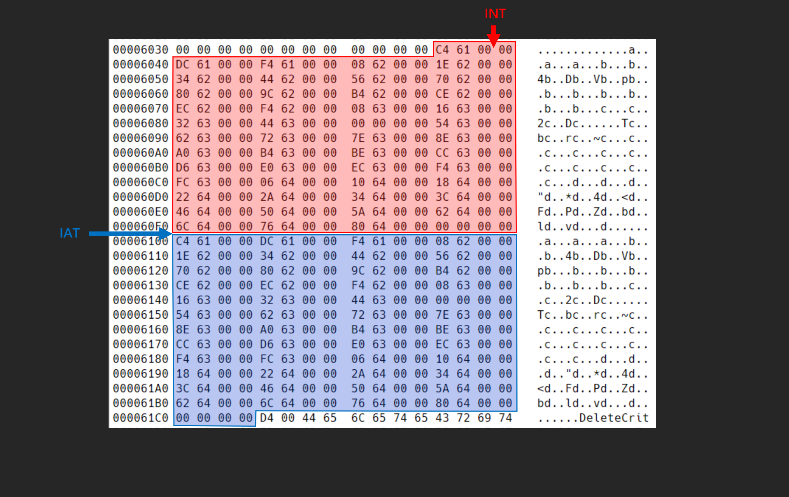
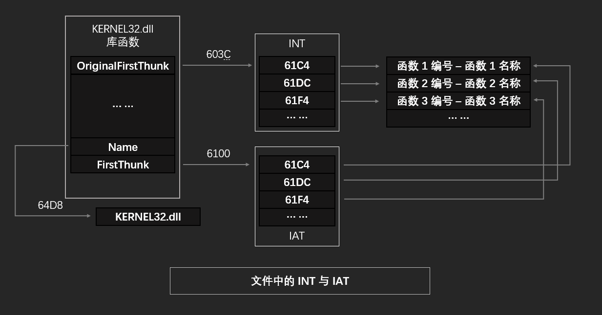

# 導入表

當可執行文件使用外來 DLL 的代碼或數據時，需要 Windows 裝載器記錄所有要導入的函數和數據，並將 DLL 裝載到可執行文件的虛擬地址空間中；裝載器會確保可執行文件運行需要的所有 DLL 都被裝載。

但對於可執行文件，它無法確定導入函數在內存中的位置，於是 Windows 裝載器在裝載 DLL 時將定位導入函數需要的信息寫入到 IAT(Import Address Table，導入地址表)。待執行中遇到導入函數的調用時，就通過 IAT 確定導入函數在內存中的位置。

導入表相關數據包括 `IMAGE_IMPORT_DESCRIPTOR` 和 `IMAGE_IMPORT_BY_NAME` 以及相應的字符串數據。導入表是用來修正並存儲 DLL 裝載進內存後對應函數實際地址的數據節。

## INT 與 IAT

`DataDirectory[1]` 處保存着 IMPORT TABLE（即導入表）的 RVA。該 RVA 指向 `IMAGE_IMPORT_DESCRIPTOR` 結構體數組，`IMAGE_IMPORT_DESCRIPTOR` 結構體記錄着 PE 文件導入庫文件所需的信息。

```c
typedef struct _IMAGE_IMPORT_DESCRIPTOR {
  union {
    DWORD Characteristics;
    DWORD OriginalFirstThunk;       // 導入名稱表 `INT` 的 RVA
  };
  DWORD TimeDateStamp;
  DWORD ForwarderChain;
  DWORD Name;                       // 庫名稱字符串 RVA
  DWORD FirstThunk;                 // 導入地址表 `IAT` 的 RVA
} IMAGE_IMPORT_DESCRIPTOR;
```

接下來對結構體中重要的成員說明一下：

- **`OriginalFirstThunk` 指向 INT(Import Name Table)。**
- **`Name` 指向導入函數所屬的庫文件名稱。**
- **`FirstThunk` 指向 IAT(Import Address Table)。**

`INT` 與 `IAT` 也並稱做雙橋結構。`INT` 數組中的每一個指針都指向一個 `IMAGE_IMPORT_BY_NAME` 結構體，文件中 `IAT` 也是。`IMAGE_IMPORT_BY_NAME` 結構體記錄着導入函數所需的信息。

```c
typedef struct _IMAGE_IMPORT_BY_NAME {
  WORD Hint;                        // 
  BYTE Name[1];                     // 函數名稱字符串
} IMAGE_IMPORT_BY_NAME, *PIMAGE_IMPORT_BY_NAME;
```

- **`Hint` 成員表示函數的編號。通常在 DLL 中對每一個函數都進行了編號，定位函數時可以通過名稱定位，也可以通過編號定位。**
- **`Name[1]` 成員是一個以 "\0" 爲結尾的 ANSI 字符串，表示函數名稱。**

接下來看一下示例文件中的 `IMAGE_IMPORT_DESCRIPTOR` 結構體數組：

```text
RVA       Data      Description               Value
----------------------------------------------------------
00006000  0000603C  Import Name Table RVA
00006004  00000000  Time Data Stamp
00006008  00000000  Forward Chain
0000600C  000064D8  Name RVA                  KERNEL32.dll
00006010  00006100  Import Address Table RVA  
----------------------------------------------------------
00006014  0000608C  Import Name Table RVA
00006018  00000000  Time Data Stamp
0000601C  00000000  Forward Chain
00006020  00006558  Name RVA                  msvcrt.dll
00006024  00006150  Import Address Table RVA
----------------------------------------------------------
00006028  00000000
0000602C  00000000
00006030  00000000
00006034  00000000
00006038  00000000
----------------------------------------------------------
```

接下來看一下示例文件的 `INT` 與 `IAT`：



可以看到雖然兩者指向的是不同的位置，但是兩者保存的數據卻完全相同。爲什麼完全相同的結構體要保存兩份吶？這就需要先了解 `INT` 和 `IAT` 的作用，以及它們之間的關係。首先看一下文件中 `INT` 與 `IAT` 之間的關係。



兩者雖說是不同的指針，但指針內容完全相同，最終也都指向同樣的結構體數組。也就是說，如果要定位一個庫文件中的函數，既能通過 `INT` 定位，也能通過 `IAT` 定位。
當程序裝載到內存時，會將導入函數的地址寫入到 `IAT` 中，以方便引用。IAT 更新地址值的過程如下：

1. 讀取 `IMAGE_IMPORT_DESCRIPTOR` 的 `Name` 成員，獲取庫名稱字符串 "KERNEL32.dll"
2. 裝載對應的庫 -> `LoadLibrary["KERNEL32.dll"]`
3. 讀取 `IMAGE_IMPORT_DESCRIPTOR` 的 `OriginalFirstThunk` 成員，獲取 `INT` 地址
4. 讀取 `INT` 數組中的值，獲取對應 `IMAGE_IMPORT_BY_NAME` 結構體地址
5. 讀取 `IMAGE_IMPORT_BY_NAME` 的 `Hint` 或 `Name` 成員，獲取對應函數的起始地址 -> `GetProcAddress('DeleteCriticalSection')`
6. 讀取 `IMAGE_IMPORT_DESCRIPTOR` 的 `FirstThunk` 成員，獲取 `IAT` 地址
7. 將第 5 步得到的函數地址寫入到 `IAT` 數組中對應的項
8. 重複 4 - 7 步，直到 `INT` 結束（即遇到NULL時）

接下來看一下在內存中 `INT` 和 `IAT` 之間的關係。


**在內存中，通過 `INT` 可以找到函數的名稱或函數的編號，通過 `IAT` 可以找到函數指令代碼在內存空間中的實際地址。**
在 x32dbg 中查看一下程序的 IAT:


此時 `IAT` 中的指針已經全部替換成了函數在內存中的實際地址。

## 綁定導入

綁定導入是一種提高 PE 加載速度的技術。它隻影響加載的過程，並不影響 PE 最終的加載結果和運行結果。如果一個 PE 文件要導入的函數很多，那麼在裝載時就會佔用一部分時間來完成函數導入，這會使得 PE 的裝載時間變長。**綁定導入將 IAT 地址的修正工作提前到裝載前進行。要麼由用戶手動完成，要麼由專門的綁定工具完成；然後在 PE 文件中聲明綁定導入數據，以此告訴裝載器不必重複裝載。**

但是在 Windows 的不同系統中動態鏈接庫的基址是不同的，這樣就導致綁定的地址出錯而導致程序無法運行。這點也容易解決。**假定 PE 裝載前對 IAT 的修正都是正確的，那麼運行時就省去了修正的步驟；同樣 PE 裝載有檢錯機制，如果檢測出錯誤，PE 加載器會在裝載時重新對 IAT 進行修正。**

**總的來說，Windows 在裝載目標 PE 文件相關的動態鏈接庫時，會首先檢查這些地址是否正確合法，包括檢查當前系統的 DLL 版本是否符合綁定導入結構中描述的版本號哦，如果不符合或者 DLL 需要被重新定位，裝載器就會遍歷 OriginalFirstThunk 指向的數組計算新的地址，並將新的地址寫入到 IAT 中。**

