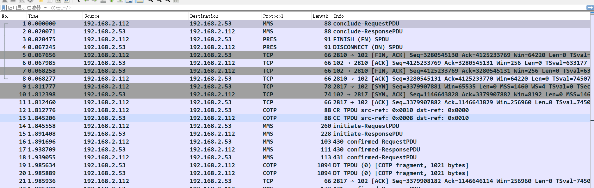
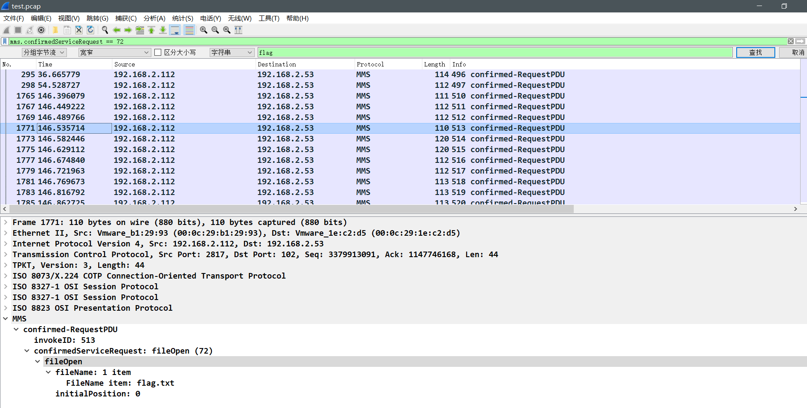
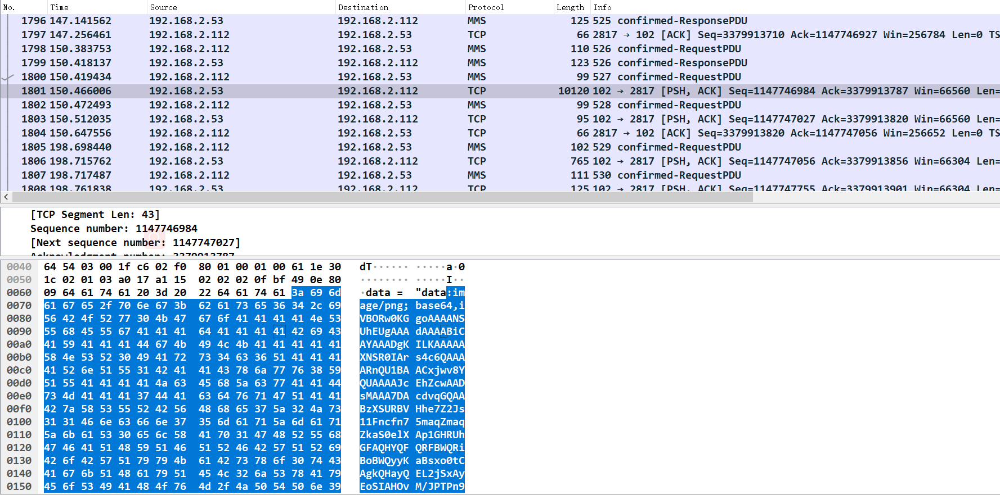
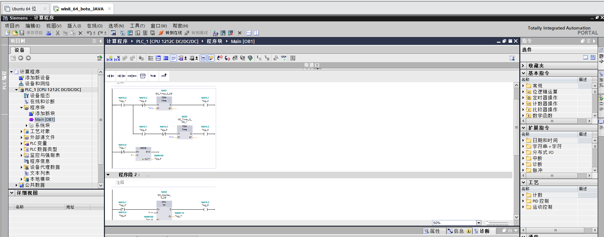

# ICS_CTF 競賽

> 本欄目內容，ICS CTF競賽內容來自於作者自身打比賽經驗，如果不對之處，請各位老師批評指正

## 國內工控比賽考察點

採用CTF分類模型，總結分析當前工控ICS比賽中的關鍵點

|比賽類型|考察點|與CTF異同|
|-------|------|-------|
|內網滲透|Web 端滲透測試、CMS 系統、工控發佈展示系統、數據庫系統|與 Web 滲透相關
|逆向分析|固件分析、工控軟件逆向|實際場景逆向|
|工控協議|工控流量分析、Misc 類|Misc 流量分析，工控場景流量特徵|
|工控編程|PLC 編程、HMI 組態、RTU 編程等|工控實際組態軟件使用，梯形圖識別與分析|

根據漏洞類型其實還可以區分細化題目類型，包括常見的 Web 注入類、固件弱口令、後門程序、協議重放與邏輯問題、組態部署問題等常見的工控場景安全問題。

|比賽類型|漏洞類型|
|-------|------|
|內網滲透|Web 類（SQL、XSS、命令注入、敏感文件泄露 `.git/.idea/.project` 等、）
|逆向分析|固件分析、工控軟件逆向|實際軟件、DLL、ELF、MIPS 逆向|
|工控協議|工控流量分析、Misc 類|Misc 流量分析，工控場景流量特徵|
|工控編程|PLC 編程、HMI 組態|工控實際組態軟件使用，梯形圖識別與分析|

針對目前出現或曾經出現的 ICS CTF 題目類型，其實與 CTF 競賽有許多重合點，因此不再此贅述，主要討論下工控 CTF 中與 CTF 競賽不太一致的地方。

## Web滲透類（Web）

該節主要談工控Web滲透的特點：

- 與業務場景高度契合，例如工業控制中，Web端主要爲顯示當前使用場景中的控制參數、運行狀態等信息，如果在內網中被中間人劫持，當HMI顯示設備無法與PLC等實時運行設備同步時，系統會報警或出錯。
- 一般採用通用技術展示Web界面，以windows操作系統爲主要平臺，包括WinCC、Windows Server、Windows 98/2000/XP等看似古老的系統爲主。
- Web滲透的同時會保留多個端口，例如FTP、HTTPS、Telnet、SNMP、NTP等服務端口，在Web滲透無法打穿的同時可以試試其他端口。
- 工控由於一般處於內網環境，內網劫持往往比較有效，但是如果內網配置了靜態 IP 或其他防護措施，ARP 欺騙方式等內網劫持方法無法起效。
- 敏感信息泄露，配置文件不完善是工控 Web 發佈常見問題，不僅僅包括 `.git/.idea/.project` 等工程信息協議，還可能出現路徑遍歷、命令注入、弱口令等問題。

### 題目示例

待補充

## 逆向分析（Reverse）

該節主要討論工控逆向的特點：

- 工控操作系統一般爲RTOS（Real Time Operate System）,例如vxworks、uc-os等實時操作系統，在逆向前需要對其架構和指令集需要比較熟悉，如果不懂請自行學習。
- 工控固件逆向常見的目標是工控工程加密算法、硬編碼祕鑰、硬編碼後門等常見固件逆向漏洞，如果發現了堆棧溢出類漏洞，往往能夠導致目標設備宕機（即DOS後果）。
- 工控固件往往存在加密和壓縮情況，需要在第一步解壓過程對其進行解壓或解密，這部分依據具體廠商來定，不能一概而論。
- 工控固件存在逆向分析不出的情況

### 題目示例

題目名稱：tplink_tddp

從題目描述中，我們可以得知我們的關鍵分析對象時 tddp，然後題目附件是一個固件，利用 binwalk 解析，在 `usr/bin` 中找到 tddp，然後通過谷歌搜索 tddp 關鍵詞可以發現有在 TP-Link 路由器中有該協議的漏洞，基於 UDP 運行於 1040 端口，發送數據的第 2 個字節（採用 tddp v1 協議）爲 0x31（CMD_FTEST_CONFIG）時，會導致遠程代碼執行。參考鏈接：https://paper.seebug.org/879/ 。
將 tddp 拖入 IDA 搜索字符串 `CMD_FTEST_CONFIG` 可以找到會執行 `sub_A580` 函數

至此已經可以提交 flag，但也可以繼續進行分析，通過 qemu 搭建 arm 環境運行文件系統進行動態調試。

## 工控協議（Protocol）

題目特點介紹：

- 工控協議針對工控場景設計，具有簡單、高效、低延時等特點，所以針對此類的攻擊完全可以考慮採用重放、命令注入等簡單攻擊手段。
- 工控協議不僅僅採用公開協議、還包括衆多的私有協議，這部分協議具體細節需要逆向或者採集數據來實現數據功能的還原。例如 Modbus、DNP3、Melsec-Q、S7、Ethernet/IP 等。
- 工控協議可能導致目標 PLC、DCS、RTU 等設備出現宕機、不可重啓等問題，採用基於 Fuzz 的方法可以快速高效發現 PLC 宕機類漏洞。
- 工控協議中可能有衆多針對 PLC 等設備的操作，用戶需要區分哪些是合法請求、哪些是異常請求，這需要經驗，需要研究推斷當前流量的使用邏輯。這個場景很適合機器學習的條件，這可以考慮是個探索的方向。
- 針對工控場景的實際防禦方案其實最好的還是旁路檢測，通過分光將流量接入分析系統，在不影響正常業務使用的同時對目標系統進行安全監控。

### 題目示例

題目名字：mms.pacp

這是一道關於 MMS 協議分析的題目，當拿到文件時使用 Wireshark 打開文件（部分題目需要使用 tcpdump 打開）

可以看到題目中出現了 MMS 字樣，這是變電站 IEC61850 標準中的協議，在做題前應該熟悉該協議的層次結構以及功能碼（尤其是握手包、讀寫功能包）。然後過濾 MMS 協議數據包，同時搜索 flag 字符

可以看到在第 1764 條報文中有 flag.txt，功能碼是 fileDirectory，所以猜測會使用 fileopen 來進行打開，對這個功能碼的請求報文進行過濾

可以發現在 1764 之後的第 1771、1798、1813、4034 條報文都對 flag.txt 進行了打開操作。接下來去每條報文後邊一條看是否有 fileread 進行了讀取，最終在 1800 處發現其讀取了 flag.txt，那麼第 1801 條就是回覆報文。

內容是一張 base64 編碼的圖片，對其進行解碼就可以得到對應的 FLAG 內容。

這是一道簡單的協議分析題目，主要考察做題者對協議結構層次及功能碼的熟悉程度，同時也要熟悉 Wireshark 的過濾分析功能，這將起到事半功倍的作用。在比賽題目中有可能並不能通過搜索 flag 字符找到相關線索，相關信息有可能藏在多條報文的載荷中或者長度字段中，需要細心觀察和總結。

## 工控編程和組態（Program）

工控編程和組態是工控系統運行的核心和重點，此類題目特點一般是：

- 工控編程核心爲明白工控業務邏輯，而工控編程遵循 IEC61131-3（工控史上首例實現 PLC、DCS、運動控制、 SCADA 等聯合編程的標準——IEC61131-3），包括 5 種編程語言標準，3 種是圖形化語言（梯形圖、順序功能圖和功能塊圖），兩種是文本化語言（指令表和結構文本）。
- 工控設備往往可以在線調試，從而可以控制某些輸入輸出端口，實現強制啓停的功能，如果這些功能可以採用 Remote 方式重發，那攻擊危害就更爲嚴重。
- 工控設備的連接方式多樣，一般採用串口，但是目前設備發展支持以太網、USB 接口等新的方式，如果網口不行試試串口、USB。
- 工控組態可以非常複雜，甚至連接成百上千個輸入輸出都有可能，組態中會由於添加了新的組件而更加麻煩，這時候要慢慢看，一點一點縷出來。

### 題目示例

題目名字：PLC梯形圖計算

這類題目主要考察做題者對於相應產品（PLC、RTU、上位機軟件）的編程軟件、編程語言及流程的熟悉程度，當拿到題目時需要有相應的支持軟件可以打開題目。例如下圖是一道西門子 PLC 的編程題目，flag 爲梯形圖的最終輸出值，所以我們使用博圖軟件打開題目：

這類題目的做法一般有兩種：

1. 題目代碼模擬運行，然後直接查看相應位置的值，但是一般會遇到很多錯誤難以直接運行；
2. 直接讀，對於熟悉梯形圖的人來說非常簡單。

以上是我參加工控比賽的一些心得體會，希望能爲後來參賽的小夥伴多些指導。
