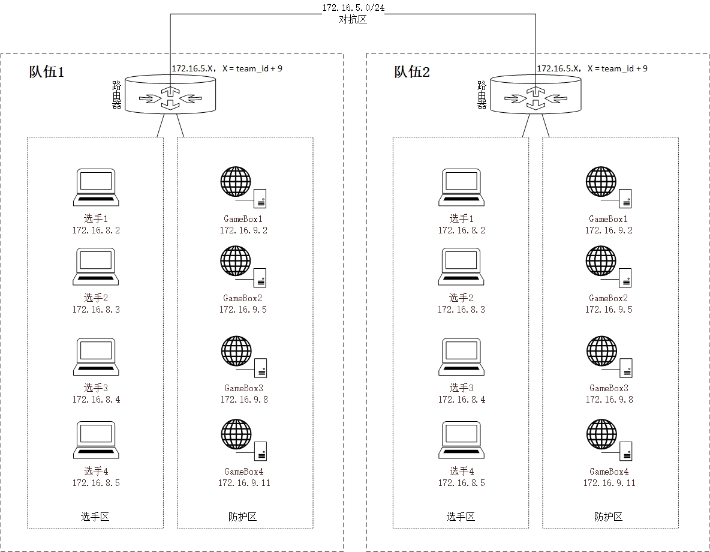

# CTF 競賽模式簡介

## 解題模式 - Jeopardy

解題模式（Jeopardy）常見於線上選拔比賽。在解題模式 CTF 賽制中，參賽隊伍可以通過互聯網或者現場網絡參與，參數隊伍通過與在線環境交互或文件離線分析，解決網絡安全技術挑戰獲取相應分值，類似於 ACM
編程競賽、信息學奧林匹克賽，根據總分和時間來進行排名。

不同的是這個解題模式一般會設置 **一血** 、 **二血** 、 **三血** ，也即最先完成的前三支隊伍會獲得額外分值，所以這不僅是對首先解出題目的隊伍的分值鼓勵，也是一種團隊能力的間接體現。

當然還有一種流行的計分規則是設置每道題目的初始分數後，根據該題的成功解答隊伍數，來逐漸降低該題的分值，也就是說如果解答這道題的人數越多，那麼這道題的分值就越低。最後會下降到一個保底分值後便不再下降。

題目類型主要包含 **Web 網絡攻防** 、 **RE 逆向工程** 、 **Pwn 二進制漏洞利用** 、 **Crypto 密碼攻擊** 、 **Mobile 移動安全** 以及 **Misc 安全雜項** 這六個類別。

## 戰爭分享模式 - Belluminar

在 2016 年世界黑客大師挑戰賽（WCTF）國內首次引入韓國 POC SECURITY 團隊開創的 BELLUMINAR CTF （戰爭與分享）賽制，從此中國國內陸陸續續也有開始 BELLUMINAR 模式的比賽，目前採取這一賽制的有 2016
年諸葛建偉老師集合的 XMan 夏令營分享賽以及同年 9 月的「百度杯」CTF 比賽。

同時這裏也有 BELLUMINAR 賽制的介紹官網： <http://belluminar.org/>

### 賽制介紹

> Belluminar, hacking contest of POC, started at POC2015 in KOREA for the first time. Belluminar is from 'Bellum'(war in Latin) and 'seminar'. It is not a just hacking contest but a kind of
> festival consisted of CTF & seminar for the solution about challenges. Only invited teams can join Belluminar. Each team can show its ability to attack what other teams want to protect and can
> defend what others want to attack.

如官網介紹這樣，BELLUMINAR CTF 賽制由受邀參賽隊伍相互出題挑戰，並在比賽結束後分享賽題的出題思路，學習過程以及解題思路等。戰隊評分依據出題得分，解題得分和分享得分，進行綜合評價並得出最終的排名。

### 出題階段

> 每個隊伍需要提出兩個Challenge到challenge題庫

首先各個受邀參賽隊伍都必須在正式比賽前出 2 道Challange。參賽隊伍將有 12 周的時間準備Challenge。出Challenge的積分佔總分的 30%。

> Challenge 1: must be on the Linux platform;
>
> Challenge 2: No platform restriction(except Linux) No challenge type restriction (Pwn, Reverse...)

傳統的 BELLUMINAR 賽制要求出的兩道Challenge中一道 Challenge 必須是在 Linux 平臺，另外一個Challenge則爲非 Linux 平臺。兩個 Challenge 的類型沒有做出限制。因此隊伍可以盡情展現自己的技術水平。

爲使比賽Challenge類型比較均衡，也有采用隊伍抽籤出Challenge的方式抽取自己的Challenge，這要求隊伍能力水平更爲全面，因此爲了不失平衡性，也會將兩道 Challenge 的計入不同分值（比如要求其中一道 Challenge 分值爲
200，而另外一道分值則爲 100）。

### 提交部署

題目提交截止之前，各個隊伍需要提交完整的文檔以及解題 Writeup，文檔中要求詳細標明題目分值，題面，出題負責人，考察知識點列表以及題目源碼。而解題 Writeup中則需要包含操作環境，完整解題過程以及解題代碼。

題目提交之後主辦方會對題目和解題代碼進行測試，如果期間出現問題則需要該題負責人配合以解決問題。最終放到比賽平臺上。

### 解題競技

進入比賽後，各支隊伍可以看到所有其他團隊出的題目併發起挑戰，但是不能解答本隊出的題目，不設 First Blood 獎勵，根據解題積分進行排名。解題積分佔總分的 60%。

### 分享討論

比賽結束後，隊伍休息，並準備製作分享 PPT（也可以在出題階段準備好）。分享會時，各隊派 2
名隊員上臺分享出題解題思路，學習過程以及考察知識點等。在演示結束後進入互動討論環節，解說代表需要回答評委和其他選手提出的問題。解說沒有太多的時間限制，但是時間用量是評分的一個標準。

### 計分規則

出題積分（佔總分 30%）有 50% 由評委根據題目提交的詳細程度，完整度，提交時間等進評分，另外 50% 則根據比賽結束後的最終解題情況進行評分。計分公式示例：
Score = MaxScore -- | N -- Expect＿N |
。N代表解出該題的隊伍數量，而 Expect＿N 則是這道題預期解出的題目數量。只有當題目難度適中，解題隊伍數量越接近預期數量 Expect＿N，則這道題的出題隊伍得到的出題積分越高。

解題積分（佔總積分 60%）在計算時不考慮 First Blood 獎勵。

分享積分（佔 10%）由評委和其他隊伍根據其技術分享內容進行評分得出（考慮分享時間以及其他限制），會計算平均值。

### 賽制總評

賽制中將 Challenge 的出題方交由受邀戰隊，讓戰隊能儘自己所能互相出題，比賽難度和範圍不會被主辦方水平限制，同時也能提高 Challenge
的質量，每個戰隊都能有不一樣的體驗與提升。在"分享"環節，對本隊題目進行講解的同時也在提高自己的能力水平，在討論回答的過程更是一種思維互動的環節。可以在賽後的學習總結中能得到更好的認知。

## 攻防模式 - Attack & Defense

### 概述

攻防模式常見於線下決賽。在攻防模式中，初始時刻，所有參賽隊伍擁有相同的系統環境（包含若干服務，可能位於不同的機器上），常稱爲 gamebox，參賽隊伍挖掘網絡服務漏洞並攻擊對手服務獲取 flag 來得分，修補自身服務漏洞進行防禦從而防止扣分（一般來說防禦只能避免丟分，當然有的比賽在防禦上可以得分）。

攻防模式可以實時通過得分反映出比賽情況，最終也以得分直接分出勝負，是一種競爭激烈，具有很強觀賞性和高度透明性的網絡安全賽制。在這種賽制中，不僅僅是比參賽隊員的智力和技術，也比體力（因爲比賽一般都會持續
48 小時），同時也比團隊之間的分工配合與合作。

一般比賽的具體環境會在開賽前一天或者當天開賽前半小時由比賽主辦方給出（是一份幾頁的小文檔）。在這一段時間內，你需要根據主辦方提供的文檔熟悉環境並做好防禦。

在比賽開始前半小時，這半小時內是無法進行攻擊的，各支隊伍都會加緊熟悉比賽網絡環境，並做好防禦準備。至於敵方 Gamebox 的 IP 地址，則需要靠你自己在給出網段中發現。

如果是分爲上午下午兩場攻防賽的話，那麼上午和下午的 Gamebox 漏洞服務會更換（避免比賽中途休息時選手交流），但管理時要用的 IP 地址什麼的不會改變。也就是 **下午會換新題** 。

一般情況下，主辦方會提供網線，**但並不會提供網線轉接口，所以需要自備。**

### 基本規則

攻防模式一般的規則如下

- 戰隊初始分數均爲 x 分
- 比賽以 5/10 分鐘爲一個回合，每回合主辦方會更新已放出服務的 Flag
- 每回合內，一個戰隊的一個服務被滲透攻擊成功（被拿 Flag 並提交），則扣除一定分數，攻擊成功的戰隊平分這些分數。
- 每回合內，如果戰隊能夠維護自己的服務正常運行，則分數不會減少（如果防禦成功加分則會加分）；
- 如果一個服務宕機或異常無法通過測試，則可能會扣分，服務正常的戰隊平分這些分。往往服務異常會扣除較多的分數。
- 如果該回合內所有戰隊的服務都異常，則認爲是不可抗拒因素造成，分數都不減少。
- 每回合內，服務異常和被拿 Flag 可以同時發生，即戰隊在一個回合內單個服務可能會扣除兩者疊加的分數。
- 禁止隊伍使用通用防禦方法
- 請參賽隊伍在比賽開始時對所有服務進行備份，若因自身原因導致服務永久損壞或丟失，無法恢復，主辦方不提供重置服務
- 禁止對賽題以外的比賽平臺發起攻擊，包括但不限於在 gamebox 提權 root、利用主辦方平臺漏洞等，違規者立刻被取消參賽資格
- 參賽隊伍如果發現其他隊伍存在違規行爲，請立刻舉報，我們會嚴格審覈並作出相應判罰。

### 網絡環境

文檔上一般都會有比賽環境的 **網絡拓撲圖** （如下圖），每支隊伍會維護若干的 **Gamebox（己方服務器）** ，Gamebox 上部署有存在漏洞的服務。

文檔上會包括選手，攻防環境，主辦方三者的環境。

選手需要在個人電腦上配置或者 DHCP 自動獲取

- IP 地址
- 網關
- 掩碼DNS 服務器地址

攻防環境

- Gamebox 所處地址，包括己方和其他隊伍的地址。
- 比賽一般會提供隊伍的 id 與對應 ip 的映射表，以便於讓選手指定恰當的攻防策略。

主辦方環境

- 比賽答題平臺
- 提交 flag 接口
- 流量訪問接口

### 訪問 Gamebox

參賽文檔中會給出隊伍登錄 gamebox 的方式，一般來說如下

- 用戶名爲 ctf
- 一般會通過 ssh 登錄，登錄方式爲密碼或者私鑰。

自然，在登錄上戰隊機器後應該修改所有的默認密碼，同時不應該設置弱密碼。
