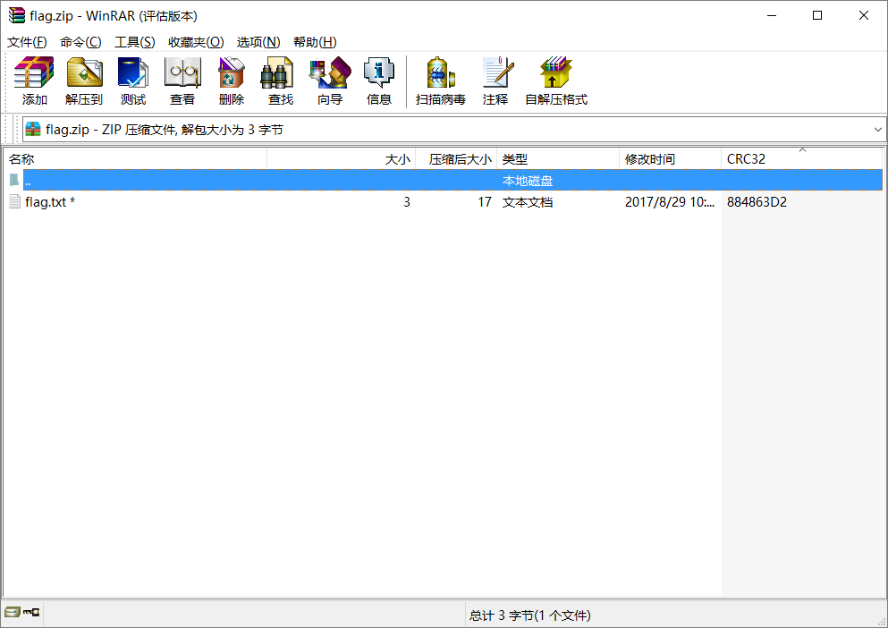
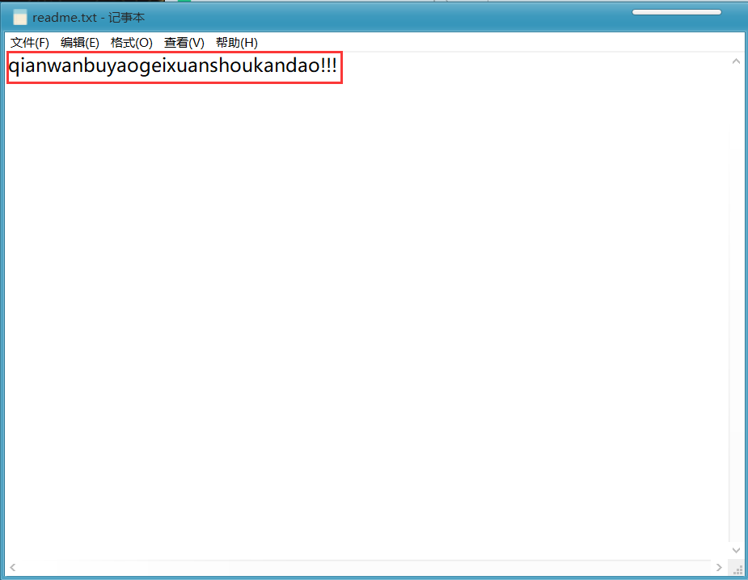
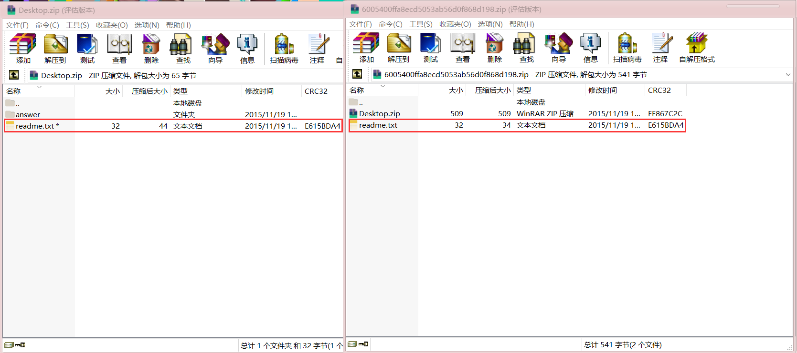
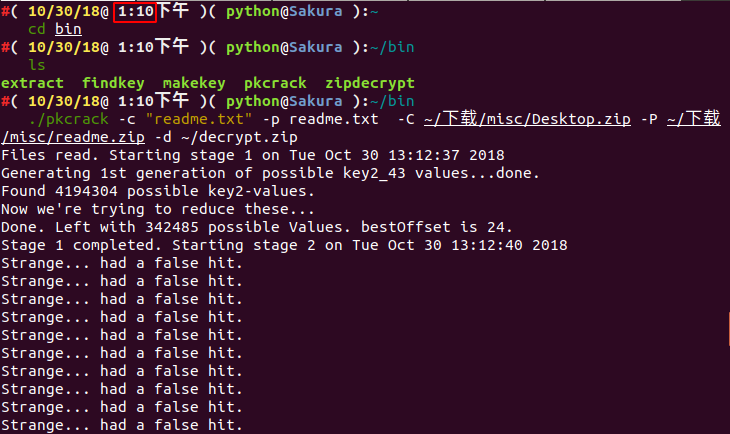
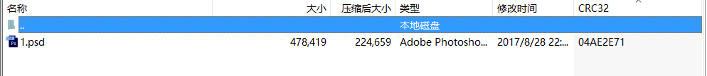

# ZIP 格式

## 文件結構

`ZIP` 文件主要由三部分構成，分別爲

| 壓縮源文件數據區                                | 核心目錄          | 目錄結束                        |
| ----------------------------------------------- | ----------------- | ------------------------------- |
| local file header + file data + data descriptor | central directory | end of central directory record |

-   壓縮源文件數據區中每一個壓縮的源文件或目錄都是一條記錄，其中
    -   `local file header` ：文件頭用於標識該文件的開始，記錄了該壓縮文件的信息，這裏的文件頭標識由固定值 `50 4B 03 04` 開頭，也是 `ZIP` 的文件頭的重要標誌
    -   `file data` ：文件數據記錄了相應壓縮文件的數據
    -   `data descriptor` ：數據描述符用於標識該文件壓縮結束，該結構只有在相應的 `local file header` 中通用標記字段的第 `3 bit` 設爲 `1` 時纔會出現，緊接在壓縮文件源數據後
- `Central directory` 核心目錄

  -   記錄了壓縮文件的目錄信息，在這個數據區中每一條紀錄對應在壓縮源文件數據區中的一條數據。

      | Offset | Bytes | Description                                          | 譯                                      |
      | ------ | ----- | ---------------------------------------------------- | --------------------------------------- |
      | 0      | 4     | Central directory file header signature = 0x02014b50 | 核心目錄文件 header標識 =（0x02014b50） |
      | 4      | 2     | Version made by                                      | 壓縮所用的 pkware 版本                  |
      | 6      | 2     | Version needed to extract (minimum)                  | 解壓所需 pkware 的最低版本              |
      | 8      | 2     | General purpose bit flag                             | 通用位標記僞加密                        |
      | 10     | 2     | Compression method                                   | 壓縮方法                                |
      | 12     | 2     | File last modification time                          | 文件最後修改時間                        |
      | 14     | 2     | File last modification date                          | 文件最後修改日期                        |
      | 16     | 4     | CRC-32                                               | CRC-32 校驗碼                           |
      | 20     | 4     | Compressed size                                      | 壓縮後的大小                            |
      | 24     | 4     | Uncompressed size                                    | 未壓縮的大小                            |
      | 28     | 2     | File name length (n)                                 | 文件名長度                              |
      | 30     | 2     | Extra field length (m)                               | 擴展域長度                              |
      | 32     | 2     | File comment length (k)                              | 文件註釋長度                            |
      | 34     | 2     | Disk number where file starts                        | 文件開始位置的磁盤編號                  |
      | 36     | 2     | Internal file attributes                             | 內部文件屬性                            |
      | 38     | 4     | External file attributes                             | 外部文件屬性                            |
      | 42     | 4     | relative offset of local header                      | 本地文件頭的相對位移                    |
      | 46     | n     | File name                                            | 目錄文件名                              |
      | 46+n   | m     | Extra field                                          | 擴展域                                  |
      | 46+n+m | k     | File comment                                         | 文件註釋內容                            |

- `End of central directory record(EOCD)` 目錄結束標識

  -   目錄結束標識存在於整個歸檔包的結尾，用於標記壓縮的目錄數據的結束。每個壓縮文件必須有且只有一個 `EOCD` 記錄。

更加詳細參見 [官方文檔](https://pkware.cachefly.net/webdocs/APPNOTE/APPNOTE-6.2.0.txt)。

## 主要攻擊

### 爆破

這裏主要介紹兩款爆破使用的工具

-   `Windows`下的神器 [ARCHPR](http://www.downcc.com/soft/130539.html)

    

    暴力枚舉，跑字典，明文攻擊，應有盡有。

-   `Linux` 下的命令行工具 [fcrackzip](https://github.com/hyc/fcrackzip)

    ```shell
    # －b 指定模式爲暴破，-c1指定密碼類型爲純數字，其它類型可以rtfm,-u這個參數非常重要不然不顯示破解出來的密碼,-l 5-6可以指定長度
    root@kali:fcrackzip -b -c1 -u test.zip
    ```

### CRC32

#### 原理

`CRC` 本身是「冗餘校驗碼」的意思，`CRC32` 則表示會產生一個 `32 bit` ( `8`  位十六進制數)的校驗值。由於 `CRC32` 產生校驗值時源數據塊的每一個 `bit` (位)都參與了計算，所以數據塊中即使只有一位發生了變化，也會得到不同的 `CRC32` 值。

`CRC32` 校驗碼出現在很多文件中比如 `png` 文件，同樣 `zip` 中也有 `CRC32` 校驗碼。值得注意的是 `zip` 中的 `CRC32` 是未加密文件的校驗值。

這也就導致了基於 `CRC32` 的攻擊手法。

- 文件內內容很少(一般比賽中大多爲 `4` 字節左右)
- 加密的密碼很長

我們不去爆破壓縮包的密碼，而是直接去爆破源文件的內容(一般都是可見的字符串)，從而獲取想要的信息。

比如我們新建一個 `flag.txt`，其中內容爲 `123`，使用密碼 `!QAZXSW@#EDCVFR$` 去加密。



而我們去計算文件的 `CRC32` 值發現和上圖中的 `CRC32` 值吻合。

```shell
文件: flag.txt
大小: 3
時間: Tue, 29 Aug 2017 10:38:10 +0800
MD5: 202cb962ac59075b964b07152d234b70
SHA1: 40bd001563085fc35165329ea1ff5c5ecbdbbeef
CRC32: 884863D2
```

!!! note
​    在爆破時我們所枚舉的所有可能字符串的 `CRC32` 值是要與壓縮源文件數據區中的 `CRC32` 值所對應

```python
# -*- coding: utf-8 -*-

import binascii
import base64
import string
import itertools
import struct

alph = 'abcdefghijklmnopqrstuvwxyzABCDEFGHIJKLMNOPQRSTUVWXYZ0123456789+/='

crcdict = {}
print "computing all possible CRCs..."
for x in itertools.product(list(alph), repeat=4):
    st = ''.join(x)
    testcrc = binascii.crc32(st)
    crcdict[struct.pack('<i', testcrc)] = st
print "Done!"

f = open('flag.zip')
data = f.read()
f.close()
crc = ''.join(data[14:18])
if crc in crcdict:
    print crcdict[crc]
else:
    print "FAILED!"
```

#### 例題

> 題目：`Abctf-2016:Zippy`

根據每個壓縮包內的文件大小可以推斷使用 `CRC32` 攻擊手法，獲得每個壓縮包內的內容後連在一起 `Base64` 解碼後是一個加密的壓縮包，爆破獲得 `flag`。

### 明文攻擊

#### 原理

- 一個加密的壓縮文件
- 壓縮文件的壓縮工具，比如 `2345` 好壓， `WinRAR` ， `7z` 。 `zip` 版本號等，可以通過文件屬性瞭解。如果是 `Linux` 平臺，用 `zipinfo -v` 可以查看一個 `zip` 包的詳細信息，包括加密算法等
- 知道壓縮包裏某個文件的部分連續內容(至少 `12` 字節)

如果你已經知道加密文件的部分內容，比如在某個網站上發現了它的 `readme.txt` 文件，你就可以開始嘗試破解了。

首先，將這個明文文件打包成 `zip` 包，比如將 `readme.txt` 打包成 `readme.zip` 。

打包完成後，需要確認二者採用的壓縮算法相同。一個簡單的判斷方法是用 `WinRAR` 打開文件，同一個文件壓縮後的體積是否相同。如果相同，基本可以說明你用的壓縮算法是正確的。如果不同，就嘗試另一種壓縮算法。

#### 工具

- Windows下的神器 [ARCHPR](http://www.downcc.com/soft/130539.html)
- Linux下的 [PKCrack](http://www.unix-ag.uni-kl.de/~conrad/krypto/pkcrack.html)

!!! note
​    建議使用 `Windows` 的 `ARCHPR`，一是速度較快，二是較穩定（之前出題時遇到過用 `PKCrack` 爆不出來的情況）。

#### 例題

> 2015廣州強網杯：爆破？
>
> WP：https://www.cnblogs.com/ECJTUACM-873284962/p/9884416.html

首先我們拿到這樣一道題，題目標題爲**爆破?**，很明顯這題肯定是要用到一個破解工具，很暴力的說。

**第一步、分析壓縮包文件**

我們下載了這個壓縮包以後，我們看到文件名是 ***.zip** 結尾，我們可以立即想到破解壓縮包常用的幾種方式，我們將其壓縮包解壓出來，發現裏面有兩個文件，分別爲 `Desktop.zip` 和 `readme.txt` ，我們看看 `readme.txt` 裏面寫了什麼？



打開以後竟然是`qianwanbuyaogeixuanshoukandao!!!` ，出題人不想讓選手看到，這出題人還是有點意思。我們再看看那個 `Desktop.zip` ，我們可以看到裏面有個 `readme.txt` 文件和 `answer` 文件夾， `answer` 文件夾下有 `key.txt` 文件， `flag` 應該就藏在這裏了。

**第二步、分析破解方式**

這題目拿到手上，我們首先發現解壓出來的文件和 `Desktop.zip` 壓縮包中都含有同樣一個文件 `readme.txt` ，而且並沒有給出其他相關信息，且文件大小大於 `12Byte` ，我們再對比壓縮包中的 `readme.txt` 和原壓縮包中的 `readme.txt` 的 `CRC32` 的值，我們發現兩個值相同，這說明解壓出的 `readme.txt` 是加密壓縮包裏的 `readme.txt` 的明文，於是我們可以大膽地猜測這極可能是個明文加密。



**第三步、嘗試明文攻擊**

既然我們已經知道了它是明文攻擊的話，我們將對其壓縮包進行破解，由於解壓出的readme.txt是加密壓縮包裏的 `readme.txt` 的明文，將 `readme.txt` 壓縮成 **.zip** 文件，然後在軟件中填入相應的路徑即可開始進行明文攻擊，這裏我們將介紹 `Windows` 和 `Ubuntu` 下使用不同的方式進行明文攻擊。

方法一、 `pkcrack` 進行明文攻擊

`pkcrack` 下載鏈接：https://www.unix-ag.uni-kl.de/~conrad/krypto/pkcrack.html

我們可以直接寫個 `shell` 腳本下載就好了：

```shell
#!/bin/bash -ex

wget https://www.unix-ag.uni-kl.de/~conrad/krypto/pkcrack/pkcrack-1.2.2.tar.gz
tar xzf pkcrack-1.2.2.tar.gz
cd pkcrack-1.2.2/src
make

mkdir -p ../../bin
cp extract findkey makekey pkcrack zipdecrypt ../../bin
cd ../../
```

把文件保存，改爲 `pkcrack-install.sh` ，然後跑到當前目錄下，給它加一個執行權限 `x` 。

```shell
chmod 777 install.sh
```

或者直接可以：

```shell
chmod u+x install.sh
```

然後運行 `./pkcrack-install.sh` 


然後當前目錄下會生成一個 `bin` 的文件夾，我們直接進入 `bin` 文件夾下，看到有 `pkcrack` 文件，直接對文件進行明文破解。

```shell
./pkcrack -c "readme.txt" -p readme.txt  -C ~/下載/misc/Desktop.zip -P ~/下載/misc/readme.zip -d ~/decrypt.zip
```

我們所用到的參數選項如下：

```shell
-C:要破解的目標文件(含路徑)

-c:破解文件中的明文文件的名字(其路徑不包括系統路徑,從zip文件一層開始)

-P:壓縮後的明文文件

-p:壓縮的明文文件中明文文件的名字(也就是readme.txt在readme.zip中的位置)
-d:指定文件名及所在的絕對路徑，將解密後的zip文件輸出
```

至於其他選項參看 `./pkcrack --help` 

解密後的結果如下：




我們可以看到，我們下午 `1:10` 開始跑的，下午 `3:27` 才求解出祕鑰。

我們得出了最終的flag爲：**`flag{7ip_Fi13_S0m3tim3s_s0_3a5y@}`**

**坑點來了**

看起來一切都很順利的樣子，同樣花了兩個多小時，爲啥我在博客園上寫了我跑了兩個小時都沒跑出來呢？或者說有朋友遇到了和我一樣的問題，我明明和你是一樣的，爲啥我跑不出結果？

你們可能忽略了一些細節問題，有人曾想過原壓縮包是通過什麼方式壓縮的嘛？還有就是我們生成的 `readme.zip` 又該以哪種方式去生成呢？我就是因爲這個問題卡了整整三個月沒做出來，不信的話我們可以看看第二種方法，在 `Windows` 下用 `ARCHPR` 進行明文攻擊。

方法二、 `ARCHPR` 進行明文攻擊

首先這題我建議大家下 `ARCHPR 4.53` 版本，我是在這個版本下測試成功的。成功截圖如下：


我相信很多朋友在用 `ARCHPR` 的時候遇到以下這種情況：


我當時內心是崩潰的，爲啥會出現這種情況。

在後來的學習中發現，用 `7z` 壓縮的文件得用 `7z` 來解壓縮， `7z` 是一種使用多種壓縮算法進行數據壓縮的檔案格式，和傳統的 `zip` ， `rar` 相比，它的壓縮比率更大，採用的壓縮算法不同，自然而然就可能出現不匹配這種情況，所以我們在解壓縮原壓縮包和對文件進行加密的時候得先分析出題人是用什麼方式進行加解密的，所以這題的問題顯而易見就出來了，經過驗證，我發現出題人是用 `7z` 進行壓縮的。

**再嘗試**

我們已經發現了這個問題，我們去官網下載 `7zip` ：https://www.7-zip.org/

然後我們對原壓縮文件用 `7z` 進行解壓縮，然後將 `readme.txt` 用7z進行壓縮即可。然後我們就可以用 `ARCHPR` 進行明文攻擊了。

結果如下：


我們將 `Desktop_decrypted.zip` 解壓出來，查看 `answer` 目錄下的 `key.txt` 即可。

所以最終的flag爲：**`flag{7ip_Fi13_S0m3tim3s_s0_3a5y@}`**

### 僞加密

#### 原理

在上文 `ZIP` 格式中的 **核心目錄區** 中，我們強調了一個叫做通用位標記 `(General purpose bit flag)` 的 `2` 字節，不同比特位有着不同的含義。

```shell
Bit 0: If set, indicates that the file is encrypted.

(For Method 6 - Imploding)
Bit 1: If the compression method used was type 6,
     Imploding, then this bit, if set, indicates
     an 8K sliding dictionary was used.  If clear,
     then a 4K sliding dictionary was used.
...
Bit 6: Strong encryption.  If this bit is set, you should
     set the version needed to extract value to at least
     50 and you must also set bit 0.  If AES encryption
     is used, the version needed to extract value must
     be at least 51.
...
```

在 `010Editor` 中我們嘗試着將這 `1` 位修改 `0 --> 1`。


再打開文件發現已要求輸入密碼。



修改僞加密的方法：

- `16` 進制下修改通用位標記
- `binwalk -e` 無視僞加密
- 在 `Mac OS` 及部分 `Linux`(如 `Kali` )系統中，可以直接打開僞加密的 `ZIP` 壓縮包
- 檢測僞加密的小工具 `ZipCenOp.jar`
- 有時候用 `WinRar` 的修復功能（此方法有時有奇效，不僅針對僞加密）

#### 例題

> `SSCTF-2017` ：我們的祕密是綠色的
>
> `WP`：<http://bobao.360.cn/ctf/detail/197.html>

我們在得到兩個 `readme.txt`，且一個加密，一個已知，很容易想到明文攻擊的手法。

注意在用明文攻擊時的操作。


得到密碼 `Y29mZmVl` 後，解壓縮文件，得到另一個壓縮包。

觀察通用位標記位，猜測僞加密，修改後解壓得到 flag。

這一題，基本涵蓋了比賽中 ZIP 的常見考察手法，爆破，僞加密，明文攻擊等，都在本題中出現。

### 參考文獻

- https://pkware.cachefly.net/webdocs/APPNOTE/APPNOTE-6.2.0.txt
- https://www.cnblogs.com/ECJTUACM-873284962/p/9387711.html
- https://www.cnblogs.com/ECJTUACM-873284962/p/9884416.html
- http://bobao.360.cn/ctf/detail/197.html
