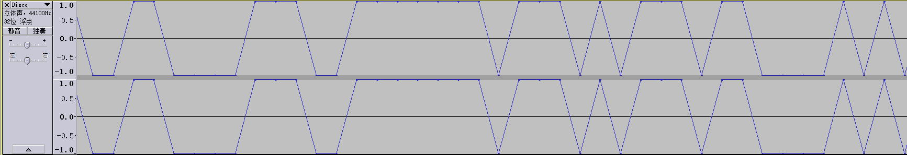
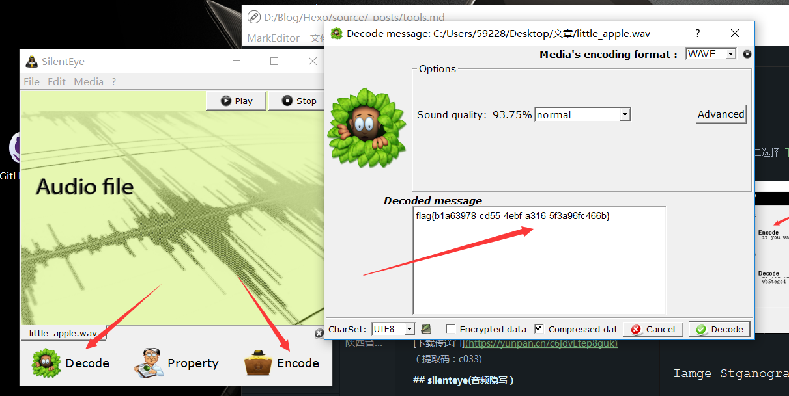

# 音頻隱寫

與音頻相關的 CTF 題目主要使用了隱寫的策略，主要分爲 MP3 隱寫，LSB 隱寫，波形隱寫，頻譜隱寫等等。

## 常見手段

通過 `binwalk` 以及 `strings` 可以發現的信息不再詳述。

## MP3 隱寫

### 原理

MP3隱寫主要是使用 [Mp3Stego](http://www.petitcolas.net/steganography/mp3stego/) 工具進行隱寫，其基本介紹及使用方法如下

> MP3Stego will hide information in MP3 files during the compression process. The data is first compressed, encrypted and then hidden in the MP3 bit stream.

```shell
encode -E hidden_text.txt -P pass svega.wav svega_stego.mp3
decode -X -P pass svega_stego.mp3
```

### 例題

> ISCC-2016: Music Never Sleep

初步觀察後，由 `strings` 無發現，聽音頻無異常猜測使用隱寫軟件隱藏數據。


得到密碼後使用 `Mp3Stego` 解密。

```shell
decode.exe -X ISCC2016.mp3 -P bfsiscc2016
```

得到文件 `iscc2016.mp3.txt`:
```
Flag is SkYzWEk0M1JOWlNHWTJTRktKUkdJTVpXRzVSV0U2REdHTVpHT1pZPQ== ???
```

Base64 && Base32 後得到 flag。

## 波形

### 原理

通常來說，波形方向的題，在觀察到異常後，使用相關軟件（Audacity, Adobe Audition 等）觀察波形規律，將波形進一步轉化爲 01 字符串等，從而提取轉化出最終的 flag。

### 例題

> ISCC-2017: Misc-04

其實這題隱藏的信息在最開始的一段音頻內，不細心聽可能會誤認爲是隱寫軟件。



以高爲 1 低爲 0，轉換得到 `01` 字符串。

```
110011011011001100001110011111110111010111011000010101110101010110011011101011101110110111011110011111101
```

轉爲 ASCII，摩斯密碼解密，得到 flag。

!!! note
    一些較複雜的可能會先對音頻進行一系列的處理，如濾波等。例如 [JarvisOJ - 上帝之音 Writeup](https://www.40huo.cn/blog/jarvisoj-misc-writeup.html)

## 頻譜

### 原理

音頻中的頻譜隱寫是將字符串隱藏在頻譜中，此類音頻通常會有一個較明顯的特徵，聽起來是一段雜音或者比較刺耳。

### 例題

> Su-ctf-quals-2014:hear_with_your_eyes


## LSB音頻隱寫

### 原理

類似於圖片隱寫中的 LSB 隱寫，音頻中也有對應的 LSB 隱寫。主要可以使用 [Silenteye](http://silenteye.v1kings.io/) 工具，其介紹如下：

> SilentEye is a cross-platform application design for an easy use of steganography, in this case hiding messages into pictures or sounds. It provides a pretty nice interface and an easy integration of new steganography algorithm and cryptography process by using a plug-ins system.

### 例題

> 2015 廣東省強網杯 - Little Apple

直接使用 `silenteye` 即可。



## 延伸

-   [音頻中的 LSB](https://ethackal.github.io/2015/10/05/derbycon-ctf-wav-steganography/)
-   [隱寫術總結](http://bobao.360.cn/learning/detail/243.html)
