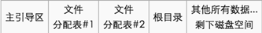

# 磁盤內存分析

## 常用工具

-   EasyRecovery
-   MedAnalyze
-   FTK
-   [Elcomsoft Forensic Disk Decryptor](https://ctf-wiki.github.io/ctf-tools/misc/#_6)
-   Volatility

## 磁盤

常見的磁盤分區格式有以下幾種

-   Windows: FAT12 -> FAT16 -> FAT32 -> NTFS
-   Linux: EXT2 -> EXT3 -> EXT4
-   FAT 主磁盤結構

    

-   刪除文件：目錄表中文件名第一字節 `e5`。

## VMDK

VMDK 文件本質上是物理硬盤的虛擬版，也會存在跟物理硬盤的分區和扇區中類似的填充區域，我們可以利用這些填充區域來把我們需要隱藏的數據隱藏到裏面去，這樣可以避免隱藏的文件增加了 VMDK 文件的大小（如直接附加到文件後端），也可以避免由於 VMDK 文件大小的改變所帶來的可能導致的虛擬機錯誤。而且 VMDK 文件一般比較大，適合用於隱藏大文件。

## 內存

-   解析 Windows / Linux / Mac OS X 內存結構
-   分析進程，內存數據
-   根據題目提示尋找線索和思路，提取分析指定進程的特定內存數據

## 題目

-   Jarvis OJ - MISC - 取證 2

## 參考

-   [數據隱藏技術](http://wooyun.jozxing.cc/static/drops/tips-12614.html)
