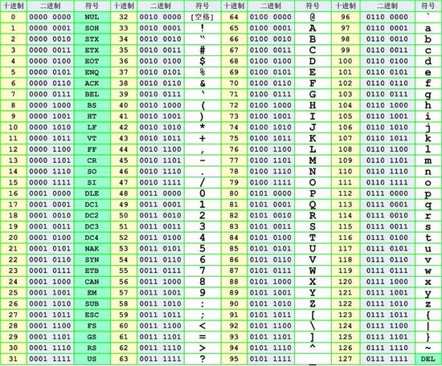
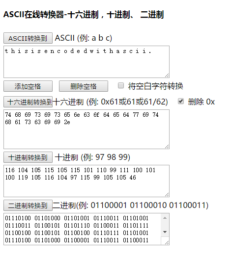
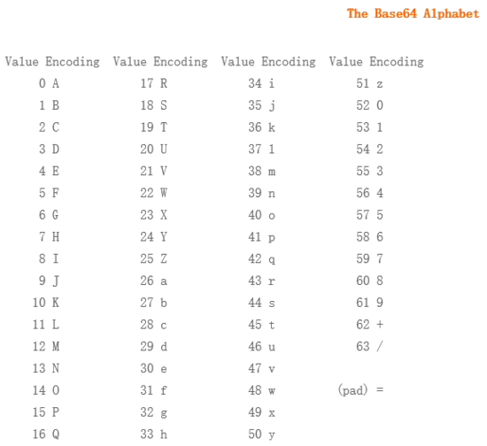

# 計算機相關的編碼

本節介紹一些計算機相關的編碼。

## 字母表編碼

- A-Z/a-z 對應 1-26 或者 0-25

## ASCII 編碼



### 特點

我們一般使用的 ascii 編碼的時候採用的都是可見字符，而且主要是如下字符

- 0-9, 48-57
- A-Z, 65-90
- a-z, 97-122

### 變形

#### 二進制編碼

將 ascii 碼對應的數字換成二進製表示形式。

- 只有 0 和 1
- 不大於 8 位，一般 7 位也可以，因爲可見字符到 127。
- 其實是另一種 ascii 編碼。

#### 十六進制編碼

將 ascii 碼對應的數字換成十六進製表示形式。

- A-Z-->0x41~0x5A
- a-z-->0x61~0x7A

### 工具

- jpk, ascii to number, number to ascii
- http://www.ab126.com/goju/1711.html

### 例子




### 2018 DEFCON Quals ghettohackers: Throwback

題目描述如下

```
Anyo!e!howouldsacrificepo!icyforexecu!!onspeedthink!securityisacomm!ditytop!urintoasy!tem!
```

第一直覺應該是我們去補全這些歎號對應的內容，從而得到 flag，但是補全後並不行，那麼我們可以把源字符串按照 `!` 分割，然後字符串長度 1 對應字母a，長度 2 對應字母 b，以此類推

```shell
ori = 'Anyo!e!howouldsacrificepo!icyforexecu!!onspeedthink!securityisacomm!ditytop!urintoasy!tem!'
sp = ori.split('!')
print repr(''.join(chr(97 + len(s) - 1) for s in sp))
```

進而可以得到，這裏同時需要假設 0 個字符爲空格。因爲這正好使得原文可讀。

```shell
dark logic
```

### 題目

- Jarvis-basic-德軍的密碼

## Base 編碼


base xx 中的 xx 表示的是採用多少個字符進行編碼，比如說 base64 就是採用以下 64 個字符編碼，由於 2 的 6 次方等於 64，所以每 6 個比特爲一個單元，對應某個可打印字符。3個字節就有 24 個比特，對應於 4 個 Base64 單元，即 3 個字節需要用 4 個可打印字符來表示。它可用來作爲電子郵件的傳輸編碼。在 Base64 中的可打印字符包括字母 A-Z、a-z、數字 0-9，這樣共有 62 個字符，此外兩個可打印符號在不同的系統中而不同。




具體介紹參見 [Base64 - 維基百科](https://zh.wikipedia.org/wiki/Base64)。


**編碼 man**


如果要編碼的字節數不能被 3 整除，最後會多出 1 個或 2 個字節，那麼可以使用下面的方法進行處理：先使用 0 值在末尾補足，使其能夠被 3 整除，然後再進行 base64 的編碼。在編碼後的 base64 文本後加上一個或兩個 `=` 號，代表補足的字節數。也就是說，當最後剩餘一個八位字節（一個 byte）時，最後一個 6 位的 base64 字節塊有四位是 0 值，最後附加上兩個等號；如果最後剩餘兩個八位字節（2 個 byte）時，最後一個 6 位的 base 字節塊有兩位是 0 值，最後附加一個等號。參考下表：


由於解碼時補位的 0 並不參與運算，可以在該處隱藏信息。

與 base64 類似，base32 使用 32 個可見字符進行編碼，2 的 5 次方爲 32，所以每 5 bit 爲 1 個分組。5 字節爲 40 bit，對應於 8 個 base32 分組，即 5 個字節用 8 個 base32 中字符來表示。但如果不足 5 個字節，則會先對第一個不足 5 bit 的分組用 0 補足了 5 bit ，對後面剩餘分組全部使用 “=” 填充，直到補滿 5 個字節。由此可知，base32 最多隻有 6 個等號出現。例如：


### 特點

- base64 結尾可能會有 `=` 號，但最多有 2 個
- base32 結尾可能會有 `=` 號，但最多有 6 個
- 根據 base 的不同，字符集會有所限制
- **有可能需要自己加等號**
- **=也就是 3D**
- 更多內容請參見 [base rfc](https://tools.ietf.org/html/rfc4648)

### 工具

- http://www1.tc711.com/tool/BASE64.htm
- python 庫函數
- [讀取隱寫信息腳本](https://github.com/cjcslhp/wheels/tree/master/b64stego)


### 例子

題目描述參見 `ctf-challenge`中 [misc 分類的 base64-stego 目錄](https://github.com/ctf-wiki/ctf-challenges/tree/master/misc/encode/computer/base64-stego)中的 data.txt 文件。

使用腳本讀取隱寫信息。

``` python
import base64

def deStego(stegoFile):
    b64table = "ABCDEFGHIJKLMNOPQRSTUVWXYZabcdefghijklmnopqrstuvwxyz0123456789+/"
    with open(stegoFile,'r') as stegoText:
        message = ""
        for line in stegoText:
            try:
                text = line[line.index("=") - 1:-1]
                message += "".join([ bin( 0 if i == '=' else b64table.find(i))[2:].zfill(6) for i in text])[2 if text.count('=') ==2 else 4:6]  
            except:
                pass
    return "".join([chr(int(message[i:i+8],2)) for i in range(0,len(message),8)])

print(deStego("text.txt"))
```

輸出:

```
     flag{BASE64_i5_amaz1ng}
```

<!--
下面是原編輯者的代碼，代碼的小毛病在於查找隱寫字符用`last = line[-3]`寫死了，這種寫法默認每行尾有一個'\n',而最後一行並非如此，因此左後一個字符顯示錯誤。

一大串 Base64 密文，試試補 0 位的數據。

```python
# coding=utf-8
import base64
import re

result = []
with open('text.txt', 'r') as f:
    for line in f.readlines():
        if len(re.findall(r'=', line)) == 2:
            last = line[-4]
            if last.isupper():
                num = ord(last) - ord('A')
            elif last.islower():
                num = ord(last) - ord('a') + 26
            elif last.isdigit():
                num = int(last) + 52
            elif last == '+':
                num = 62
            elif last == '/':
                num = 63
            elem = '{0:06b}'.format(num)
            result.append(elem[2:])

        elif len(re.findall(r'=', line)) == 1:
            last = line[-3]
            if last.isupper():
                num = ord(last) - ord('A')
            elif last.islower():
                num = ord(last) - ord('a') + 26
            elif last.isdigit():
                num = int(last) + 52
            elif last == '+':
                num = 62
            elif last == '/':
                num = 63
            elem = '{0:06b}'.format(num)
            result.append(elem[4:])

flag_b = ''.join(result)
split = re.findall(r'.{8}', flag_b)
for i in split:
    print chr(int(i, 2)),
```

感覺像是程序有點毛病，不過還是能看出來 flag。

```
flag{BASE64_i5_amaz1ng~
```
-->

### 題目


## 霍夫曼編碼

參見 [霍夫曼編碼](https://zh.wikipedia.org/wiki/%E9%9C%8D%E5%A4%AB%E6%9B%BC%E7%BC%96%E7%A0%81)。

## XXencoding

XXencode 將輸入文本以每三個字節爲單位進行編碼。如果最後剩下的資料少於三個字節，不夠的部份用零補齊。這三個字節共有 24 個 Bit，以 6bit 爲單位分爲 4 個組，每個組以十進制來表示所出現的數值只會落在 0 到 63 之間。以所對應值的位置字符代替。

```text
           1         2         3         4         5         6
 0123456789012345678901234567890123456789012345678901234567890123
 |         |         |         |         |         |         |
 +-0123456789ABCDEFGHIJKLMNOPQRSTUVWXYZabcdefghijklmnopqrstuvwxyz
```

具體信息參見[維基百科](https://en.wikipedia.org/wiki/Xxencoding)

### 特點

- 只有數字，大小寫字母
- +號，-號。

### 工具

- http://web.chacuo.net/charsetxxencode

### 題目

## URL 編碼

參見[ URL 編碼 - 維基百科](https://zh.wikipedia.org/wiki/%E7%99%BE%E5%88%86%E5%8F%B7%E7%BC%96%E7%A0%81)。

### 特點

- 大量的百分號

### 工具

### 題目

## Unicode 編碼

參見[ Unicode - 維基百科](https://zh.wikipedia.org/wiki/Unicode)。

注意，它有四種表現形式。

### 例子

源文本： `The`

&#x [Hex]:  `&#x0054;&#x0068;&#x0065;`

&# [Decimal]:  `&#00084;&#00104;&#00101;`

\U [Hex]:  `\U0054\U0068\U0065`

\U+ [Hex]:  `\U+0054\U+0068\U+0065`

### 工具

### 題目

## HTML 實體編碼
