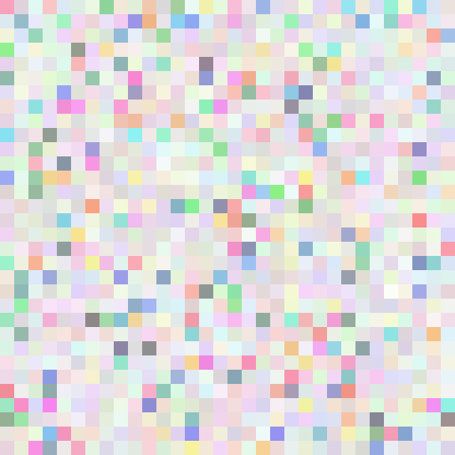

# 圖片分析簡介

圖像文件能夠很好地包含黑客文化，因此 CTF 競賽中經常會出現各種圖像文件。

圖像文件有多種複雜的格式，可以用於各種涉及到元數據、信息丟失和無損壓縮、校驗、隱寫或可視化數據編碼的分析解密，都是 Misc 中的一個很重要的出題方向。涉及到的知識點很多（包括基本的文件格式，常見的隱寫手法及隱寫用的軟件），有的地方也需要去進行深入的理解。

## 元數據（Metadata）

> 元數據（Metadata），又稱中介數據、中繼數據，爲描述數據的數據（Data about data），主要是描述數據屬性（property）的信息，用來支持如指示存儲位置、歷史數據、資源查找、文件記錄等功能。

元數據中隱藏信息在比賽中是最基本的一種手法，通常用來隱藏一些關鍵的 `Hint` 信息或者是一些重要的如 `password` 等信息。

這類元數據你可以 `右鍵 --> 屬性` 去查看,也可以通過 `strings` 命令去查看，一般來說，一些隱藏的信息（奇怪的字符串）常常出現在頭部或者尾部。

接下來介紹一個 `identify` 命令，這個命令是用來獲取一個或多個圖像文件的格式和特性。

`-format` 用來指定顯示的信息，靈活使用它的 `-format` 參數可以給解題帶來不少方便。[format各個參數具體意義](https://www.imagemagick.org/script/escape.php)

### 例題

[Break In 2017 - Mysterious GIF](https://github.com/ctfs/write-ups-2017/tree/master/breakin-ctf-2017/misc/Mysterious-GIF)

這題的一個難點是發現並提取 GIF 中的元數據，首先 `strings` 是可以觀察到異常點的。

```shell
GIF89a
   !!!"""###$$$%%%&&&'''((()))***+++,,,---...///000111222333444555666777888999:::;;;<<<===>>>???@@@AAABBBCCCDDDEEEFFFGGGHHHIIIJJJKKKLLLMMMNNNOOOPPPQQQRRRSSSTTTUUUVVVWWWXXXYYYZZZ[[[\\\]]]^^^___```aaabbbcccdddeeefffggghhhiiijjjkkklllmmmnnnooopppqqqrrrssstttuuuvvvwwwxxxyyyzzz{{{|||}}}~~~
4d494945767749424144414e42676b71686b6947397730424151454641415343424b6b776767536c41674541416f4942415144644d4e624c3571565769435172
NETSCAPE2.0
ImageMagick
...
```

這裏的一串16進制其實是藏在 GIF 的元數據區

接下來就是提取，你可以選擇 Python，但是利用 `identify` 顯得更加便捷

```shell
root in ~/Desktop/tmp λ identify -format "%s %c \n" Question.gif
0 4d494945767749424144414e42676b71686b6947397730424151454641415343424b6b776767536c41674541416f4942415144644d4e624c3571565769435172
1 5832773639712f377933536849507565707478664177525162524f72653330633655772f6f4b3877655a547834346d30414c6f75685634364b63514a6b687271
...
24 484b7735432b667741586c4649746d30396145565458772b787a4c4a623253723667415450574d35715661756278667362356d58482f77443969434c684a536f
25 724b3052485a6b745062457335797444737142486435504646773d3d
```

其他過程這裏不在敘述，可參考鏈接中的 Writeup

## 像素值轉化

看看這個文件裏的數據，你能想到什麼？

```
255,255,255,255,255...........
```

是一串 RGB 值，嘗試着將他轉化爲圖片

```python
from PIL import Image
import re

x = 307 #x座標  通過對txt裏的行數進行整數分解
y = 311 #y座標  x*y = 行數

rgb1 = [****]
print len(rgb1)/3
m=0
for i in xrange(0,x):
    for j in xrange(0,y):

        line = rgb1[(3*m):(3*(m+1))]#獲取一行
        m+=1
        rgb = line

        im.putpixel((i,j),(int(rgb[0]),int(rgb[1]),int(rgb[2])))#rgb轉化爲像素
im.show()
im.save("flag.png")
```

而如果反過來的話，從一張圖片提取 RGB 值，再對 RGB 值去進行一些對比，從而得到最終的 flag。

這類題目大部分都是一些像素塊組成的圖片，如下圖



相關題目:

-   [CSAW-2016-quals:Forensic/Barinfun](https://github.com/ctfs/write-ups-2016/tree/master/csaw-ctf-2016-quals/forensics/brainfun-50)
-   [breakin-ctf-2017:A-dance-partner](https://github.com/ctfs/write-ups-2017/tree/master/breakin-ctf-2017/misc/A-dance-partner)
