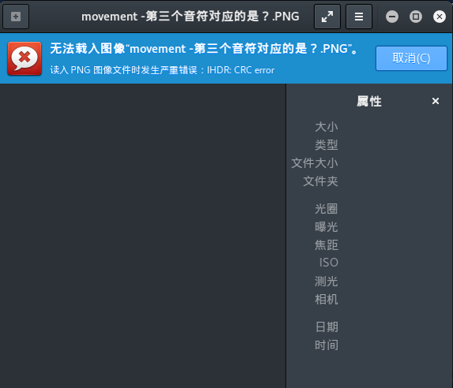
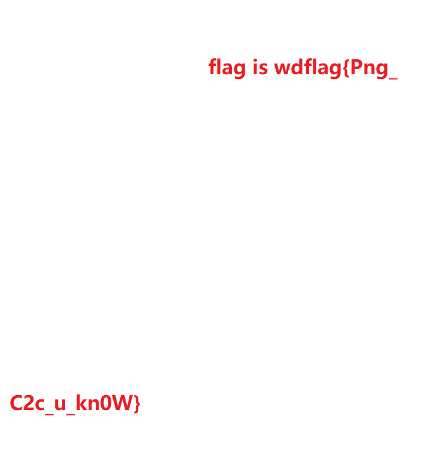
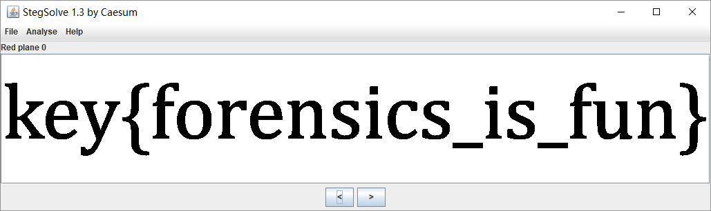
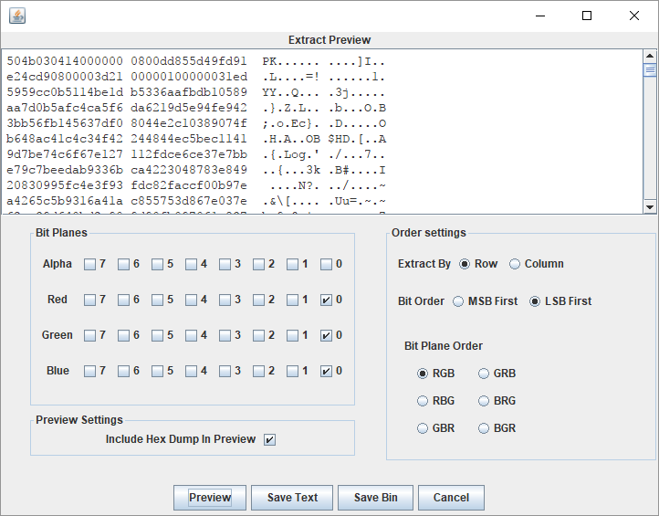

# PNG

## 文件格式

對於一個 PNG 文件來說，其文件頭總是由位固定的字節來描述的，剩餘的部分由 3 個以上的 PNG 的數據塊（Chunk）按照特定的順序組成。

文件頭 `89 50 4E 47 0D 0A 1A 0A` + 數據塊 + 數據塊 + 數據塊……

### 數據塊CHUNk

PNG 定義了兩種類型的數據塊，一種是稱爲關鍵數據塊（critical chunk），這是標準的數據塊，另一種叫做輔助數據塊（ancillary chunks），這是可選的數據塊。關鍵數據塊定義了 4 個標準數據塊，每個 PNG 文件都必須包含它們，PNG 讀寫軟件也都必須要支持這些數據塊。

| 數據塊符號 | 數據塊名稱             | 多數據塊 | 可選否 | 位置限制           |
| ---------- | ---------------------- | -------- | ------ | ------------------ |
| IHDR       | 文件頭數據塊           | 否       | 否     | 第一塊             |
| cHRM       | 基色和白色點數據塊     | 否       | 是     | 在PLTE和IDAT之前   |
| gAMA       | 圖像γ數據塊            | 否       | 是     | 在PLTE和IDAT之前   |
| sBIT       | 樣本有效位數據塊       | 否       | 是     | 在PLTE和IDAT之前   |
| PLTE       | 調色板數據塊           | 否       | 是     | 在IDAT之前         |
| bKGD       | 背景顏色數據塊         | 否       | 是     | 在PLTE之後IDAT之前 |
| hIST       | 圖像直方圖數據塊       | 否       | 是     | 在PLTE之後IDAT之前 |
| tRNS       | 圖像透明數據塊         | 否       | 是     | 在PLTE之後IDAT之前 |
| oFFs       | （專用公共數據塊）     | 否       | 是     | 在IDAT之前         |
| pHYs       | 物理像素尺寸數據塊     | 否       | 是     | 在IDAT之前         |
| sCAL       | （專用公共數據塊）     | 否       | 是     | 在IDAT之前         |
| IDAT       | 圖像數據塊             | 是       | 否     | 與其他IDAT連續     |
| tIME       | 圖像最後修改時間數據塊 | 否       | 是     | 無限制             |
| tEXt       | 文本信息數據塊         | 是       | 是     | 無限制             |
| zTXt       | 壓縮文本數據塊         | 是       | 是     | 無限制             |
| fRAc       | （專用公共數據塊）     | 是       | 是     | 無限制             |
| gIFg       | （專用公共數據塊）     | 是       | 是     | 無限制             |
| gIFt       | （專用公共數據塊）     | 是       | 是     | 無限制             |
| gIFx       | （專用公共數據塊）     | 是       | 是     | 無限制             |
| IEND       | 圖像結束數據           | 否       | 否     | 最後一個數據塊     |

對於每個數據塊都有着統一的數據結構，每個數據塊由 4 個部分組成

| 名稱                            | 字節數   | 說明                                                |
| ------------------------------- | -------- | --------------------------------------------------- |
| Length（長度）                  | 4字節    | 指定數據塊中數據域的長度，其長度不超過（2<sup>31</sup>－1）字節 |
| Chunk Type Code（數據塊類型碼） | 4字節    | 數據塊類型碼由 ASCII 字母（A - Z 和 a - z）組成     |
| Chunk Data（數據塊數據）        | 可變長度 | 存儲按照 Chunk Type Code 指定的數據                 |
| CRC（循環冗餘檢測）             | 4字節    | 存儲用來檢測是否有錯誤的循環冗餘碼                  |

CRC（Cyclic Redundancy Check）域中的值是對 Chunk Type Code 域和 Chunk Data 域中的數據進行計算得到的。

### IHDR

文件頭數據塊 IHDR（Header Chunk）：它包含有 PNG 文件中存儲的圖像數據的基本信息，由 13 字節組成，並要作爲第一個數據塊出現在 PNG 數據流中，而且一個 PNG 數據流中只能有一個文件頭數據塊

其中我們關注的是前8字節的內容

| 域的名稱 | 字節數  | 說明                   |
| -------- | ------- | ---------------------- |
| Width    | 4 bytes | 圖像寬度，以像素爲單位 |
| Height   | 4 bytes | 圖像高度，以像素爲單位 |

我們經常會去更改一張圖片的高度或者寬度使得一張圖片顯示不完整從而達到隱藏信息的目的。



這裏可以發現在 Kali 中是打不開這張圖片的，提示 `IHDR CRC error`，而 Windows 10 自帶的圖片查看器能夠打開，就提醒了我們 IHDR 塊被人爲的篡改過了，從而嘗試修改圖片的高度或者寬度發現隱藏的字符串。

#### 例題

##### WDCTF-finals-2017

觀察文件可以發現,文件頭及寬度異常

```hex
00000000  80 59 4e 47 0d 0a 1a 0a  00 00 00 0d 49 48 44 52  |.YNG........IHDR|
00000010  00 00 00 00 00 00 02 f8  08 06 00 00 00 93 2f 8a  |............../.|
00000020  6b 00 00 00 04 67 41 4d  41 00 00 9c 40 20 0d e4  |k....gAMA...@ ..|
00000030  cb 00 00 00 20 63 48 52  4d 00 00 87 0f 00 00 8c  |.... cHRM.......|
00000040  0f 00 00 fd 52 00 00 81  40 00 00 7d 79 00 00 e9  |....R...@..}y...|
...
```

這裏需要注意的是，文件寬度不能任意修改，需要根據 IHDR 塊的 CRC 值爆破得到寬度,否則圖片顯示錯誤不能得到 flag。

```python
import os
import binascii
import struct


misc = open("misc4.png","rb").read()

for i in range(1024):
    data = misc[12:16] + struct.pack('>i',i)+ misc[20:29]
    crc32 = binascii.crc32(data) & 0xffffffff
    if crc32 == 0x932f8a6b:
        print i
```

得到寬度值爲 709 後，恢復圖片得到 flag。



### PLTE

調色板數據塊 PLTE（palette chunk）：它包含有與索引彩色圖像（indexed-color image）相關的彩色變換數據，它僅與索引彩色圖像有關，而且要放在圖像數據塊（image data
chunk）之前。真彩色的 PNG 數據流也可以有調色板數據塊，目的是便於非真彩色顯示程序用它來量化圖像數據，從而顯示該圖像。

### IDAT

圖像數據塊 IDAT（image data chunk）：它存儲實際的數據，在數據流中可包含多個連續順序的圖像數據塊。

-   儲存圖像像數數據
-   在數據流中可包含多個連續順序的圖像數據塊
-   採用 LZ77 算法的派生算法進行壓縮
-   可以用 zlib 解壓縮

值得注意的是，IDAT 塊只有當上一個塊充滿時，纔會繼續一個新的塊。

用 `pngcheck` 去查看此 PNG 文件

```shell
λ .\pngcheck.exe -v sctf.png
File: sctf.png (1421461 bytes)
  chunk IHDR at offset 0x0000c, length 13
    1000 x 562 image, 32-bit RGB+alpha, non-interlaced
  chunk sRGB at offset 0x00025, length 1
    rendering intent = perceptual
  chunk gAMA at offset 0x00032, length 4: 0.45455
  chunk pHYs at offset 0x00042, length 9: 3780x3780 pixels/meter (96 dpi)
  chunk IDAT at offset 0x00057, length 65445
    zlib: deflated, 32K window, fast compression
  chunk IDAT at offset 0x10008, length 65524
...
  chunk IDAT at offset 0x150008, length 45027
  chunk IDAT at offset 0x15aff7, length 138
  chunk IEND at offset 0x15b08d, length 0
No errors detected in sctf.png (28 chunks, 36.8% compression).
```

可以看到，正常的塊的 length 是在 65524 的時候就滿了，而倒數第二個 IDAT 塊長度是 45027，最後一個長度是 138，很明顯最後一個 IDAT 塊是有問題的，因爲他本來應該併入到倒數第二個未滿的塊裏.

利用 `python zlib` 解壓多餘 IDAT 塊的內容，此時注意剔除 **長度、數據塊類型及末尾的CRC校驗值**。

```python
import zlib
import binascii
IDAT = "789...667".decode('hex')
result = binascii.hexlify(zlib.decompress(IDAT))
print result
```

### IEND

圖像結束數據 IEND（image trailer chunk）：它用來標記 PNG 文件或者數據流已經結束，並且必須要放在文件的尾部。

```
00 00 00 00 49 45 4E 44 AE 42 60 82
```

IEND 數據塊的長度總是 `00 00 00 00`，數據標識總是 IEND `49 45 4E 44`，因此，CRC 碼也總是 `AE 42 60 82`。

### 其餘輔助數據塊

-   背景顏色數據塊 bKGD（background color）
-   基色和白色度數據塊 cHRM（primary chromaticities and white point），所謂白色度是指當 `R＝G＝B＝最大值` 時在顯示器上產生的白色度
-   圖像 γ 數據塊 gAMA（image gamma）
-   圖像直方圖數據塊 hIST（image histogram）
-   物理像素尺寸數據塊 pHYs（physical pixel dimensions）
-   樣本有效位數據塊 sBIT（significant bits）
-   文本信息數據塊 tEXt（textual data）
-   圖像最後修改時間數據塊 tIME （image last-modification time）
-   圖像透明數據塊 tRNS （transparency）
-   壓縮文本數據塊 zTXt （compressed textual data）

## LSB

LSB 全稱 Least Significant Bit，最低有效位。PNG 文件中的圖像像數一般是由 RGB 三原色（紅綠藍）組成，每一種顏色佔用 8 位，取值範圍爲 `0x00` 至 `0xFF`，即有 256 種顏色，一共包含了 256 的 3 次方的顏色，即 16777216 種顏色。

而人類的眼睛可以區分約1000萬種不同的顏色，意味着人類的眼睛無法區分餘下的顏色大約有6777216種。

LSB 隱寫就是修改 RGB 顏色分量的最低二進制位（LSB），每個顏色會有 8 bit，LSB 隱寫就是修改了像數中的最低的 1 bit，而人類的眼睛不會注意到這前後的變化，每個像素可以攜帶 3 比特的信息。


如果是要尋找這種 LSB 隱藏痕跡的話，有一個工具 [Stegsolve](http://www.caesum.com/handbook/Stegsolve.jar) 是個神器，可以來輔助我們進行分析。

通過下方的按鈕可以觀察每個通道的信息，例如查看 R 通道的最低位第 8 位平面的信息。



LSB 的信息藉助於 Stegsolve 查看各個通道時一定要細心捕捉異常點，抓住 LSB 隱寫的蛛絲馬跡。

### 例題

> HCTF - 2016 - Misc

這題的信息隱藏在 RGB 三個通道的最低位中，藉助 `Stegsolve-->Analyse-->Data Extract` 可以指定通道進行提取。



可以發現 `zip` 頭，用 `save bin` 保存爲壓縮包後，打開運行其中的 ELF 文件就可以得到最後的 flag。

> 更多關於 LSB 的研究可以看 [這裏](https://zhuanlan.zhihu.com/p/23890677)。

## 隱寫軟件

[Stepic](http://domnit.org/stepic/doc/)
