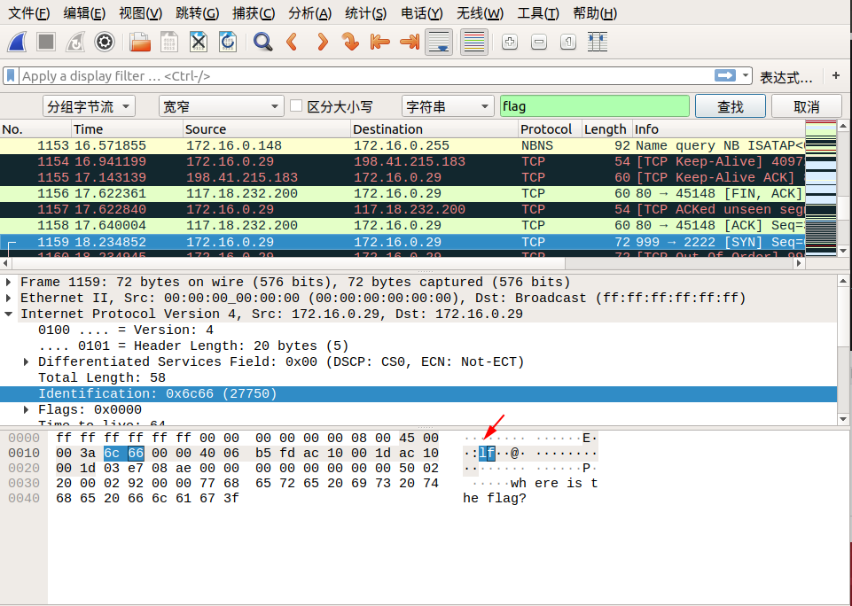
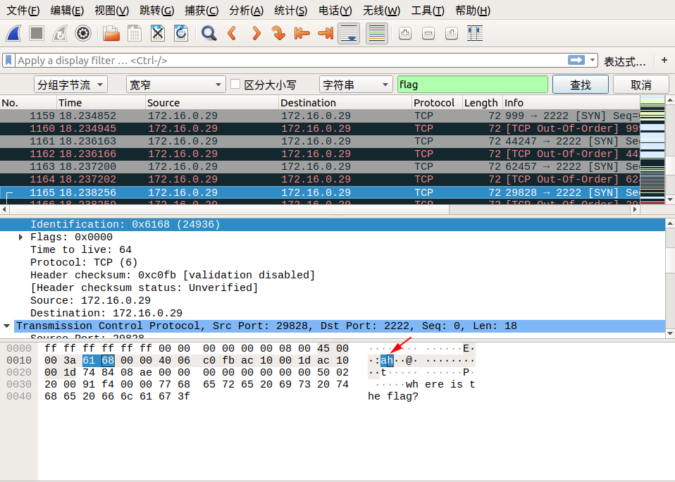
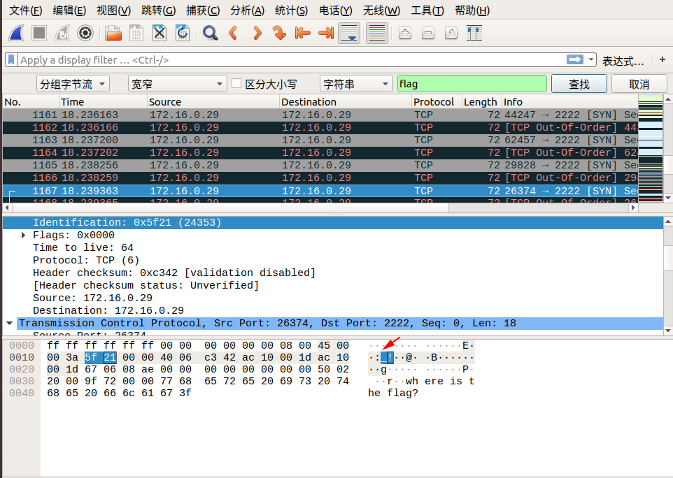
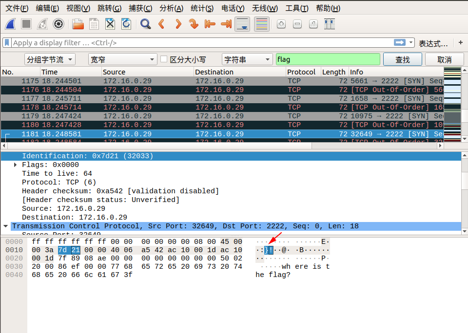

# PCAP 文件修復

## PCAP文件結構

一般來說,對於 `PCAP` 文件格式考察較少，且通常都能借助於現成的工具如 `pcapfix` 直接修復，這裏大致介紹下幾個常見的塊，詳細可以翻看[Here](http://www.tcpdump.org/pcap/pcap.html)。

- Tools
    - [PcapFix Online](https://f00l.de/hacking/pcapfix.php)
    - [PcapFix](https://github.com/Rup0rt/pcapfix/tree/devel)

一般文件結構

```shell
    0                   1                   2                   3   
    0 1 2 3 4 5 6 7 8 9 0 1 2 3 4 5 6 7 8 9 0 1 2 3 4 5 6 7 8 9 0 1
   +-+-+-+-+-+-+-+-+-+-+-+-+-+-+-+-+-+-+-+-+-+-+-+-+-+-+-+-+-+-+-+-+
   |                          Block Type                           |
   +-+-+-+-+-+-+-+-+-+-+-+-+-+-+-+-+-+-+-+-+-+-+-+-+-+-+-+-+-+-+-+-+
   |                      Block Total Length                       |
   +-+-+-+-+-+-+-+-+-+-+-+-+-+-+-+-+-+-+-+-+-+-+-+-+-+-+-+-+-+-+-+-+
   /                          Block Body                           /
   /          /* variable length, aligned to 32 bits */            /
   +-+-+-+-+-+-+-+-+-+-+-+-+-+-+-+-+-+-+-+-+-+-+-+-+-+-+-+-+-+-+-+-+
   |                      Block Total Length                       |
   +-+-+-+-+-+-+-+-+-+-+-+-+-+-+-+-+-+-+-+-+-+-+-+-+-+-+-+-+-+-+-+-+
```

目前所定義的常見塊類型有

1. Section Header Block: it defines the most important characteristics of the capture file.
2. Interface Description Block: it defines the most important characteristics of the interface(s) used for capturing traffic.
3. Packet Block: it contains a single captured packet, or a portion of it.
4. Simple Packet Block: it contains a single captured packet, or a portion of it, with only a minimal set of information about it.
5. Name Resolution Block: it defines the mapping from numeric addresses present in the packet dump and the canonical name counterpart.
6. Capture Statistics Block: it defines how to store some statistical data (e.g. packet dropped, etc) which can be useful to undestand the conditions in which the capture has been made.

## 常見塊

### Section Header BlocK(文件頭)

必須存在,意味着文件的開始

```shell
    0                   1                   2                   3   
    0 1 2 3 4 5 6 7 8 9 0 1 2 3 4 5 6 7 8 9 0 1 2 3 4 5 6 7 8 9 0 1
   +-+-+-+-+-+-+-+-+-+-+-+-+-+-+-+-+-+-+-+-+-+-+-+-+-+-+-+-+-+-+-+-+
   |                Byte-Order Magic (0x1A2B3C4D)                  |
   +-+-+-+-+-+-+-+-+-+-+-+-+-+-+-+-+-+-+-+-+-+-+-+-+-+-+-+-+-+-+-+-+
   |   Major Version(主版本號)   |    Minor Version(次版本號)        |
   +-+-+-+-+-+-+-+-+-+-+-+-+-+-+-+-+-+-+-+-+-+-+-+-+-+-+-+-+-+-+-+-+
   |                                                               |
   |                          Section Length                       |
   |                                                               |
   +-+-+-+-+-+-+-+-+-+-+-+-+-+-+-+-+-+-+-+-+-+-+-+-+-+-+-+-+-+-+-+-+
   /                                                               /
   /                      Options (variable)                       /
   /                                                               /
   +-+-+-+-+-+-+-+-+-+-+-+-+-+-+-+-+-+-+-+-+-+-+-+-+-+-+-+-+-+-+-+-+
```

### Interface Description Block(接口描述)

必須存在,描述接口特性

```shell
    0                   1                   2                   3   
    0 1 2 3 4 5 6 7 8 9 0 1 2 3 4 5 6 7 8 9 0 1 2 3 4 5 6 7 8 9 0 1
   +-+-+-+-+-+-+-+-+-+-+-+-+-+-+-+-+-+-+-+-+-+-+-+-+-+-+-+-+-+-+-+-+
   |           LinkType            |           Reserved            |
   +-+-+-+-+-+-+-+-+-+-+-+-+-+-+-+-+-+-+-+-+-+-+-+-+-+-+-+-+-+-+-+-+
   |                  SnapLen(每個數據包最大字節數)                  |
   +-+-+-+-+-+-+-+-+-+-+-+-+-+-+-+-+-+-+-+-+-+-+-+-+-+-+-+-+-+-+-+-+
   /                                                               /
   /                      Options (variable)                       /
   /                                                               /
   +-+-+-+-+-+-+-+-+-+-+-+-+-+-+-+-+-+-+-+-+-+-+-+-+-+-+-+-+-+-+-+-+
```

### Packet Block(數據塊)

```sh
    0                   1                   2                   3   
    0 1 2 3 4 5 6 7 8 9 0 1 2 3 4 5 6 7 8 9 0 1 2 3 4 5 6 7 8 9 0 1
   +-+-+-+-+-+-+-+-+-+-+-+-+-+-+-+-+-+-+-+-+-+-+-+-+-+-+-+-+-+-+-+-+
   |         Interface ID          |          Drops Count          |
   +-+-+-+-+-+-+-+-+-+-+-+-+-+-+-+-+-+-+-+-+-+-+-+-+-+-+-+-+-+-+-+-+
   |                     Timestamp (High)   標準的Unix格式          |
   +-+-+-+-+-+-+-+-+-+-+-+-+-+-+-+-+-+-+-+-+-+-+-+-+-+-+-+-+-+-+-+-+
   |                        Timestamp (Low)                        |
   +-+-+-+-+-+-+-+-+-+-+-+-+-+-+-+-+-+-+-+-+-+-+-+-+-+-+-+-+-+-+-+-+
   |                         Captured Len                          |
   +-+-+-+-+-+-+-+-+-+-+-+-+-+-+-+-+-+-+-+-+-+-+-+-+-+-+-+-+-+-+-+-+
   |                          Packet Len                           |
   +-+-+-+-+-+-+-+-+-+-+-+-+-+-+-+-+-+-+-+-+-+-+-+-+-+-+-+-+-+-+-+-+
   /                          Packet Data                          /
   /          /* variable length, aligned to 32 bits */            /
   +-+-+-+-+-+-+-+-+-+-+-+-+-+-+-+-+-+-+-+-+-+-+-+-+-+-+-+-+-+-+-+-+
   /                      Options (variable)                       /
   +-+-+-+-+-+-+-+-+-+-+-+-+-+-+-+-+-+-+-+-+-+-+-+-+-+-+-+-+-+-+-+-+
```

## 例題

> 題目：第一屆“百度杯”信息安全攻防總決賽 線上選拔賽：find the flag
>
> WP：https://www.cnblogs.com/ECJTUACM-873284962/p/9884447.html

首先我們拿到這樣一道流量包的題目，題目名稱爲 `find the flag` 。這裏面給了很多提示信息，要我們去找到 `flag` 。

**第一步，搜索 `flag` 字樣**

我們先去搜索看看流量包裏面有沒有 `flag` 。我們使用 `strings` 命令去找一下流量包， `Windows` 的朋友可以用 `notepad++` 的搜索功能去尋找。

搜索命令如下：

```shell
strings findtheflag.cap | grep flag
```

搜索結果如下：


我們發現搜出了一大堆的東西，我們通過管道去過濾出 `flag` 信息，似乎沒有發現我們所需要找的答案。

**第二步，流量包修復**

我們用 `wireshark` 打開這個流量包


我們發現這個流量包出現了異常現象，我們可以修復一下這個流量包。

這裏我們用到一個在線工具：http://f00l.de/hacking/pcapfix.php

這個工具可以幫助我們快速地將其流量包修復爲 `pcap` 包。

我們對其進行在線修復。


修復完畢後點擊 `Get your repaired PCAP-file here.` 即可下載流量包，然後我們用 `wireshark` 打開。

既然還是要找 `flag` ，我們可以先看看這個流量包。

**第三步，追蹤TCP流**

我們追蹤一下TCP流，看看有沒有什麼突破？


我們通過追蹤 `TCP` 流，可以看到一些版本信息， `cookie` 等等，我們還是發現了一些很有意思的東西。

從 `tcp.stream eq 29` 到 `tcp.stream eq 41` 只顯示了 `where is the flag?` 這個字樣，難道這是出題人在告訴我們 `flag` 在這裏嘛？

**第四步，查找分組字節流**

我們追蹤到 `tcp.stream eq 29` 的時候，在 `Identification` 信息中看到了 `flag` 中的 `lf` 字樣，我們可以繼續追蹤下一個流，在 `tcp.stream eq 30` 的 `Identification` 信息中看到了 `flag` 中的 `ga` 字樣，我們發現將兩個包中 `Identification` 信息對應的字段從右至左組合，恰好就是 `flag` ！於是我們可以大膽地猜測， `flag` 肯定是藏在這裏面。

我們直接通過搜索->字符串搜索->分組字節流->搜索關鍵字 `flag` 即可，按照同樣的方式連接後面相連數據包的 `Identification` 信息對應的字段，即可找到最終的flag！

下面是搜索的截圖：











所以最終的 `flag` 爲：**flag{aha!_you_found_it!}**

## 參考文獻

- http://www.tcpdump.org/pcap/pcap.html
- https://zhuanlan.zhihu.com/p/27470338
- https://www.cnblogs.com/ECJTUACM-873284962/p/9884447.html


