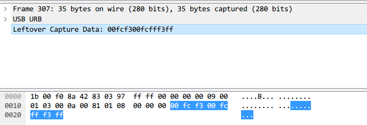
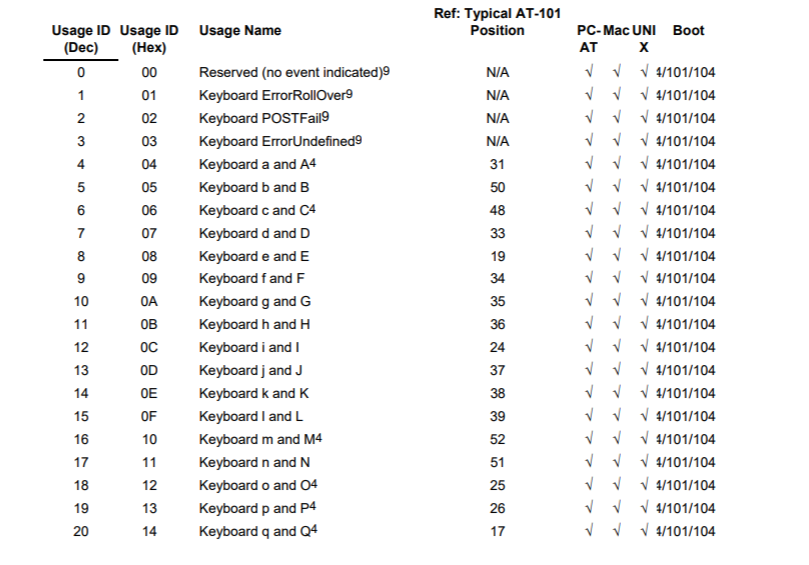
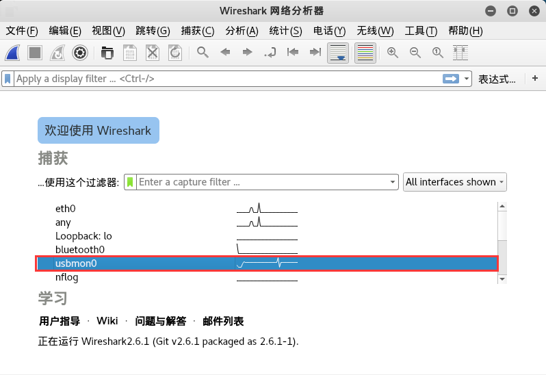
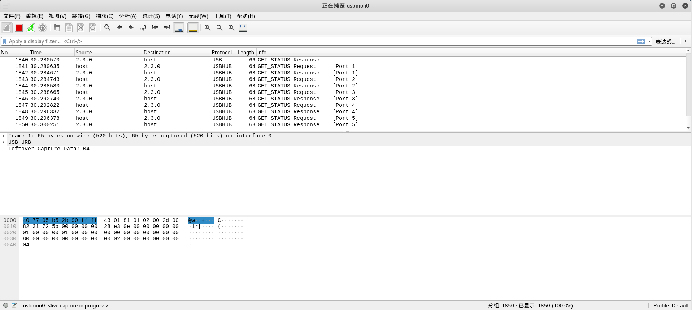
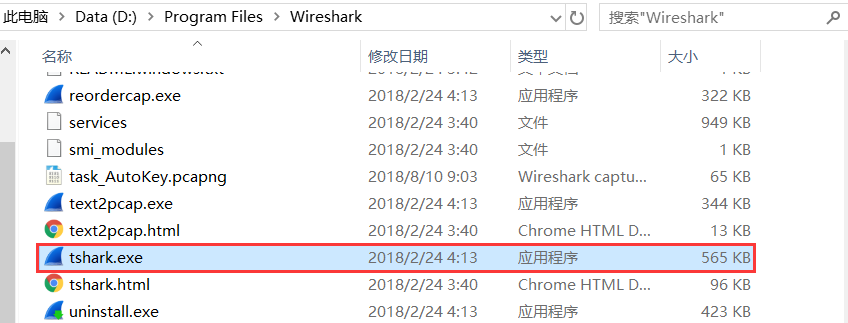
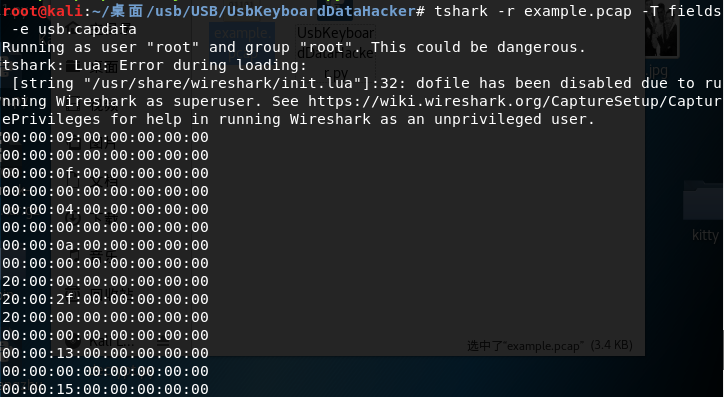
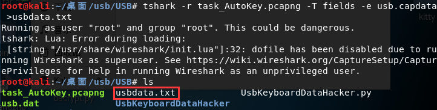
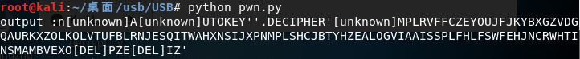
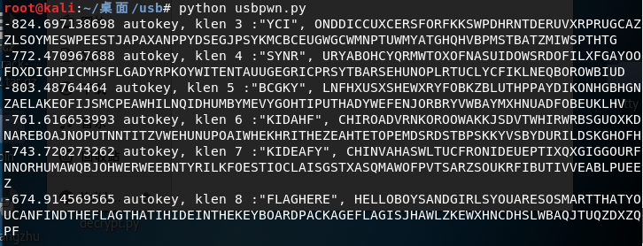

# USB

## 簡介

**USB詳述**: [https://www.usb.org/sites/default/files/documents/hut1_12v2.pdf](https://www.usb.org/sites/default/files/documents/hut1_12v2.pdf)

- 鼠標協議

鼠標移動時表現爲連續性，與鍵盤擊鍵的離散性不一樣，不過實際上鼠標動作所產生的數據包也是離散的，畢竟計算機表現的連續性信息都是由大量離散信息構成的


每一個數據包的數據區有四個字節，第一個字節代表按鍵，當取0x00時，代表沒有按鍵、爲0x01時，代表按左鍵，爲0x02時，代表當前按鍵爲右鍵。第二個字節可以看成是一個signed byte類型，其最高位爲符號位，當這個值爲正時，代表鼠標水平右移多少像素，爲負時，代表水平左移多少像素。第三個字節與第二字節類似，代表垂直上下移動的偏移。

得到這些點的信息後,即可恢復出鼠標移動軌跡

- Tools
  - [UsbMiceDataHacker](https://github.com/WangYihang/UsbMiceDataHacker)
- 鍵盤協議

鍵盤數據包的數據長度爲8個字節，擊鍵信息集中在第3個字節



根據data值與具體鍵位的對應關係



可從數據包恢復出鍵盤的案件信息

- Tools
  - [UsbKeyboardDataHacker](https://github.com/WangYihang/UsbKeyboardDataHacker)

**參考**

- https://www.anquanke.com/post/id/85218

## 例題

> `Xman`三期夏令營排位賽練習題：`AutoKey`
>
> WP：https://www.cnblogs.com/ECJTUACM-873284962/p/9473808.html

問題描述：


這道題是我參加 `Xman` 三期夏令營選拔賽出的一道題，我們如何對其進行分析？

### 流量包是如何捕獲的？

首先我們從上面的數據包分析可以知道，這是個 `USB` 的流量包，我們可以先嚐試分析一下 `USB` 的數據包是如何捕獲的。

在開始前，我們先介紹一些 `USB` 的基礎知識。 `USB` 有不同的規格，以下是使用 `USB` 的三種方式：

```shell
l USB UART
l USB HID
l USB Memory
```

`UART` 或者 `Universal Asynchronous Receiver/Transmitter` 。這種方式下，設備只是簡單的將 `USB` 用於接受和發射數據，除此之外就再沒有其他通訊功能了。

`HID` 是人性化的接口。這一類通訊適用於交互式，有這種功能的設備有：鍵盤，鼠標，遊戲手柄和數字顯示設備。

最後是 `USB Memory` ，或者說是數據存儲。 `External HDD` ， `thumb drive/flash drive` 等都是這一類的。

其中使用的最廣的不是 `USB HID` 就是 `USB Memory` 了。

每一個 `USB` 設備（尤其是 `HID` 或者 `Memory` ）都有一個供應商 `ID（Vendor ID）` 和產品識別碼`（Product Id）` 。 `Vendor ID` 是用來標記哪個廠商生產了這個 `USB` 設備。 `Product ID` 用來標記不同的產品，他並不是一個特殊的數字，當然最好不同。如下圖：


上圖是我在虛擬機環境下連接在我電腦上的 `USB` 設備列表，通過 `lsusb` 查看命令。

例如說，我在 `VMware` 下有一個無線鼠標。它是屬於 `HID` 設備。這個設備正常的運行，並且通過`lsusb` 這個命令查看所有 `USB` 設備，現在大家能找出哪一條是這個鼠標嗎？？沒有錯，就是第四個，就是下面這條：

```shell
Bus 002 Device 002: ID 0e0f:0003 VMware, Inc. Virtual Mouse
```

其中，`ID 0e0f:0003` 就是 `Vendor-Product ID` 對， `Vendor ID` 的值是 `0e0f` ，並且 `Product ID` 的值是 `0003` 。 `Bus 002 Device 002` 代表 `usb` 設備正常連接，這點需要記下來。

我們用 `root` 權限運行 `Wireshark` 捕獲 `USB` 數據流。但是通常來說我們不建議這麼做。我們需要給用戶足夠的權限來獲取 `Linux` 中的 `usb` 數據流。我們可以用 `udev` 來達到我們的目的。我們需要創建一個用戶組 `usbmon` ，然後把我們的賬戶添加到這個組中。

```shell
addgroup usbmon
gpasswd -a $USER usbmon
echo 'SUBSYSTEM=="usbmon", GROUP="usbmon", MODE="640"' > /etc/udev/rules.d/99-usbmon.rules
```

接下來，我們需要 `usbmon` 內核模塊。如果該模塊沒有被加載，我們可以通過以下命令加載該模塊：

```shell
modprobe usbmon
```

打開 `wireshark` ，你會看到 `usbmonX` 其中 `X` 代表數字。下圖是我們本次的結果（我使用的是`root `）：



如果接口處於活躍狀態或者有數據流經過的時候， `wireshark` 的界面就會把它以波形圖的方式顯示出來。那麼，我們該選那個呢？沒有錯，就是我剛剛讓大家記下來的，這個X的數字就是對應這 `USB Bus` 。在本文中是 `usbmon0` 。打開他就可以觀察數據包了。



通過這些，我們可以瞭解到 `usb` 設備與主機之間的通信過程和工作原理，我們可以來對流量包進行分析了。

### 如何去分析一個USB流量包？

根據前面的知識鋪墊，我們大致對 `USB` 流量包的抓取有了一個輪廓了，下面我們介紹一下如何分析一個 `USB` 流量包。

`USB` 協議的細節方面參考 `wireshark` 的 `wiki` ：<https://wiki.wireshark.org/USB>

我們先拿 `GitHub` 上一個簡單的例子開始講起：


我們分析可以知道， `USB` 協議的數據部分在 `Leftover Capture Data` 域之中，在 `Mac` 和 `Linux` 下可以用 `tshark` 命令可以將 `leftover capture data` 單獨提取出來，命令如下：

```shell
tshark -r example.pcap -T fields -e usb.capdata //如果想導入usbdata.txt文件中，後面加上參數：>usbdata.txt
```

`Windows` 下裝了 `wireshark` 的環境下，在 `wireshark`目錄下有個 `tshark.exe` ，比如我的在 `D:\Program Files\Wireshark\tshark.exe`



調用 `cmd` ，定位到當前目錄下，輸入如下命令即可：

```
tshark.exe -r example.pcap -T fields -e usb.capdata //如果想導入usbdata.txt文件中，後面加上參數：>usbdata.txt
```

有關 `tshark` 命令的詳細使用參考 `wireshark` 官方文檔：<https://www.wireshark.org/docs/man-pages/tshark.html>

運行命令並查看 `usbdata.txt` 發現數據包長度爲八個字節



關於 `USB` 的特點應用我找了一張圖，很清楚的反應了這個問題：


這裏我們只關注 `USB` 流量中的鍵盤流量和鼠標流量。

鍵盤數據包的數據長度爲 `8` 個字節，擊鍵信息集中在第 `3` 個字節，每次 `key stroke` 都會產生一個 `keyboard event usb packet` 。

鼠標數據包的數據長度爲 `4` 個字節，第一個字節代表按鍵，當取 `0x00` 時，代表沒有按鍵、爲0x01時，代表按左鍵，爲 `0x02` 時，代表當前按鍵爲右鍵。第二個字節可以看成是一個 `signed byte` 類型，其最高位爲符號位，當這個值爲正時，代表鼠標水平右移多少像素，爲負時，代表水平左移多少像素。第三個字節與第二字節類似，代表垂直上下移動的偏移。

我翻閱了大量的 `USB` 協議的文檔，在這裏我們可以找到這個值與具體鍵位的對應關係：<https://www.usb.org/sites/default/files/documents/hut1_12v2.pdf>

`usb keyboard` 的映射表 根據這個映射表將第三個字節取出來，對應對照表得到解碼：


我們寫出如下腳本：

```python
mappings = { 0x04:"A",  0x05:"B",  0x06:"C", 0x07:"D", 0x08:"E", 0x09:"F", 0x0A:"G",  0x0B:"H", 0x0C:"I",  0x0D:"J", 0x0E:"K", 0x0F:"L", 0x10:"M", 0x11:"N",0x12:"O",  0x13:"P", 0x14:"Q", 0x15:"R", 0x16:"S", 0x17:"T", 0x18:"U",0x19:"V", 0x1A:"W", 0x1B:"X", 0x1C:"Y", 0x1D:"Z", 0x1E:"1", 0x1F:"2", 0x20:"3", 0x21:"4", 0x22:"5",  0x23:"6", 0x24:"7", 0x25:"8", 0x26:"9", 0x27:"0", 0x28:"n", 0x2a:"[DEL]",  0X2B:"    ", 0x2C:" ",  0x2D:"-", 0x2E:"=", 0x2F:"[",  0x30:"]",  0x31:"\\", 0x32:"~", 0x33:";",  0x34:"'", 0x36:",",  0x37:"." }
nums = []
keys = open('usbdata.txt')
for line in keys:
    if line[0]!='0' or line[1]!='0' or line[3]!='0' or line[4]!='0' or line[9]!='0' or line[10]!='0' or line[12]!='0' or line[13]!='0' or line[15]!='0' or line[16]!='0' or line[18]!='0' or line[19]!='0' or line[21]!='0' or line[22]!='0':
         continue
    nums.append(int(line[6:8],16))
    # 00:00:xx:....
keys.close()
output = ""
for n in nums:
    if n == 0 :
        continue
    if n in mappings:
        output += mappings[n]
    else:
        output += '[unknown]'
print('output :n' + output)
```

結果如下：


我們把前面的整合成腳本，得：

```python
#!/usr/bin/env python

import sys
import os

DataFileName = "usb.dat"

presses = []

normalKeys = {"04":"a", "05":"b", "06":"c", "07":"d", "08":"e", "09":"f", "0a":"g", "0b":"h", "0c":"i", "0d":"j", "0e":"k", "0f":"l", "10":"m", "11":"n", "12":"o", "13":"p", "14":"q", "15":"r", "16":"s", "17":"t", "18":"u", "19":"v", "1a":"w", "1b":"x", "1c":"y", "1d":"z","1e":"1", "1f":"2", "20":"3", "21":"4", "22":"5", "23":"6","24":"7","25":"8","26":"9","27":"0","28":"<RET>","29":"<ESC>","2a":"<DEL>", "2b":"\t","2c":"<SPACE>","2d":"-","2e":"=","2f":"[","30":"]","31":"\\","32":"<NON>","33":";","34":"'","35":"<GA>","36":",","37":".","38":"/","39":"<CAP>","3a":"<F1>","3b":"<F2>", "3c":"<F3>","3d":"<F4>","3e":"<F5>","3f":"<F6>","40":"<F7>","41":"<F8>","42":"<F9>","43":"<F10>","44":"<F11>","45":"<F12>"}

shiftKeys = {"04":"A", "05":"B", "06":"C", "07":"D", "08":"E", "09":"F", "0a":"G", "0b":"H", "0c":"I", "0d":"J", "0e":"K", "0f":"L", "10":"M", "11":"N", "12":"O", "13":"P", "14":"Q", "15":"R", "16":"S", "17":"T", "18":"U", "19":"V", "1a":"W", "1b":"X", "1c":"Y", "1d":"Z","1e":"!", "1f":"@", "20":"#", "21":"$", "22":"%", "23":"^","24":"&","25":"*","26":"(","27":")","28":"<RET>","29":"<ESC>","2a":"<DEL>", "2b":"\t","2c":"<SPACE>","2d":"_","2e":"+","2f":"{","30":"}","31":"|","32":"<NON>","33":"\"","34":":","35":"<GA>","36":"<","37":">","38":"?","39":"<CAP>","3a":"<F1>","3b":"<F2>", "3c":"<F3>","3d":"<F4>","3e":"<F5>","3f":"<F6>","40":"<F7>","41":"<F8>","42":"<F9>","43":"<F10>","44":"<F11>","45":"<F12>"}

def main():
    # check argv
    if len(sys.argv) != 2:
        print "Usage : "
        print "        python UsbKeyboardHacker.py data.pcap"
        print "Tips : "
        print "        To use this python script , you must install the tshark first."
        print "        You can use `sudo apt-get install tshark` to install it"
        print "        Thank you for using."
        exit(1)

    # get argv
    pcapFilePath = sys.argv[1]
    
    # get data of pcap
    os.system("tshark -r %s -T fields -e usb.capdata > %s" % (pcapFilePath, DataFileName))

    # read data
    with open(DataFileName, "r") as f:
        for line in f:
            presses.append(line[0:-1])
    # handle
    result = ""
    for press in presses:
        Bytes = press.split(":")
        if Bytes[0] == "00":
            if Bytes[2] != "00":
                result += normalKeys[Bytes[2]]
        elif Bytes[0] == "20": # shift key is pressed.
            if Bytes[2] != "00":
                result += shiftKeys[Bytes[2]]
        else:
            print "[-] Unknow Key : %s" % (Bytes[0])
    print "[+] Found : %s" % (result)

    # clean the temp data
    os.system("rm ./%s" % (DataFileName))


if __name__ == "__main__":
    main()
```

效果如下：


另外貼上一份鼠標流量數據包轉換腳本：

```python
nums = [] 
keys = open('usbdata.txt','r') 
posx = 0 
posy = 0 
for line in keys: 
if len(line) != 12 : 
     continue 
x = int(line[3:5],16) 
y = int(line[6:8],16) 
if x > 127 : 
    x -= 256 
if y > 127 : 
    y -= 256 
posx += x 
posy += y 
btn_flag = int(line[0:2],16)  # 1 for left , 2 for right , 0 for nothing 
if btn_flag == 1 : 
    print posx , posy 
keys.close()
```

鍵盤流量數據包轉換腳本如下：

```python
nums=[0x66,0x30,0x39,0x65,0x35,0x34,0x63,0x31,0x62,0x61,0x64,0x32,0x78,0x33,0x38,0x6d,0x76,0x79,0x67,0x37,0x77,0x7a,0x6c,0x73,0x75,0x68,0x6b,0x69,0x6a,0x6e,0x6f,0x70]
s=''
for x in nums:
    s+=chr(x)
print s
mappings = { 0x41:"A",  0x42:"B",  0x43:"C", 0x44:"D", 0x45:"E", 0x46:"F", 0x47:"G",  0x48:"H", 0x49:"I",  0x4a:"J", 0x4b:"K", 0x4c:"L", 0x4d:"M", 0x4e:"N",0x4f:"O",  0x50:"P", 0x51:"Q", 0x52:"R", 0x53:"S", 0x54:"T", 0x55:"U",0x56:"V", 0x57:"W", 0x58:"X", 0x59:"Y", 0x5a:"Z", 0x60:"0", 0x61:"1", 0x62:"2", 0x63:"3", 0x64:"4",  0x65:"5", 0x66:"6", 0x67:"7", 0x68:"8", 0x69:"9", 0x6a:"*", 0x6b:"+",  0X6c:"separator", 0x6d:"-",  0x6e:".", 0x6f:"/" }
output = ""
for n in nums:
    if n == 0 :
        continue
    if n in mappings:
        output += mappings[n]
    else:
        output += '[unknown]'
print 'output :\n' + output
```

那麼對於 `xman` 三期夏令營排位賽的這道題，我們可以模仿嘗試如上這個例子：

首先我們通過 `tshark` 將 `usb.capdata` 全部導出：

```shell
tshark -r task_AutoKey.pcapng -T fields -e usb.capdata //如果想導入usbdata.txt文件中，後面加上參數：>usbdata.txt
```

結果如下：



我們用上面的 `python` 腳本將第三個字節取出來，對應對照表得到解碼：

```python
mappings = { 0x04:"A",  0x05:"B",  0x06:"C", 0x07:"D", 0x08:"E", 0x09:"F", 0x0A:"G",  0x0B:"H", 0x0C:"I",  0x0D:"J", 0x0E:"K", 0x0F:"L", 0x10:"M", 0x11:"N",0x12:"O",  0x13:"P", 0x14:"Q", 0x15:"R", 0x16:"S", 0x17:"T", 0x18:"U",0x19:"V", 0x1A:"W", 0x1B:"X", 0x1C:"Y", 0x1D:"Z", 0x1E:"1", 0x1F:"2", 0x20:"3", 0x21:"4", 0x22:"5",  0x23:"6", 0x24:"7", 0x25:"8", 0x26:"9", 0x27:"0", 0x28:"n", 0x2a:"[DEL]",  0X2B:"    ", 0x2C:" ",  0x2D:"-", 0x2E:"=", 0x2F:"[",  0x30:"]",  0x31:"\\", 0x32:"~", 0x33:";",  0x34:"'", 0x36:",",  0x37:"." }
nums = []
keys = open('usbdata.txt')
for line in keys:
    if line[0]!='0' or line[1]!='0' or line[3]!='0' or line[4]!='0' or line[9]!='0' or line[10]!='0' or line[12]!='0' or line[13]!='0' or line[15]!='0' or line[16]!='0' or line[18]!='0' or line[19]!='0' or line[21]!='0' or line[22]!='0':
         continue
    nums.append(int(line[6:8],16))
    # 00:00:xx:....
keys.close()
output = ""
for n in nums:
    if n == 0 :
        continue
    if n in mappings:
        output += mappings[n]
    else:
        output += '[unknown]'
print('output :n' + output)
```

運行結果如下：



```shell
output :n[unknown]A[unknown]UTOKEY''.DECIPHER'[unknown]MPLRVFFCZEYOUJFJKYBXGZVDGQAURKXZOLKOLVTUFBLRNJESQITWAHXNSIJXPNMPLSHCJBTYHZEALOGVIAAISSPLFHLFSWFEHJNCRWHTINSMAMBVEXO[DEL]PZE[DEL]IZ'
```

我們可以看出這是自動密匙解碼，現在的問題是在我們不知道密鑰的情況下應該如何解碼呢？

我找到了如下這篇關於如何爆破密匙：<http://www.practicalcryptography.com/cryptanalysis/stochastic-searching/cryptanalysis-autokey-cipher/>

爆破腳本如下：

```python
from ngram_score import ngram_score
from pycipher import Autokey
import re
from itertools import permutations

qgram = ngram_score('quadgrams.txt')
trigram = ngram_score('trigrams.txt')

ctext = 'MPLRVFFCZEYOUJFJKYBXGZVDGQAURKXZOLKOLVTUFBLRNJESQITWAHXNSIJXPNMPLSHCJBTYHZEALOGVIAAISSPLFHLFSWFEHJNCRWHTINSMAMBVEXPZIZ'

ctext = re.sub(r'[^A-Z]','',ctext.upper())
# keep a list of the N best things we have seen, discard anything else

class nbest(object):
    def __init__(self,N=1000):
        self.store = []
        self.N = N

    def add(self,item):
        self.store.append(item)
        self.store.sort(reverse=True)
        self.store = self.store[:self.N]

    def __getitem__(self,k):
        return self.store[k]

    def __len__(self):
        return len(self.store)
        
#init
N=100
for KLEN in range(3,20):
    rec = nbest(N)
    for i in permutations('ABCDEFGHIJKLMNOPQRSTUVWXYZ',3):
        key = ''.join(i) + 'A'*(KLEN-len(i))
        pt = Autokey(key).decipher(ctext)
        score = 0
        for j in range(0,len(ctext),KLEN):
            score += trigram.score(pt[j:j+3])
        rec.add((score,''.join(i),pt[:30]))

    next_rec = nbest(N)
    for i in range(0,KLEN-3):
        for k in xrange(N):
            for c in 'ABCDEFGHIJKLMNOPQRSTUVWXYZ':
                key = rec[k][1] + c
                fullkey = key + 'A'*(KLEN-len(key))
                pt = Autokey(fullkey).decipher(ctext)
                score = 0
                for j in range(0,len(ctext),KLEN):
                    score += qgram.score(pt[j:j+len(key)])
                next_rec.add((score,key,pt[:30]))
        rec = next_rec
        next_rec = nbest(N)
    bestkey = rec[0][1]
    pt = Autokey(bestkey).decipher(ctext)
    bestscore = qgram.score(pt)
    for i in range(N):
        pt = Autokey(rec[i][1]).decipher(ctext)
        score = qgram.score(pt)
        if score > bestscore:
            bestkey = rec[i][1]
            bestscore = score       
    print bestscore,'autokey, klen',KLEN,':"'+bestkey+'",',Autokey(bestkey).decipher(ctext)
```

跑出來的結果如下：



我們看到了 `flag` 的字樣，整理可得如下：

```shell
-674.914569565 autokey, klen 8 :"FLAGHERE", HELLOBOYSANDGIRLSYOUARESOSMARTTHATYOUCANFINDTHEFLAGTHATIHIDEINTHEKEYBOARDPACKAGEFLAGISJHAWLZKEWXHNCDHSLWBAQJTUQZDXZQPF
```

我們把字段進行分割看：

```shell
HELLO
BOYS
AND
GIRLS
YOU
ARE
SO
SMART
THAT
YOU
CAN
FIND
THE
FLAG
THAT
IH
IDE
IN
THE
KEY
BOARD
PACKAGE
FLAG
IS
JHAWLZKEWXHNCDHSLWBAQJTUQZDXZQPF
```

最後的 `flag` 就是 `flag{JHAWLZKEWXHNCDHSLWBAQJTUQZDXZQPF}` 

## 參考文獻

- https://www.cnblogs.com/ECJTUACM-873284962/p/9473808.html
- https://blog.csdn.net/songze_lee/article/details/77658094
- https://wiki.wireshark.org/USB
- https://www.usb.org/sites/default/files/documents/hut1_12v2.pdf
- https://www.wireshark.org/docs/man-pages/tshark.html
- http://www.practicalcryptography.com/cryptanalysis/stochastic-searching/cryptanalysis-autokey-cipher/
- https://hackfun.org/2017/02/22/CTF%E4%B8%AD%E9%82%A3%E4%BA%9B%E8%84%91%E6%B4%9E%E5%A4%A7%E5%BC%80%E7%9A%84%E7%BC%96%E7%A0%81%E5%92%8C%E5%8A%A0%E5%AF%86/
