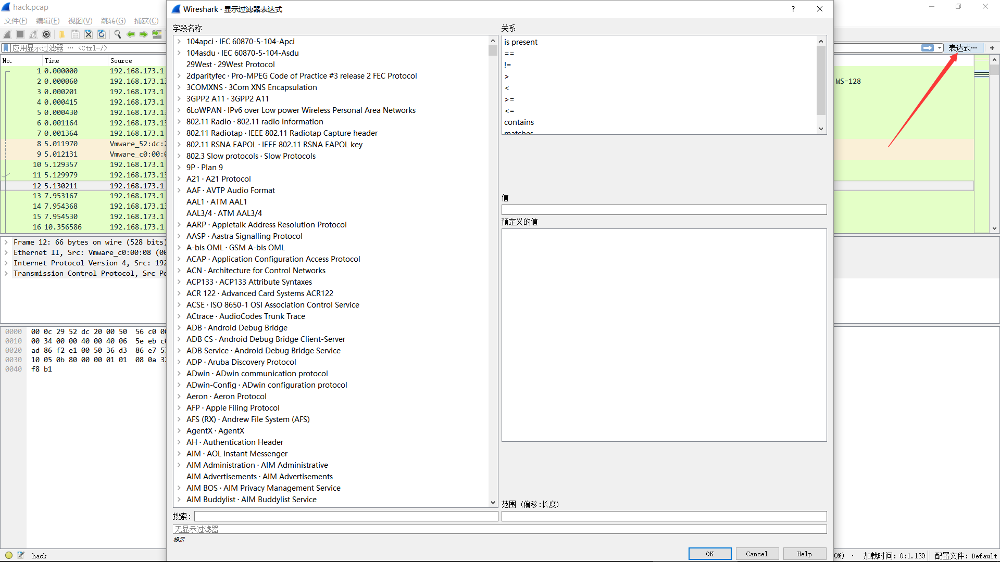
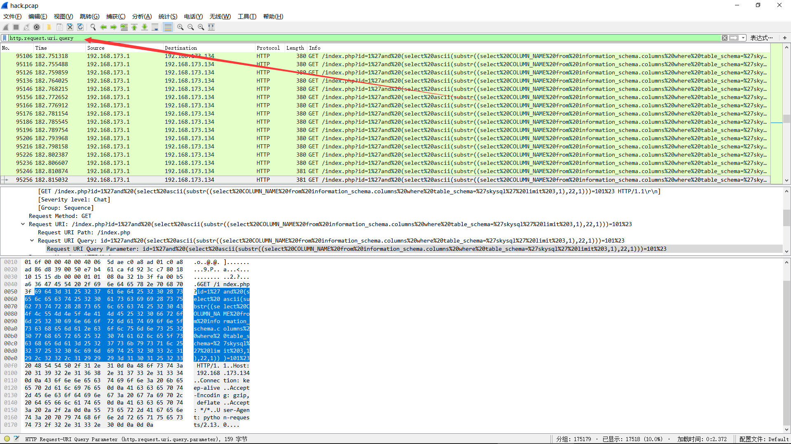
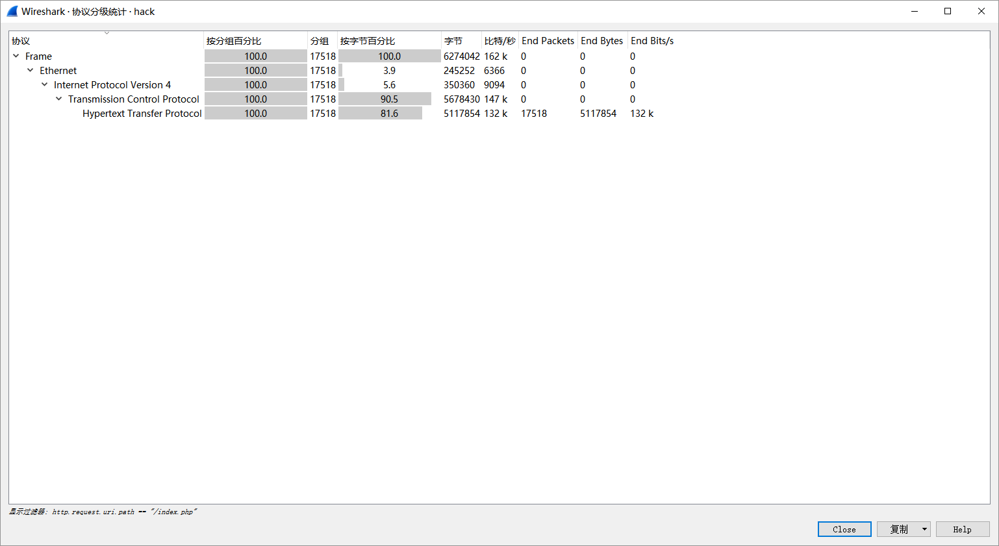

# Wireshark

## Wireshark 常用功能介紹

### 顯示過濾器

顯示過濾器可以用很多不同的參數來作爲匹配標準，比如IP地址、協議、端口號、某些協議頭部的參數。此外，用戶也用一些條件工具和串聯運算符創建出更加複雜的表達式。用戶可以將不同的表達式組合起來，讓軟件顯示的數據包範圍更加精確。在數據包列表面板中顯示的所有數據包都可以用數據包中包含的字段進行過濾。

```
[not] Expression [and|or] [not] Expression
```

經常要用到各種運算符

| 運算符 | 說明      |
| ------ | --------- |
| ==     | 等於      |
| !=     | 不等於    |
| >      | 大於      |
| <      | 小於      |
| >=     | 大於等於  |
| <=     | 小於等於  |
| 與     | and , &&  |
| 或     | or , \|\| |
| 非     | ! , not   |

#### 配置方法

1. 藉助於過濾器窗口

   

2. 藉助於工具條的輸入欄

   

3. 將數據包某個屬性值指定爲過濾條件

   

!!! note
​    複雜的過濾命令可以直接通過第三種方式得到過濾語法

### 信息統計

#### Protocol History(協議分級)

這個窗口實現的是捕捉文件包含的所有協議的樹狀分支



包含的字段

| 名稱          | 含義                                           |
| ------------- | ---------------------------------------------- |
| Protocol：    | 協議名稱                                       |
| % Packets：   | 含有該協議的包數目在捕捉文件所有包所佔的比例   |
| Packets：     | 含有該協議的包的數目                           |
| Bytes：       | 含有該協議的字節數                             |
| Mbit/s：      | 抓包時間內的協議帶寬                           |
| End Packets： | 該協議中的包的數目（作爲文件中的最高協議層）   |
| End Bytes：   | 該協議中的字節數（作爲文件中的最高協議層）     |
| End Mbit/s：  | 抓包時間內的協議帶寬（作爲文件中的最高協議層） |

這一功能可以爲分析數據包的主要方向提供依據

#### Conversation(對話)

發生於一特定端點的IP間的所有流量.


!!! note
​    - 查看收發大量數據流的IP地址。如果是你知道的服務器（你記得服務器的地址或地址範圍），那問題就解決了；但也有可能只是某臺設備正在掃描網絡，或僅是一臺產生過多數據的PC。
​    - 查看掃描模式（scan pattern）。這可能是一次正常的掃描，如SNMP軟件發送ping報文以查找網絡，但通常掃描都不是好事情

#### EndPoints(端點)

這一工具列出了Wireshark發現的所有endpoints上的統計信息


#### HTTP

- Packet Counter

  

**參考**

- http://blog.jobbole.com/73482/
- http://www.vuln.cn/2103

### 信息統計 進階版

根據總體信息迅速把握流量包總體特徵,搞清楚 **做什麼?**

TODO

## 
