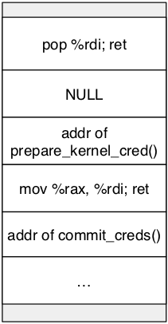

# Change Self

內核會通過進程的 `task_struct` 結構體中的 cred 指針來索引 cred 結構體，然後根據 cred 的內容來判斷一個進程擁有的權限，如果 cred 結構體成員中的 uid-fsgid 都爲 0，那一般就會認爲進程具有 root 權限。

```c
struct cred {
	atomic_t	usage;
#ifdef CONFIG_DEBUG_CREDENTIALS
	atomic_t	subscribers;	/* number of processes subscribed */
	void		*put_addr;
	unsigned	magic;
#define CRED_MAGIC	0x43736564
#define CRED_MAGIC_DEAD	0x44656144
#endif
	kuid_t		uid;		/* real UID of the task */
	kgid_t		gid;		/* real GID of the task */
	kuid_t		suid;		/* saved UID of the task */
	kgid_t		sgid;		/* saved GID of the task */
	kuid_t		euid;		/* effective UID of the task */
	kgid_t		egid;		/* effective GID of the task */
	kuid_t		fsuid;		/* UID for VFS ops */
	kgid_t		fsgid;		/* GID for VFS ops */
  ...
}
```

因此，思路就比較直觀了，我們可以通過以下方式來提權

- 直接修改 cred 結構體的內容
- 修改 task_struct 結構體中的 cred 指針指向一個滿足要求的 cred

無論是哪一種方法，一般都分爲兩步：定位，修改。這就好比把大象放到冰箱裏一樣。

## 直接改 cred

### 定位具體位置

我們可以首先獲取到 cred 的具體地址，然後修改 cred。

#### 定位

定位 cred 的具體地址有很多種方法，這裏根據是否直接定位分爲以下兩種

##### 直接定位

cred 結構體的最前面記錄了各種 id 信息，對於一個普通的進程而言，uid-fsgid 都是執行進程的用戶的身份。因此我們可以通過掃描內存來定位 cred。

```c
struct cred {
	atomic_t	usage;
#ifdef CONFIG_DEBUG_CREDENTIALS
	atomic_t	subscribers;	/* number of processes subscribed */
	void		*put_addr;
	unsigned	magic;
#define CRED_MAGIC	0x43736564
#define CRED_MAGIC_DEAD	0x44656144
#endif
	kuid_t		uid;		/* real UID of the task */
	kgid_t		gid;		/* real GID of the task */
	kuid_t		suid;		/* saved UID of the task */
	kgid_t		sgid;		/* saved GID of the task */
	kuid_t		euid;		/* effective UID of the task */
	kgid_t		egid;		/* effective GID of the task */
	kuid_t		fsuid;		/* UID for VFS ops */
	kgid_t		fsgid;		/* GID for VFS ops */
  ...
}
```

**在實際定位的過程中，我們可能會發現很多滿足要求的 cred，這主要是因爲 cred 結構體可能會被拷貝、釋放。**一個很直觀的想法是在定位的過程中，利用 usage 不爲 0 來篩除掉一些 cred，但仍然會發現一些 usage 爲 0 的 cred。這是因爲 cred 從 usage 爲 0， 到釋放有一定的時間。此外，cred 是使用 rcu 延遲釋放的。

##### 間接定位

###### task_struct

進程的 `task_struct` 結構體中會存放指向 cred 的指針，因此我們可以

1. 定位當前進程  `task_struct` 結構體的地址

2. 根據 cred 指針相對於 task_struct 結構體的偏移計算得出 `cred` 指針存儲的地址

3. 獲取 `cred` 具體的地址

###### comm

comm 用來標記可執行文件的名字，位於進程的 `task_struct` 結構體中。我們可以發現 comm 其實在 cred 的正下方，所以我們也可以先定位 comm ，然後定位 cred 的地址。

```c
	/* Process credentials: */

	/* Tracer's credentials at attach: */
	const struct cred __rcu		*ptracer_cred;

	/* Objective and real subjective task credentials (COW): */
	const struct cred __rcu		*real_cred;

	/* Effective (overridable) subjective task credentials (COW): */
	const struct cred __rcu		*cred;

#ifdef CONFIG_KEYS
	/* Cached requested key. */
	struct key			*cached_requested_key;
#endif

	/*
	 * executable name, excluding path.
	 *
	 * - normally initialized setup_new_exec()
	 * - access it with [gs]et_task_comm()
	 * - lock it with task_lock()
	 */
	char				comm[TASK_COMM_LEN];
```

然而，在進程名字並不特殊的情況下，內核中可能會有多個同樣的字符串，這會影響搜索的正確性與效率。因此，我們可以使用 prctl 設置進程的 comm 爲一個特殊的字符串，然後再開始定位 comm。

#### 修改

在這種方法下，我們可以直接將 cred 中的 uid-fsgid 都修改爲 0。當然修改的方式有很多種，比如說

- 在我們具有任意地址讀寫後，可以直接修改 cred。
- 在我們可以 ROP 執行代碼後，可以利用 ROP gadget 修改 cred。

### 間接定位

雖然我們確實想要修改 cred 的內容，但是不一定非得知道 cred 的具體位置，我們只需要能夠修改 cred 即可。

#### （已過時）UAF 使用同樣堆塊

如果我們在進程初始化時能控制 cred 結構體的位置，並且我們可以在初始化後修改該部分的內容，那麼我們就可以很容易地達到提權的目的。這裏給出一個典型的例子

1. 申請一塊與 cred 結構體大小一樣的堆塊
2. 釋放該堆塊
3. fork 出新進程，恰好使用剛剛釋放的堆塊
4. 此時，修改 cred 結構體特定內存，從而提權

但是**此種方法在較新版本內核中已不再可行，我們已無法直接分配到 cred\_jar 中的 object**，這是因爲 cred\_jar 在創建時設置了 `SLAB_ACCOUNT` 標記，在 `CONFIG_MEMCG_KMEM=y` 時（默認開啓）**cred\_jar 不會再與相同大小的 kmalloc-192 進行合併**

```c
void __init cred_init(void)
{
	/* allocate a slab in which we can store credentials */
	cred_jar = kmem_cache_create("cred_jar", sizeof(struct cred), 0,
			SLAB_HWCACHE_ALIGN|SLAB_PANIC|SLAB_ACCOUNT, NULL);
}
``` 

## 修改 cred 指針

### 定位具體位置

在這種方式下，我們需要知道 cred 指針的具體地址。

#### 定位

##### 直接定位

顯然，cred 指針並沒有什麼非常特殊的地方，所以很難通過直接定位的方式定位到 cred 指針。

##### 間接定位

###### task_struct

進程的 `task_struct` 結構體中會存放指向 cred 的指針，因此我們可以

1. 定位當前進程  `task_struct` 結構體的地址

2. 根據 cred 指針相對於 task_struct 結構體的偏移計算得出 `cred` 指針存儲的地址

###### common

comm 用來標記可執行文件的名字，位於進程的 `task_struct` 結構體中。我們可以發現 comm 其實在 cred 指針的正下方，所以我們也可以先定位 comm ，然後定位 cred 指針的地址。

```c
	/* Process credentials: */

	/* Tracer's credentials at attach: */
	const struct cred __rcu		*ptracer_cred;

	/* Objective and real subjective task credentials (COW): */
	const struct cred __rcu		*real_cred;

	/* Effective (overridable) subjective task credentials (COW): */
	const struct cred __rcu		*cred;

#ifdef CONFIG_KEYS
	/* Cached requested key. */
	struct key			*cached_requested_key;
#endif

	/*
	 * executable name, excluding path.
	 *
	 * - normally initialized setup_new_exec()
	 * - access it with [gs]et_task_comm()
	 * - lock it with task_lock()
	 */
	char				comm[TASK_COMM_LEN];
```

然而，在進程名字並不特殊的情況下，內核中可能會有多個同樣的字符串，這會影響搜索的正確性與效率。因此，我們可以使用 prctl 設置進程的 comm 爲一個特殊的字符串，然後再開始定位 comm。

#### 修改

在具體修改時，我們可以使用如下的兩種方式

- 修改 cred 指針爲內核鏡像中已有的 init_cred 的地址。這種方法適合於我們能夠直接修改 cred 指針以及知道 init_cred 地址的情況。
- 僞造一個 cred，然後修改 cred 指針指向該地址即可。這種方式比較麻煩，一般並不使用。

### 間接定位

#### commit_creds(&init_cred)

`commit_creds()` 函數被用以將一個新的 cred 設爲當前進程 task_struct 的 real_cred 與 cred 字段，因此若是我們能夠劫持內核執行流調用該函數並傳入一個具有 root 權限的 cred，則能直接完成對當前進程的提權工作：

```c
int commit_creds(struct cred *new)
{
	struct task_struct *task = current;//內核宏，用以從 percpu 段獲取當前進程的 PCB
	const struct cred *old = task->real_cred;

	//...
	rcu_assign_pointer(task->real_cred, new);
	rcu_assign_pointer(task->cred, new);
```

在內核初始化過程當中會以 root 權限啓動 `init` 進程，其 cred 結構體爲**靜態定義**的 `init_cred`，由此不難想到的是我們可以通過 `commit_creds(&init_cred)` 來完成提權的工作

```c
/*
 * The initial credentials for the initial task
 */
struct cred init_cred = {
	.usage			= ATOMIC_INIT(4),
#ifdef CONFIG_DEBUG_CREDENTIALS
	.subscribers		= ATOMIC_INIT(2),
	.magic			= CRED_MAGIC,
#endif
	.uid			= GLOBAL_ROOT_UID,
	.gid			= GLOBAL_ROOT_GID,
	.suid			= GLOBAL_ROOT_UID,
	.sgid			= GLOBAL_ROOT_GID,
	.euid			= GLOBAL_ROOT_UID,
	.egid			= GLOBAL_ROOT_GID,
	.fsuid			= GLOBAL_ROOT_UID,
	.fsgid			= GLOBAL_ROOT_GID,
	.securebits		= SECUREBITS_DEFAULT,
	.cap_inheritable	= CAP_EMPTY_SET,
	.cap_permitted		= CAP_FULL_SET,
	.cap_effective		= CAP_FULL_SET,
	.cap_bset		= CAP_FULL_SET,
	.user			= INIT_USER,
	.user_ns		= &init_user_ns,
	.group_info		= &init_groups,
	.ucounts		= &init_ucounts,
};
```

#### （已過時） commit_creds(prepare_kernel_cred(0))

在內核當中提供了 `prepare_kernel_cred()` 函數用以拷貝指定進程的 cred 結構體，當我們傳入的參數爲 NULL 時，該函數會拷貝 `init_cred` 並返回一個有着 root 權限的 cred：

```c
struct cred *prepare_kernel_cred(struct task_struct *daemon)
{
	const struct cred *old;
	struct cred *new;

	new = kmem_cache_alloc(cred_jar, GFP_KERNEL);
	if (!new)
		return NULL;

	kdebug("prepare_kernel_cred() alloc %p", new);

	if (daemon)
		old = get_task_cred(daemon);
	else
		old = get_cred(&init_cred);
```

我們不難想到的是若是我們可以在內核空間中調用 `commit_creds(prepare_kernel_cred(NULL))`，則也能直接完成提權的工作



不過自從內核版本 6.2 起，`prepare_kernel_cred(NULL)` 將**不再拷貝 init\_cred，而是將其視爲一個運行時錯誤並返回 NULL**，這使得這種提權方法無法再應用於 6.2 及更高版本的內核：

```c
struct cred *prepare_kernel_cred(struct task_struct *daemon)
{
	const struct cred *old;
	struct cred *new;

	if (WARN_ON_ONCE(!daemon))
		return NULL;

	new = kmem_cache_alloc(cred_jar, GFP_KERNEL);
	if (!new)
		return NULL;
```
