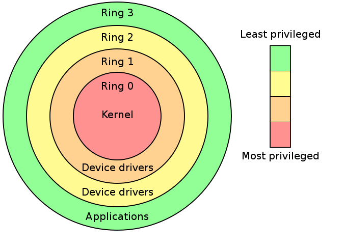
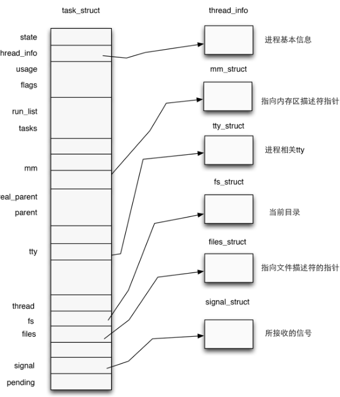
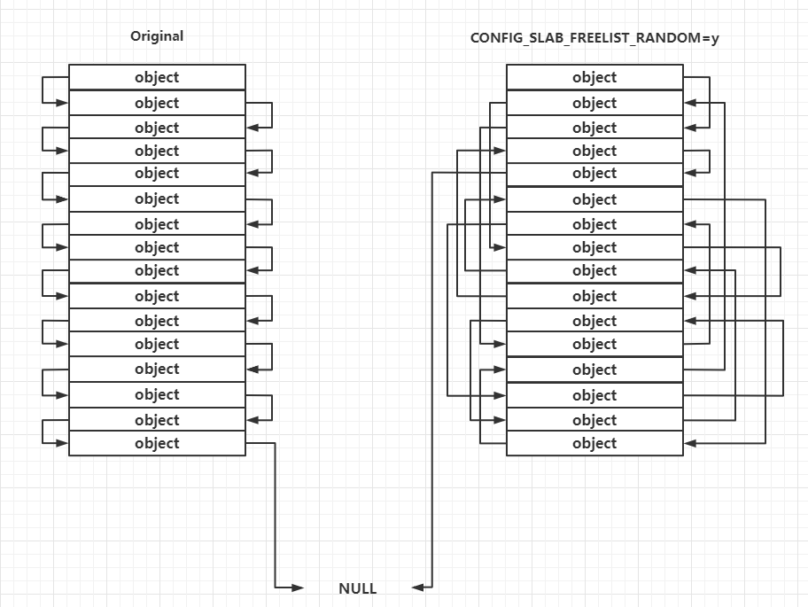

# 基礎知識

本節我們介紹 Linux kernel pwn 所需要的基礎知識，你可以看作簡易的《操作系統導論》課程。

## Operating System Kernel

操作系統內核（Operation System Kernel）本質上也是一種軟件，可以看作是普通應用程式與硬件之間的一層中間層，其主要作用便是調度系統資源、控制IO設備、操作網絡與文件系統等，併爲上層應用提供便捷、抽象的應用接口。


操作系統內核實際上是我們抽象出來的一個概念，本質上與用戶進程一般無二，都是位於物理內存中的代碼+數據，不同之處在於當CPU執行操作系統內核代碼時通常運行在高權限，擁有着完全的硬件訪問能力，而 CPU在執行用戶態代碼時通常運行在低權限環境，只擁有部分/缺失硬件訪問能力。

這兩種不同權限的運行狀態實際上是通過硬件來實現的，因此這裏我們開始引入新的一個概念——**分級保護環**。

## hierarchical protection domains

**分級保護域**（hierarchical protection domains）又被稱作保護環，簡稱 Rings ，是一種將計算機不同的資源劃分至不同權限的模型。

在一些硬件或者微代碼級別上提供不同特權態模式的 CPU 架構上，保護環通常都是硬件強制的。Rings是從最高特權級（通常被叫作0級）到最低特權級（通常對應最大的數字）排列的

Intel的CPU將權限分爲四個等級：Ring0、Ring1、Ring2、Ring3，權限等級依次降低，現代操作系統模型中我們通常只會使用 ring0 和 ring3，對應操作系統內核與用戶進程，即 CPU 在執行用戶進程代碼時處在 ring3 下。



現在我們給【用戶態】與【內核態】這兩個概念下定義：

- 用戶態：CPU 運行在 ring3 + 用戶進程運行環境上下文。
- 內核態：CPU 運行在 ring0 + 內核代碼運行環境上下文。

## 狀態切換

CPU 在不同的特權級間進行切換主要有兩個途徑：

- 中斷與異常（interrupt & exception）：當 CPU 收到一箇中斷/異常時，會切換到 ring0，並根據中斷描述符表索引對應的中斷處理代碼以執行。
- 特權級相關指令：當 CPU 運行這些指令時會發生運行狀態的改變，例如 iret 指令（ring0->ring3）或是 sysenter 指令（ring3->ring0）。

基於這些特權級切換的方式，現代操作系統的開發者包裝出了系統調用（syscall），作爲由”用戶態“切換到”內核態“的入口，從而執行內核代碼來完成用戶進程所需的一些功能。當用戶進程想要請求更高權限的服務時，便需要通過由系統提供的應用接口，使用系統調用以陷入內核態，再由操作系統完成請求。

### user space to kernel space

當發生 `系統調用`，`產生異常`，`外設產生中斷` 等事件時，會發生用戶態到內核態的切換，具體的過程爲：

1. 通過 `swapgs` 切換 GS 段寄存器，將 GS 寄存器值和一個特定位置的值進行交換，目的是保存 GS 值，同時將該位置的值作爲內核執行時的 GS 值使用。
2. 將當前棧頂（用戶空間棧頂）記錄在 CPU 獨佔變量區域裏，將 CPU 獨佔區域裏記錄的內核棧頂放入 rsp/esp。
3. 通過 push 保存各寄存器值，具體的 [代碼](http://elixir.free-electrons.com/linux/v4.12/source/arch/x86/entry/entry_64.S) 如下:

	```asm
	 ENTRY(entry_SYSCALL_64)
	 /* SWAPGS_UNSAFE_STACK是一個宏，x86直接定義爲swapgs指令 */
	 SWAPGS_UNSAFE_STACK
	
	 /* 保存棧值，並設置內核棧 */
	 movq %rsp, PER_CPU_VAR(rsp_scratch)
	 movq PER_CPU_VAR(cpu_current_top_of_stack), %rsp
	
	
	/* 通過push保存寄存器值，形成一個pt_regs結構 */
	/* Construct struct pt_regs on stack */
	pushq  $__USER_DS      /* pt_regs->ss */
	pushq  PER_CPU_VAR(rsp_scratch)  /* pt_regs->sp */
	pushq  %r11             /* pt_regs->flags */
	pushq  $__USER_CS      /* pt_regs->cs */
	pushq  %rcx             /* pt_regs->ip */
	pushq  %rax             /* pt_regs->orig_ax */
	pushq  %rdi             /* pt_regs->di */
	pushq  %rsi             /* pt_regs->si */
	pushq  %rdx             /* pt_regs->dx */
	pushq  %rcx tuichu    /* pt_regs->cx */
	pushq  $-ENOSYS        /* pt_regs->ax */
	pushq  %r8              /* pt_regs->r8 */
	pushq  %r9              /* pt_regs->r9 */
	pushq  %r10             /* pt_regs->r10 */
	pushq  %r11             /* pt_regs->r11 */
	sub $(6*8), %rsp      /* pt_regs->bp, bx, r12-15 not saved */
	```

4. 通過彙編指令判斷是否爲 `x32_abi`。
5. 通過系統調用號，跳到全局變量 `sys_call_table` 相應位置繼續執行系統調用。

### kernel space to user space

退出時，流程如下：

1. 通過 `swapgs` 恢復 GS 值。
2. 通過 `sysretq` 或者 `iretq` 恢復到用戶控件繼續執行。如果使用 `iretq` 還需要給出用戶空間的一些信息（CS, eflags/rflags, esp/rsp 等）。

## 虛擬內存空間

在現代操作系統中，計算機的虛擬內存地址空間通常被分爲兩塊——供用戶進程使用的用戶空間（user space）與供操作系統內核使用的內核空間（kernel space），對於 Linux 而言，通常位於較高虛擬地址的虛擬內存空間被分配給內核使用，而位於較低虛擬地址的虛擬內存空間責備分配給用戶進程使用。

32 位下的虛擬內存空間佈局如下：


64 位下的虛擬內存空間佈局如下：


## 進程權限管理

內核 kernel 調度着一切的系統資源，併爲用戶應用程式提供運行環境，相應地，應用程式的權限也都是由 kernel 進行管理的。

### 進程描述符（process descriptor）

在內核中使用結構體 `task_struct` 表示一個進程，該結構體定義於內核源碼 `include/linux/sched.h` 中，代碼比較長就不在這裏貼出了。

一個進程描述符的結構應當如下圖所示：



### 進程權限憑證（credential）

注意到 `task_struct` 的源碼中有如下代碼：

```c
/* Process credentials: */

/* Tracer's credentials at attach: */
const struct cred __rcu        *ptracer_cred;

/* Objective and real subjective task credentials (COW): */
const struct cred __rcu        *real_cred;

/* Effective (overridable) subjective task credentials (COW): */
const struct cred __rcu        *cred;
```

結構體 `cred` 用以管理一個進程的權限，該結構體定義於內核源碼 `include/linux/cred.h` 中，如下：

```c
/*
 * The security context of a task
 *
 * The parts of the context break down into two categories:
 *
 *  (1) The objective context of a task.  These parts are used when some other
 *	task is attempting to affect this one.
 *
 *  (2) The subjective context.  These details are used when the task is acting
 *	upon another object, be that a file, a task, a key or whatever.
 *
 * Note that some members of this structure belong to both categories - the
 * LSM security pointer for instance.
 *
 * A task has two security pointers.  task->real_cred points to the objective
 * context that defines that task's actual details.  The objective part of this
 * context is used whenever that task is acted upon.
 *
 * task->cred points to the subjective context that defines the details of how
 * that task is going to act upon another object.  This may be overridden
 * temporarily to point to another security context, but normally points to the
 * same context as task->real_cred.
 */
struct cred {
	atomic_long_t	usage;
	kuid_t		uid;		/* real UID of the task */
	kgid_t		gid;		/* real GID of the task */
	kuid_t		suid;		/* saved UID of the task */
	kgid_t		sgid;		/* saved GID of the task */
	kuid_t		euid;		/* effective UID of the task */
	kgid_t		egid;		/* effective GID of the task */
	kuid_t		fsuid;		/* UID for VFS ops */
	kgid_t		fsgid;		/* GID for VFS ops */
	unsigned	securebits;	/* SUID-less security management */
	kernel_cap_t	cap_inheritable; /* caps our children can inherit */
	kernel_cap_t	cap_permitted;	/* caps we're permitted */
	kernel_cap_t	cap_effective;	/* caps we can actually use */
	kernel_cap_t	cap_bset;	/* capability bounding set */
	kernel_cap_t	cap_ambient;	/* Ambient capability set */
#ifdef CONFIG_KEYS
	unsigned char	jit_keyring;	/* default keyring to attach requested
					 * keys to */
	struct key	*session_keyring; /* keyring inherited over fork */
	struct key	*process_keyring; /* keyring private to this process */
	struct key	*thread_keyring; /* keyring private to this thread */
	struct key	*request_key_auth; /* assumed request_key authority */
#endif
#ifdef CONFIG_SECURITY
	void		*security;	/* LSM security */
#endif
	struct user_struct *user;	/* real user ID subscription */
	struct user_namespace *user_ns; /* user_ns the caps and keyrings are relative to. */
	struct ucounts *ucounts;
	struct group_info *group_info;	/* supplementary groups for euid/fsgid */
	/* RCU deletion */
	union {
		int non_rcu;			/* Can we skip RCU deletion? */
		struct rcu_head	rcu;		/* RCU deletion hook */
	};
} __randomize_layout;
```

一個cred結構體中記載了一個進程四種不同的用戶ID，在通常情況下這幾個ID應當都是相同的：

- 真實用戶ID（real UID）：標識一個進程啓動時的用戶ID
- 保存用戶ID（saved UID）：標識一個進程最初的有效用戶ID
- 有效用戶ID（effective UID）：標識一個進程正在運行時所屬的用戶ID，一個進程在運行途中是可以改變自己所屬用戶的，因而權限機制也是通過有效用戶ID進行認證的，內核通過 euid 來進行特權判斷；爲了防止用戶一直使用高權限，當任務完成之後，euid 會與 suid 進行交換，恢復進程的有效權限
- 文件系統用戶ID（UID for VFS ops）：標識一個進程創建文件時進行標識的用戶ID

用戶組ID同樣分爲四個：真實組ID、保存組ID、有效組ID、文件系統組ID，與用戶ID是類似的，這裏便不再贅敘。

### 進程權限改變

前面我們講到，一個進程的權限是由位於內核空間的 `cred` 結構體進行管理的，那麼我們不難想到：只要改變一個進程的 `cred` 結構體，就能改變其執行權限。

在內核空間有如下兩個函數，都位於 `kernel/cred.c` 中：

- `struct cred* prepare_kernel_cred(struct task_struct* daemon)`：該函數用以拷貝一個進程的cred結構體，並返回一個新的cred結構體，需要注意的是daemon參數應爲有效的進程描述符地址。
- `int commit_creds(struct cred *new)`：該函數用以將一個新的cred結構體應用到進程。

## Loadable Kernel Modules(LKMs)

Linux Kernle採用的是宏內核架構，一切的系統服務都需要由內核來提供，雖然效率較高，但是缺乏可擴展性與可維護性，同時內核需要裝載很多可能用到的服務，但這些服務最終可能未必會用到，還會佔據大量內存空間，同時新服務的提供往往意味着要重新編譯整個內核。

綜合以上考慮，**可裝載內核模塊**（Loadable Kernel Modules，簡稱LKMs）出現了，位於內核空間的LKMs可以提供新的系統調用或其他服務，同時LKMs可以像積木一樣被裝載入內核/從內核中卸載，大大提高了kernel的可拓展性與可維護性。

常見的 LKMs 包括：

- 驅動程序（Device drivers）
	- 設備驅動
	- 文件系統驅動
	- ...
- 內核擴展模塊 (modules)

LKMs 的文件格式和用戶態的可執行程序相同，Linux 下爲 ELF，Windows 下爲 exe/dll，mac 下爲 MACH-O，因此我們可以用 IDA 等工具來分析內核模塊。

模塊可以被單獨編譯，但不能單獨運行。它在運行時被鏈接到內核作爲內核的一部分在內核空間運行，這與運行在用戶控件的進程不同。

模塊通常用來實現一種文件系統、一個驅動程序或者其他內核上層的功能。

> Linux 內核之所以提供模塊機制，是因爲它本身是一個單內核 (monolithic kernel)。單內核的優點是效率高，因爲所有的內容都集合在一起，但缺點是可擴展性和可維護性相對較差，模塊機制就是爲了彌補這一缺陷。

### 相關指令
- **insmod**: 講指定模塊加載到內核中
- **rmmod**: 從內核中卸載指定模塊
- **lsmod**: 列出已經加載的模塊
- **modprobe**: 添加或刪除模塊，modprobe 在加載模塊時會查找依賴關係

> 大多數　CTF 中的 kernel vulnerability 也出現在 LKM 中。

## 內核交互

### 系統調用簡介

系統調用，指的是用戶空間的程序向操作系統內核請求需要更高權限的服務，比如 IO 操作或者進程間通信。系統調用提供用戶程序與操作系統間的接口，部分庫函數（如 scanf，puts 等 IO 相關的函數實際上是對系統調用的封裝（read 和 write））。

> 在 */usr/include/x86_64-linux-gnu/asm/unistd_64.h* 和 */usr/include/x86_64-linux-gnu/asm/unistd_32.h* 分別可以查看 64 位和 32 位的系統調用號。

> 同時推薦一個很好用的網站 [Linux Syscall Reference](https://syscalls.kernelgrok.com)，可以查閱 32 位系統調用對應的寄存器含義以及源碼。64位系統調用可以查看 [Linux Syscall64 Reference](https://syscalls64.paolostivanin.com/)

### 系統調用：ioctl

在 `*NIX` 中一切都可以被視爲文件，因而一切都可以以訪問文件的方式進行操作，爲了方便，Linux 定義了系統調用 `ioctl` 供進程與設備之間進行通信。

`ioctl` 是一個專用於設備輸入輸出操作的一個系統調用，其調用方式如下：

```c
int ioctl(int fd, unsigned long request, ...)
```

其第一個參數爲打開設備 (open) 返回的 [文件描述符](http://m4x.fun/post/play-with-file-descriptor-1/)，第二個參數爲用戶程序對設備的控制命令，再後邊的參數則是一些補充參數，與設備有關。

對於一個提供了ioctl通信方式的設備而言，我們可以通過其文件描述符、使用不同的請求碼及其他請求參數通過ioctl系統調用完成不同的對設備的I/O操作。

> 使用 ioctl 進行通信的原因：
>
> 操作系統提供了內核訪問標準外部設備的系統調用，因爲大多數硬件設備只能夠在內核空間內直接尋址,但是當訪問非標準硬件設備這些系統調用顯得不合適,有時候用戶模式可能需要直接訪問設備。
>
> 比如，一個系統管理員可能要修改網卡的配置。現代操作系統提供了各種各樣設備的支持，有一些設備可能沒有被內核設計者考慮到，如此一來提供一個這樣的系統調用來使用設備就變得不可能了。 
>
> 爲了解決這個問題，內核被設計成可擴展的，可以加入一個稱爲設備驅動的模塊，驅動的代碼允許在內核空間運行而且可以對設備直接尋址。一個Ioctl接口是一個獨立的系統調用，通過它用戶空間可以跟設備驅動溝通。對設備驅動的請求是一個以設備和請求號碼爲參數的Ioctl調用，如此內核就允許用戶空間訪問設備驅動進而訪問設備而不需要了解具體的設備細節，同時也不需要一大堆針對不同設備的系統調用。

## 常見內核態函數
相比用戶態庫函數，內核態的函數有了一些變化

- printf()		->		**printk()**，但需要注意的是 printk() 不一定會把內容顯示到終端上，但一定在內核緩衝區裏，可以通過 `dmesg` 查看效果
- memcpy()		->		**copy\_from\_user()/copy\_to\_user()**
	- copy\_from\_user() 實現了將用戶空間的數據傳送到內核空間
	- copy\_to\_user() 實現了將內核空間的數據傳送到用戶空間
- malloc()		->		**kmalloc()**，內核態的內存分配函數，和 malloc() 相似，但使用的是 `slab/slub 分配器`
- free()		->		**kfree()**，同 kmalloc()

另外要注意的是，`kernel 管理進程，因此 kernel 也記錄了進程的權限`。kernel 中有兩個可以方便的改變權限的函數：

- **int commit_creds(struct cred *new)**
- **struct cred\* prepare_kernel_cred(struct task_struct\* daemon)**

從函數名也可以看出，執行 `commit_creds(prepare_kernel_cred(&init_cred))` 即可獲得 root 權限，即拷貝 init 進程的 cred 作爲當前進程的新的 credentials。

> 更多關於 `prepare_kernel_cred` 的信息可以參考 [源碼](https://elixir.bootlin.com/linux/v4.6/source/kernel/cred.c#L594)

執行 `commit_creds(prepare_kernel_cred(0))` 也是最常用的提權手段，兩個函數的地址都可以在 `/proc/kallsyms` 中查看（較老的內核版本中是 `/proc/ksyms`）。
```bash
post sudo grep commit_creds /proc/kallsyms 
[sudo] m4x 的密碼：
ffffffffbb6af9e0 T commit_creds
ffffffffbc7cb3d0 r __ksymtab_commit_creds
ffffffffbc7f06fe r __kstrtab_commit_creds
post sudo grep prepare_kernel_cred /proc/kallsyms
ffffffffbb6afd90 T prepare_kernel_cred
ffffffffbc7d4f20 r __ksymtab_prepare_kernel_cred
ffffffffbc7f06b7 r __kstrtab_prepare_kernel_cred
```

> 一般情況下，/proc/kallsyms 的內容需要 root 權限才能查看。

## Mitigation

與一般的程序相同，Linux Kernel同樣有着各種各樣的保護機制。

> canary, dep, PIE, RELRO 等保護與用戶態原理和作用相同。

### 通用保護機制

#### KASLR

KASLR即```內核空間地址隨機化```（kernel address space layout randomize），與用戶態程序的ASLR相類似——在內核鏡像映射到實際的地址空間時加上一個偏移值，但是內核內部的相對偏移其實還是不變的。

在未開啓KASLR保護機制時，內核代碼段的基址爲 ```0xffffffff81000000``` ，direct mapping area 的基址爲 `0xffff888000000000`。

內核內存佈局可以參考[這裏](https://elixir.bootlin.com/linux/latest/source/Documentation/x86/x86_64/mm.rst)。

#### _*FGKASLR_

KASLR 雖然在一定程度上能夠緩解攻擊，但是若是攻擊者通過一些信息泄露漏洞獲取到內核中的某個地址，仍能夠直接得知內核加載地址偏移從而得知整個內核地址佈局，因此有研究者基於 KASLR 實現了 FGKASLR，**以函數粒度重新排布內核代碼**。

#### STACK PROTECTOR

類似於用戶態程序的 canary，通常又被稱作是 stack cookie，用以檢測**是否發生內核堆棧溢出**，若是發生內核堆棧溢出則會產生 kernel panic。

內核中的 canary 的值通常取自 gs 段寄存器某個固定偏移處的值。

#### SMAP/SMEP

SMAP即```管理模式訪問保護```（Supervisor Mode Access Prevention），SMEP即```管理模式執行保護```（Supervisor Mode Execution Prevention），這兩種保護通常是同時開啓的，用以阻止**內核空間直接訪問/執行用戶空間的數據**，完全地將內核空間與用戶空間相分隔開，用以防範ret2usr（return-to-user，將內核空間的指令指針重定向至用戶空間上構造好的提權代碼）攻擊。

SMEP保護的繞過有以下兩種方式：

- 利用內核線性映射區對物理地址空間的完整映射，找到用戶空間對應頁框的內核空間地址，利用該內核地址完成對用戶空間的訪問（即一個內核空間地址與一個用戶空間地址映射到了同一個頁框上），這種攻擊手法稱爲 ret2dir 。
- Intel下系統根據CR4控制寄存器的第20位標識是否開啓SMEP保護（1爲開啓，0爲關閉），若是能夠通過kernel ROP改變CR4寄存器的值便能夠關閉SMEP保護，完成SMEP-bypass，接下來就能夠重新進行 ret2usr，**但對於開啓了 KPTI 的內核而言，內核頁表的用戶地址空間無執行權限，這使得 ret2usr 徹底成爲過去式** 。

>  在 ARM 下有一種類似的保護叫 `PXN`。

#### [KPTI](https://www.kernel.org/doc/html/latest/x86/pti.html)

KPTI即 `內核頁表隔離`（Kernel page-table isolation），內核空間與用戶空間分別使用兩組不同的頁表集，這對於內核的內存管理產生了根本性的變化。

需要進行說明的是，**在這兩張頁表上都有着對用戶內存空間的完整映射，但在用戶頁表中只映射了少量的內核代碼（例如系統調用入口點、中斷處理等），而只有在內核頁表中才有着對內核內存空間的完整映射，但兩張頁表都有着對用戶內存空間的完整映射**，如下圖所示，左側是未開啓 KPTI 後的頁表佈局，右側是開啓了 KPTI 後的頁表佈局。


KPTI 的發明主要是用來修復一個史詩級別的 CPU 硬件漏洞：Meltdown。簡單理解就是利用 CPU 流水線設計中（亂序執行與預測執行）的漏洞來獲取到用戶態無法訪問的內核空間的數據，屬於側信道攻擊的一種。

**KPTI 同時還令內核頁表中屬於用戶地址空間的部分不再擁有執行權限，這使得 ret2usr 徹底成爲過去式**。

### 內核“堆”上保護機制

#### Hardened Usercopy

hardened usercopy 是用以在用戶空間與內核空間之間拷貝數據時進行越界檢查的一種防護機制，**主要檢查拷貝過程中對內核空間中數據的讀寫是否會越界**：

- 讀取的數據長度是否超出源 object 範圍。
- 寫入的數據長度是否超出目的 object 範圍。

這一保護被用於 `copy_to_user()` 與 `copy_from_user()` 等數據交換 API 中，不過這種保護 _不適用於內核空間內的數據拷貝_ ，這也是目前主流的繞過手段。

#### Hardened freelist

類似於 glibc 2.32 版本引入的保護，在開啓這種保護之前，slub 中的 free object 的 next 指針直接存放着 next free object 的地址，攻擊者可以通過讀取 freelist 泄露出內核線性映射區的地址，在開啓了該保護之後 free object 的 next 指針存放的是由以下三個值進行異或操作後的值：

- 當前 free object 的地址。
- 下一個 free object 的地址。
- 由 kmem\_cache 指定的一個 random 值。

攻擊者至少需要獲取到第一與第三個值才能篡改 freelist，這無疑爲對 freelist 的直接利用增添不少難度。

> 在更新版本的 Linux kernel 中似乎還引入了一個偏移值，筆者尚未進行考證。

#### Random freelist

這種保護主要發生在 slub allocator 向 buddy system 申請到頁框之後的處理過程中，對於未開啓這種保護的一張完整的 slub，其上的 object 的連接順序是線性連續的，但在開啓了這種保護之後其上的 object 之間的連接順序是隨機的，這讓攻擊者無法直接預測下一個分配的 object 的地址。

需要注意的是這種保護髮生在**slub allocator 剛從 buddy system 拿到新 slub 的時候，運行時 freelist 的構成仍遵循 LIFO**。



#### CONFIG\_INIT\_ON\_ALLOC\_DEFAULT\_ON

當編譯內核時開啓了這個選項時，在內核進行“堆內存”分配時（包括 buddy system 和 slab allocator），**會將被分配的內存上的內容進行清零**，從而防止了利用未初始化內存進行數據泄露的情況。

> 據悉性能損耗在 `1%~7%` 之間。

## CTF kernel pwn 相關

傳統的 kernel pwn 題目通常會給以下三個文件：

1. boot.sh: 一個用於啓動 kernel 的 shell 的腳本，多用 qemu，保護措施與 qemu 不同的啓動參數有關
2. bzImage: kernel binary
3. rootfs.cpio: 文件系統映像

這裏我們以 CISCN2017 - babydriver 爲例：
	
	```bash
	CISCN2017_babydriver [master●] ls
	babydriver.tar
	CISCN2017_babydriver [master●] x babydriver.tar
	boot.sh
	bzImage
	rootfs.cpio
	CISCN2017_babydriver [master●] ls
	babydriver.tar  boot.sh  bzImage  rootfs.cpio
	CISCN2017_babydriver [master●] file bzImage
	bzImage: Linux kernel x86 boot executable bzImage, version 4.4.72 (atum@ubuntu) #1 SMP Thu Jun 15 19:52:50 PDT 2017, RO-rootFS, swap_dev 0x6, Normal VGA
	CISCN2017_babydriver [master●] file rootfs.cpio
	rootfs.cpio: gzip compressed data, last modified: Tue Jul  4 08:39:15 2017, max compression, from Unix, original size 2844672
	CISCN2017_babydriver [master●] file boot.sh
	boot.sh: Bourne-Again shell script, ASCII text executable
	CISCN2017_babydriver [master●] bat boot.sh 
	───────┬─────────────────────────────────────────────────────────────────────────────────
	       │ File: boot.sh
	───────┼─────────────────────────────────────────────────────────────────────────────────
	   1   │ #!/bin/bash
	   2   │ 
	   3   │ qemu-system-x86_64 -initrd rootfs.cpio -kernel bzImage -append 'console=ttyS0 ro
	       │ ot=/dev/ram oops=panic panic=1' -enable-kvm -monitor /dev/null -m 64M --nographi
	       │ c  -smp cores=1,threads=1 -cpu kvm64,+smep
	───────┴─────────────────────────────────────────────────────────────────────────────────
	```

其中主要的 qemu 參數含義如下：
	
- -initrd rootfs.cpio，使用 rootfs.cpio 作爲內核啓動的文件系統
- -kernel bzImage，使用 bzImage 作爲 kernel 映像
- -cpu kvm64,+smep，設置 CPU 的安全選項，這裏開啓了 smep
- -m 64M，設置虛擬 RAM 爲 64M，默認爲 128M

其他的 qemu 參數可以通過 --help 查看。

### 在遠程題目環境中進行利用

通常情況下我們需要將在本地編寫好的 exploit 程序進行靜態編譯並傳輸到遠程，比較通用的辦法便是將 exploit 進行 base64 編碼後傳輸，可參考如下腳本：

```python
from pwn import *
import base64
#context.log_level = "debug"

with open("./exp", "rb") as f:
    exp = base64.b64encode(f.read())

p = remote("127.0.0.1", 11451)
#p = process('./run.sh')
p.sendline()
p.recvuntil("/ $")

count = 0
for i in range(0, len(exp), 0x200):
    p.sendline("echo -n \"" + exp[i:i + 0x200].decode() + "\" >> /tmp/b64_exp")
    count += 1
    log.info("count: " + str(count))

for i in range(count):
    p.recvuntil("/ $")
    
p.sendline("cat /tmp/b64_exp | base64 -d > /tmp/exploit")
p.sendline("chmod +x /tmp/exploit")
p.sendline("/tmp/exploit ")

p.interactive()
```
相比起常規的 pwn 題，kernel pwn 打遠程會是一個比較漫長的過程，因爲大部分的時間都會花在這個文件傳輸上。我們可以使用 musl-C、uclibc 等庫來大幅降低可執行文件的大小，對於時間比較充足的題目也可以使用純彙編來編寫 exp。

## Reference

[【OS.0x00】Linux Kernel I：Basic Knowledge](https://arttnba3.cn/2021/02/21/OS-0X00-LINUX-KERNEL-PART-I/)

[【PWN.0x00】Linux Kernel Pwn I：Basic Exploit to Kernel Pwn in CTF](https://arttnba3.cn/2021/03/03/PWN-0X00-LINUX-KERNEL-PWN-PART-I/)

[Linux kernel heap feng shui in 2022](https://duasynt.com/blog/linux-kernel-heap-feng-shui-2022)

https://zh.wikipedia.org/wiki/內核

https://zh.wikipedia.org/wiki/分級保護域

https://zh.wikipedia.org/wiki/Ioctl

http://www.freebuf.com/articles/system/54263.html

https://blog.csdn.net/zqixiao_09/article/details/50839042

https://yq.aliyun.com/articles/53679

