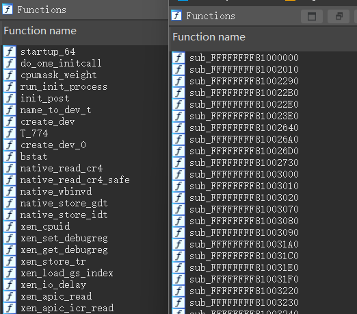

# System.map

`System.map` 文件是Linux內核編譯過程中生成的一個重要文件。它包含了內核符號和它們對應的內存地址。這些符號包括內核函數、變量以及其他在內核中定義的重要符號。當我們獲得的vmlinux是stripped時就需要System.map來幫助我們調試。
`System.map` 文件是一個純文本文件，每一行包含三個字段：

符號地址（內存地址）
符號類型（例如：函數、變量）如果爲小寫，則符號爲本地符號;如果大寫，符號爲全局（外部）。
符號名（標識符）
```
└─$ head System.map                 
0000000000000000 A VDSO32_PRELINK
0000000000000000 D __per_cpu_start
0000000000000000 D per_cpu__irq_stack_union
0000000000000000 A xen_irq_disable_direct_reloc
0000000000000000 A xen_save_fl_direct_reloc
0000000000000040 A VDSO32_vsyscall_eh_frame_size
00000000000001e7 A kexec_control_code_size
00000000000001f0 A VDSO32_NOTE_MASK
0000000000000400 A VDSO32_sigreturn
0000000000000410 A VDSO32_rt_sigreturn
```

## 在ida中爲stripped的vmlinux添加System.map

加載以下腳本，然後選擇對應的System.map文件
```
import idaapi

def load_system_map(file_path):
    with open(file_path, "r") as f:
        for line in f:
            parts = line.split()
            if len(parts) < 3:
                continue
            
            addr = int(parts[0], 16)
            symbol_type = parts[1]
            symbol_name = parts[2]
            
            # if symbol_type in ['T', 't', 'D', 'd', 'B', 'b']:     #如果符號表太大，可以針對性添加
            if not idaapi.add_entry(addr, addr, symbol_name, 0):
                print(f"Failed to add symbol: {symbol_name} at {hex(addr)}")
            else:
                print(f"Added symbol: {symbol_name} at {hex(addr)}")

system_map_path = idaapi.ask_file(0, "*.map", "Select System.map file")
if system_map_path:
    load_system_map(system_map_path)
else:
    print("No file selected")

```

加載前後對比



## 直接修復vmlinux

如果你想直接修復vmlinux，可以參考https://github.com/marin-m/vmlinux-to-elf

## 參考
https://linux.die.net/man/1/nm