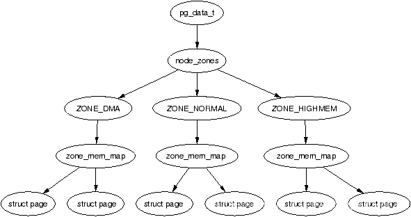
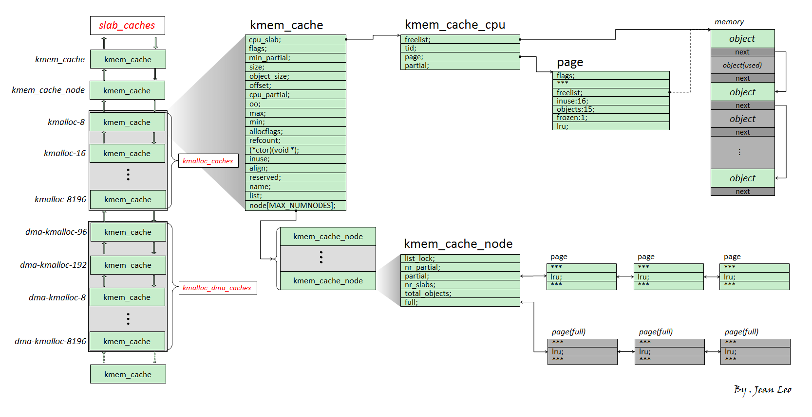

# 內核堆概述

類似於用戶態進程中的堆（heap），內核也有着自己的一套動態內存管理機制，爲了方便這裏我們同樣將內核中動態分配的內存稱爲“堆”。

Linux kernel 將內存分爲 `頁→區→節點` 三級結構，主要有兩個內存管理器—— `buddy system` 與 `slab allocator`，前者負責以內存頁爲粒度管理所有可用的物理內存，後者則向前者請求內存頁並劃分爲多個較小的對象（object）以進行細粒度的內存管理。

## 頁→區→節點三級結構

這是一張十分經典的  _Overview_ ，自頂向下是

- **節點**（node，對應結構體 pgdata\_list）
- **區**（zone，對應結構體 zone，圖上展示了三種類型的 zone）
- **頁**（page，對應結構體 page）



### 頁（page）

Linux kernel 中使用 `page` 結構體來表示一個物理頁框，**每個物理頁框都有着一個對應的 page 結構體**：


### 區（zone）

在 Linux 下將一個節點內不同用途的內存區域劃分爲不同的 `區（zone）`，對應結構體 `struct zone`：


### 節點（node）

zone 再向上一層便是**節點**——Linux 將_內存控制器（memory controller）_作爲節點劃分的依據，對於 UMA 架構而言只有一個節點，而對於 NUMA 架構而言通常有多個節點，對於同一個內存控制器下的 CPU 而言其對應的節點稱之爲_本地內存_，不同處理器之間通過總線進行進一步的連接。如下圖所示，一個 MC 對應一個節點：


## buddy system

buddy system 是 Linux kernel 中的一個較爲底層的內存管理系統，**以內存頁爲粒度管理者所有的物理內存**，其存在於 **區** 這一級別，對當前區所對應擁有的所有物理頁框進行管理.

在每個 zone 結構體中都有一個 free\_area 結構體數組，用以存儲 buddy system **按照 order 管理的頁面**:

```c
struct zone {
    //...
    struct free_area	free_area[MAX_ORDER];
    //...
```

其中的 `MAX_ORDER` 爲一個常量，值爲 11.

在 buddy system 中按照空閒頁面的連續大小進行分階管理，這裏的 order 的實際含義爲**連續的空閒頁面的大小**，不過單位不是頁面數，而是`階`，即對於每個下標而言，其中所存儲的頁面大小爲：

$$
2^{order}
$$

在 free\_area 中存放的頁面通過自身的相應字段連接成雙向鏈表結構，由此我們得到這樣一張 _Overview_ ：


  - 分配：
    - 首先會將請求的內存大小向 2 的冪次方張內存頁大小對齊，之後從對應的下標取出連續內存頁。
    - 若對應下標鏈表爲空，則會從下一個 order 中取出內存頁，一分爲二，裝載到當前下標對應鏈表中，之後再返還給上層調用，若下一個 order 也爲空則會繼續向更高的 order 進行該請求過程。
  - 釋放：
    - 將對應的連續內存頁釋放到對應的鏈表上。
    - 檢索是否有可以合併的內存頁，若有，則進行合成，放入更高 order 的鏈表中。

## slab allocator

slab allocator 則是更爲細粒度的內存管理器，其通過向 buddy system 請求單張或多張連續內存頁後再分割成同等大小的**對象**（object）返還給上層調用者來實現更爲細粒度的內存管理。

slab allocator 一共有三種版本：

- slab（最初的版本，機制比較複雜，效率不高）
- slob（用於嵌入式等場景的極爲簡化版本）
- slub（優化後的版本，**現在的通用版本**）

### 基本結構

 `slub` 版本的 allocator 爲現在絕大多數 Linux kernel 所裝配的版本，因此本篇文章主要敘述的也是 slub allocator，其基本結構如下圖所示：



我們將 slub allocator 每次向 buddy system 請求得來的單張/多張內存頁稱之爲一個 `slub`，其被分割爲多個同等大小對象（object），每個 object 作爲一個被分配實體，在 slub 的第一張內存頁對應的 page 結構體上的 freelist 成員指向該張內存頁上的第一個空閒對象，一個 slub 上的所有空閒對象組成一個以 NULL 結尾的單向鏈表。

  > 一個 object 可以理解爲用戶態 glibc 中的 chunk，不過 object 並不像 chunk 那樣需要有一個 header，因爲 page 結構體與物理內存間存在線性對應關係，我們可以直接通過 object 地址找到其對應的 page 結構體。

`kmem_cache` 爲一個基本的 allocator 組件，其用於分配某個特定大小（某種特定用途）的對象，所有的 kmem\_cache 構成一個雙向鏈表，並存在兩個對應的結構體數組 `kmalloc_caches` 與 `kmalloc_dma_caches`。

一個 `kmem_cache` 主要由兩個模塊組成：

  - `kmem_cache_cpu`：這是一個**percpu 變量**（即每個核心上都獨立保留有一個副本，原理是以 gs 寄存器作爲 percpu 段的基址進行尋址），用以表示當前核心正在使用的 slub，因此當前 CPU 在從 kmem\_cache\_cpu 上取 object 時**不需要加鎖**，從而極大地提高了性能
  - `kmem_cache_node`：可以理解爲當前 `kmem_cache` 的 slub 集散中心，其中存放着兩個 slub 鏈表：
    - partial：該 slub 上存在着一定數量的空閒 object，但並非全部空閒。
    - full：該 slub 上的所有 object 都被分配出去了。

### 分配/釋放過程

那麼現在我們可以來說明 slub allocator 的分配/釋放行爲了：

  - 分配：
    - 首先從 `kmem_cache_cpu` 上取對象，若有則直接返回。
    - 若 `kmem_cache_cpu` 上的 slub 已經無空閒對象了，對應 slub 會被從 `kmem_cache_cpu` 上取下，並嘗試從 **partial** 鏈表上取一個 slub 掛載到 `kmem_cache_cpu` 上，然後再取出空閒對象返回。
    - 若 `kmem_cache_node` 的 partial 鏈表也空了，那就**向 buddy system 請求分配新的內存頁**，劃分爲多個 object 之後再給到 `kmem_cache_cpu`，取空閒對象返回上層調用。
  - 釋放：
    - 若被釋放 object 屬於  `kmem_cache_cpu` 的 slub，直接使用頭插法插入當前 CPU slub 的 freelist。
    - 若被釋放 object 屬於 `kmem_cache_node` 的 partial 鏈表上的 slub，直接使用頭插法插入對應 slub 的 freelist。
    - 若被釋放 object 爲 full slub，則其會成爲對應 slub 的 freelist 頭節點，**且該 slub 會被放置到 partial 鏈表**。

以上便是 slub allocator 的基本原理。

## REFERENCE

[https://arttnba3.cn/2021/11/28/OS-0X02-LINUX-KERNEL-MEMORY-5.11-PART-I/](https://arttnba3.cn/2021/11/28/OS-0X02-LINUX-KERNEL-MEMORY-5.11-PART-I/)

[https://arttnba3.cn/2022/06/30/OS-0X03-LINUX-KERNEL-MEMORY-5.11-PART-II/](https://arttnba3.cn/2022/06/30/OS-0X03-LINUX-KERNEL-MEMORY-5.11-PART-II/)

[https://arttnba3.cn/2023/02/24/OS-0X04-LINUX-KERNEL-MEMORY-6.2-PART-III/](https://arttnba3.cn/2023/02/24/OS-0X04-LINUX-KERNEL-MEMORY-6.2-PART-III/)

[https://blog.csdn.net/lukuen/article/details/6935068](https://blog.csdn.net/lukuen/article/details/6935068)

[https://www.cnblogs.com/LoyenWang/p/11922887.html](https://www.cnblogs.com/LoyenWang/p/11922887.html)