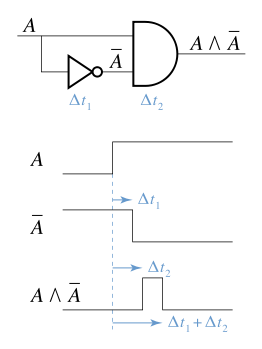
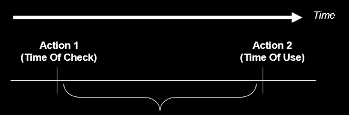
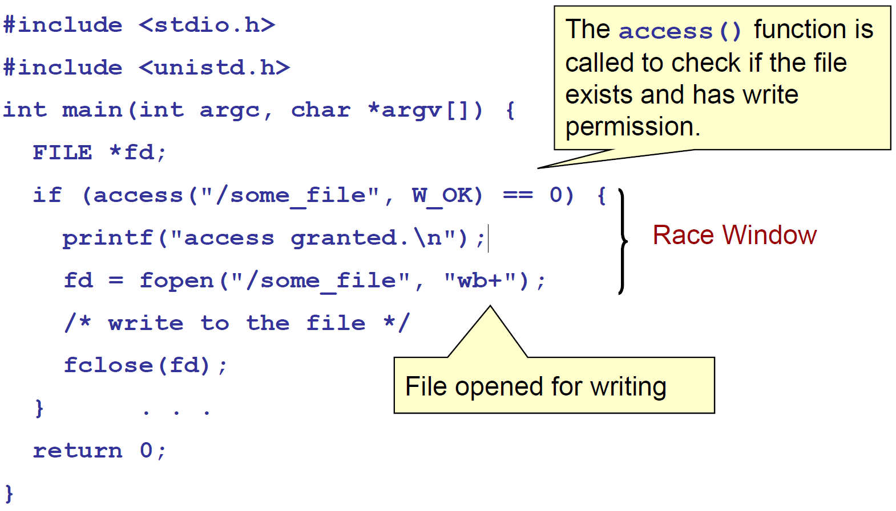
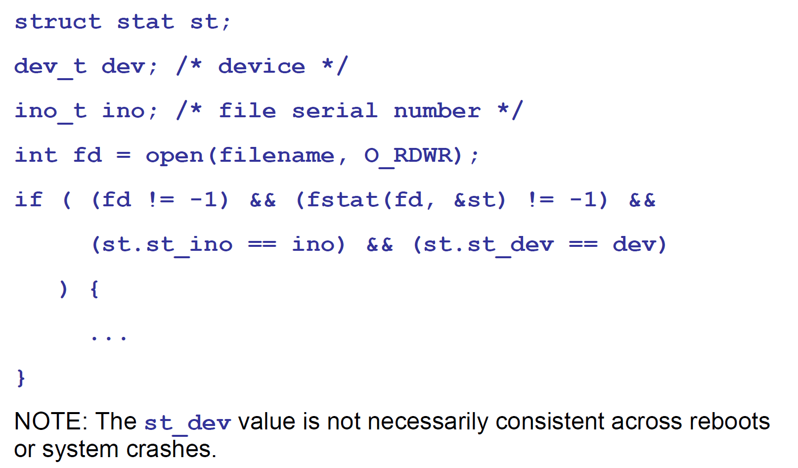

# Race Condition

## 概述

條件競爭是指一個系統的運行結果依賴於不受控制的事件的先後順序。當這些不受控制的事件並沒有按照開發者想要的方式運行時，就可能會出現 bug。這個術語最初來自於兩個電信號互相競爭來影響輸出結果。



條件競爭主要出現在如下領域

- 電子系統，尤其是邏輯電路
- 計算機，尤其是多線程程序和分佈式程序。

由於目前的系統中大量採用併發編程，經常對資源進行共享，往往會產生條件競爭漏洞。

這裏我們主要考慮計算機程序方面的條件競爭。當一個軟件的運行結果依賴於進程或者線程的順序時，就可能會出現條件競爭。簡單考慮一下，可以知道條件競爭需要如下的**條件**：

- 併發，即至少存在兩個併發執行流。這裏的執行流包括線程，進程，任務等級別的執行流。
- 共享對象，即多個併發流會訪問同一對象。**常見的共享對象有共享內存，文件系統，信號。一般來說，這些共享對象是用來使得多個程序執行流相互交流。**此外，我們稱訪問共享對象的代碼爲**臨界區**。在正常寫代碼時，這部分應該加鎖。
- 改變對象，即至少有一個控制流會改變競爭對象的狀態。因爲如果程序只是對對象進行讀操作，那麼並不會產生條件競爭。

由於在併發時，執行流的不確定性很大，條件競爭相對**難察覺**，並且在**復現和調試方面會比較困難**。這給修復條件競爭也帶來了不小的困難。

條件競爭造成的影響也是多樣的，輕則程序異常執行，重則程序崩潰。如果條件競爭漏洞被攻擊者利用的話，很有可能會使得攻擊者獲得相應系統的特權。

這裏舉一個簡單的例子。

```c
#include <pthread.h>
#include <stdio.h>

int counter;
void *IncreaseCounter(void *args) {
  counter += 1;
  sleep(0.1);
  printf("Thread %d has counter value %d\n", (unsigned int)pthread_self(),
         counter);
}

int main() {
  pthread_t p[10];
  for (int i = 0; i < 10; ++i) {
    pthread_create(&p[i], NULL, IncreaseCounter, NULL);
  }
  for (int i = 0; i < 10; ++i) {
    pthread_join(p[i], NULL);
  }
  return 0;
}

```

一般來說，我們可能希望按如下方式輸出

```shell
➜  005race_condition ./example1
Thread 1859024640 has counter value 1
Thread 1841583872 has counter value 2
Thread 1832863488 has counter value 3
Thread 1824143104 has counter value 4
Thread 1744828160 has counter value 5
Thread 1736107776 has counter value 6
Thread 1727387392 has counter value 7
Thread 1850304256 has counter value 8
Thread 1709946624 has counter value 9
Thread 1718667008 has counter value 10
```

但是，由於條件競爭的存在，最後輸出的結果往往不盡人意

```c
➜  005race_condition ./example1
Thread 1417475840 has counter value 2
Thread 1408755456 has counter value 2
Thread 1391314688 has counter value 8
Thread 1356433152 has counter value 8
Thread 1365153536 has counter value 8
Thread 1373873920 has counter value 8
Thread 1382594304 has counter value 8
Thread 1400035072 has counter value 8
Thread 1275066112 has counter value 9
Thread 1266345728 has counter value 10
```

仔細思考一下條件競爭爲什麼可能會發生呢？以下面的爲具體的例子

- 程序首先執行了action1，然後執行了action2。其中 action 可能是應用級別的，也可能是操作系統級別的。正常來說，我們希望程序在執行 action2 時，action1 所產生的條件仍然是滿足的。
- 但是由於程序的併發性，攻擊者很有可能可以在 action2 執行之前的這個短暫的時間窗口中破壞 action1 所產生的條件。這時候攻擊者的操作與 action2 產生了條件競爭，所以可能會影響程序的執行效果。


所以我認爲問題的根源在於程序員雖然假設某個條件在相應時間段應該是滿足的，但是往往條件可能會在這個很小的時間窗口中被修改。**雖然這個時間的間隔可能非常小，但是攻擊者仍然可能可以通過執行某些操作（如計算密集型操作，Dos攻擊）使得受害機器的處理速度變得相對慢一些。**

## 形式

常見的條件競爭有以下形式。

### CWE-367: TOCTOU Race Condition

#### 描述

TOCTOC (Time-of-check Time-of-use) 指的是程序在使用資源（變量，內存，文件）前會對進行檢查，但是在程序使用對應的資源前，該資源卻被修改了。



下面給出一些更加具體的例子。

#### CWE-365: Race Condition in Switch

當程序正在執行 switch 語句時，如果 switch 變量的值被改變，那麼就可能造成不可預知的行爲。尤其在case 語句後不寫 break 語句的代碼，一旦 switch 變量發生改變，很有可能會改變程序原有的邏輯。

#### CWE-363: Race Condition Enabling Link Following

我們知道 Linux 中提供了兩種對於文件的命名方式

- 文件路徑名
- 文件描述符

但是，將這兩種命名解析到相應對象上的方式有所不同

- 文件路徑名在解析的時候是通過傳入的路徑（文件名，硬鏈接，軟連接）**間接解析**的，其傳入的參數並不是相應文件的真實地址(inode)。
- 文件描述符通過訪問直接指向文件的指針來解析。

正是由於間接性，產生了上面我們所說的時間窗口。

以下面的代碼爲例子，程序在訪問某個文件之前，會檢查是否存在，之後會打開文件然後執行操作。但是如果在檢查之後，真正使用文件之前，攻擊者將文件修改爲某個符號鏈接，那麼程序將訪問錯誤的文件。



這種條件競爭出現的問題的根源在於文件系統中的名字對象綁定的問題。而下面的函數都會使用文件名作爲參數：access(), open(), creat(), mkdir(), unlink(), rmdir(), chown(), symlink(), link(), rename(), chroot(),…

那該如何避免這個問題呢？我們可以使用 fstat 函數來讀取文件的信息並把它存入到stat結構體中，然後我們可以將該信息與我們已知的信息進行比較來判斷我們是否讀入了正確的信息。其中，stat結構體中的 `st_ino` 和 `st_dev` 變量可以唯一表示文件

- `st_ino` ，包含了文件的序列號，即 `i-node`
- `st_dev` ，包含了文件對應的設備。



### CWE-364: Signal Handler Race Condition

#### 概述

條件競爭經常會發生在信號處理程序中，這是因爲信號處理程序支持異步操作。尤其是當信號處理程序是**不可重入**的或者狀態敏感的時候，攻擊者可能通過利用信號處理程序中的條件競爭，可能可以達到拒絕服務攻擊和代碼執行的效果。比如說，如果在信號處理程序中執行了free操作，此時又來了一個信號，然後信號處理程序就會再次執行free操作，這時候就會出現 double free 的情況，再稍微操作一下，就可能可以達到任意地址寫的效果了。

一般來說，與信號處理程序有關的常見的條件競爭情況有

- 信號處理程序和普通的代碼段共享全局變量和數據段。
- 在不同的信號處理程序中共享狀態。
- 信號處理程序本身使用不可重入的函數，比如 malloc 和 free 。
- 一個信號處理函數處理多個信號，這可能會進而導致use after free 和 double free 漏洞。
- 使用 setjmp 或者 longjmp 等機制來使得信號處理程序不能夠返回原來的程序執行流。

#### 線程安全與可重入

這裏說明一下線程安全與可重入的關係。

-   線程安全
    -   即該函數可以被多個線程調用，而不會出現任何問題。
    -   條件
        -   本身沒有任何共享資源
        -   有共享資源，需要加鎖。
-   可重用
    -   一個函數可以被多個實例可以同時運行在相同的地址空間中。
    -   可重入函數可以被中斷，並且其它代碼在進入該函數時，不會丟失數據的完整性。所以可重入函數一定是線程安全的。
    -   可重入強調的是單個線程執行時，重新進入同一個子程序仍然是安全的。
    -   不滿足條件
        -   函數體內使用了靜態數據結構，並且不是常量
        -   函數體內使用了malloc 或者 free 函數
        -   函數使用了標準 IO 函數。
        -   調用的函數不是可重入的。
    -   可重入函數使用的所有變量都保存在[調用棧](https://zh.wikipedia.org/wiki/%E8%B0%83%E7%94%A8%E6%A0%88)的當前[函數棧](https://zh.wikipedia.org/w/index.php?title=%E5%87%BD%E6%95%B0%E6%A0%88&action=edit&redlink=1)（frame）上。

## 防範

如果想要消除條件競爭，那麼首要的目標是找到競爭窗口（race windows）。

所謂競爭窗口，就是訪問競爭對象的代碼段，這給攻擊者相應的機會來修改相應的競爭對象。

一般來說，如果我們可以使得衝突的競爭窗口相互排斥，那麼就可以消除競爭條件。

### 同步原語

一般來說，我們會使用同步原語來消除競爭條件。常見的如下

-   鎖變量
    -   通常互斥瑣，在等待期間放棄CPU，進入idle狀態，過一段時間自動嘗試。
    -   自旋鎖（spinlock），在等待期間不放棄CPU，一直嘗試。
-   條件變量
    -   **條件變量是用來等待而不是用來上鎖的。條件變量用來自動阻塞一個線程，直到某特殊情況發生爲止。通常條件變量和互斥鎖同時使用。**
-   臨界區對象，CRITICAL_SECTION

-   信號量（semaphore），控制可訪問某個臨界區的線程數量，一般比1大。
-   管道，指用於連接一個讀進程和一個寫進程以實現它們之間通信的一個共享文件。其生存期不超過創建管道的進程的生存期。
-   命名管道，生存期可以與操作系統運行期一樣長。

```
# 創建管道
mkfifo my_pipe
# gzip從給定的管道中讀取數據，並把數據壓縮到out.gz中
gzip -9 -c < my_pipe > out.gz &
# 給管道傳輸數據
cat file > my_pipe
```

### 死鎖

#### 概述

當同步原語使用的不恰當的時候，進程就可能會出現死鎖。當兩個或兩個以上的執行流互相阻塞導致都不能繼續執行，死鎖就會發生。其實，死鎖主要是因爲在衝突的執行流中，出現了循環等待的執行流，即循環等待中的每一個執行流都獲得一個資源，同時試圖獲得下一個資源。下圖所示，P1、P2 兩個進程都需要資源才能繼續運行。P1 擁有資源 R2、還需要額外資源 R1 才能運行；P2 擁有資源 R1、還需要額外資源 R2 才能運行，兩邊都在互相等待而沒有任何一個可運行。


一般來說，死鎖有以下四個必要條件

- 互斥，資源是互斥的。
- 持有和等待，持有已有的資源，同時等待使用下一個資源。
- 不可搶佔，進程所獲得的資源在未使用完畢之前，資源申請者不能強行地從資源佔有者手中奪取資源，而只能由該資源的佔有者進程自行釋放。
- 循環等待，循環等待資源。

而如果想要消除死鎖，也就是打破上面的四個必要條件。

此外，死鎖可能來源於以下的原因

- 處理器速度
- 進程或者線程調度算法的變動
- 在執行的過程中，不同內存的限制。
- 任何能夠中斷程序執行的異步事件。

#### 影響

死鎖一般情況下會造成拒絕服務攻擊。

## 檢測

那麼，說到這裏，我們有沒有可能來檢測條件競爭漏洞呢？目前也確實有這方面的研究，也是主要從靜態分析和動態分析兩個方面來檢測。

### 靜態檢測

目前已知的靜態檢測工具有

-   [Flawfinder](http://www.dwheeler.com/flawfinder/)
    -   目標：C/C++源碼
    -   步驟
        -   建立漏洞數據庫
        -   進行簡單的文本模式匹配，沒有任何的數據流或控制流分析
-   [ThreadSanitizer](https://github.com/google/sanitizers)
    -   目標：C++和GO
    -   實現：LLVM

### 動態檢測

- [Intel Inspector](https://en.wikipedia.org/wiki/Intel_Inspector)
- [Valgrind](https://en.wikipedia.org/wiki/Valgrind)

# 參考

- http://www.teraits.com/pitagoras/marcio/segapp/05.ppt
- http://repository.root-me.org/Programmation/C%20-%20C++/EN%20-%20Secure%20Coding%20in%20C%20and%20C++%20Race%20Conditions.pdf
- https://www.blackhat.com/presentations/bh-europe-04/bh-eu-04-tsyrklevich/bh-eu-04-tsyrklevich.pdf
- https://xinhuang.github.io/posts/2014-09-23-detect-race-condition-using-clang-thread-sanitizer.html
- https://llvm.org/devmtg/2011-11/Hutchins_ThreadSafety.pdf
- http://www.cnblogs.com/biyeymyhjob/archive/2012/07/20/2601655.html
- http://www.cnblogs.com/huxiao-tee/p/4660352.html
- https://github.com/dirtycow/dirtycow.github.io
