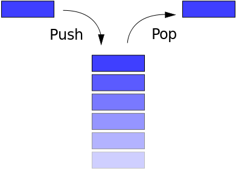
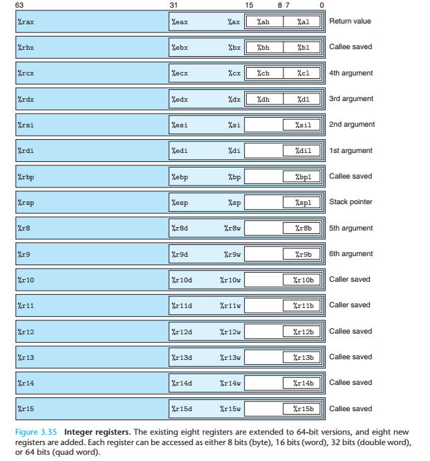

# 棧介紹

## 基本棧介紹

棧是一種典型的後進先出( Last in First Out )的數據結構，其操作主要有壓棧(push)與出棧(pop)兩種操作，如下圖所示（維基百科）。兩種操作都操作棧頂，當然，它也有棧底。

高級語言在運行時都會被轉換爲彙編程序，在彙編程序運行過程中，充分利用了這一數據結構。每個程序在運行時都有虛擬地址空間，其中某一部分就是該程序對應的棧，用於保存函數調用信息和局部變量。此外，常見的操作也是壓棧與出棧。需要注意的是，**程序的棧是從進程地址空間的高地址向低地址增長的**。

## 函數調用棧

請務必仔細看一下下面的文章來學習一下基本的函數調用棧。

- [C語言函數調用棧(一)](http://www.cnblogs.com/clover-toeic/p/3755401.html)
- [C語言函數調用棧(二)](http://www.cnblogs.com/clover-toeic/p/3756668.html)

這裏再給出另外一張寄存器的圖

需要注意的是，32 位和 64 位程序有以下簡單的區別

- **x86**
    - **函數參數**在**函數返回地址**的上方
- **x64**
    - System V AMD64 ABI (Linux、FreeBSD、macOS 等採用)中前六個整型或指針參數依次保存在**RDI, RSI, RDX, RCX, R8 和 R9 寄存器**中，如果還有更多的參數的話纔會保存在棧上。
    - 內存地址不能大於 0x00007FFFFFFFFFFF，**6 個字節長度**，否則會拋出異常。

## 參考閱讀

- csapp
- Calling conventions for different C++ compilers and operating systems, Agner Fog
