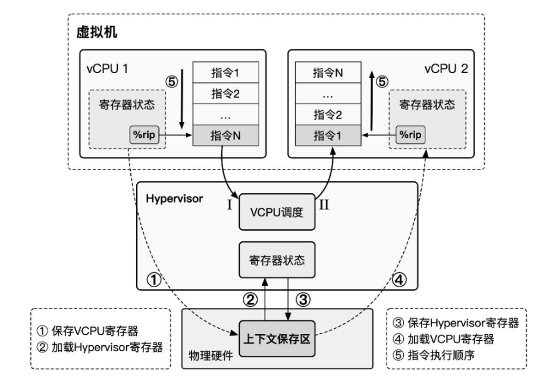
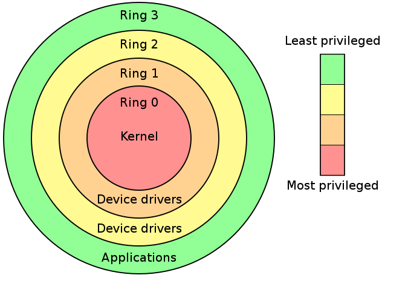
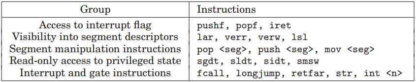
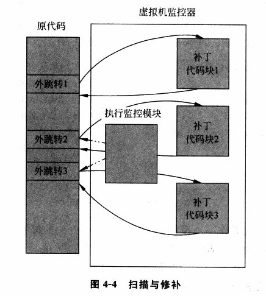
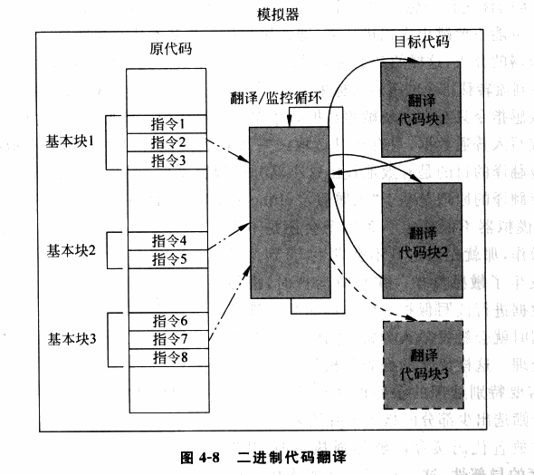
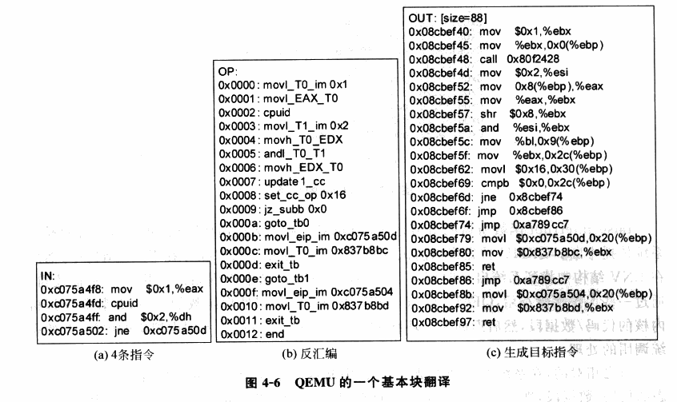
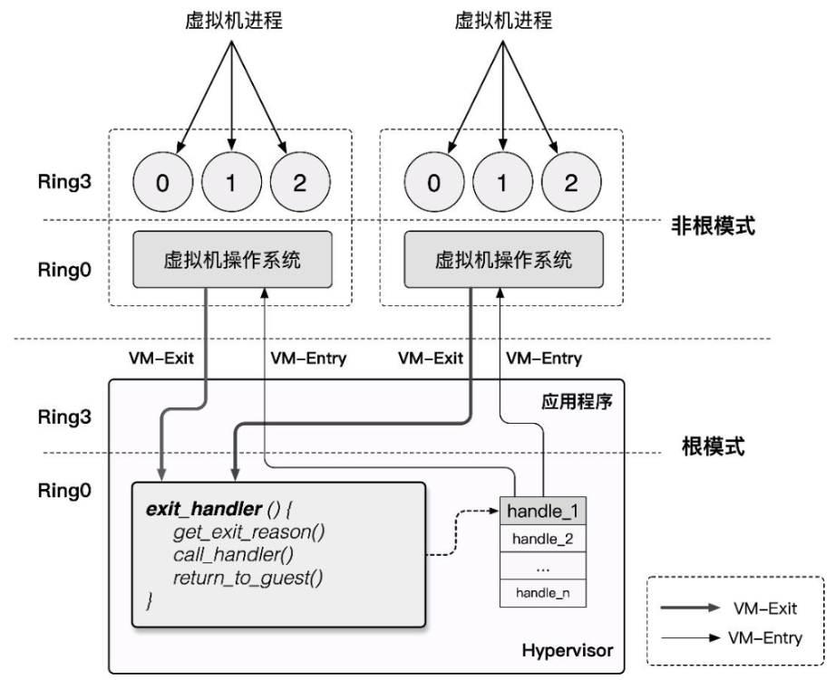
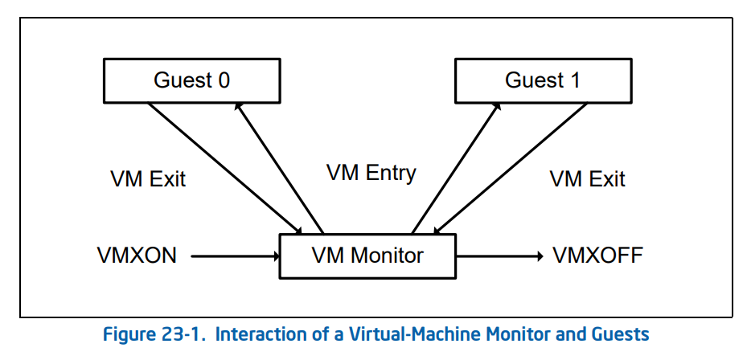
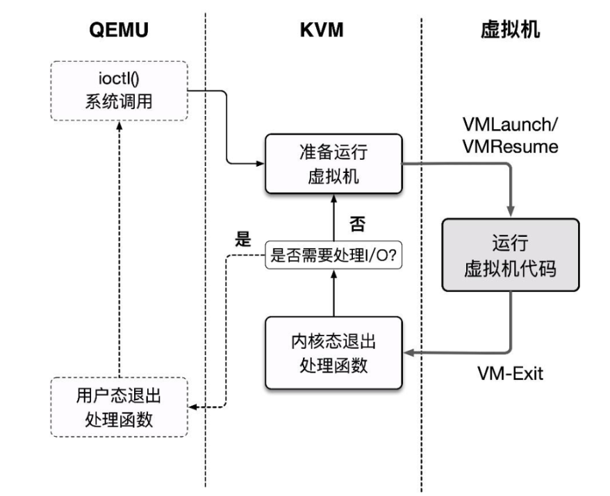

# CPU 虛擬化

CPU 虛擬化是系統虛擬化技術中最核心的部分，因爲 CPU 是計算機中最核心的組件，直接控制着整個系統的運行，同時內存訪問（內存虛擬化）與 I/O 操作（I/O虛擬化）也都直接依賴於 CPU，因此 CPU 虛擬化是系統虛擬化技術中的核心。

在 Gerald J. Popek 與 Robert P. Goldberg 的合作論文[《Formal Requirements for Virtualizable Third Generation Architectures》](https://dl.acm.org/doi/pdf/10.1145/361011.361073) 中提出了滿足虛擬化系統結構的 VMM 的三個充分條件：等價性，資源控制，效率性。爲了滿足這個條件， CPU 虛擬化使用的經典模型是「Trap & Emulate」，使用**特權級壓縮**（Ring Compression）的方式來實現虛擬環境：

- Hypervisor 運行在最高特權級上，Guest VM 運行在低特權級上，Guest VM 在硬件上直接執行非敏感指令，當 Guest VM 執行到敏感指令時，其便會陷入位於最高特權級的 Hypervisor ，此時便能由 Hypervisor 模擬敏感指令的行爲。
- 當發生 virtual CPU 調度時，我們將 vCPU 的狀態保存，恢復 Hypervisor 狀態，Hypervisor 完成其行爲後進行下一 virtual CPU 的調度，恢復下一 vCPU 的狀態並恢復執行。



## x86 虛擬化遇到的問題

在虛擬化技術的發展初期，在個人計算機領域廣泛使用的 x86 架構並沒有對虛擬化的經典架構「Trap & Emulate」提供很好的支持，存在着對系統虛擬化的支持缺陷，**系統虛擬化並不能直接而有效的實現**。

Intel 分級保護環將權限分爲 ring0~ ring3，其中操作系統內核運行在 ring0 權限而用戶進程運行在 ring3 權限。



在系統虛擬化的經典架構「Trap & Emulate」中， Guest OS 全部運行在 ring3，當涉及到一些敏感指令時，VM 觸發 General Protection 異常，由 VMM 進行截獲並處理，**但不是所有敏感指令都是特權指令，不是所有的敏感指令都有觸發異常以讓 VMM 介入的機會**， x86 架構中**一共有 17 條非特權敏感指令**：



這些指令**直接違反了 `Popek and Goldberg virtualization requirements` ，從而使得 x86 不是一個可以虛擬化的架構**。

> 例如在 x86 下我們想要用 popf 修改 eflags 的中斷開關位（IF）時，若我們在用戶態下進行這樣的操作，**則會直接被硬件所忽視，而不會引起異常**，這令 VMM 無法介入。

“硬件不夠，軟件來湊”。因此在硬件還未提供對虛擬化的足夠支持之前，Hypervisor 只能從軟件層面下功夫，於是出現了兩種純軟件虛擬化技術：「模擬執行」（VMWare）與「直接源代碼改寫」（Xen）。

在軟件虛擬化技術已經發展成熟多年之後，x86 架構對虛擬化的支持才姍姍來遲：「硬件輔助虛擬化」（Intel VT）開始出現在人們的視野當中。

## 純軟件實現 CPU 虛擬化

前文我們已經指出 x86 架構存在**非特權敏感指令，直接導致 VMM 無法截獲 x86 VM 的敏感行爲**，這違反了 `Popek and Goldberg virtualization requirements`，因此在硬件對虛擬化的支持出現之前，虛擬化廠商只好先從軟件層面下手。

### 模擬 & 解釋執行

**「模擬」**（Emulate）技術的出現其實早於虛擬化，純軟件的模擬本質上就是通過**編寫能夠呈現出與被模擬對象相同行爲的應用程式從而達到運行非同構平臺應用程序的效果**。

模擬技術不僅能夠應用於程序級別的模擬，還能應用於系統級別的模擬：CPU 運行的本質行爲其實就是**從 PC 寄存器所指內存區域中不斷取出指令解碼執行**，我們不難想到的是，實現一個虛擬機最簡單粗暴的方法便是通過**模擬每一條指令對應的行爲，從而使得 VM 的行爲對 VMM 而言是完全可控的**。

實現模擬技術的原理也是最簡單的——我們可以通過**解釋執行**的方式來實現模擬技術，即模擬器程序不斷地從內存中讀取指令，並模擬出每一條指令的效果。從某種程度而言，**每一條指令在執行時都完成了“陷入”**，因此我們可以使用模擬技術解決虛擬化的漏洞，同時還能模擬與物理機不同架構的虛擬機

**Qemu**——`Quick Emulator` 本質上便是一個模擬器，其**完整地模擬了一套包括各種外設在內的計算機系統**。

不過基於解釋執行的模擬技術有着一個非常致命的缺點——**性能極差**，因爲每一條指令都需要經過 VMM 的解析後再由 VMM 模擬執行，哪怕最簡單的一條指令也可能需要分解成多個步驟與多次內存訪問，效率極低。

讓我們重新審視我們爲什麼需要在 x86 架構上使用模擬技術來實現虛擬機：非特權敏感指令的存在打破了 `Popek and Goldberg virtualization requirements`，但**非特權敏感指令僅是少數，大部分指令我們仍能直接在物理硬件上運行**，因此基於模擬技術進行改進的虛擬化技術出現了：`掃描 & 修補` 與 `二進制翻譯`。

### 掃描 & 修補

虛擬化場景下的虛擬機大都是與物理機有着相同的 ISA，因此我們並沒有必要採用純模擬的技術實現虛擬機，而是可以**讓非敏感指令直接在硬件上執行，通過某種方式讓非特權敏感指令陷入 VMM**，從而重新實現 Trap & Emulate 模型。

**掃描 & 修補**（Scan & Patch）便是這樣的一種技術，其**讓非敏感指令直接在硬件上執行**，同時**將系統代碼中的敏感指令替換爲跳轉指令等能陷入 VMM 中的指令**，從而讓 VM 在執行敏感指令時能陷入 VMM，使得 VMM 能夠模擬執行敏感指令的效果。

基本執行流程如下：

- VMM 在 VM 執行每段代碼之前對其進行掃描，解析每一條指令，查找特權與敏感指令
- VMM 動態生成相應指令的補丁代碼，並將原敏感指令替換爲一個外跳轉以陷入 VMM，從而在 VMM 中執行動態生成的補丁代碼
- 補丁代碼執行結束後，再跳轉回 VM 中繼續執行下一條代碼



在「掃描 & 修補」技術當中大部分的代碼都可以直接在物理 CPU 上運行，其性能損失較小，但「掃描 & 修補」同樣存在着一定的缺陷：

- 特權指令與敏感指令仍通過模擬執行的方式完成，仍可能造成一定的性能損失

- 代碼補丁當中引入了額外的跳轉，這破壞了代碼的局部性

  > 局部性原理：CPU存取指令/數據的內存單元應當趨向於聚集在一個較小的區域

- VMM 需要維護一份補丁代碼對應的原始代碼的副本，這造成了額外的開銷

### 二進制翻譯

爲了進一步地提高虛擬化的性能，**「二進制代碼翻譯」**（Binary Translation）技術應運而生，類似於「掃描 & 修補」技術，二進制代碼翻譯同樣會在運行時動態地修改代碼，不過不同的是 BT 技術以**基本塊**（只有一個入口和一個出口的代碼塊）作爲翻譯的單位：

- Emulator 對讀入的二進制代碼**翻譯**輸出爲對應 ISA 的一個**不包含特權指令與敏感指令的子集**所構成的代碼，使其可以在用戶態下安全運行
- Emulator 動態地爲當前要運行的基本塊開闢一塊空間，稱之爲**翻譯緩存**（translation cache），在其中存放着翻譯後的代碼，每一塊 TC 與原代碼以某種映射關係（例如哈希表）進行關聯



> 我們可以看出二進制代碼翻譯技術與掃描修補技術的原理大體上是非常類似的，但是二進制代碼翻譯技術會對所有的代碼進行翻譯，而掃描與修補技術則只會 patch 掉敏感指令與特權指令；同時掃描&修補技術**不會改變代碼的整體結構**，而僅是將敏感與特權指令替換爲能觸發陷入 VMM 的指令，但是二進制代碼翻譯技術**會直接改變一個基本塊的代碼整體結構**（例如翻譯前基本塊可能長度 40B，翻譯後變成100B，內部代碼的相對位置也會發生變化）。

翻譯方法大致分爲以下兩種：

- **簡單翻譯**：可以直接理解爲**等效代碼模擬**，這種方法實現較爲簡單，但是會讓指令數量大幅膨脹。
- **等值翻譯**：翻譯的**原代碼與結果代碼相同**。理論上大多數指令都可以使用等值翻譯直接在硬件上執行，但這需要更復雜的動態分析技術。

在相同 ISA 架構上大部分指令都是可以直接進行等值翻譯的，除了以下幾種：

- PC 相對尋址指令。這類指令的尋址與 PC 相關，但在進行二進制翻譯後更改了代碼基本塊的結構，因此這類指令需要額外插入一些補償代碼來確保尋址的準確，這造成了一定的性能損失。
- 直接控制轉換。這類指令包括函數調用與跳轉指令，其目標地址需要被替換爲生成代碼的地址。
- 間接控制轉換。這類指令包括間接調用、返回、間接跳轉，其目標地址是在運行時動態得到的，因此我們無法在翻譯時確定跳轉目標。
- 特權指令。對於簡單的特權指令可以直接翻譯爲類似的等值代碼（例如 cli 指令可以直接翻譯爲置 vcpu 的 flags 寄存器的 IF 位爲0），但對於稍微複雜一點的指令，則需要進行深度模擬，利用跳轉指令陷入 VMM 中，這通常會造成一定的性能開銷。

> 例如這是 QEMU 中的一個基本塊代碼翻譯的例子：
>
> 

由於二進制代碼翻譯技術使用了更爲複雜的過程，由此也會引入更多的問題，對於以下情形則需要額外的處理：

- 自修改代碼（Self Modifying Code）。這類程序會在運行時修改自身所執行的代碼，這需要我們的 Emulator 對新生成的代碼進行重翻譯。
- 自參考代碼（Self Referential Code）。這類程序會在運行中讀取自己的代碼段中內容，這需要我們額外進行處理，使其讀取原代碼段中內容而非翻譯後的代碼。
- 精確異常（Precise Exceptions）。即在翻譯代碼執行的過程中發生了中斷或異常，這需要將運行狀態恢復到原代碼執行到異常點時的狀態，之後再交給 Guest OS 處理。BT 技術暫很難很好地處理這種情況，因爲翻譯後的代碼與原代碼已經失去了逐條對應的關係。一個可行的解決方案就是在發生異常時進行回滾，之後重新使用解釋執行的方式。
- 實時代碼。這類代碼對於實時性要求較高，在模擬環境下運行會損失時間精確性，目前暫時無法解決。


## 硬件輔助虛擬化

本節我們以 Intel VT-x 爲例介紹硬件輔助虛擬化（hardware-assisted virtualization）技術。

### 概述

Intel VT 技術是 Intel 爲 x86 虛擬化所提供的硬件支持，其中用於輔助 CPU 虛擬化的是 `Intel VT-x` 技術，其擴展了傳統的 IA32 處理器架構，爲 IA32 架構的 CPU 虛擬化提供了硬件支持。

VT-x 技術爲 Intel CPU 額外引入了兩種運行模式，統稱爲**VMX 操作模式**（Virtual Machine eXtensions），通過 `vmxon` 指令開啓，這兩種運行模式**都獨立有着自己的分級保護環**：

- `VMX Root Operation`：Hypervisor 所工作的模式，在這個模式下可以訪問計算機的所有資源，並對 VM 進行調度。
- `VMX Non-Root Operation`：VM 所工作的模式，在這個模式下僅能訪問非敏感資源，對於敏感資源的訪問（例如 I/O 操作）會使得 CPU 退出 Non-Root 模式並陷入 Hypervisor 中，由 Hypervisor 處理後再重新進入 Non-Root 模式恢復 VM 的運行。

由此，我們對 Root 模式與 Non-Root 模式間的切換行爲進行定義：

- `VM-Entry`：Hypervisor 保存自身狀態信息，切換到 VMX Non-Root 模式，載入 VM 狀態信息，恢復 VM 執行流。
- `VM-Exit`：VM 運行暫停並保存自身狀態信息，切換到 VMX Root 模式，載入 Hypervisor 狀態信息，執行相應的處理函數。



由於 Non-Root 模式與 Root 模式都各自有着自己的分級保護環，因此 Host OS 與 Guest OS 都可以**不加修改地在自己對應的模式下直接在硬件上運行**，僅有當 Guest OS 涉及到敏感資源的訪問及 Host OS 對 VM 的調度時纔會發生切換，這在確保了 VM 高性能的同時滿足了 `Trap & Emulate` `模型實現，也解決了 x86 架構的虛擬化漏洞。

### VMCS

`VMCS`（**Virtual-Machine Control Structure**）是用以保存 CPU 虛擬化所需要的相關狀態的一塊內存，**每個 virtual CPU 對應有一個 VMCS**，同一時刻一個物理 CPU 只能與一個 VMCS 綁定，反之亦然，但在不同的時刻我們可以將 VMCS 綁定到不同的物理 CPU 上，稱之爲 VMCS 的**遷移**（Migration）。

與 VMCS 的綁定與解綁相關的是以下兩條指令：

|     Instruction     |                Description                |
| :-----------------: | :---------------------------------------: |
| VMPTRLD <VMCS 地址> | 將指定的 VMCS 與執行該指令的 CPU 進行綁定 |
|       VMCLEAR       |   將執行該指令的 CPU 與其 VMCS 進行解綁   |

VT-x 中將 VMCS 定義爲一個**最大不超過 4KB 的內存塊，且應與 4KB 對齊**，其內容格式如下：

```c
struct VMCS {
    /* 版本號，4字節 */
	uint32_t vmcs_revision_identifier:31, shadow_vmcs_indicator:1;
    
    /* 中止標識，4字節
     * 當 VM-Exit 失敗時便會產生 VMX 中止，並在此處存放原因
     */
    uint32_t 	vmx_abort_indicator;
    
    /* 數據域 */
    struct VMCSData vmcs_data;
};
```

VMCS 數據域 存放着 VMCS 主要的信息，分爲以下六個子域：

- **Guest-state area**：保存 VM 寄存器狀態，在 VM-entry 時加載，在 VM-exit 時保存

- **Host-state area**：保存 Hypervisor 寄存器狀態，在 VM-exit 時加載

- **VM-execution control fileds**：控制 `Non-Root` 模式下的處理器行爲 

- **VM-entry  control fileds**：控制 `VM-Entry` 過程中的某些行爲

- **VM-exit  control fileds**：控制 `VM-Exit` 過程中的某些行爲

- **VM-exit information fields**：保存 `VM-Exit` 的基本原因及其他詳細信息，在一些處理器上該域爲只讀域


我們可以通過以下兩條指令讀寫 VMCS：

|      Instruction      |           Description            |
| :-------------------: | :------------------------------: |
|     VMREAD <索引>     |     讀 VMCS 中“索引”指定的域     |
| VMWRITE <索引> <數據> | 向 VMCS 中“索引”指定的域寫入數據 |

> 這裏的索引並非偏移值，而是 Intel 爲數據域中每個字段都定義了一個獨特的索引值，例如 Guest State Area 中 ES 段選擇子的索引值便是 `0x00000800`。
>
> 當然，要把所有域的索引都背下來並不現實，最好的辦法還是多多查表：）推薦閱讀：[Intel SDM](https://www.intel.com/content/www/us/en/developer/articles/technical/intel-sdm.html) 的 [Intel® 64 and IA-32 Architectures Software Developer's Manual Volume 3C: System Programming Guide, Part 3](https://cdrdv2.intel.com/v1/dl/getContent/671506)。

### VMX 操作模式

作爲傳統的 IA32 架構的擴展，VMX 操作模式在默認下是關閉的，只有當 VMM 需要使用硬件輔助虛擬化功能時纔會使用 Intel 提供的兩條新指令來開關 VMX 操作模式：

- `VMXON`：開啓 VMX 操作模式。
- `VMXOFF`：關閉 VMX 操作模式。

在 Intel SDM 中描述的 VMX 生命週期如下：

- 軟件通過 `VMXON` 指令進入 VMX 操作模式。
- VMM 可以通過 `VM entries` 進入 Guest VM（單次只能執行一個 VM），VMM 通過 `VMLAUNCH` （第一次進入 VM）與 `VMRESUME` （從 VMM 中恢復到 VM）指令來使能 `VM entry`，通過 `VM exits` 重獲控制權。
- `VM exits` 通過 VMM 指定的入口點移交控制權，VMM 對 VM 的退出原因進行響應後通過 `VM entry` 返回到 VM 中。
- 當 VMM 想要停止自身運行並退出 VMX 操作模式時，其通過 `VMXOFF` 指令來完成。



現在我們來深入 `VM entry` 與 `VM exit` 這兩個行爲的實現細節中，在其流程中他們分別進行了如下動作：

- **VM entry**：從 Hypervisor 切換到 VM
  - 檢查 VMCS 合法性（各字段值是否合法）。
  - 加載 VMCS 的 `Guest-state area` 中的各字段到對應的寄存器。
  - 加載指定的 MSR。
  - 設置 VMCS 的狀態爲 `launched`。
  - 根據需要通過寫 VMCS 的 `VM-entry Interrucption-Information` 向 VM 進行**事件注入**（如異常、異步中斷等）。
- **VM exit**：從 VM 切換到 Hypervisor
  - 將 VM 退出的原因與詳細信息寫入 VMCS 的  `VM-exit information fields`。
  - 將 VM 的寄存器保存至 VMCS 的 `Guest-state area` 。
  - 從 VMCS 的 `Host-state area` 中恢復 Host 寄存器。
  - 加載指定 MSR。


> 這裏筆者爲大家補充一個概念：**Model Specific Register**，簡稱 MSR，是 x86 下的一組用來**控制CPU運行、功能開關、調試、跟蹤程序執行、監測CPU性能**等方面的寄存器。
>
> > 例如 `syscall` 指令便是通過 MSR 寄存器來獲取到內核系統調用的入口點。
>
> 每個 MSR 寄存器都會有一個 id，稱之爲 `MSR Index`，我們可以通過這個 id 來利用 `RDMSR` 與 `WRMSR` 指令讀寫指定的 MSR 寄存器。
>
> 我們可以在 Intel SDM 的 Volume 4 中獲取到到 MSR 寄存器的詳細信息。

## KVM & QEMU-KVM

**Kernel-based Virtual Machine** 是一個自 Linux 2.6.20 後集成在 kernel 中的一個**開源系統虛擬化內核模塊**，本質上是一個依賴於硬件輔助虛擬化的位於 kernel 中的 Hypervisor，或者說**KVM 將 Linux kernel 變成了 Hypervisor**，並提供了相應的用戶態操作 VM 的接口： `/dev/kvm` ，我們可以通過 ioctl 指令來操作 KVM。

但 KVM 本身僅提供了 CPU 與內存的虛擬化，不能構成一個完整的虛擬化環境，那麼我們不難想到的是我們可以複用現有的全虛擬化方案，**將模擬 CPU 與內存的工作交由 KVM 完成**，這樣便能直接通過 KVM 來藉助硬件輔助虛擬化以提高虛擬機性能。

QEMU 便支持通過 KVM 來創建與運行虛擬機，利用QEMU + KVM 進行虛擬化的方案如下：

- QEMU 通過 ioctl 進入內核態將控制權移交 KVM，KVM 進行 VM 的運行。
- 產生 VM-Exit，KVM 接管，判斷原因並決定繼續運行還是交由 QEMU 處理。
- 若是後者，恢復到用戶態 QEMU 中的處理代碼進行相應的處理，之後退出或回到第一步。



這個基本執行框架實際上爲 QEMU 源碼 `accel/kvm/kvm-all.c` 中的 `kvm_cpu_exec()`：

```c
int kvm_cpu_exec(CPUState *cpu)
{
    //...
    cpu_exec_start(cpu);

    do {
        //...
        /**
         * 開始運行 VM，本質上就是 ioctl(kvm_fd, KVM_RUN)
         * 當產生 VM-Exit 時，首先在 KVM 中完成處理，
         * 若產生 IO，則退出內核態，即恢復到這裏，接下來進入到用戶態的處理
         */
        run_ret = kvm_vcpu_ioctl(cpu, KVM_RUN, 0);
        
        //...
        if (run_ret < 0) {
            /**
             * 返回值小於 0 說明 VM 運行出了些問題，
             * 這裏會簡單處理後 break 打破大循環 
             */
        	//...
        }
        
        trace_kvm_run_exit(cpu->cpu_index, run->exit_reason);
        /* 這裏就是一個大的 switch，根據退出的原因進行不同的處理，就不放完整代碼了 */
        switch (run->exit_reason) {
        case KVM_EXIT_IO:
            DPRINTF("handle_io\n");
            /* Called outside BQL */
            kvm_handle_io(run->io.port, attrs,
                          (uint8_t *)run + run->io.data_offset,
                          run->io.direction,
                          run->io.size,
                          run->io.count);
            ret = 0;
            break;
        case KVM_EXIT_MMIO:
            DPRINTF("handle_mmio\n");
            /* Called outside BQL */
            address_space_rw(&address_space_memory,
                             run->mmio.phys_addr, attrs,
                             run->mmio.data,
                             run->mmio.len,
                             run->mmio.is_write);
            ret = 0;
            break;
        //...
        default:
            DPRINTF("kvm_arch_handle_exit\n");
            ret = kvm_arch_handle_exit(cpu, run);
            break;
        }
    } while (ret == 0);
    
    /* 運行結束，收尾處理 */
    // ...
```

## REFERENCE

《系統虛擬化：原理與實現》——Intel 開源軟件技術中心

[【VIRT.0x02】系統虛擬化導論](https://arttnba3.cn/2022/08/29/VURTUALIZATION-0X02-BASIC_KNOWLEDGE/)

[Intel® 64 and IA-32 Architectures Software Developer's Manual Volume 3C: System Programming Guide, Part 3](https://cdrdv2.intel.com/v1/dl/getContent/671506)

[Formal Requirements for Virtualizable Third Generation Architectures](https://dl.acm.org/doi/pdf/10.1145/361011.361073)
