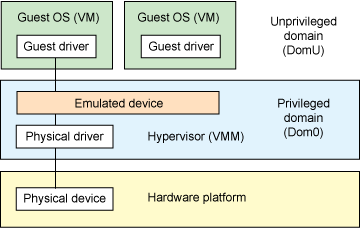
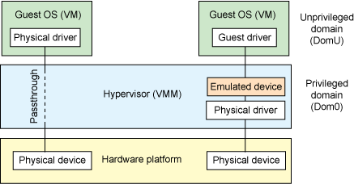
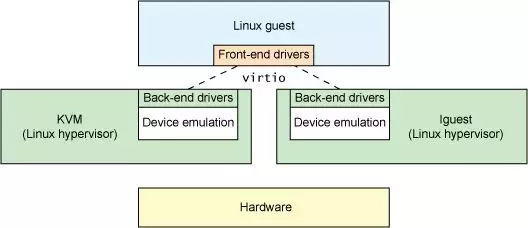
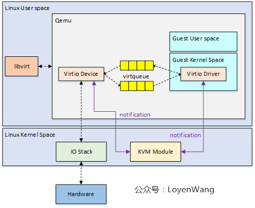
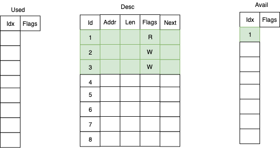
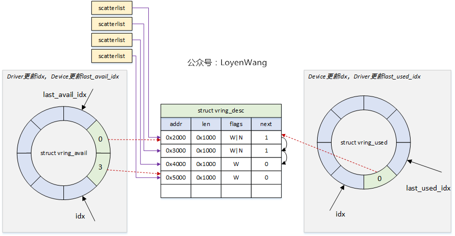
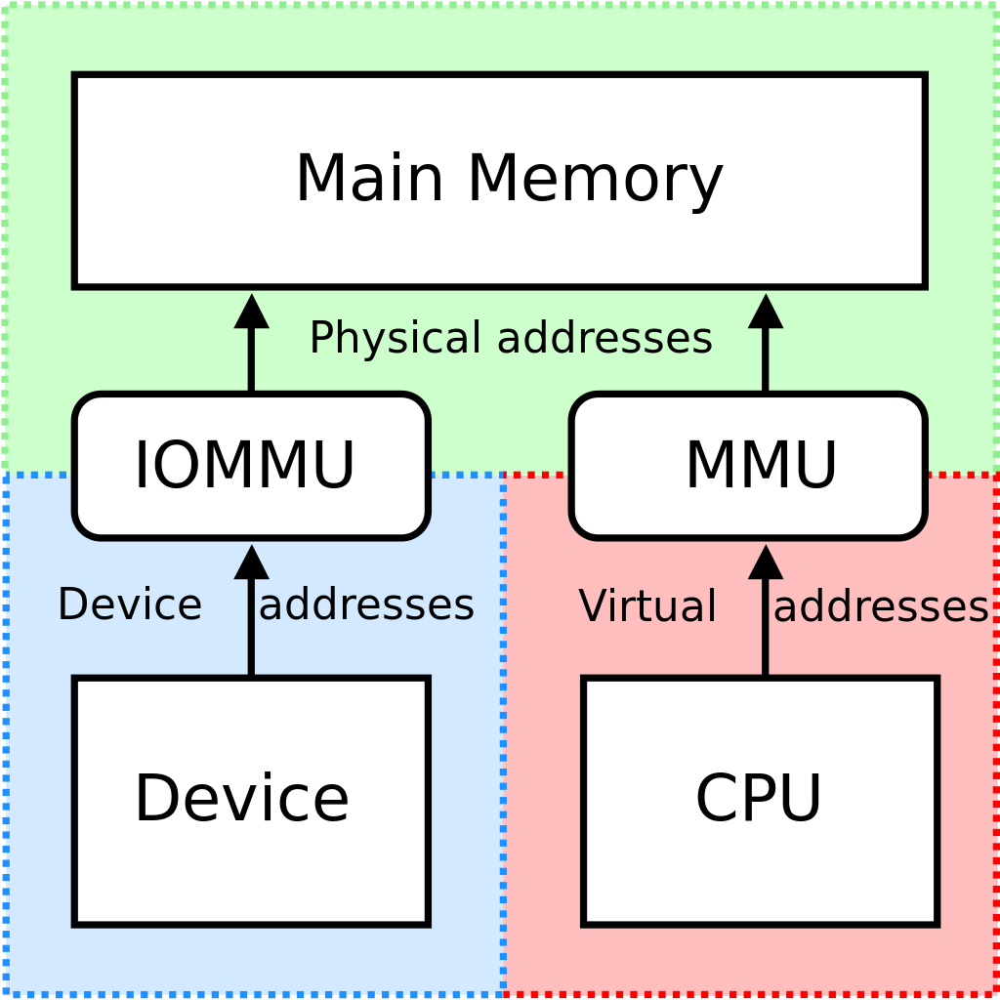
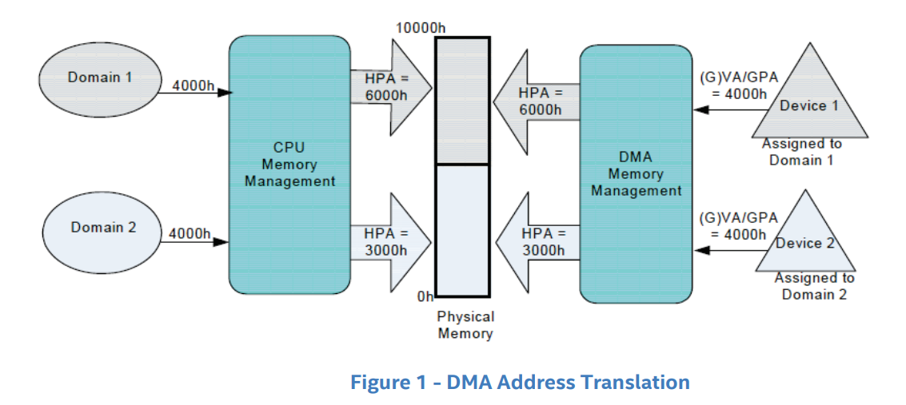

# IO 虛擬化

現實的外設資源往往是有限的，同時我們有的時候並不需要讓 VM 直接接觸到現實存在的外設資源，有的時候我們還想爲 VM 提供一些不存在實體設備的設備，因此 Hypervisor 需要通過 IO 虛擬化的方式來爲 VM 提供**虛擬的設備資源**。

從處理器的角度而言，我們與外設之間的交互主要是通過 MMIO 與 Port IO 來完成的，因而針對外設的虛擬化稱之爲 **I/O 虛擬化**。

I/O 虛擬化需要實現以下三個任務：

- 訪問截獲：Hypervisor 需要截獲 VM 對外設的訪問操作。
- 提供設備接口：Hypervisor 需要爲 VM 提供虛擬/直通設備的接口。
- 實現設備功能：Hypervisor 需要實現虛擬設備的功能。

## 基本模型

### 平臺設備模擬（Platform device emulation）

**平臺設備模擬**即由 Hypervisor 負責模擬虛擬設備的功能，不同的虛擬化軟件對於模擬設備的實現方式不同。

**基於 hypervisor 的設備模擬**（Hypervisor-based device emulation）是 VMware workstation 系列產品較爲常用的一種方式：在 hypervisor 中有着對一般設備的仿真供 guest OS 進行共享，包括虛擬磁盤、虛擬網絡適配器與其他的必要元素，這種模型如下圖所示：



第二種架構稱爲**用戶空間設備模擬**（User space device emulation），其虛擬設備的模擬在用戶空間進行。QEMU 在用戶空間中獨立進行設備模擬，虛擬設備被其他的 VM 通過 hypervisor 提供的接口進行調用。由於設備的模擬是獨立於 hypervisor 的，因此我們可以模擬任何設備，且該模擬設備可以在其他 hypervisor 間進行共享。


### 設備直通（Device passthrough）

上面的這兩種模型或多或少都存在着一定的性能開銷，如果該設備需要被多個 VM 共享，那這種開銷或許是值得的，但如果該設備並不需要共享，那麼我們其實可以使用一種更爲高效的方法——設備直通（Device passthrough）。

設備直通可以理解爲設備獨佔的設備模擬：直接將設備**隔離**給到指定的 VM 上，以便該設備可以由該 VM 獨佔使用。**這提供了接近於原生設備的性能**，例如對於一些需要大量 IO 的設備（例如網絡設備等），使用設備直通能提供相當完美的性能。



## 軟件半虛擬化 - virtio

`virtio` 這個概念來自於一篇非常古老的虛擬化領域的論文：[virtio: towards a de-facto standard for virtual I/O devices](https://ozlabs.org/~rusty/virtio-spec/virtio-paper.pdf)，主要是爲了解決設備虛擬化的問題而**提供了一套通用的虛擬化設備模型**，Guest OS 只需要實現一套統一的 virtio 驅動便能以統一的方式訪問虛擬化設備，從而避免了各種虛擬化驅動分裂的問題。



### VirtQueue：傳輸層抽象

`virtqueue` 爲 virtio 中用以進行數據傳輸的關鍵結構，其本身表示一個**數據隊列**：由一方向隊列中添加 buffer，另一方從隊列中取出 buffer——通過這樣的方式實現了 Guest 與 Host 之間基本的數據傳輸模型。

爲了減少模型的複雜性，通常我們使用 virtqueue 的傳輸都是單向的，因此一個最簡單的模型就是我們就可以使用兩個 virtqueue 來實現 Guest 與 Host 之間的雙向通信：tx queue（發送隊列） & rx queue（接收隊列）。



對於 virtqueue 的操作，在論文中抽象成一個函數表 `virtqueue_ops`：

```c
struct virtqueue_ops {
    int (*add_buf)(struct virtqueue *vq,
                    struct scatterlist sg[],
                    unsigned int out_num,
                    unsigned int in_num,
                    void *data);
    void (*kick)(struct virtqueue *vq);
    void *(*get_buf)(struct virtqueue *vq,
    unsigned int *len);
    void (*disable_cb)(struct virtqueue *vq);
    bool (*enable_cb)(struct virtqueue *vq);
};
```

-  `add_buf`：向 virtqueue 中添加一個 buffer
-  `kick` ：通知另一方新到達了一個 buffer
-  `get_buf` 從 virtqueue 中獲取一個 buffer
-  `disable_cb`：通知另一方關閉 buffer 到達的提示
-  `enable_cb`：通知另一方開啓 buffer 到達的提示

### VRing：virtqueue 的基本結構

virtqueue 核心的數據結構便是 `vring`，這是一個**環形緩衝區隊列**，其由三部分組成：

- 描述符表（Desc）
- 可用描述符數組（Used）
- 已用描述符數組（Avail）



一個描述符（Descriptor）爲如下結構，表示了一塊 buffer 的基本屬性，需要注意的是一個 Avail/Used 表項通常是多個 descriptor 串聯的 buffer——這便是 next 域的作用：

```c
struct vring_desc
{
    __u64 addr;		// Guest Physical Addresses
    __u32 len;		// 長度
    __u16 flags;	// 屬性
    __u16 next;		// 下一個描述符的 idx
};
```

**Avail** 數組用來存儲當前可用的描述符：

```c
struct vring_avail
{
    __u16 flags;
    __u16 idx;
    __u16 ring[NUM];
};
```

**Used** 數組則用來存儲已經被使用的描述符：

```c
struct vring_used_elem
{
    __u32 id;
    __u32 len;
};

struct vring_used
{
    __u16 flags;
    __u16 idx;
    struct vring_used_elem ring[];
};
```

Avail 數組與 Used 數組同樣是一個**環形隊列**，不過這兩個數組分別由通信的兩方進行使用：

- 數據**發送方**準備好數據後從 `Avail 隊列` 中獲取可用的表項，更新描述符表，並在 `Used 隊列` 中插入新的表項，通知接收方有數據到達。
- 數據**接收方**從 `Used 隊列` 中取出表項，讀取描述符表以獲取數據，完成處理後將表項插入到 `Avail 隊列` 中。

下圖爲由 Guest 向 Host 發送數據的一個 vring 示例：



### virtio 配置操作抽象

結合 virtqueue，我們現在可以抽象出一個虛擬 PCI 設備的基本操作：

- 獲取 feature bits
- 讀寫配置空間
- 讀寫 status bits
- 設備重置
- 創建/銷燬 virtqueue

我們將其抽象成一張函數表：`virtio_config_ops`。

```c
struct virtio_config_ops
{
        bool (*feature)(struct virtio_device *vdev, unsigned bit);
        void (*get)(struct virtio_device *vdev, unsigned offset,
                    void *buf, unsigned len);
        void (*set)(struct virtio_device *vdev, unsigned offset,
                    const void *buf, unsigned len);
        u8 (*get_status)(struct virtio_device *vdev);
        void (*set_status)(struct virtio_device *vdev, u8 status);
        void (*reset)(struct virtio_device *vdev);
        struct virtqueue *(*find_vq)(struct virtio_device *vdev,
                                     unsigned index,
                                     void (*callback)(struct virtqueue *));
        void (*del_vq)(struct virtqueue *vq);
};
```

- `feature`：獲取設備對應的 feature bit。
- `get & set` ：讀寫設備的配置空間。
- `get_status & set_status`：讀寫設備的 status bits。
- `reset`：重置設備。
- `find_vq`：獲取/創建 virtqueue。
- `del_vq`：銷燬 virtqueue。

## IOMMU

 IOMMU 即 **Input/Output Memory Management Unit**，其功能類似於 CPU 中的 MMU，是一個**向設備側提供地址翻譯功能的單元**。



IOMMU 通常被集成於北橋中，其提供面向設備端的兩個功能：

- **DMA 重映射**（ **DMA remapping**）：有着 DMA 功能的設備可以使用虛擬地址，通過 IOMMU 轉換爲物理地址進行直接內存訪問。
- **中斷重映射**（**Interrupt remapping**）：IOMMU 會攔截設備產生的中斷，根據中斷重映射表產生新的中斷請求發送給 LAPIC。


### DMA 重映射

DMA 重映射即面向設備側的地址訪問重翻譯，如下圖所示，左側是 CPU 對內存的虛擬化：MMU 利用進程頁表將進程要訪問的虛擬地址翻譯爲物理地址，從而實現在兩個進程中訪問同一個虛擬地址實際上訪問到不同的物理地址——DMA 重映射也是類似的原理，如下圖右側所示，當外設想要進行 DMA 時，IOMMU 會根據“設備頁表”進行地址翻譯，從而使得兩個設備各自感知訪問的是同一個地址，但實際上訪問到了不同的物理地址。



### IOMMU 與虛擬化

雖然 IOMMU 的引入增加了與外設通信間的開銷，但 IOMMU 解決了系統虛擬化技術的一個難點：對於非純模擬的設備而言，其並不知道 GPA 與 HPA 之間的映射關係，當其按 Guest OS 提供的地址進行 DMA 時**會直接訪問到 Host 的內存**。

當引入了 IOMMU 之後，IOMMU 可以根據 Host 側提供的 GPA 到 HPA 之間的地址轉換表，進行**DMA remapping**，這樣外設就能正常地訪問到 Guest 的物理內存，而不會錯誤地訪問到 Host 對應的物理內存區域。

## REFERENCE

[IBM Archived | Linux virtualization and PCI passthrough](https://developer.ibm.com/tutorials/l-pci-passthrough/)

[【原創】Linux虛擬化KVM-Qemu分析（十）之virtio驅動](https://www.cnblogs.com/LoyenWang/p/14444344.html)

[【原創】Linux虛擬化KVM-Qemu分析（十一）之virtqueue ](https://www.cnblogs.com/LoyenWang/p/14589296.html)

[virtio: towards a de-facto standard for virtual I/O devices](https://ozlabs.org/~rusty/virtio-spec/virtio-paper.pdf)

[知乎 - IOMMU DMA 重映射](https://zhuanlan.zhihu.com/p/349225786)

《系統虛擬化——原理與實現》——Intel 開源軟件技術中心

[A Tour Beyond BIOS: Using IOMMU for DMA Protection in UEFI Firmware](https://www.intel.com/content/dam/develop/external/us/en/documents/intel-whitepaper-using-iommu-for-dma-protection-in-uefi.pdf)


