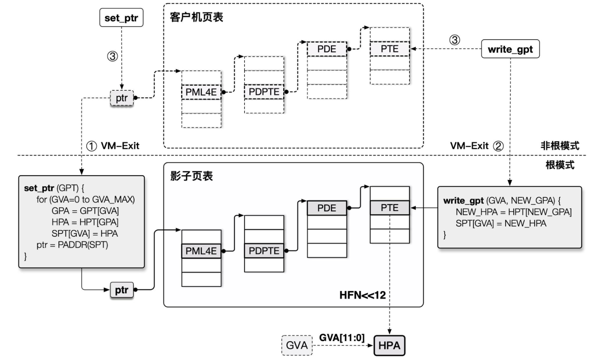
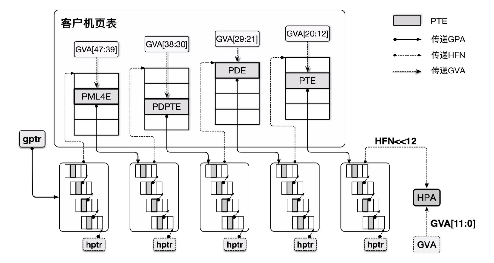

# 內存虛擬化

內存虛擬化本質上是需要達成以下兩個目的：

- 提供一個在 Guest 感知中的從零開始的連續物理內存空間。
- 在各個 VM 之間進行有效的隔離、調度、共享內存資源。

## 純軟件實現內存虛擬化

### 虛擬機內存訪問原理及遇到的問題

爲了實現內存空間的隔離，Hypervisor 需要爲 Guest VM 準備一層新的地址空間：`Guest Physical Address Space`，從 Guest 側其只能看到這一層地址空間，Hypervisor 需要記錄從 GPA 到 HVA 之間的轉換關係。

下圖爲 Qemu 的內存架構：

```
Guest' processes
                     +--------------------+
Virtual addr space   |                    |
                     +--------------------+                                    （GVA）
                     |                    |
                     \__   Page Table     \__
                        \                    \
                         |                    |  Guest kernel
                    +----+--------------------+----------------+
Guest's phy  memory |    |                    |                |            （GPA）
                    +----+--------------------+----------------+
                    |                                          |
                    \__                                        \__
                       \                                          \
                        |             QEMU process                 |
                   +----+------------------------------------------+
Virtual addr space |    |                                          |         （HVA）
                   +----+------------------------------------------+
                   |                                               |
                    \__                Page Table                   \__
                       \                                               \
                        |                                               |
                   +----+-----------------------------------------------+----+
Physical memory    |    |                                               |    |    （HPA）
                   +----+-----------------------------------------------+----+
```

當我們要訪問 Guest 中某個虛擬地址上的數據時，我們需要：

- 首先得先通過 Guest 的頁表將 `Guest Virtual Address` （GVA）轉換爲 `Guest Physical Address`（GPA）。
- GPA 在 Qemu 的實現當中實際上是對應映射到 Host 中一大塊 mmap 的內存上的，所以我們還需要將 GPA 再轉換爲 `Host Virtual Address`（HVA）。
- 最後再通過 Host 上的頁表將 HVA 轉化爲 `Host Physical Address`（HPA）。
- 在 Guest 多級頁表的尋址當中同樣也要多次經過 `GPA->HPA` 的轉換查詢過程。

這一整套流程**非常繁重**，從而使得虛擬機中內存訪問的性能極爲低下。

> 在 QEMU 當中訪問內存的核心函數是 `address_space_rw()`，實現了 `GPA->HVA`，感興趣的同學可以看一下其內部實現。

### 影子頁表 （shadow page table）

在早期的時候 Intel 硬件對虛擬化並沒有很好的支持，因此 Hypervisor 只能先在軟件層面進行優化——**影子頁表**（Shadow Page Table）應運而生。

以 Intel 爲例，由於讀寫 CR3 寄存器（存放頁頂級表指針）的操作是敏感指令，我們的 Hypervisor 可以很輕易地截獲 VM 的這個操作，**並將頁表替換爲存放 GVA→HPA 映射關係的影子頁表**，這樣就能**直接完成由 GVA 到 HPA 的轉換過程**。



爲了實現影子頁表，我們本質上需要實現**MMU 虛擬化**：

- Guest VM 所能看到與操作的實際都上是虛擬的 MMU，真正載入 MMU 的頁表是由 Hypevisor 完成翻譯後所產生的**影子頁表**。
- 影子頁表中的訪問權限爲**只讀的**，當 Guest 想要讀寫頁表時便能被 Hypervisor 捕獲到這個操作並代爲處理。

不過這種方法的缺點就是**我們需要爲 Guest VM 中的每套頁表都獨立維護一份影子頁表，且需要多次在 VMM 與 VM 間進行切換**，這有着不小的開銷。

## 硬件輔助虛擬化

### 擴展頁表（Extend Page Table, EPT）

從軟件層面似乎已經是難以有更好的優化的方案了，因此硬件層面的對內存虛擬化的支持便應運而生——**EPT** 即 **Extend Page Table**，是 Intel 爲實現內存虛擬化而新增的特性，目的是爲了減少內存訪問的開銷。

EPT 並不幹擾 Guest VM 操作自身頁表的過程，其本質上是**額外提供了一個 Guest 物理地址空間到 Host 物理地址空間轉換的頁表**，即使用一個額外的頁表來完成 `GPA→HPA` 的轉換。

EPT 方案雖然相比起影子頁表而言多了一層轉換，但是並不需要幹擾 Guest 原有的頁表管理，**GVA→GPA→HPA 的過程都由硬件自動完成**，同時 Hypervisor 僅需要截獲 `EPT Violation` 異常（EPT 表項爲空），效率提高了不少。



### VPID：TLB 資源優化

**Translation Lookaside Buffer**爲用以加快虛擬地址到物理地址轉換的**頁表項緩存**，當進行地址轉換時 CPU 首先會先查詢 TLB，TLB 根據虛擬地址查找是否存在對應的 cache，若 cache miss 了纔會查詢頁表。

由於 TLB 是與對應的頁表進行工作的，因此在切換頁表時 TLB 原有的內容就失效了，此時我們應當使用 `INVLPG` 使 TLB 失效，類似地，在 VM-Entry 與 VM-Exit 時 CPU 都會強制讓 TLB 失效，但這麼做仍存在一定的性能損耗。

**Virtual Processor Identifier**（VPID）則是一種硬件級的對 TLB 資源管理的優化，其在硬件上爲每個 TLB 表項打上一個 VPID 標識（VMM 爲每個 vCPU 分配一個唯一的 VPID，存放在 VMCS 中，邏輯 CPU 的 VPID 爲 0），在 CPU 查找 TLB cache 時會先比對 VPID，這樣我們就無需在每次進行 VM entry/exit 時刷掉所有的 cache，而可以繼續複用之前保留的 cache。

## REFERENCE

《系統虛擬化：原理與實現》——Intel 開源軟件技術中心 著

[【VIRT.0x02】系統虛擬化導論](https://arttnba3.cn/2022/08/29/VURTUALIZATION-0X02-BASIC_KNOWLEDGE/)

《深度探索 Linux 系統虛擬化》——王柏生、謝廣軍 著