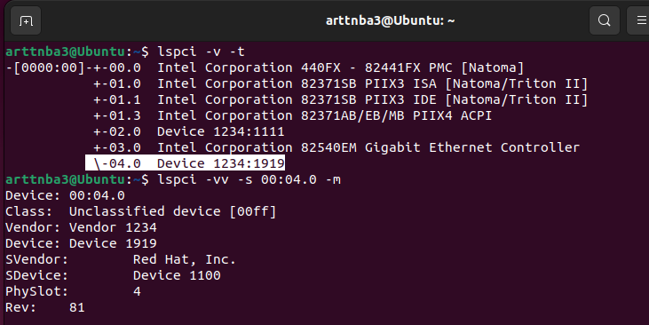

# 編寫 QEMU 模擬設備

本節我們將介紹如何在 QEMU 中編寫一個新的模擬設備。

> 注1：在開始之前你可能需要補充一些[PCI 設備的基礎知識](https://arttnba3.cn/2022/08/30/HARDWARE-0X00-PCI_DEVICE/)
>
> 注2：qemu 官方在 `hw/misc/edu.c` 中也提供了一個教學用的設備樣例，red hat 則在 `hw/misc/pci-testdev.c` 中提供了一個測試設備，我們可以參考這兩個設備來構建我們的設備

## QEMU Object Model

在 Qemu 當中有着一套叫做 **Qemu Object Model** 的東西來實現面向對象，主要由這四個組件構成：

- `Type`：用來定義一個「類」的基本屬性，例如類的名字、大小、構造函數等。
- `Class`：用來定義一個「類」的靜態內容，例如類中存儲的靜態數據、方法函數指針等。
- `Object`：動態分配的一個「類」的具體的實例（instance），儲存類的動態數據。
- `Property`：動態對象數據的訪問器（accessor），可以通過監視器接口進行檢查。

類似於 Golang，在 QOM 當中使用成員嵌套的方式來完成類的繼承，父類作爲類結構體的第一個成員 `parent` 而存在，因此也不支持多繼承。

> 參見[這個ppt](https://www.linux-kvm.org/images/f/f6/2012-forum-QOM_CPU.pdf)

### I、TypeInfo - 類的基本屬性

`TypeInfo` 這一結構體用來定義一個 `類` 的基本屬性，該結構體定義於 `include/qom/object.h` 當中：

```c
/**
 * TypeInfo:
 * @name: 類型名.
 * @parent: 父類型名.
 * @instance_size: 對象大小 (#Object 的衍生物). 
 *   若 @instance_size 爲 0, 則對象的大小爲其父類的大小
 * @instance_init: 該函數被調用以初始化對象（譯註：構造函數）. 
 *   （譯註：調用前）父類已被初始化，因此子類只需要初始化他自己的成員。
 * @instance_post_init: 該函數被調用以結束一個對象的初始化，
 *   在所有的 @instance_init 函數被調用之後.
 * @instance_finalize: 該函數在對象被析構時調用. 其在
 *   父類的 @instance_finalize 被調用之前被調用.
 *   在該函數中一個對象應當僅釋放該對象特有的成員。
 * @abstract: 若該域爲真，則該類爲一個虛類，不能被直接實例化。
 * @class_size: 這個對象的類對象的大小 (#Object 的衍生物)
 *   若 @class_size 爲 0, 則類的大小爲其父類的大小。
 *   這允許一個類型在沒有添加額外的虛函數時避免實現一個顯式的類型。
 * @class_init: 該函數在所有父類初始化結束後被調用，
 *   以允許一個類設置他的默認虛方法指針.
 *   這也允許該函數重寫父類的虛方法。
 * @class_base_init: 在所有的父類被初始化後、但
 *   在類自身初始化前，爲所有的基類調用該函數。
 *   該函數用以撤銷從父類 memcpy 到子類的影響.
 * @class_data: 傳遞給 @class_init 與 @class_base_init 的數據,
 *   這會在建立動態類型時有用。
 * @interfaces: 與這個類型相關的接口. 
 *   其應當指向一個以 0 填充元素結尾的靜態數組
 */
struct TypeInfo
{
    const char *name;
    const char *parent;

    size_t instance_size;
    void (*instance_init)(Object *obj);
    void (*instance_post_init)(Object *obj);
    void (*instance_finalize)(Object *obj);

    bool abstract;
    size_t class_size;

    void (*class_init)(ObjectClass *klass, void *data);
    void (*class_base_init)(ObjectClass *klass, void *data);
    void *class_data;

    InterfaceInfo *interfaces;
};
```

當我們在 Qemu 中要定義一個**類**的時候，我們實際上需要定義一個 `TypeInfo` 類型的變量，以下是一個在 Qemu 定義一個自定義類的例子：

```c
static const TypeInfo a3_type_info = {
    .name = "a3_type",
    .parent = TYPE_OBJECT,
    .interfaces = (InterfaceInfo[]) {
        { },
    },
}

static void a3_register_types(void) {
    type_register_static(&a3_type_info);
}

type_init(a3_register_types);
```

`type_init()` 其實就是 `constructor` 這一 gcc attribute 的封裝，其作用就是將一個函數加入到一個 `init_array` 當中，在 Qemu 程序啓動時在進入到 main 函數之前會先調用 `init_array` 中的函數，因此這裏會調用我們自定義的函數，其作用便是調用 `type_register_static()` 將我們自定義的類型 `a3_type_info` 註冊到全局的類型表中。

### II、Class - 類的靜態內容

當我們通過一個 `TypeInfo` 結構體定義了一個類之後，我們還需要定義一個 Class 結構體來定義這個類的靜態內容，包括函數表、靜態成員等，其應當繼承於對應的 Class 結構體類型，例如我們若是要定義一個新的機器類，則其 Class 應當繼承於 `MachineClass`。

所有 Class 結構體類型的最終的父類都是 `ObjectClass` 結構體：

```c
/**
 * ObjectClass:
 *
 * 所有類的基類.  #ObjectClass 僅包含一個整型類型 handler
 */
struct ObjectClass
{
    /*< private >*/
    Type type;
    GSList *interfaces;

    const char *object_cast_cache[OBJECT_CLASS_CAST_CACHE];
    const char *class_cast_cache[OBJECT_CLASS_CAST_CACHE];

    ObjectUnparent *unparent;

    GHashTable *properties;
};
```

下面是一個最簡單的示例：

```c
struct A3Class
{
    /*< private >*/
    ObjectClass parent;
}
```

完成 Class 的定義之後我們還應當在前面定義的 `a3_type_info` 中添加上 Class size 與 Class 的構造函數：

```c
static void a3_class_init(ObjectClass *oc, void *data)
{
    // 這裏的 oc 參數便是新創建的 Class，全局只有一個該實例
    // 我們應當 cast 爲我們自己的 Class 類型，之後再進行相應操作
    // do something
}

static const TypeInfo a3_type_info = {
    .name = "a3_type",
    .parent = TYPE_OBJECT,
    .class_size = sizeof(A3Class),
    .class_init = a3_class_init,
    .interfaces = (InterfaceInfo[]) {
        { },
    },
}
```

### III、Object - 類的實例對象

我們還需要定義一個相應的 Object 類型來表示一個實例對象，其包含有這個類實際的具體數據，且應當繼承於對應的 Object 結構體類型，例如我們若是要定義一個新的機器類型，其實例類型應當繼承自 `MachineState`

所有 Object 結構體類型的最終的父類都是 `Object` 結構體：

```c
/**
 * Object:
 *
 * 所有對象的基類。該對象的第一個成員爲一個指向 #ObjectClass 的指針。
 * 因爲 C 中將一個結構體的第一個成員組織在該結構體的 0 字節起始處，
 * 只要任何的子類將其父類作爲第一個成員，我們都能直接轉化爲一個 #Object.
 *
 * 因此, #Object 包含一個對對象類的引用作爲其第一個成員。 
 * 這允許在運行時識別對象的真實類型
 */
struct Object
{
    /*< private >*/
    ObjectClass *class;
    ObjectFree *free;
    GHashTable *properties;
    uint32_t ref;
    Object *parent;
};
```

下面是一個示例：

```c
struct A3Object
{
    /*< private >*/
    Object parent;
}
```

完成 Object 的定義之後我們還應當在前面定義的 `a3_type_info` 中添加上 Object size 與 Object 的構造函數：

```c
static void a3_object_init(Object *obj)
{
    // 這裏的 obj 參數便是動態創建的類型實例
    // do something
}

static const TypeInfo a3_type_info = {
    .name = "a3_type",
    .parent = TYPE_OBJECT,
    .instance_init = a3_object_init,
    .instance_size = sizeof(A3Object),
    .class_size = sizeof(A3Class),
    .class_init = a3_class_init,
    .interfaces = (InterfaceInfo[]) {
        { },
    },
}
```

### IV、類的創建與釋放

類似於在 C++ 當中使用 `new` 與 `delete` 來創建與釋放一個類實例，在 QOM 中我們應當使用 `object_new()` 與 `object_delete()` 來創建與銷燬一個 QOM 類實例，本質上就是 `分配/釋放類空間 + 顯示調用構造/析構函數`

QOM 判斷創建類實例的類型是通過類的名字，即 `TypeInfo->name`，當創建類實例時 Qemu 會遍歷所有的 TypeInfo 並尋找名字匹配的那個，從而調用到對應的構造函數，並將其基類 `Object->class` 指向對應的 class

下面是一個示例：

```c
// create a QOM object
A3Object *a3obj = object_new("a3_type");
// delete a QOM object
object_delete(a3obj);
```

## Qemu 中 PCI 設備的編寫

在補充了這麼多的 Qemu 相關的知識之後，現在我們可以開始在 Qemu 中編寫 PCI 設備了，這裏筆者將編寫一個最簡單的 Qemu 設備，並將源碼放在 `hw/misc/a3dev.c` 中

Qemu 當中 PCI 設備實例的基類是 `PCIDevice`，因此我們應當創建一個繼承自 `PCIDevice` 的類來表示我們的設備實例，這裏筆者僅聲明瞭兩個 `MemoryRegion` 用作 MMIO 與 PMIO，以及一個用作數據存儲的 buffer：

```c
#define A3DEV_BUF_SIZE 0x100

typedef struct A3PCIDevState {
    /*< private >*/
    PCIDevice parent_obj;

    /*< public >*/
    MemoryRegion mmio;
    MemoryRegion pmio;
    uint8_t buf[A3DEV_BUF_SIZE];
} A3PCIDevState;
```

以及定義一個空的 Class 模板，繼承自 PCI 設備的靜態類型 `PCIDeviceClass`，不過這一步並不是必須的，事實上我們可以直接用 `PCIDeviceClass` 作爲我們設備類的 Class：

```c
typedef struct A3PCIDevClass {
    /*< private >*/
    PCIDeviceClass parent;
} A3PCIDevClass;
```

以及兩個將父類轉爲子類的宏，因爲 QOM 基本函數傳遞的大都是父類指針，所以我們需要一個宏來進行類型檢查 + 轉型，這也是 Qemu 中慣用的做法：

```c
#define TYPE_A3DEV_PCI "a3dev-pci"
#define A3DEV_PCI(obj) \
    OBJECT_CHECK(A3PCIDevState, (obj), TYPE_A3DEV_PCI)
#define A3DEV_PCI_GET_CLASS(obj) \
    OBJECT_GET_CLASS(A3PCIDevClass, obj, TYPE_A3DEV_PCI)
#define A3DEV_PCI_CLASS(klass) \
    OBJECT_CLASS_CHECK(A3PCIDevClass, klass, TYPE_A3DEV_PCI)
```

下面我們開始定義 MMIO 與 PMIO 的操作函數，這裏筆者就簡單地設置爲讀寫設備內部的 buffer，並聲明上兩個 MemoryRegion 對應的函數表，需要注意的是這裏傳入的 `hwaddr` 類型參數其實爲相對地址而非絕對地址：

```c
static uint64_t
a3dev_read(void *opaque, hwaddr addr, unsigned size)
{
    A3PCIDevState *ds = A3DEV_PCI(opaque);
    uint64_t val = ~0LL;

    if (size > 8)
        return val;

    if (addr + size > A3DEV_BUF_SIZE)
        return val;
    
    memcpy(&val, &ds->buf[addr], size);
    return val;
}

static void
a3dev_write(void *opaque, hwaddr addr, uint64_t val, unsigned size)
{
    A3PCIDevState *ds = A3DEV_PCI(opaque);

    if (size > 8)
        return ;

    if (addr + size > A3DEV_BUF_SIZE)
        return ;
    
    memcpy(&ds->buf[addr], &val, size);
}

static uint64_t
a3dev_mmio_read(void *opaque, hwaddr addr, unsigned size)
{
    return a3dev_read(opaque, addr, size);
}

static uint64_t
a3dev_pmio_read(void *opaque, hwaddr addr, unsigned size)
{
    return a3dev_read(opaque, addr, size);
}

static void
a3dev_mmio_write(void *opaque, hwaddr addr, uint64_t val, unsigned size)
{
    a3dev_write(opaque, addr, val, size);
}

static void
a3dev_pmio_write(void *opaque, hwaddr addr, uint64_t val, unsigned size)
{
    a3dev_write(opaque, addr, val, size);
}

static const MemoryRegionOps a3dev_mmio_ops = {
    .read = a3dev_mmio_read,
    .write = a3dev_mmio_write,
    .endianness = DEVICE_LITTLE_ENDIAN,
};

static const MemoryRegionOps a3dev_pmio_ops = {
    .read = a3dev_pmio_read,
    .write = a3dev_pmio_write,
    .endianness = DEVICE_LITTLE_ENDIAN,
};
```

然後是設備實例的初始化函數，在 `PCIDeviceClass` 當中定義了一個名爲 `realize` 的函數指針，當 PCI 設備被載入時便會調用這個函數指針指向的函數來初始化，所以這裏我們也定義一個自己的初始化函數，不過我們需要做的工作其實基本上就只有初始化兩個 `MemoryRegion`，`memory_region_init_io()` 會爲這兩個 `MemoryRegion` 進行初始化的工作，並設置函數表爲我們指定的函數表，`pci_register_bar()` 則用來註冊 BAR：

```c
static void a3dev_realize(PCIDevice *pci_dev, Error **errp)
{
    A3PCIDevState *ds = A3DEV_PCI(pci_dev);

    memory_region_init_io(&ds->mmio, OBJECT(ds), &a3dev_mmio_ops,
                        pci_dev, "a3dev-mmio", A3DEV_BUF_SIZE);
    pci_register_bar(pci_dev, 0, PCI_BASE_ADDRESS_SPACE_MEMORY, &ds->mmio);
    memory_region_init_io(&ds->pmio, OBJECT(ds), &a3dev_pmio_ops,
                        pci_dev, "a3dev-pmio", A3DEV_BUF_SIZE);
    pci_register_bar(pci_dev, 1, PCI_BASE_ADDRESS_SPACE_IO, &ds->pmio);
}
```

最後是 Class 與 Object（也就是 instance）的初始化函數，這裏需要注意的是在 Class 的初始化函數中我們應當設置父類 `PCIDeviceClass` 的一系列基本屬性（也就是 PCI 設備的基本屬性）：

```c
static void a3dev_instance_init(Object *obj)
{
    // do something
}

static void a3dev_class_init(ObjectClass *oc, void *data)
{
    DeviceClass *dc = DEVICE_CLASS(oc);
    PCIDeviceClass *pci = PCI_DEVICE_CLASS(oc);

    pci->realize = a3dev_realize;
    pci->vendor_id = PCI_VENDOR_ID_QEMU;
    pci->device_id = 0x1919;
    pci->revision = 0x81;
    pci->class_id = PCI_CLASS_OTHERS;

    dc->desc = "arttnba3 test PCI device";
    set_bit(DEVICE_CATEGORY_MISC, dc->categories);
}
```

最後就是爲我們的 PCI 設備類型註冊 TypeInfo 了，這裏別忘了**我們的接口中應當增加上 PCI 的接口**：

```c
static const TypeInfo a3dev_type_info = {
    .name = TYPE_A3DEV_PCI,
    .parent = TYPE_PCI_DEVICE,
    .instance_init = a3dev_instance_init,
    .instance_size = sizeof(A3PCIDevState),
    .class_size = sizeof(A3PCIDevClass),
    .class_init = a3dev_class_init,
    .interfaces = (InterfaceInfo[]) {
        { INTERFACE_CONVENTIONAL_PCI_DEVICE },
        { },
    },
};

static void a3dev_register_types(void) {
    type_register_static(&a3dev_type_info);
}

type_init(a3dev_register_types);
```

最後我們在 meson 構建系統中加入我們新增的這個設備，在 `hw/misc/meson.build` 中加入如下語句：

```meson
softmmu_ss.add(when: 'CONFIG_PCI_A3DEV', if_true: files('a3dev.c'))
```

並在 `hw/misc/Kconfig` 中添加如下內容，這表示我們的設備會在 `CONFIG_PCI_DEVICES=y` 時編譯：

```kconfig
config PCI_A3DEV
    bool
    default y if PCI_DEVICES
    depends on PCI
```

之後編譯 Qemu 並附加上 `-device a3dev-pci` ，之後隨便起一個 Linux 系統，此時使用 `lspci` 指令我們便能看到我們新添加的 pci 設備：



我們可以使用如下程序來測試我們的設備的輸入輸出，需要注意的是這需要 root 權限：

> PMIO，使用 iopl 更改端口權限後便能通過 in/out 類指令讀寫端口

```c
#include <stdio.h>
#include <unistd.h>
#include <fcntl.h>
#include <stdlib.h>
#include <sys/io.h>

int main(int argc, char **argv, char **envp)
{
        unsigned short port_addr;

        if (argc < 2) {
                puts("[x] no port provided!");
                exit(EXIT_FAILURE);
        }

        if (iopl(3) < 0) {
                puts("[x] no privilege!");
                exit(EXIT_FAILURE);
        }

        port_addr = atoi(argv[1]);

        printf("[+] a3dev port addr start at: %d\n", port_addr);

        puts("[*] now writing into a3dev-pci...");

        for (int i = 0; i < 0x100 / 4; i++) {
                outl(i, port_addr + i * 4);
        }

        puts("[+] writing done!");

        printf("[*] now reading from a3dev-pci...");
        for (int i = 0; i < 0x100 / 4; i++) {
                if (i % 8 == 0) {
                        printf("\n[--%d--]", port_addr + i * 4);
                }
                printf(" %d ", inl(port_addr + i * 4));
        }

        puts("\n[+] reading done!");
}
```

> MMIO，使用 mmap 映射 `sys` 目錄下設備的 `resource0` 文件即可直接讀寫

```c
#include <stdio.h>
#include <stdlib.h>
#include <fcntl.h>
#include <unistd.h>
#include <stdint.h>
#include <sys/mman.h>

void mmio_write(uint32_t *addr, uint32_t val)
{
        *addr = val;
}

uint32_t mmio_read(uint32_t *addr)
{
        return *addr;
}

int main(int argc, char **argv, char **envp)
{
        uint32_t *mmio_addr;
        int dev_fd;

        dev_fd = open("/sys/devices/pci0000:00/0000:00:04.0/resource0",
                        O_RDWR | O_SYNC);
        if (dev_fd < 0) {
                puts("[x] failed to open mmio file! wrong path or no root!");
                exit(EXIT_FAILURE);
        }

        mmio_addr = (uint32_t*)
                mmap(0, 0x1000, PROT_READ | PROT_WRITE, MAP_SHARED, dev_fd, 0);
        if (mmio_addr == MAP_FAILED) {
                puts("failed to mmap!");
                exit(EXIT_FAILURE);
        }

        puts("[*] start writing to a3dev-pci...");
        for (int i = 0; i < 0x100 / 4; i++) {
                mmio_write(mmio_addr + i, i);
        }
        puts("[+] write done!");

        printf("[*] start reading from a3dev-pci...");
        for (int i = 0; i < 0x100 / 4; i++) {
                if (i % 8 == 0) {
                        printf("\n[--%p--]", mmio_addr);
                }
                printf(" %u ", mmio_read(mmio_addr + i));
        }
        puts("\n[+] read done!");
}
```

## REFERENCE

[【VIRT.0x00】Qemu - I：Qemu 簡易食用指南](https://arttnba3.cn/2022/07/15/VIRTUALIZATION-0X00-QEMU-PART-I/)

[QOM Vadis?Taking Objects To The CPU And Beyond](https://www.linux-kvm.org/images/f/f6/2012-forum-QOM_CPU.pdf)

[在 QEMU 中模擬設備 - 知乎](https://zhuanlan.zhihu.com/p/57526565)