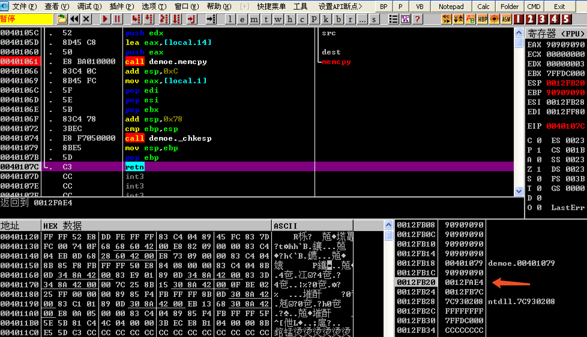
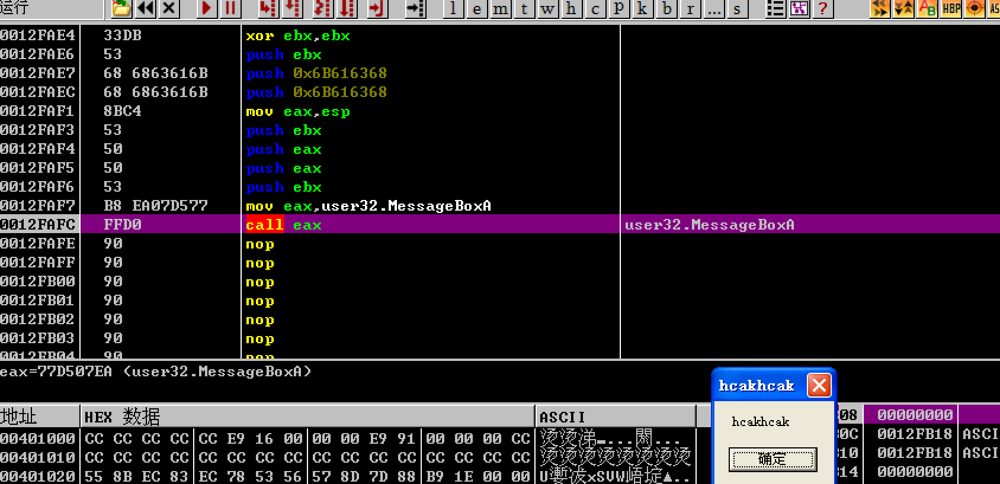

# 執行 Shellcode

## 介紹 

shellcode 是一段用於利用軟件漏洞而執行的代碼，shellcode 爲16進制之機械碼，以其經常讓攻擊者獲得 shell 而得名。shellcode 常常使用機器語言編寫。 可在暫存器 eip 溢出後，塞入一段可讓 CPU 執行的 shellcode 機械碼，讓電腦可以執行攻擊者的任意指令。在編譯時關閉 ASLR、NX 、CANARY 選項，這樣就可以在輸入時把 shellcode 佈置在棧中，通過動態調試獲得所需要的 padding 溢出到返回地址爲輸入的 shellcode 地址，這樣程序返回後便會執行 shellcode。


### 示例 

下面給出一個經典例子，驗證程序溢出後執行 **shellcode**，編譯的環境爲 winxp 工具爲 vc6.0。

```c
#include <stdio.h>
#include <windows.h>

#define PASSWORD "1234567"

int verify_password(char *password)
{
	int authenticated;
	char buffer[50];
	authenticated = strcmp(password,PASSWORD);
	memcpy(buffer,password,strlen(password)); 
	return authenticated;
}

void main()
{
	int valid_flag =0;
	char password[1024];
	FILE *fp;

	LoadLibrary("user32.dll");

	if (!(fp=fopen("password.txt","rw+")))
	{
		exit(0);
	}
	fscanf(fp,"%s",password);

	valid_flag = verify_password(password);

	if (valid_flag !=0)
	{
		printf("incorrect password!\n\n");
	}
	else
	{
		printf("Congratulation! You have passed the verification!\n");
	}
	fclose(fp);
	getchar();
}
```


編譯完成後拖入 OllyDbg 動態調試確定 **padding** 的長度，在 **memcpy** 處下一個斷點方便隨後調試。可以先生成50 BYTES 的 padding 比較與返回地址的距離，最後確定爲60 BYTES 後爲返回地址。


輸入的字符串會被複制到棧中 **0012FAE4** 的位置。


因爲通過合理的 padding 控制了返回地址到 **0012FAE4**，所以在函數返回時寄存器 **EIP** 的值爲 **0012FAE4**，這時系統會認爲棧中的數據爲機器碼，程序就會執行地址爲 **0012FAE4** 的代碼。




**password.txt** 中的內容爲精心佈置的機器碼，功能是彈出一個消息框，內容爲 **hackhack**。如何編寫 **password.txt** 中的內容，我們放在後面的章節來講，本章着重介紹整個執行流程。

如我們所期望的，程序返回後執行了彈窗功能。




### 參考閱讀 

[0day安全：軟件漏洞分析技術]()

[cve-2015-8277](https://www.securifera.com/advisories/cve-2015-8277/)

