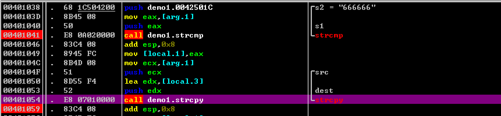
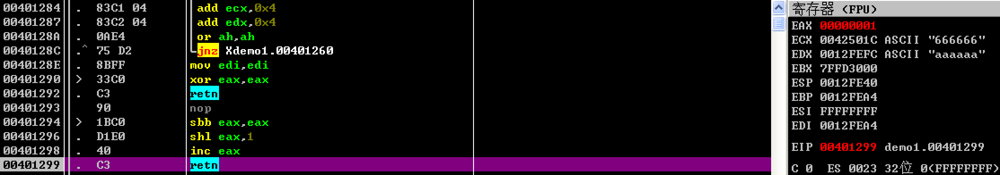
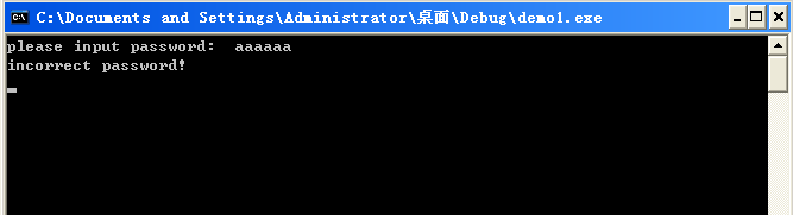

# 棧溢出原理 

## 介紹 

關於棧的介紹，可以閱讀 [Linux Pwn](https://ctf-wiki.org/pwn/linux/user-mode/stackoverflow/x86/stack-intro/) 中的介紹。

## 基本示例 

下面給出一個典型例子，在這個例子中由於變量聲明的順序和 buffer 聲明的大小導致存在最後一字節的溢出。

```c
#include <stdio.h>
#include <string.h>
#define PASSWORD "666666"
int verify_password(char *password)
{
	int authenticated;
	char buffer[8];
	authenticated = strcmp(password,PASSWORD);
	strcpy(buffer,password); 
	return authenticated;
}
void main()
{
	int valid_flag =0;
	char password[128];
	while(1)
	{
		printf("please input password:  ");
		scanf("%s",password);
		valid_flag = verify_password(password);
		if (valid_flag !=0)
		{
			printf("incorrect password!\n");
		}
		else
		{
			printf("Congratulation! You have passed the verification!\n");
			break;
		}
	}
}
```

這是一個簡單的密碼校驗程序，會判斷輸入的字符串是否和666666相等。使用 vc6.0 來編譯這個程序，成功後使用 winchecksec 查看所開的防護。可以看到 GS 是開啓的，但這並不妨礙我們的溢出。

```
C:\Users\CarlStar\Desktop>winchecksec.exe demo1.exe
Dynamic Base    : false
ASLR            : true
High Entropy VA : false
Force Integrity : false
Isolation       : true
NX              : true
SEH             : true
CFG             : false
RFG             : false
SafeSEH         : true
GS              : true
Authenticode    : false
.NET            : true
```

使用 OllyDbg 動態調試這個程序，輸入 aaaaaa 看一下程序正常的執行流程。爲了方便理解整個過程，在 **strcmp** 函數和 **strcpy** 執行完後下一個斷點。



現在可以讓程序運行，輸入 aaaaaa 後程序會執行到我們下的第一個斷點。進入 **strcmp** 這個函數，觀察它的返回值。因爲 a 的 ascii 碼值大於 6 的 ascii 碼值，不出意外函數會返回 **1** ，x86 下返回值保存在 EAX 寄存器中，函數正常返回後，由於程序完成它的其餘功能還會使用這些寄存器，所以這個返回值會保存在棧上，也就是 **ss:[0012FEA0]** 這個地方。




當執行到第二個斷點時，看一下棧結構。其中 61 是我們輸入 a 的 ascii 碼形式，**00** 是字符串結束符。那麼 **buffer** 的大小是 8 字節，如果我們輸入 8 個 a 的話，最後的字符串結束符會溢出到 **0012FEA0** 這個位置把原來的值覆蓋爲 0，這樣我們就可以改變程序的執行流程，輸出 Congratulation! You have passed the verification!

```
0012FE90   CCCCCCCC
0012FE94   CCCCCCCC
0012FE98   61616161
0012FE9C   CC006161
0012FEA0   00000001
```

好，我們先讓程序正常運行下去。



這次我們輸入 8 個 a 驗證一下是否如我們想的一樣：**字符串的結束符會溢出到 strcmp 的返回值**。可以看到 strcmp 的返回值還是 1。


繼續運行到第二個斷點處，查看一下當前棧的值。**strcmp的返回值已經成功由 1 溢出爲 0 **。

```
0012FE90   CCCCCCCC
0012FE94   CCCCCCCC
0012FE98   61616161
0012FE9C   61616161
0012FEA0   00000000
```

這時候讓程序繼續運行，成功的輸出了預想的字符串。


## 參考閱讀 

[stack buffer overflow](https://en.wikipedia.org/wiki/Stack_buffer_overflow)

[0day安全：軟件漏洞分析技術]()

[Winchecksec](https://github.com/trailofbits/winchecksec)

