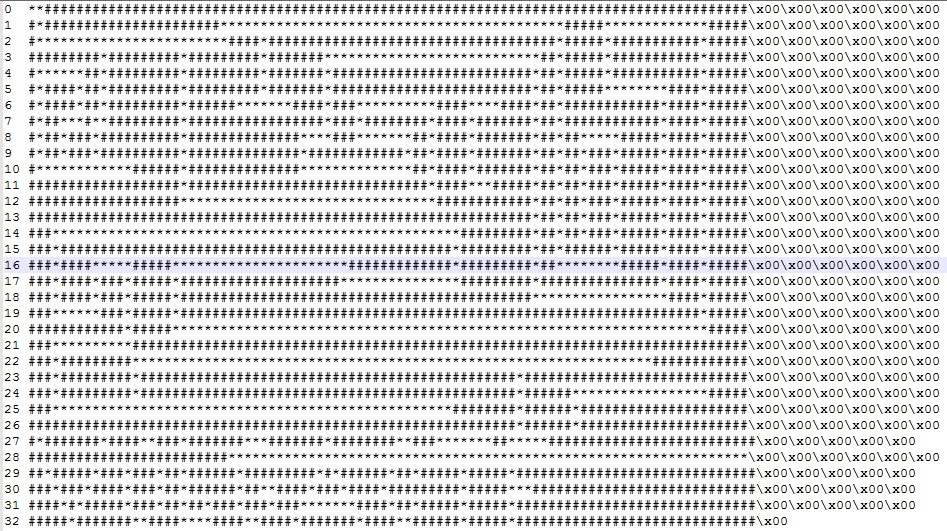
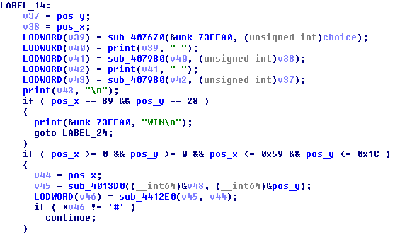
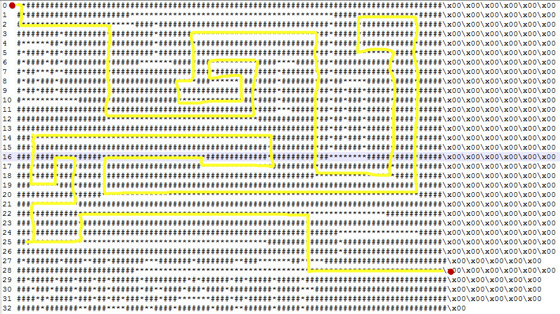

# 迷宮問題

迷宮問題有以下特點: 

* 在內存中佈置一張"地圖"
* 將用戶輸入限制在少數幾個字符範圍內. 
* 一般只有一個迷宮入口和一個迷宮出口

佈置的地圖可以由可顯字符(比如`#`和`*`)組合而成(這非常明顯, 查看字符串基本就知道這是個迷宮題了.), 也可以單純用不可顯的十六進制值進行表示. 可以將地圖直接組成一條非常長的字符串, 或是一行一行分開佈置. 如果是一行一行分開佈置的話, 因爲迷宮一般都會比較大, 所以用於按行(注意, 佈置並非按順序佈置, 每行都對應一個具體的行號, 你需要確定行號才能還原迷宮地圖)佈置迷宮的函數會明顯重複多次. 

而被限制的字符通常會是一些方便記憶的組合(不是也沒辦法), 比如`w/s/a/d`, `h/j/k/l`, `l/r/u/d`這樣的類似組合. 當然各個鍵具體的操作需要經過分析判斷(像那種只用一條字符串表示迷宮的, 就可以用`t`鍵表示向右移動`12`個字符這樣). 對於二維的地圖, 一般作者都會設置一個`X座標`和一個`Y座標`用於保存當前位置. 我們也可以根據這個特點來入手分析.

一般情況下, 迷宮是隻有1個入口和1個出口, 像入口在最左上角`(0, 0)`位置, 而出口在最右下角`(max_X, max_Y)`處. 但也有可能是出口在迷宮的正中心, 用一個`Y`字符表示等等. 解答迷宮題的條件也是需要根據具體情況判斷的.  

當然迷宮的走法可能不止1條, 也有情況是有多條走法, 但是要求某一個走法比如說代價最小. 那麼這就可以變相爲一個算法問題. 

## Volga Quals CTF 2014: Reverse 100

接下來我們以這道題進行示例, 這是一道簡單的迷宮題. 該題對地圖按行亂序佈置, 使用的字符是`#`和`*`. 

對應的`crackme`可以點擊此處下載: [rev100](https://github.com/ctf-wiki/ctf-challenges/blob/master/reverse/maze/2014_volga_quals/rev100)

對應的`idb`可以點擊此處下載: [rev100.i64](https://github.com/ctf-wiki/ctf-challenges/blob/master/reverse/maze/2014_volga_quals/rev100.i64)


我們可以到`.rodata`段用光標選擇所有的地圖字符串, 按下`shift+E`提取所有的地圖數據. 


但是目前提取到的地圖字符串, 從上往下並非是按順序的, 因此我們需要回到IDA生成的僞C代碼, 獲取行號並重新排序組合起來. 

最後得到的完整地圖如下:

對應的`迷宮地圖文件`可以點擊此處下載: [maze_array.txt](https://github.com/ctf-wiki/ctf-challenges/blob/master/reverse/maze/2014_volga_quals/maze_array.txt)



再來看迷宮移動所需要的字符:


這裏我們知道, 可以使用的字符有`L/R/U/D`, 分別對應於`左/右/上/下`.  

再往下看



通過調試是可以知道, 這裏其實是每次在用戶輸入`L/R/U/D`後, 先打印一次你的輸入, 然後打印對應的`X/Y座標`. 而最後的判定成功的條件, 就是當`pos_x == 89 && pos_y == 28`. 那麼我們就可以根據上述信息, 獲得走出迷宮的路徑. 



最後得到的迷宮路徑就是

```
RDDRRRRRRRRRRRRRRRRRRDDDDDDDDDDRRRRRRRRRRRRRRRRRRRRRRRRRRRRRRRUUUUUULLLLLLLLLDDRRRRRRDDLLLLLLLLLLLLLUURRRUUUUURRRRRRRRRRRRRRRRRRRRRRRRRRDDDDDDDDDDDDDDDRRRRRRRRRRRRRRRRUUUUUUUUUUUUULLLLLLLUUUURRRRRRRRRRRRDDDDDDDDDDDDDDDDDDDLLLLLLLLLLLLLLLLLLLLLLLLLLLLLLLLLLLLLLLLLLLLLLLLLLLLLLLLLLLLLLLLLLUUUURRRRRRRRRRRRRRRRRRRRRDRRRRRRRRRRRRRRUUULLLLLLLLLLLLLLLLLLLLLLLLLLLLLLLLLLLLLLLLLLLLLLLLLLDDDDDRRRRRUUURRRRDDDDDLLLLLLLLLDDDDRRRRRRRRRRUUURRRRRRRRRRRRRRRRRRRRRRRRRRRRRRRRRRRRRRRRRRRRRRRRDDDDDDRRRRRRRRRRRRRRRRRRRRRRRRRRRR
```

## 參考鏈接

* [[VolgaCTF Quals 2014 writeup - Reverse-100](https://singularityctf.blogspot.com/2014/03/volgactf-quals-2014-writeup-reverse-100.html)]